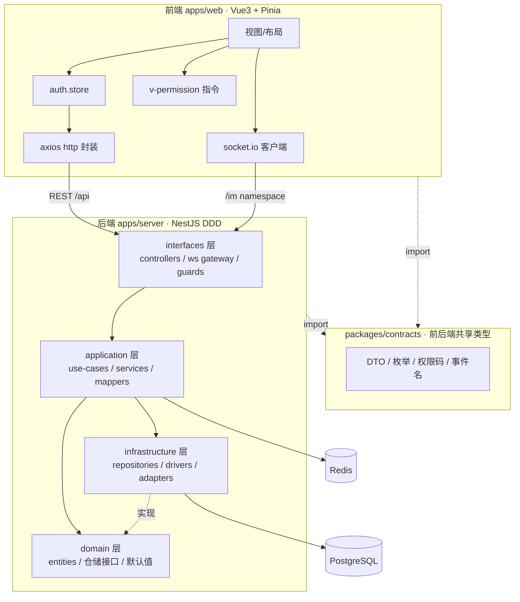

# 基础设施平台 · 文档总览

后端基础设施平台，技术栈 **NestJS + PostgreSQL + Redis + Vue3 + Pinia**，遵循 **DDD 分层 + 低耦合高内聚**。
本期交付五大基础能力：**配置中心、RBAC 权限、文件上传、WebSocket IM、链路追踪与日志**，以及前端基座。

## 文档索引

| 模块 | 文档 | 一句话说明 |
| --- | --- | --- |
| 配置中心 | [config-center.md](./config-center.md) | 除连接信息外的全部可调参数集中入库 + Redis 缓存，消除硬编码 |
| RBAC 权限 | [rbac.md](./rbac.md) | 用户/角色/权限三层模型，JWT 双令牌，API/菜单/按钮级颗粒度 |
| 文件上传 | [upload.md](./upload.md) | 策略模式，local 默认 / oss 可切，驱动由配置中心选择 |
| WebSocket IM | [im.md](./im.md) | JWT 握手鉴权，会话房间收发文字/图片/视频，为群聊/客服预留扩展 |
| 链路追踪与日志 | [observability.md](./observability.md) | AsyncLocalStorage 链路追踪，结构化日志异步落库 + RBAC 查询/链路详情/清理 |
| 前端基座 | [frontend.md](./frontend.md) | Vue3 + Pinia，鉴权 store、动态路由守卫、v-permission 指令 |
| API 参考 | [api-reference.md](./api-reference.md) | 全部 REST 端点与 WS 事件、统一响应结构、权限码一览 |

## 总体架构



## DDD 分层约定

每个后端模块统一四层目录，职责单向依赖（interfaces → application → domain，infrastructure 实现 domain 端口）：

```
modules/<module>/
├── domain/            实体、仓储接口、领域常量与默认值（不依赖框架）
├── application/       用例(use-case)、领域服务、mapper（编排业务）
├── infrastructure/    仓储实现、外部驱动/适配器（TypeORM、OSS、bcrypt 等）
└── interfaces/        controllers（一个路由一个文件）、ws gateway、guards、dto
```

落地的工程约束（对应需求中的硬性要求）：

- **零硬编码**：唯一允许读 `process.env` 的地方是 `bootstrap/env.config.ts`（只放连接信息 + 部署密钥）；其余参数全部走配置中心。
- **一个函数只做一件事 / 单文件 ≤ 500 行**：用例按动作拆分，控制器一个路由业务函数一个文件。
- **设计模式优先**：上传用策略模式、权限用解析器 + 缓存、配置用读穿透缓存、仓储用端口-适配器。
- **共享单一来源**：DTO/枚举/权限码/事件名集中在 `packages/contracts`，前后端复用，杜绝定义漂移。

## Monorepo 结构

```
E-sports-01/
├── apps/
│   ├── server/        NestJS 后端（DDD 四层）
│   └── web/           Vue3 + Pinia 前端基座
├── packages/
│   └── contracts/     前后端共享 DTO / 枚举 / 权限码（双 CJS+ESM 产物）
├── docs/              本文档目录
└── docker-compose.yml PostgreSQL 16 + Redis 7
```

## 本地启动

```bash
# 1. 依赖
pnpm install

# 2. 基础设施（PostgreSQL 16 + Redis 7）
docker compose up -d

# 3. 后端环境变量（仅连接信息 + 密钥）
cp apps/server/.env.example apps/server/.env

# 4. 构建共享包 + 启动
pnpm --filter @app/contracts build
pnpm --filter @app/server start:dev     # http://127.0.0.1:3000/api
pnpm --filter @app/web dev              # http://127.0.0.1:5173
```

默认初始管理员：`admin / admin123456`（首次启动播种，超级管理员角色 `admin`，请尽快改密）。

## 统一响应结构

所有 REST 响应经全局拦截器包装为 `ApiResponse<T>`：

```jsonc
{ "code": 0, "message": "ok", "data": { /* ... */ }, "timestamp": 1782447482340 }
```

`code` 为业务码（`0` 成功）；分页数据统一形如 `{ list, total, page, pageSize }`。
