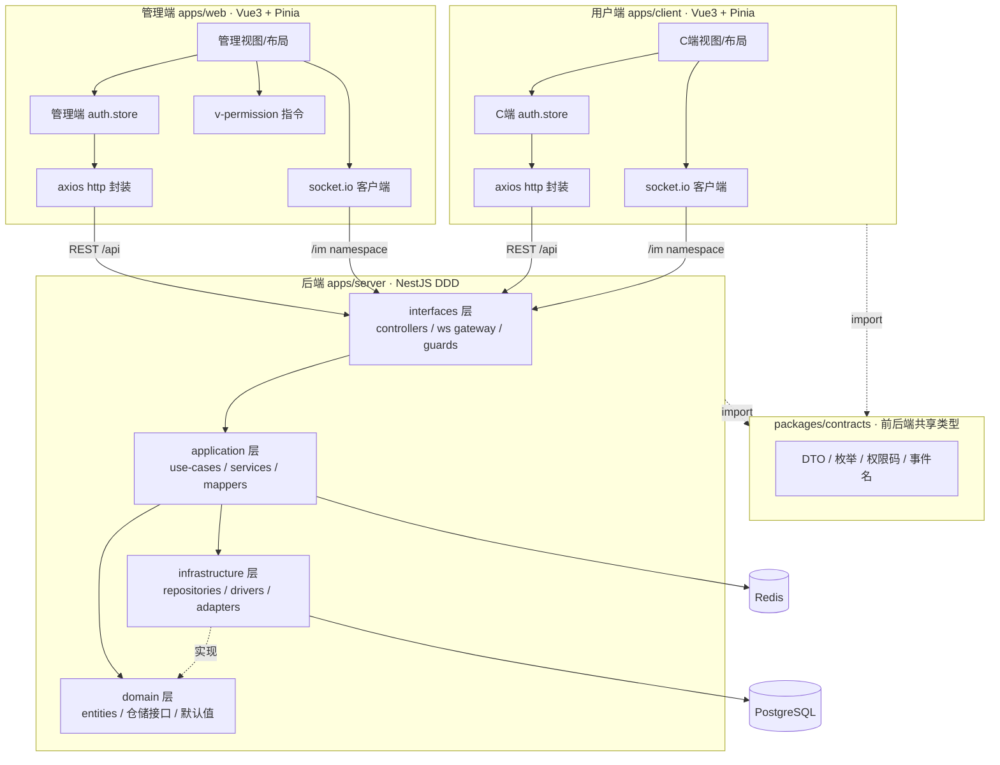

# 基础设施平台 · 文档总览

后端基础设施平台，技术栈 **NestJS + PostgreSQL + Redis + Vue3 + Pinia**，遵循 **DDD 分层 + 低耦合高内聚**。
本期交付五大基础能力：**配置中心、RBAC 权限、文件上传、WebSocket IM、链路追踪与日志**，以及前端基座。

## 文档索引

| 模块             | 文档                                               | 一句话说明                                                                                                   |
| ---------------- | -------------------------------------------------- | ------------------------------------------------------------------------------------------------------------ |
| 配置中心         | [config-center.md](./config-center.md)             | 可调参数集中入库 + Redis 缓存，五项站点配置按租户覆盖，vConsole 保持平台全局                                 |
| RBAC 权限        | [rbac.md](./rbac.md)                               | 用户/角色/权限三层模型，JWT 双令牌，API/菜单/按钮级颗粒度                                                    |
| 多租户隔离       | [multi-tenant.md](./multi-tenant.md)               | HTTP/JWT/IM 行级数据隔离、租户站点入口、配置覆盖、平台权限边界与 migration                                   |
| 文件上传         | [upload.md](./upload.md)                           | 策略模式，local 默认 / oss 可切，驱动由配置中心选择                                                          |
| 短信登录         | [sms.md](./sms.md)                                 | 多云短信、开发固定码、生产安全门、Redis 原子限流与一次性验证码                                               |
| WebSocket IM     | [im.md](./im.md)                                   | JWT 握手鉴权、会话收发、订单群标题、成员安全展示名、历史手机号脱敏及 C 端未读角标                            |
| 链路追踪与日志   | [observability.md](./observability.md)             | AsyncLocalStorage 链路追踪，结构化日志异步落库 + RBAC 查询/链路详情/清理                                     |
| 钱包             | [wallet.md](./wallet.md)                           | 钱包充值/提现/明细，以及服务订单余额支付的锁、流水和一致性边界                                               |
| 用户会员等级     | [member.md](./member.md)                           | 累计消费实时定级、下单折扣，以及 C 端头像徽标与会员卡的单一数据源                                            |
| 用户资料自助     | [user-profile.md](./user-profile.md)               | 登录用户自助改头像/昵称/手机号，免授权自助上传，个人中心页                                                   |
| 实名认证         | [realname.md](./realname.md)                       | 证件提交 + 人工审核状态机，身份证 AES-256-GCM 加密脱敏，超管按角色配置需实名                                 |
| 反馈管理         | [feedback.md](./feedback.md)                       | 投诉关联真实订单/打手，管理端原子幂等扣款 + 回复，C 端联系客服复用既有 IM                                    |
| 运营通知         | [notice.md](./notice.md)                           | 首页多图轮播、活动关联和后台配置（兼容历史单图）+ 通知公告 CRUD + C 端 Flame Wrap 弹窗公告                   |
| 主题特效         | [theme.md](./theme.md)                             | 5 种 Canvas UI 背景特效：管理端按租户勾选启用（可多选），C 端公开接口拉取后懒加载嵌套渲染并兼容降级         |
| 服务订单         | [order.md](./order.md)                             | 双端权威计价、结构化游戏资料、大厅检索、并发安全派单、三种支付方式与三阶段群标题                             |
| 订单退款         | [order-refund.md](./order-refund.md)               | 用户申请、后台审核、客服独立授权、余额与支付宝/微信原路退款、并发幂等及失败恢复                              |
| 商品评论         | [review.md](./review.md)                           | 订单完成后一单一评（打星 + 文字），商品详情页脱敏展示评论与平均分，管理端隐藏/恢复/删除治理                  |
| 打手入驻         | [booster.md](./booster.md)                         | 入驻审核、打手自主上下线、脱敏挑人目录/主页和安全语音试听，含 migration 与隐私边界                           |
| 商品管理         | [commerce.md](./commerce.md)                       | 分类 + 商品 CRUD、手机/电脑双端价格、左右分类目录、方形完整主图与正式 migration                              |
| 前端基座         | [frontend.md](./frontend.md)                       | Vue3 + Pinia，鉴权 store、动态路由守卫、v-permission 指令                                                    |
| 菜单待办角标     | [menu-badges.md](./menu-badges.md)                 | 管理端实名、订单、打手、即时通讯和客服待办数量，权限裁剪、实时刷新、轮询重试与并发防旧响应                   |
| C 端用户应用     | [client.md](./client.md)                           | 左右分类目录、双端结算、接单大厅检索、挑选打手、短信登录及按需 vConsole 调试                                 |
| 登录注册 UI      | [auth-ui.md](./auth-ui.md)                         | 企业级电竞风格登录/注册/短信验证码入口，仅重做 UI 不改鉴权逻辑                                               |
| 工作台 UI        | [dashboard-ui.md](./dashboard-ui.md)               | 响应式账号概览、业务入口、快捷访问和权限摘要                                                                 |
| 数据统计仪表盘   | [dashboard.md](./dashboard.md)                     | 订单/财务/用户/打手四块只读聚合统计（ECharts），日/月/年时间范围，按权限分块展示                             |
| 单文件数据库迁移 | [database-migrations.md](./database-migrations.md) | 同一 main.js 支持只读 audit、安全 show/run、静态迁移清单、可信基线校验、并发锁与失败回滚                     |
| 部署文档         | [deployment.md](./deployment.md)                   | 环境变量、构建顺序、PM2 启停、Nginx 反代与更新部署检查清单                                                   |
| API 参考         | [api-reference.md](./api-reference.md)             | 全部 REST 端点与 WS 事件、统一响应结构、权限码一览                                                           |
| 宝塔部署         | [deploy-bt.md](./deploy-bt.md)                     | 宝塔面板（CentOS 7+）单站点部署：前后端同域名，Nginx 按路径转发（/、/admin/、/api、/socket.io、/static）     |

## 总体架构


```mermaid
flowchart TB
  subgraph Web[管理端 apps/web · Vue3 + Pinia]
    WebUI[管理视图/布局] --> WebStore[管理端 auth.store]
    WebUI --> Dir[v-permission 指令]
    WebStore --> WebHTTP[axios http 封装]
    WebUI --> WebWS[socket.io 客户端]
  end
  subgraph Client[用户端 apps/client · Vue3 + Pinia]
    ClientUI[C端视图/布局] --> ClientStore[C端 auth.store]
    ClientStore --> ClientHTTP[axios http 封装]
    ClientUI --> ClientWS[socket.io 客户端]
  end

  subgraph Contracts[packages/contracts · 前后端共享类型]
    DTO[DTO / 枚举 / 权限码 / 事件名]
  end

  subgraph Server[后端 apps/server · NestJS DDD]
    direction TB
    IF[interfaces 层<br/>controllers / ws gateway / guards]
    APP[application 层<br/>use-cases / services / mappers]
    DOM[domain 层<br/>entities / 仓储接口 / 默认值]
    INFRA[infrastructure 层<br/>repositories / drivers / adapters]
    IF --> APP --> DOM
    INFRA -.实现.-> DOM
    APP --> INFRA
  end

  PG[(PostgreSQL)]
  RD[(Redis)]

  WebHTTP -->|REST /api| IF
  ClientHTTP -->|REST /api| IF
  WebWS -->|/im namespace| IF
  ClientWS -->|/im namespace| IF
  Client -. import .-> Contracts
  Server -. import .-> Contracts
  INFRA --> PG
  APP --> RD
```

## DDD 分层约定

每个后端模块统一四层目录，职责单向依赖（interfaces → application → domain，infrastructure 实现 domain 端口）：

```
modules/<module>/
├── domain/            实体、仓储接口、领域常量与默认值（不依赖框架）
├── application/       用例(use-case)、领域服务、mapper（编排业务）
├── infrastructure/    仓储实现、外部驱动/适配器（TypeORM、OSS、bcrypt 等）
└── interfaces/        controllers（一个路由一个文件）、ws gateway、guards、dto
```

落地的工程约束（对应需求中的硬性要求）：

- **零硬编码**：唯一允许读 `process.env` 的地方是 `bootstrap/env.config.ts`（只放连接信息 + 部署密钥）；其余参数全部走配置中心。
- **一个函数只做一件事 / 单文件 ≤ 500 行**：用例按动作拆分，控制器一个路由业务函数一个文件。
- **设计模式优先**：上传用策略模式、权限用解析器 + 缓存、配置用读穿透缓存、仓储用端口-适配器。
- **共享单一来源**：DTO/枚举/权限码/事件名集中在 `packages/contracts`，前后端复用，杜绝定义漂移。

## Monorepo 结构

```
E-sports-01/
├── apps/
│   ├── server/        NestJS 后端（DDD 四层）
│   ├── web/           Vue3 + Pinia 管理端
│   └── client/        Vue3 + Pinia C 端商城
├── packages/
│   └── contracts/     前后端共享 DTO / 枚举 / 权限码（双 CJS+ESM 产物）
├── docs/              本文档目录
└── docker-compose.yml PostgreSQL 17 + Redis 7
```

## 本地启动

```bash
# 1. 依赖
pnpm install

# 2. 准备 PostgreSQL 17 / Redis 7（以下仅示例启动依赖，不是应用容器部署；也可连接已有本地服务）
docker compose up -d

# 3. 后端环境变量（仅连接信息 + 密钥）
cp apps/server/.env.example apps/server/.env

# 4. 构建共享包 + 启动
pnpm --filter @app/contracts build
pnpm --filter @app/server start:dev     # http://127.0.0.1:3000/api
pnpm --filter @app/web dev              # http://127.0.0.1:5173
pnpm --filter @app/client dev           # http://127.0.0.1:5174
```

默认初始管理员：`admin / admin123456`（首次启动播种，超级管理员角色 `admin`，请尽快改密）。

## 统一响应结构

所有 REST 响应经全局拦截器包装为 `ApiResponse<T>`：

```jsonc
{
  "code": 0,
  "message": "ok",
  "data": {
    /* ... */
  },
  "timestamp": 1782447482340
}
```

`code` 为业务码（`0` 成功）；分页数据统一形如 `{ list, total, page, pageSize }`。
