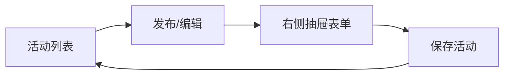

# 福利活动（activity）

## 实现了什么

1. **管理端发布活动**：标题 + 封面图上传 + 富文本详情 + 起止时间 + 启停 + 排序，权限码 `activity:list/save/remove`，菜单「福利活动」；封面上传后保存服务端返回的图片地址，不再手工填写 URL。
2. **后台 UI**：列表按「活动信息/时间/状态/启用/操作」展示；新建与编辑统一从右侧抽屉打开，中间内容滚动，底部操作区固定且左对齐。
3. **C 端浏览**：「我的 → 福利活动」入口展示启用且在起止时间内的活动列表（封面卡片），点击进详情页（富文本经 DOMPurify 净化渲染，防 XSS）。

## 结构导图

```
packages/contracts/src/activity/activity.ts   # UpsertActivityPayload / ActivityView / ActivityPublicView / ACTIVITY_LIMITS
apps/server/src/modules/activity/
├── domain/
│   ├── activity.entity.ts                    # 活动聚合根（title/cover/content/startAt/endAt/enabled/sort）
│   └── activity-repository.interface.ts      # 仓储端口 + 注入令牌
├── infrastructure/activity.repository.ts     # TypeORM 实现（进行中过滤：enabled 且 startAt ≤ now < endAt）
├── application/
│   ├── activity.mapper.ts                    # 实体 → 管理端/公开视图
│   └── use-cases/                            # 列表/保存/删除/公开列表/公开详情（一用例一文件）
├── interfaces/
│   ├── dto/upsert-activity.dto.ts
│   └── controllers/                          # 一路由一文件（admin CRUD + public 列表/详情）
└── activity.module.ts

apps/web/src/
├── api/activity.api.ts
├── views/activity/ActivityAdminView.vue      # 活动 CRUD + 行内启停
└── components/activity/ActivityFormDialog.vue # 右侧抽屉表单 + 封面上传 + 固定底部操作区

apps/client/src/
├── api/activity.api.ts
├── views/activity/ActivityListView.vue       # 进行中活动列表
├── views/activity/ActivityDetailView.vue     # 活动详情（富文本净化渲染）
└── views/activity/activity-format.ts
```

## 后台 UI 流程



## 接口

| 方法 | 路径 | 说明 | 权限 |
| --- | --- | --- | --- |
| GET | /activity/admin | 分页查询活动 | activity:list |
| POST | /activity/admin | 发布活动 | activity:save |
| PUT | /activity/admin/:id | 编辑活动 | activity:save |
| DELETE | /activity/admin/:id | 删除活动 | activity:remove |
| GET | /activity/public | 进行中的活动列表 | 登录 |
| GET | /activity/public/:id | 活动详情 | 登录 |
