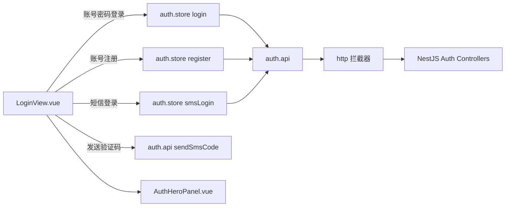
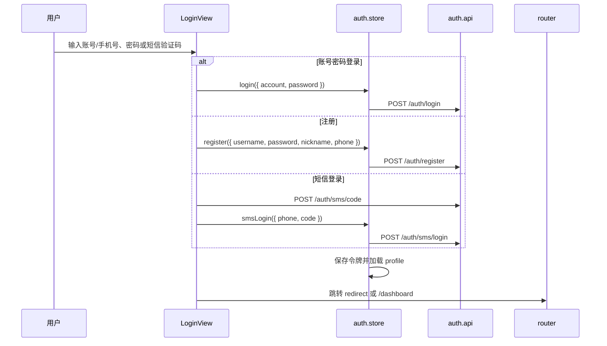

# 登录注册 UI 模块

## 模块职责

登录注册 UI 模块位于 `apps/web/src/views/LoginView.vue`，只负责登录、注册、短信验证码登录三个入口的用户界面与交互编排。鉴权状态、令牌存储、接口请求仍由既有 `auth.store`、`auth.api`、`http` 分层承接，本次仅重做视觉层，不改变业务逻辑。

实现的功能：

- **账号密码登录**：账号字段支持用户名或手机号，提交后调用 `auth.login`。
- **账号注册**：用户名、密码必填，昵称和手机号可选，提交后调用 `auth.register`。
- **短信验证码登录**：手机号格式校验、发送验证码冷却倒计时、验证码登录调用 `auth.smsLogin`。
- **企业级电竞风格视觉**：左侧 `AuthHeroPanel` 使用内联 SVG 绘制电竞运营舞台、对战席、数据轨迹与能力标签；右侧表单保持 Element Plus 表单能力。
- **响应式布局**：桌面左右分栏，窄屏自动堆叠，手机端隐藏复杂插画，保留核心登录表单。

## 文件结构

```text
apps/web/src/
├── views/
│   ├── LoginView.vue                 登录/注册/短信登录表单编排
│   └── LoginView.css                 登录页表单、布局、响应式样式
├── components/
│   └── auth/
│       ├── AuthHeroPanel.vue         登录页左侧 SVG 电竞运营插画结构
│       └── AuthHeroPanel.css         SVG 插画容器、背景与响应式样式
├── stores/
│   └── auth.store.ts                 鉴权状态、profile、令牌生命周期
└── api/
    └── auth.api.ts                   登录/注册/短信验证码 REST 请求
```

## 调用结构导图



## 交互流程



## 设计约束

- **只改 UI，不改逻辑**：提交函数、Pinia store、API 分层保持原路径，降低回归面。
- **低耦合高内聚**：SVG 视觉展示拆到 `AuthHeroPanel`，登录表单仍在 `LoginView`，避免单文件继续膨胀。
- **界面不展示技术栈**：技术选型保留在工程文档与代码结构中，登录页只呈现业务入口和运营能力。
- **无硬编码业务参数**：页面只包含展示文案和表单字段，登录地址、令牌、鉴权规则仍在 API/store/http 层。
- **最小化实现**：不新增 UI 状态管理库，不引入新的网络请求，不为视觉效果增加业务依赖。
