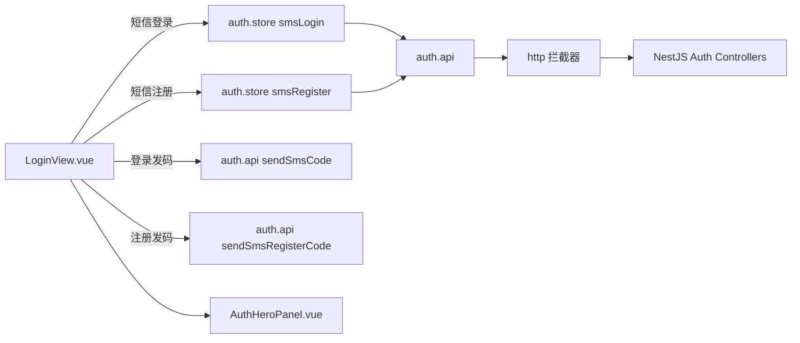
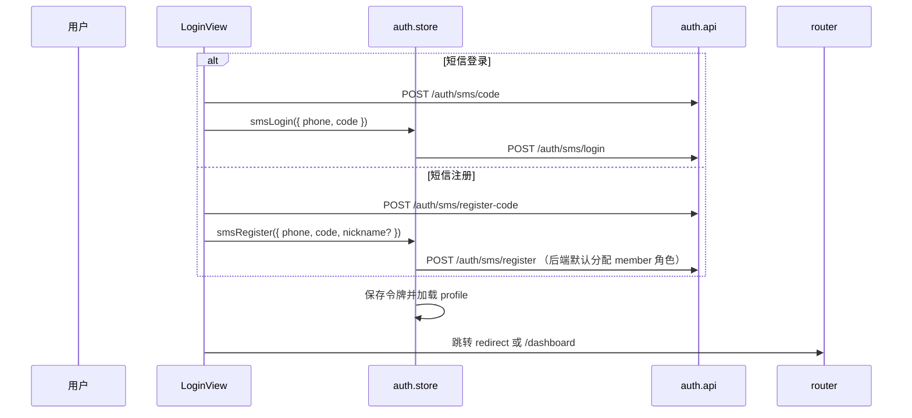

# 登录注册 UI 模块

## 模块职责

登录注册 UI 模块位于 `apps/web/src/views/LoginView.vue`，只负责「短信登录 / 短信注册」两个入口的用户界面与交互编排。本站仅支持短信方式，**不提供账号密码登录/注册入口**。鉴权状态、令牌存储、接口请求仍由既有 `auth.store`、`auth.api`、`http` 分层承接。

实现的功能：

- **短信验证码登录**：手机号格式校验、发送验证码冷却倒计时、验证码登录调用 `auth.smsLogin`。
- **短信验证码注册**：手机号 + 验证码（昵称选填），发送注册验证码调用 `auth.api.sendSmsRegisterCode`、注册调用 `auth.smsRegister`；注册用户后端默认分配 `member`（普通用户）角色，注册成功即自动登录并跳转。
- **发码入口区分**：登录/注册各自的「发送验证码」按钮共用一份冷却倒计时，切换入口时重置；登录发码走 `/auth/sms/code`，注册发码走 `/auth/sms/register-code`。
- **企业级电竞风格视觉**：左侧 `AuthHeroPanel` 使用内联 SVG 绘制电竞运营舞台、对战席、数据轨迹与能力标签；右侧表单保持 Element Plus 表单能力。
- **响应式布局**：桌面左右分栏，窄屏自动堆叠，手机端隐藏复杂插画，保留核心表单。

## 文件结构

```text
apps/web/src/
├── views/
│   ├── LoginView.vue                 登录/注册/短信登录表单编排
│   └── LoginView.css                 登录页表单、布局、响应式样式
├── components/
│   └── auth/
│       ├── AuthHeroPanel.vue         登录页左侧 SVG 电竞运营插画结构
│       └── AuthHeroPanel.css         SVG 插画容器、背景与响应式样式
├── stores/
│   └── auth.store.ts                 鉴权状态、profile、令牌生命周期
└── api/
    └── auth.api.ts                   登录/注册/短信验证码 REST 请求
```

## 调用结构导图


```mermaid
flowchart LR
  View[LoginView.vue] -->|短信登录| StoreSms[auth.store smsLogin]
  View -->|短信注册| StoreReg[auth.store smsRegister]
  View -->|登录发码| ApiSend[auth.api sendSmsCode]
  View -->|注册发码| ApiRegSend[auth.api sendSmsRegisterCode]
  StoreSms --> API[auth.api]
  StoreReg --> API
  API --> HTTP[http 拦截器]
  HTTP --> Server[NestJS Auth Controllers]
  View --> Hero[AuthHeroPanel.vue]
```

## 交互流程


```mermaid
sequenceDiagram
  participant U as 用户
  participant V as LoginView
  participant S as auth.store
  participant A as auth.api
  participant R as router

  alt 短信登录
    V->>A: POST /auth/sms/code
    V->>S: smsLogin({ phone, code })
    S->>A: POST /auth/sms/login
  else 短信注册
    V->>A: POST /auth/sms/register-code
    V->>S: smsRegister({ phone, code, nickname? })
    S->>A: POST /auth/sms/register （后端默认分配 member 角色）
  end
  S->>S: 保存令牌并加载 profile
  V->>R: 跳转 redirect 或 /dashboard
```

## 设计约束

- **分层不越界**：视图只做交互编排与校验，鉴权/建号/角色分配等业务在后端用例层，前端经 `auth.store` → `auth.api` → `http` 逐层下沉。
- **低耦合高内聚**：SVG 视觉展示拆到 `AuthHeroPanel`，登录/注册表单仍在 `LoginView`，避免单文件继续膨胀。
- **界面不展示技术栈**：技术选型保留在工程文档与代码结构中，登录页只呈现业务入口和运营能力。
- **无硬编码业务参数**：页面只包含展示文案和表单字段，接口地址、令牌、鉴权规则、默认角色仍在 API/store/后端层。
- **最小化实现**：不新增 UI 状态管理库，登录/注册复用同一套倒计时与表单样式，不为视觉效果增加业务依赖。
