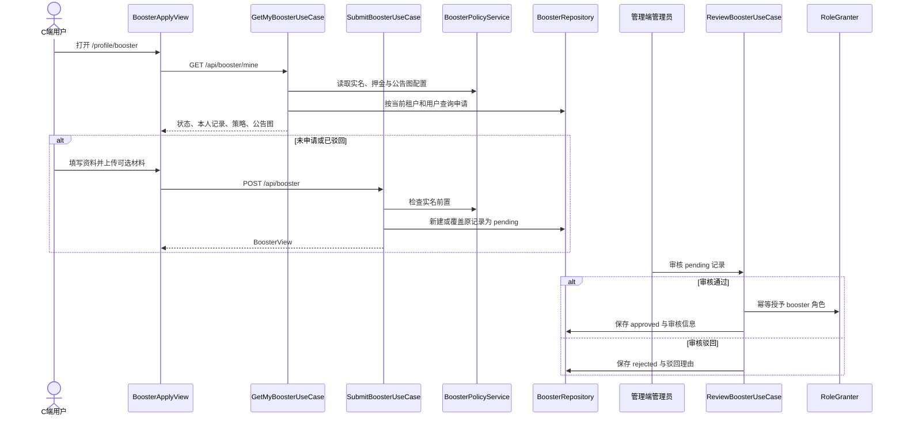
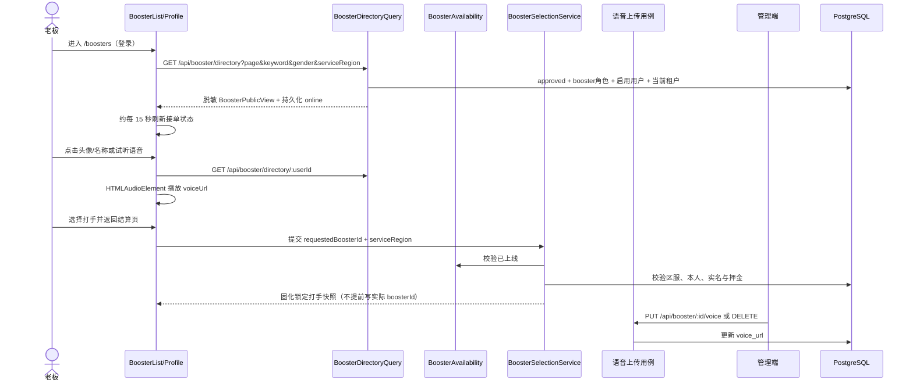
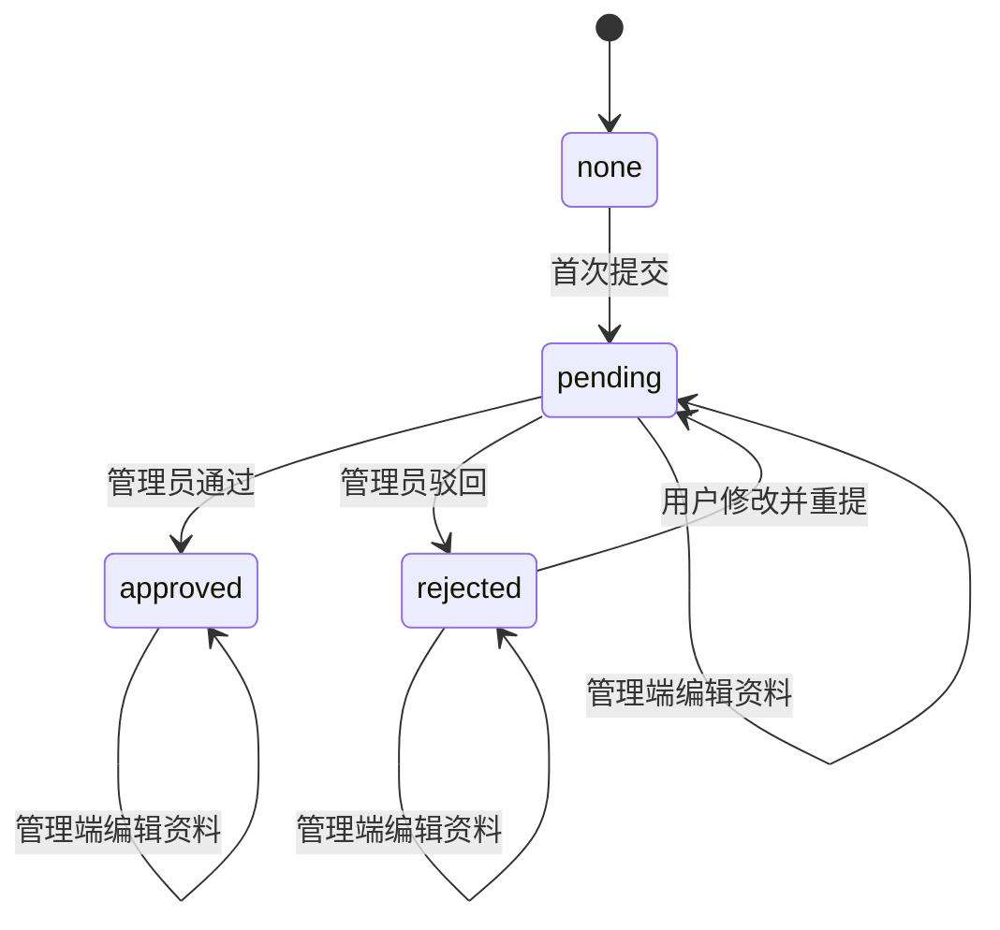
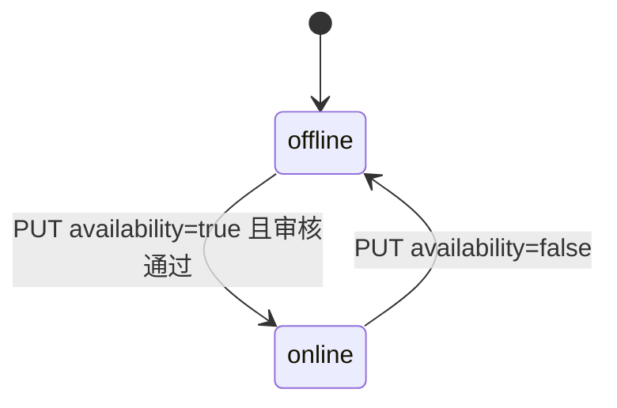
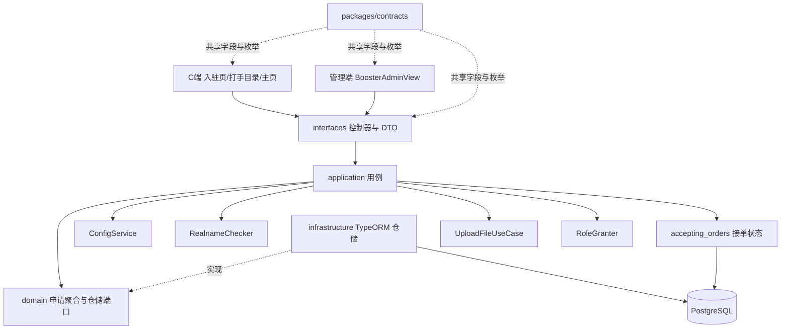
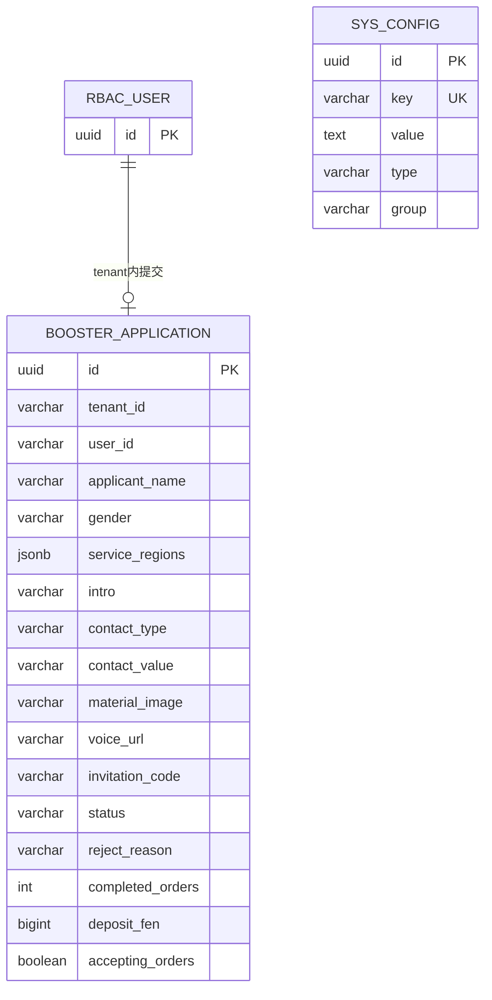
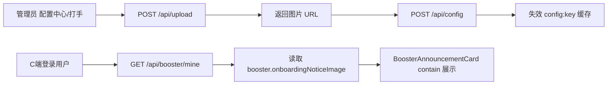

# 打手入驻（Booster）

## 功能目标与边界

C 端登录用户在个人中心提交完整打手入驻资料，管理员在管理端查看资料、编辑、审核通过或驳回。审核通过后，系统通过 RBAC 的 `RoleGranter` 幂等授予内置 `booster` 角色。审核通过的打手可自主切换上线/下线；老板在同租户脱敏目录查看该接单状态、打开打手主页、试听语音，并在下单时锁定上线打手。入驻页顶部公告图片由管理端配置中心维护，C 端随本人入驻概览一起读取。

本次已实现：

- **完整申请 / 驳回重提**：姓名、性别、接单区服、自我介绍、联系方式类型与内容为必填；其他材料图片、邀请码选填。驳回后保留原资料供修改并覆盖重提。
- **公告图片配置**：平台配置 `booster.onboardingNoticeImage` 为 `image` 类型；管理端在「配置中心 → 打手」上传或清空，C 端不写死图片地址。
- **公告文本配置**：平台配置 `booster.onboardingNoticeText` 为 `string` 类型（换行分行展示），与主页公告完全独立；随 `GET /booster/mine` 与公告图一并下发，C 端入驻页公告卡片展示，未配置时不展示。
- **打手「我的资金」**：`GET /booster/funds/mine`（仅登录）只读聚合本人保证金（已缴押金）、钱包可用余额、冻结金额（待审核/转账中提现合计）、累计/本月/上月结算（提成入账流水求和）与已交罚款（罚款记录合计）；未入驻或未开通钱包按零值返回，C 端「我的」页打手身份下展示资金面板。
- **审核与资料维护**：待审核记录可通过或驳回；管理端可编辑全部新版资料字段，编辑不改变审核状态。
- **挑人目录与主页**：登录用户可按 ID/昵称、性别和区服筛选审核通过且账号启用的打手；目录和主页只返回脱敏公开投影，支持分页、加载失败重试和打手主页跳转。
- **自主上下线与语音试听**：审核通过的打手通过 `PUT /booster/mine/availability` 持久化接单状态，历史数据默认下线；C 端目录停留期间约每 15 秒刷新。已审核打手或管理员可上传/清空试听语音，C 端头像下方可播放 MP3、M4A、WAV、WebM。
- **下单与派单约束**：老板可在自动安排和指定打手之间切换；指定、后台候选、指派和大厅接单都只允许当前上线且支持所选区服、不是下单人本人、实名和押金门禁通过的打手。锁定后不能下发公共大厅或改派他人，支付成功后由客服确认该打手接单。
- **管理端搜索**：打手管理列表支持服务端分页搜索申请姓名、昵称、用户名和注册手机号；关键词、状态和租户条件在同一查询中计算总数。
- **实名前置**：`booster.requireRealname` 开启时，未通过实名认证的用户不能提交；接单和指派继续复用 `BoosterRealnameGuard`。
- **既有履约能力**：保留等级、提成、押金和罚款接口与资金规则；缴押、退款、通用罚款已收敛为同一 PostgreSQL 事务，避免与投诉处罚并发时丢失押金更新。

明确非目标：

- 入驻邀请码只保存供审核追溯，不绑定邀请关系，也不触发邀请奖励。
- 公告图片是平台级单图配置，不按租户区分，不是富文本公告，也没有新增专用管理接口。
- 其他材料当前只支持一张图片 URL；更换或清空 URL 不会自动删除原上传文件。
- 不新增自动审核、审核超时、消息通知或已通过用户的 C 端自助编辑能力。
- 旧版 `game_nickname`、`game_name`、`rank` 列仅为历史兼容和 migration 回滚保留，不再作为对外业务字段。
- 挑人目录不是游客目录，不公开登录用户名、申请人姓名、联系方式、材料图或邀请码；“上线”表示打手当前愿意接单，不代表服务质量或响应时限承诺。
- 指定打手会锁定唯一履约人，但不提供直接绕过客服的自动开工、打手评分、打赏或与语音关联的私聊能力。
- 试听语音仅保存 URL，不做转码、内容审核或旧文件自动回收；删除仍需文件管理能力配合。

## 业务流程



### 挑人目录、接单状态与语音流程



`online` 由申请表的 `accepting_orders` 映射，`selectable`、`unavailableReason` 是请求时按上线、本人、实名、押金和区服计算的结果。锁定打手在订单创建和后续确认接单阶段再次校验，不能依赖前端按钮状态作为安全边界。

### 状态机

`none` 是查询时的聚合状态，数据库中没有对应记录。每个租户内每位用户最多一条申请记录。



审核状态与接单状态相互独立；只有 `approved` 能切换接单状态，提交、重提和历史 migration 都默认下线。



- `pending` 和 `approved` 状态下，用户重复提交返回 `409 Conflict`。
- 只有 `pending` 可以审核；重复审核或审核非待审记录返回 `409 Conflict`。
- 驳回理由必填，长度为 1 ～ 255；通过时清空历史驳回理由。
- 管理端编辑只更新传入字段，不改变状态、审核人或审核时间。

## DDD 分层与复用

```text
apps/server/src/modules/booster/
├── domain/
│   ├── booster-application.entity.ts       申请聚合、字段约束和租户内用户唯一约束
│   ├── booster-repository.interface.ts     申请仓储端口
│   ├── booster-directory.query.ts          跨 Booster/RBAC 的只读公开查询端口
│   ├── booster-penalty.entity.ts           罚款记录
│   ├── penalty-repository.interface.ts     罚款仓储端口
│   └── booster-finance-settlement.interface.ts 押金、钱包与罚款原子结算端口
├── application/
│   ├── booster.mapper.ts                   聚合映射为 BoosterView
│   ├── booster-compatibility.ts            旧列安全截断与历史自由文本区服过滤
│   ├── booster-policy.service.ts           等级、押金、实名与公告图配置读取
│   ├── booster-realname.service.ts          接单实名门控
│   ├── booster-deposit.service.ts           接单押金门控
│   ├── booster-selection.service.ts         上下线/目录/区服/实名/押金统一门禁
│   ├── booster-candidate.service.ts         对订单模块公开的上线候选查询
│   ├── booster-public.mapper.ts             公开目录/主页脱敏投影
│   ├── booster-voice-file.ts                语音大小、MIME 与文件头校验
│   ├── booster-progress.service.ts          完成单数累计
│   └── use-cases/                            mine / submit / list / review / update /
│                                               directory / public-profile / voice / availability
├── infrastructure/
│   ├── booster.repository.ts                TypeORM 仓储；非资金字段更新与完成单数行锁递增
│   ├── booster-directory.query.ts           approved/角色/账号状态交集查询
│   ├── penalty.repository.ts                罚款仓储实现
│   ├── booster-finance.settlement.ts         缴押、退款、通用罚款事务
│   └── booster-feedback-penalty.transaction.ts 反馈事务中的押金与处罚记录
└── interfaces/
    ├── dto/                                  class-validator 协议校验
    └── controllers/                          一路由一控制器
```



复用点：

- 字段限制、性别、联系方式、区服、状态和 DTO 视图统一定义在 `packages/contracts/src/booster/booster.ts`。
- 材料图和公告图复用 Upload 模块；C 端材料走 `POST /api/upload/self`，配置中心和管理端资料图片走 `POST /api/upload`。
- 公告图复用配置中心播种、图片编辑器、Redis 读穿透缓存和写后失效机制。
- 实名检查、角色授予、多租户仓储、钱包流水、等级解析和罚款抽屉沿用既有实现。

## 数据模型

### 申请字段

| 字段                                                   | 数据库列 / 类型                | 必填与限制                                   | 对外含义                                                   |
| ------------------------------------------------------ | ------------------------------ | -------------------------------------------- | ---------------------------------------------------------- |
| `tenantId` + `userId`                                  | varchar(36) + varchar(36)      | 联合唯一                                     | 租户内每位用户一条申请                                     |
| `applicantName`                                        | `applicant_name` varchar(64)   | 1 ～ 64                                      | 申请人姓名                                                 |
| `gender`                                               | varchar(16)                    | `male` / `female`                            | 性别                                                       |
| `serviceRegions`                                       | `service_regions` jsonb        | 1 ～ 2 项、去重                              | `delta-mobile`（三角洲手机端）、`delta-pc`（三角洲电脑端） |
| `intro`                                                | varchar(500)                   | 3 ～ 500                                     | 自我介绍、经验和可服务时间                                 |
| `contactType`                                          | `contact_type` varchar(16)     | `phone` / `wechat` / `qq`                    | 联系方式类型                                               |
| `contactValue`                                         | `contact_value` varchar(128)   | 1 ～ 128                                     | 手机号、微信号或 QQ 号；当前只校验长度                     |
| `materialImage`                                        | `material_image` varchar(2048) | 选填；空串或 `/`、`http://`、`https://` 开头 | 单张材料图片 URL                                           |
| `voiceUrl`                                             | `voice_url` varchar(2048)      | 已审核打手可维护；空串表示未上传             | C 端试听语音 URL                                           |
| `invitationCode`                                       | `invitation_code` varchar(64)  | 选填，最多 64                                | 仅供审核追溯                                               |
| `status`                                               | varchar(16)                    | `pending` / `approved` / `rejected`          | 持久化审核状态                                             |
| `rejectReason`                                         | `reject_reason` varchar(255)   | 驳回时必填                                   | 驳回理由                                                   |
| `reviewedBy` / `reviewedAt`                            | varchar(36) / timestamptz      | 未审核为空                                   | 审核人和时间                                               |
| `completedOrders` / `depositFen`                       | int / bigint                   | 非负业务值                                   | 既有等级与押金数据                                         |
| `acceptingOrders`                                      | `accepting_orders` boolean     | 默认 `false`                                 | 打手本人维护；下线时不可选择、指派或接单                   |
| `legacyGameNickname` / `legacyGameName` / `legacyRank` | 旧三列                         | 仅兼容                                       | 不进入 `BoosterView`                                       |

数据库 Check Constraint 限制 `gender`、`contact_type` 的枚举或历史空值，并确保 `service_regions` 是只包含开放区服且最多两项的 JSON 数组；至少选择一项和区服去重由接口 DTO 继续校验。



图中的用户关系是由 `tenant_id + user_id` 维护的逻辑归属，实体没有声明数据库外键。`material_image`、`voice_url` 和 `booster.onboardingNoticeImage` 只保存 Upload 模块返回的 URL，也没有数据库外键关联上传记录，因此配置、资料或语音清空不会触发文件删除。接单状态持久化在 `accepting_orders`；目录响应的 `online` 映射该值，`selectable` 仍是实时门禁投影。

## 数据库 Migration

TypeORM CLI 数据源为 `apps/server/src/database/data-source.ts`，固定 `synchronize: false`，迁移记录表为 `typeorm_migrations`。本次 migration：

`apps/server/src/database/migrations/1784246400000-add-booster-onboarding-fields.ts`

`up` 执行内容：

1. 为旧 `game_nickname`、`game_name`、`rank` 增加空串默认值。
2. 新增 `applicant_name`、`gender`、`service_regions`、`contact_type`、`contact_value`、`material_image`、`invitation_code` 七列。
3. 将历史 `game_nickname` 回填到姓名；仅当旧 `game_name` 精确等于 `delta-mobile` 或 `delta-pc` 时回填为单元素区服数组，其余历史自由文本直接回填为空数组，需由管理员重新选择区服。
4. 增加性别、联系方式类型和 JSON 数组三项 Check Constraint。

历史回填得到 `serviceRegions=[]` 的打手仍可保留脱敏目录资料，但在任何区服下都不可选择，目录固定返回 `selectable=false` 和 `unavailableReason="打手暂未配置接单区服"`；管理员补齐开放区服后才恢复选择能力。该兼容规则只针对打手申请资料，与历史订单 `serviceRegion=''` 的指派兼容逻辑不同。

`down` 会删除三项约束和七个新版字段，并移除旧三列的空串默认值。回滚会丢失性别、联系方式、材料图和邀请码等新版结构化资料；新提交 / 管理端编辑时同步写入旧姓名和区服列，并按旧 schema 的 32 / 64 字符长度安全截断，只用于降低回滚后的最小可读性损失。

本次挑人和结构化下单另有 migration：

`apps/server/src/database/migrations/1784332800000-add-booster-directory-order-selection.ts`

- `booster_application.voice_url`：打手试听语音 URL，默认空串。
- `service_order.game_account_id`、`game_text_id`、`service_region`、`booster_selection_mode`、`requested_booster_id`、`requested_booster_name`：下单游戏资料与锁定打手快照。
- 新增数字 ID、区服和自动/指定模式 Check Constraint，以及挑人目录和指定打手索引。
- `down` 按相反顺序删除索引、约束和六个订单字段，再删除 `voice_url`；不会删除已上传对象。

本次自主上下线另有 migration：

`apps/server/src/database/migrations/1784419200000-add-booster-availability.ts`

- `up` 增加 `booster_application.accepting_orders boolean NOT NULL DEFAULT false`，历史打手安全保持下线，需本人明确上线。
- `down` 删除该列；回滚后将失去打手自主接单状态，必须先停止依赖该字段的服务版本。

执行前应备份数据库，并确认已有 `booster_application` 表；仓库目前没有全量历史 schema baseline，本 migration 不能用于从空库独立创建该表。

```bash
pnpm --filter @app/server migration:show
pnpm --filter @app/server migration:run
pnpm --filter @app/server migration:revert
```

新增的 `1784332800000` migration 已在本地 PostgreSQL 17 的含历史数据数据库执行 `down → up` 往返验证；`1784419200000` 已在同一数据库执行 `up` 并由 TypeORM migration 表记录。生产执行前仍应备份，并先在影子库执行 `migration:show` / `migration:run`。

## API 与权限

所有路径均带全局 `/api` 前缀。

| 方法   | 路径                              | 权限                         | 说明                                                                                               |
| ------ | --------------------------------- | ---------------------------- | -------------------------------------------------------------------------------------------------- |
| GET    | `/api/booster/mine`               | 登录                         | 返回 `{ status, record, requireRealname, realnameApproved, depositPolicy, onboardingNoticeImage, onboardingNoticeText }` |
| GET    | `/api/booster/funds/mine`         | 登录                         | 打手「我的资金」只读聚合 `BoosterFundsView`（押金/余额/冻结/累计与月度结算/已交罚款，金额均为分） |
| PUT    | `/api/booster/mine/availability`  | 登录且本人已审核通过         | `{ acceptingOrders: boolean }`，幂等切换上线/下线并返回 `BoosterView`                              |
| POST   | `/api/booster`                    | 登录                         | 首次提交或驳回重提完整资料                                                                         |
| GET    | `/api/booster/directory`          | 登录                         | 脱敏目录；支持 `page`、`pageSize`、`keyword`、`gender`、`serviceRegion`                            |
| GET    | `/api/booster/directory/:userId`  | 登录                         | 同租户打手脱敏主页；不存在或已不可见返回 404                                                       |
| PUT    | `/api/booster/mine/voice`         | 登录且本人已审核通过         | multipart `file` 上传或更换语音                                                                    |
| DELETE | `/api/booster/mine/voice`         | 登录且本人已审核通过         | 清空本人语音 URL                                                                                   |
| GET    | `/api/booster`                    | `booster:list`               | 分页查询，支持 `page`、`pageSize`、`status`、`keyword`；关键词匹配姓名、昵称、用户名或注册手机号   |
| POST   | `/api/booster/:id/review`         | `booster:review`             | `{ approve, rejectReason? }`；通过时授予角色                                                       |
| PUT    | `/api/booster/:id`                | `booster:update`             | 管理端按传入字段更新资料，不改状态                                                                 |
| PUT    | `/api/booster/:id/voice`          | `booster:update`             | 管理端 multipart `file` 上传或更换语音                                                             |
| DELETE | `/api/booster/:id/voice`          | `booster:update`             | 管理端清空语音 URL                                                                                 |
| GET    | `/api/booster/levels`             | 登录                         | 获取等级档位                                                                                       |
| PUT    | `/api/booster/levels`             | 平台超管 + `booster:level:set`          | 保存全局 `{ tiers }`                                                                    |
| GET    | `/api/booster/deposit/policy`     | 登录                         | 获取最低 / 最高押金                                                                                |
| PUT    | `/api/booster/deposit/policy`     | 平台超管 + `booster:deposit:policy:set` | 保存全局 `{ minFen, maxFen }`                                                             |
| POST   | `/api/booster/deposit/pay`        | 登录                         | 已入驻用户从钱包缴纳 `{ amountFen }`                                                               |
| POST   | `/api/booster/:id/deposit/refund` | `booster:deposit:refund`     | 全额退还押金                                                                                       |

管理端菜单还需 `booster:menu`。修改公告图片通过既有配置接口，页面访问和操作分别需要 `config:menu`、`config:list`、`config:save`，上传新图另需 `upload:file:upload`。

`BoosterPublicView` 只包含 `userId`、安全显示名、头像、性别、服务区服、自我介绍、完成单数、等级、语音 URL、持久化接单状态和可选结果。目录搜索关键词最多 64 字符，可匹配昵称、完整/部分 UUID 以及去掉连字符或“打手”前缀后的 ID；查询始终限制在 access token 的当前租户。登录用户名、申请人姓名、联系方式、材料图、邀请码、押金和审核信息不会进入该投影。

## 公告图配置与前端状态



- 默认值为空串；为空时保留公告文字，不渲染图片。图片加载失败时显示失败提示。
- C 端只在 `none`、`rejected` 的可提交场景展示公告卡；`pending`、`approved` 展示只读申请资料。
- 页面覆盖加载、加载失败与重试、实名拦截、上传中禁用提交、提交中状态、驳回理由和重新提交。
- 移动端使用固定底部提交区并预留安全区；材料图和公告图使用 `object-fit: contain`，避免裁掉二维码或证明材料。

## 安全、异常与一致性边界

- 申请查询按租户上下文和当前用户隔离；管理列表及编辑、审核由 RBAC 权限控制。配置中心为平台级配置，不做租户隔离。
- 姓名、联系方式、邀请码属于个人资料，当前以明文入库并在本人接口、授权管理列表中完整返回；不应暴露到公开接口。
- 目录基础查询取 `approved` 申请、启用账号和 `booster` 角色的交集，并按 access token 的租户过滤；显示名优先昵称，缺失时使用用户 ID 后六位生成 `打手XXXXXX`，不回退登录用户名或真实姓名。
- `selectable` 会阻止下线和选择本人，并复用实名与最低押金门禁；真正创建订单、列出管理端候选、确认指派和大厅接单时再次校验打手仍上线、仍存在且门禁仍通过。下线固定返回“打手当前未上线”。
- `BoosterSelectionService.assertSelectable` 用于有区服订单，`assertAssignable` 仅供历史空区服订单跳过订单区服匹配；两者都必须通过目录可见性、上线状态、启用账号、booster 角色、本人排除、实名和押金检查。打手申请自身 `serviceRegions=[]` 时不属于可选候选，`availabilityFor` 固定返回“打手暂未配置接单区服”；它只把预期的 `ForbiddenException` 转为不可选原因，未知故障继续抛出，避免把系统错误伪装成业务不可选。
- 管理端指派候选复用同一目录查询，只返回当前租户 `approved + enabled + booster role + accepting_orders=true` 的交集；最终指派仍执行一次门禁，避免列表加载后状态变化造成越权派单。
- DTO 在长度与格式校验前统一 trim 字符串，并拒绝必填字段的纯空格以及管理端可选字段的 `null`；联系方式当前仍未按手机号、微信号、QQ 号做格式级校验。
- 错误日志递归脱敏 `applicantName`、`gender`、`serviceRegions`、`contactType`、`contactValue`、`invitationCode`、`materialImage`、`intro`，不会把这些申请内容写入错误详情；正常访问日志不保存请求 / 响应正文。
- C 端和管理端选择材料图片时检查 `image/*`；通用上传用例只校验配置大小，不嗅探真实图片内容。语音接口另行限制为 5 MB，并同时校验声明 MIME 与 MP3/M4A/WAV/WebM 文件头，规范化扩展名后才交给 Upload 模块。
- 顺序重复提交会返回 `409`；首次提交采用“先查后存”，未加显式事务或幂等键，并发首次提交可能触发数据库唯一约束错误。
- 订单确认阶段由 order 模块的 `claimForServing` 在数据库行锁内复核锁定打手、订单状态和实际 `boosterId`；竞争请求返回 `409`，只有成功请求才会写入实际打手并加入订单群。
- 审核通过中的角色授予与申请状态保存不是同一数据库事务；极端保存失败时需人工核对角色和申请状态。
- 审核和管理端编辑未显式使用版本条件锁；并发 review / update 仍可能覆盖非资金资料或由后到达者基于旧状态操作。但既有记录保存已排除 `depositFen` / `completedOrders`，不会再恢复并发处罚后的押金；完成单数在行锁事务内递增。
- 缴押、退款和通用罚款统一经 `BoosterFinanceSettlement`，按“打手 → 钱包”加锁，并在单事务内写押金、余额、流水和罚款。反馈处罚按“反馈 → 订单 → 打手或钱包”加锁；两类入口共享相同资金行锁协议。
- 更换、清空公告图、材料图或语音只更新 URL，不自动清理旧对象；需要文件管理的 `upload:file:remove` 显式删除。删除仍被引用的文件会导致前端媒体加载失败。

## 测试、验证与残余风险

自动化测试位于 `apps/server/test/booster/`、`apps/server/test/im/`、`apps/server/test/order/` 和 `apps/server/test/observability/`：

- `submit-booster.dto.spec.ts` 覆盖完整申请、空区服 / 过短简介、危险材料 URL 协议、空材料图、trim 后纯空格和管理端 `null` 输入。
- `booster.mapper.spec.ts` 覆盖新版结构化字段映射、旧字段不对外暴露、旧列长度截断和历史自由文本区服过滤。
- `booster-directory.spec.ts` 覆盖公开字段白名单、安全显示名、本人/不存在/区服/实名/押金选择门禁，以及历史空区服返回“打手暂未配置接单区服”。
- `booster-availability.spec.ts` 覆盖审核通过后上下线、重复设置幂等和未审核拒绝；`booster-candidate.spec.ts` 覆盖后台候选只返回上线资格交集。
- `booster-list-search.spec.ts` 覆盖管理列表名称/注册手机号关键词传递、trim 和长度校验。
- `booster-voice-file.spec.ts` 覆盖 5 MB 上限、MIME 与文件头一致性及安全扩展名规范化。
- `user-presence.spec.ts` 覆盖多 socket、最后连接断开和租户隔离。
- `order-selection.spec.ts` 覆盖指定订单禁止进大厅、禁止改派，以及大厅视图隐藏游戏账号字段。
- `order-assignment.spec.ts` 覆盖接单/后台指派竞争只有一方成功，失败方不进订单群且返回 409。
- `logging-sanitizer.spec.ts` 覆盖嵌套错误日志中的入驻个人资料递归脱敏。
- `apps/server/test-e2e/feedback-penalty.postgres.e2e.ts` 覆盖押金与资料保存、缴押、退款、完成单数的真实行锁竞争；`booster-finance.postgres.e2e.ts` 覆盖通用罚款原子落账与故障回滚。
- 三份 migration 均提供 `up` / `down` 和 CLI 数据源；新增挑人/结构化订单 migration 已完成 `down → up`，自主上下线 migration 已执行，索引、约束和预期字段可重建。

根目录 `pnpm test` 串行执行服务端、管理端和客户端测试；本次实际结果与数量见交付汇报及反馈模块文档，避免在多个文档复制易漂移计数。

本地浏览器已确认 C 端大厅上下线切换、刷新后持久状态、手动刷新成功反馈及 `390×844` 无横向溢出；测试账号已恢复下线。管理端分别按注册手机号和申请姓名搜索均只返回目标记录，清空后恢复完整列表。横幅轮播和语音试听仍受实际配置数据、浏览器媒体策略与存储跨域配置影响。

本次仍缺少完整 HTTP + RBAC E2E、并发首次提交、并发审核 / 编辑、审核事务失败、语音实际浏览器播放、内容审核和文件引用清理测试。公告图是平台级配置且旧文件不会自动回收，联系资料仍为明文存储，这些均是上线前需评估的残余风险。仓库级命令的最终通过数量以本次交付汇报为准。

## 管理端菜单角标

具备 `booster:menu` 与 `booster:list` 的账号会看到当前页面可见范围内的待审核打手数（普通账号为本租户，超级管理员为全局）。角标以 `page=1&pageSize=1&status=pending` 复用列表接口的 `total`，审核通过或驳回成功后立即定向刷新；不返回或缓存申请资料。完整权限、轮询和失败策略见 [menu-badges.md](./menu-badges.md)。

## 关联的既有能力

- 等级档位存 `booster.levels`，按累计完成单数实时解析；订单完成时按当前万分比提成经 `WalletLedger` 入账。
- 押金策略读 `booster.depositMinFen` / `booster.depositMaxFen`，接单前由 `BoosterDepositGuard` 校验最低额，管理端可全额退还。
- 财务罚款经 `BoosterFinanceSettlement` 从钱包余额或押金原子扣除并保留记录；打手管理页与罚款管理页复用 `PenaltyCreateDrawer`。结构化打手投诉另由反馈模块的事务端口锁定订单和资金来源，以 `feedbackId` 幂等扣款并写入 `booster_penalty.feedback_id`，不信任管理端传入打手 ID。
- `booster.requireRealname` 缺失时回退共享契约默认值 `true`；等级与押金配置缺失时也回退 `BOOSTER_LEVEL_DEFAULTS` / `BOOSTER_DEFAULTS`。
