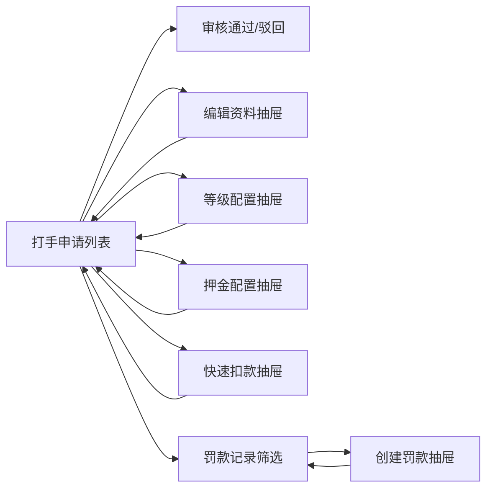

# 打手入驻（Booster）

## 模块职责

用户在 C 端个人中心提交打手入驻申请（游戏昵称 + 擅长游戏 + 段位 + 自我介绍），管理员在管理端「打手管理」审核通过 / 驳回；通过后自动为该用户授予内置 `booster`（打手）角色，驳回可修改后重提；管理端还可对打手资料进行编辑维护。

实现的功能：

- **自助申请 / 重提**：未申请或被驳回时可（重新）提交；已通过或审核中拒绝重复提交。
- **审核工作流**：状态机 `none →(提交) pending →(审核) approved / rejected`；`rejected` 可覆盖重提回到 `pending`。
- **角色授予**：审核通过时经 RBAC 的 `RoleGranter` 幂等地为申请人授予 `booster` 角色（角色由播种器内置，管理员也可在用户管理中手动调整）。
- **资料维护**：管理端可编辑打手的游戏昵称/擅长游戏/段位/自我介绍（不改变审核状态）。
- **实名前置**：配置开关 `booster.requireRealname`（默认开启），开启时未通过实名认证不可提交入驻申请（复用 realname 模块只读检查器 `RealnameChecker`）；同一开关同时门控接单：`BoosterRealnameGuard`（导出供 order 模块）在接单/指派前断言实名已通过，开关关闭则不校验。
- **打手等级**：等级档位（名称/完成单数门槛/提成万分比）存配置中心 `booster.levels`，按累计完成单数自动定级；订单完成时按当前等级费率计提成经 `WalletLedger` 入账（commission 流水）。
- **打手押金**：交付策略存配置中心（最低 `booster.depositMinFen` / 最高 `booster.depositMaxFen`，管理端可配）；已入驻打手在区间内自选金额从钱包余额缴纳（deposit 流水，累计不超最高额），接单前由 `BoosterDepositGuard` 校验已达最低交付额；管理端可全额退还（deposit_refund 流水）。
- **财务罚款**：财务可对打手按订单罚款（理由必填），从钱包余额（penalty 流水）或已缴押金中扣除，留存罚款记录供审计；管理端打手列表提供已入驻打手的快速扣款入口，复用同一罚款抽屉与接口。

## 结构导图（DDD 四层）

```
modules/booster/
├─ domain/
│  ├─ booster-application.entity.ts     聚合根（租户内 user 唯一；申请资料 + 状态机 + 完成单数/押金）
│  ├─ booster-penalty.entity.ts         罚款记录（金额/来源/理由/关联订单/操作人）
│  ├─ booster-repository.interface.ts   仓储端口
│  └─ penalty-repository.interface.ts   罚款仓储端口
├─ application/
│  ├─ booster.mapper.ts / penalty.mapper.ts   实体 → 视图（等级由档位+完成单数实时解析）
│  ├─ booster-policy.service.ts         策略读写：等级档位 / 押金交付策略（最低/最高）/ 实名开关（配置中心）
│  ├─ booster-progress.service.ts       完成单数累计（供 order 模块完成结算调用，导出）
│  ├─ booster-deposit.service.ts        BoosterDepositGuard 押金最低交付额门控（供 order 接单调用，导出）
│  ├─ booster-realname.service.ts       BoosterRealnameGuard 实名门控（开关开启时接单/指派须实名已通过，供 order 调用，导出）
│  └─ use-cases/                        get-my / submit / list / review / update
│                                        / get·set-booster-levels / pay·refund-deposit / get·set-deposit-policy
│                                        / create·list-penalties
├─ infrastructure/
│  ├─ booster.repository.ts             TypeORM 实现（按租户过滤）
│  └─ penalty.repository.ts             罚款仓储 TypeORM 实现
└─ interfaces/
   ├─ dto/                              submit / review / update / list-query
   │                                     / set-booster-levels / pay-deposit / set-deposit-policy
   │                                     / create-penalty / penalty-list-query
   └─ controllers/                      一路由一文件（mine/submit/list/review/update
                                        /levels.get/levels.set/deposit.pay/deposit.refund
                                        /deposit.policy.get/deposit.policy.set
                                        /penalty.create/penalty.list）

modules/rbac/
├─ application/role-granter.service.ts  对外角色授予/回收最小写口（模块导出）
└─ infrastructure/rbac.seeder.ts        ensureBoosterRole：内置「打手」角色幂等播种
```

前端：

- C 端 `client/views/profile/BoosterApplyView.vue`（入口：「我的」页更多功能 →「打手入驻」，路由 `/profile/booster`）：按状态分场景展示申请表单 / 审核进度 / 入驻资料 / 驳回理由与重提。
- C 端 `client/views/profile/BoosterApplyView.responsive.css`：移动端保持全屏申请表单；PC 端标题栏、状态卡、资料表单与提交按钮同轴收敛，有审核状态时左侧提示、右侧展示资料或重提表单。
- 管理端 `web/views/booster/BoosterAdminView.vue`（菜单 `booster:menu` 打手管理，电竞运营分组）：状态筛选 + 审核通过/驳回 + 资料编辑右侧抽屉 + 等级/完成单数/押金展示 + 押金退还 + 已入驻打手快速扣款。
- 管理端 `web/views/booster/BoosterLevelDialog.vue`：等级档位配置右侧抽屉（增删行 + 保存，`booster:level:set`）。
- 管理端 `web/views/booster/BoosterDepositPolicyDialog.vue`：押金交付配置右侧抽屉（最低/最高交付额，`booster:deposit:policy:set`）。
- 管理端 `web/views/finance/PenaltyAdminView.vue`（菜单 `finance:penalty:menu` 罚款管理，财务分组）：罚款记录列表 + 打手 ID 筛选 + 创建罚款右侧抽屉（余额/押金二选一）。
- 管理端 `web/components/finance/PenaltyCreateDrawer.vue`：创建罚款右侧抽屉，支持罚款管理页手动输入打手用户 ID，也支持打手管理页预填并锁定用户 ID。
- C 端 `client/components/profile/BoosterLevelCard.vue`（「我的」页打手身份）：等级/提成/完成单数/押金进度展示与区间内自选金额缴纳。

## 权限（RBAC）

| 权限码 | 名称 | 守卫接口 |
| --- | --- | --- |
| `booster:menu` | 打手管理（菜单） | 前端动态路由 `/booster`（管理后台） |
| `booster:list` | 打手-查询 | `GET /booster` |
| `booster:review` | 打手-入驻审核 | `POST /booster/:id/review` |
| `booster:update` | 打手-资料编辑 | `PUT /booster/:id` |
| `booster:level:set` | 打手-等级配置 | `PUT /booster/levels` |
| `booster:deposit:refund` | 打手-押金退还 | `POST /booster/:id/deposit/refund` |
| `booster:deposit:policy:set` | 打手-押金交付配置 | `PUT /booster/deposit/policy` |
| `finance:penalty:menu` | 罚款管理（菜单） | 前端动态路由 `/finance/penalties` |
| `finance:penalty:list` | 财务-罚款查询 | `GET /finance/penalties` |
| `finance:penalty:create` | 财务-罚款创建 | `POST /finance/penalties` |

> `GET /booster/mine`、`POST /booster` 仅需登录态，所有角色可用（自助）。管理类接口默认仅超管，其余角色在「角色管理」按需分配。

## 管理端 UI 流程



## 接口

| 方法 | 路径 | 权限 | 说明 |
| --- | --- | --- | --- |
| GET | `/booster/mine` | 登录 | `{ status, record }` |
| POST | `/booster` | 登录 | 提交/重提 `{ gameNickname, gameName, rank, intro }` |
| GET | `/booster` | `booster:list` | 分页 `?page&pageSize&status` |
| POST | `/booster/:id/review` | `booster:review` | `{ approve, rejectReason? }`；通过即授予 booster 角色 |
| PUT | `/booster/:id` | `booster:update` | 编辑资料（字段可选，仅更新传入项） |
| GET | `/booster/levels` | 登录 | 等级档位列表 |
| PUT | `/booster/levels` | `booster:level:set` | 保存等级档位 `{ tiers }` |
| GET | `/booster/deposit/policy` | 登录 | 押金交付策略（最低/最高交付额） |
| PUT | `/booster/deposit/policy` | `booster:deposit:policy:set` | 保存押金交付策略 `{ minFen, maxFen }` |
| POST | `/booster/deposit/pay` | 登录 | 区间内自选金额缴纳押金 `{ amountFen }`（仅已入驻，累计不超最高额） |
| POST | `/booster/:id/deposit/refund` | `booster:deposit:refund` | 全额退还押金到钱包余额 |
| GET | `/finance/penalties` | `finance:penalty:list` | 分页 `?page&pageSize&boosterUserId` |
| POST | `/finance/penalties` | `finance:penalty:create` | `{ boosterUserId, amountFen, source, reason, orderNo? }` |

## 设计要点（无硬编码 / 最小化）

- **角色码单一来源**：`BOOSTER_ROLE_CODE` 定义在 `@app/contracts`，播种器、审核用例共用；字段长度限制 `BOOSTER_LIMITS` 前后端共用同一校验规则。
- **RBAC 边界收口**：业务模块不直接操作 RBAC 仓储，通过 RbacModule 导出的 `RoleGranter`（grant/revoke 均幂等，且自动失效该用户的权限缓存）授予角色，供后续其他入驻类业务复用。
- **复用既有模式**：状态机、仓储、控制器拆分与实名认证（realname）保持一致的结构与命名，降低维护成本。
- **多租户**：实体继承 `TenantScopedEntity`，仓储经 `withTenant` 行级隔离。
- **零硬编码**：等级档位/应缴押金/实名开关均存配置中心（`CONFIG_KEYS.booster.*`，默认值回退 `BOOSTER_LEVEL_DEFAULTS`/`BOOSTER_DEFAULTS`）；等级不落库，读时由档位+完成单数解析，改档位即时生效。
- **资金唯一写口**：押金缴纳/退还、余额罚款、完成提成均经 `WalletLedger.adjustBalance` 入账（新增流水类型 commission/deposit/deposit_refund/penalty），保持余额变动单一入口不变量。
- **前端复用**：打手管理快速扣款与罚款管理创建罚款共用 `PenaltyCreateDrawer`，仅由调用方决定是否预填并锁定打手用户 ID，避免两套表单逻辑漂移。
