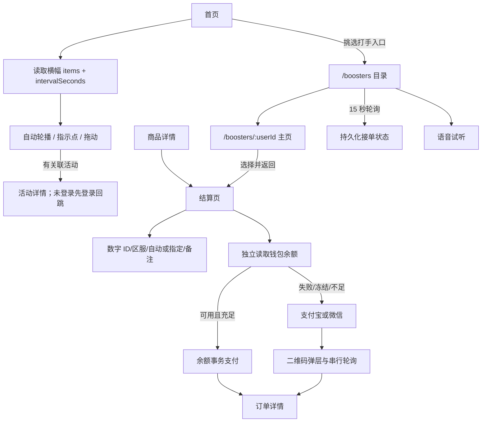
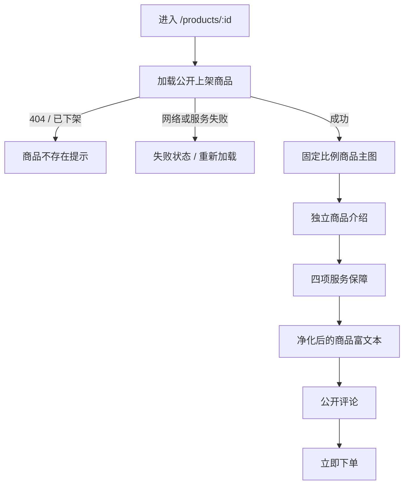
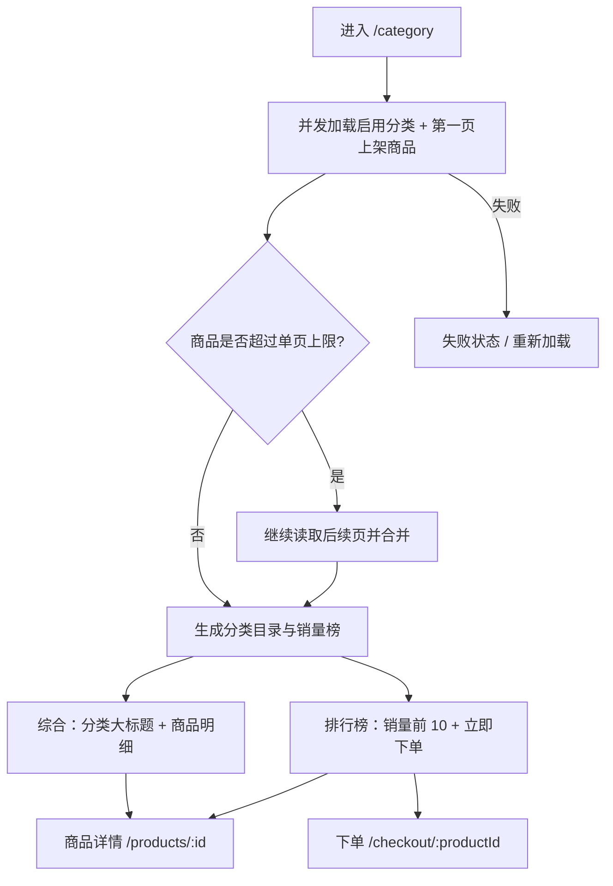
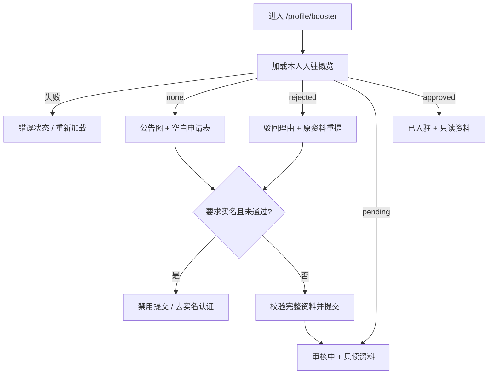

# 用户端（apps/client）

面向 C 端玩家的独立商城前端（战术电竞风），与管理端 `apps/web` 平级、互不耦合。首页/分类可游客浏览，涉及个人身份的页面（我的、消息）需登录；登录/注册**只支持手机号验证码**方式，注册用户由后端默认分配 `member`（普通会员）角色。

## 实现了哪些功能

- **商城主框架**：底部 TabBar（移动端）/ 顶部导航（PC 端）承载首页、分类、消息、我的四个一级页；UI 演示数据见 `src/config/*.mock.ts`。
- **首页运营横幅**：公开读取后台配置的多图列表，以 1～3 秒间隔自动轮播；支持指示点、拖动切换、页面隐藏/悬停/聚焦暂停和失败图降级，点击关联图片进入对应活动。首页商品卡封面不再叠加主副标语，正文仍展示标题、摘要、价格和销量。
- **分类商品目录**：游客可访问 `/category`；综合模式把管理端启用分类作为可配置大标题，展示分类下全部上架商品的真实封面、标题、价格和销量，排行榜按销量展示前 10 项并提供详情 / 下单入口。桌面综合双列、榜单单列，移动统一单列并保留底部导航。
- **商品详情展示**：游客可访问 `/products/:id`；主图只展示后台商品封面，封面主副标语移到图片下方的独立介绍区，并展示「极速接单 / 极速响应 / 服务至上 / 官方严选」。富文本详情经 DOMPurify 净化后渲染，历史本机媒体地址会转换为当前公开后端地址；加载失败可重试，封面失败回退默认徽标。
- **短信登录**：手机号 + 验证码登录（要求手机号已注册），调用后端 `POST /auth/sms/code`、`POST /auth/sms/login`。
- **短信注册**：手机号 + 验证码 + 可选昵称注册（要求手机号未注册），调用后端 `POST /auth/sms/register-code`、`POST /auth/sms/register`；注册成功后端直接签发令牌，前端即自动登录。
- **品牌配置共用**：C 端软件名称/图标与管理端共用配置中心品牌配置（`system.appName` / `system.appLogo`，公开接口 `GET /config/branding`）；启动即拉取（`stores/branding.store.ts`），登录页与 PC 顶部导航展示配置名称/图标（未配图标回退默认徽标），浏览器标题按「页标题 · 软件名称」拼合并同步 favicon。
- **用户协议**：登录/注册均需勾选「我已阅读并同意《用户协议》」才可提交；协议正文为后台配置中心富文本（`auth.userAgreement` 键），公开接口 `GET /config/agreement` 登录前可读，弹层（`AgreementDialog`）内 DOMPurify 消毒后展示。
- **登录守卫**：访问带 `meta.requiresAuth` 的页面（我的 / 消息）未登录时自动重定向到 `/login` 并带 `redirect` 回跳地址；已登录再访问登录页直接回首页。
- **登录态展示**：「我的」页头部登录后展示昵称与用户 ID 并提供退出登录；未登录展示「立即登录」入口；PC 端个人页采用左右两列，右侧订单与更多功能紧凑衔接。
- **更多功能网格（全部落地）**：领券中心 `/coupons/center`、我的优惠券 `/coupons/mine`、会员等级 `/member/levels`、排行榜 `/rank`、福利活动 `/activities`（详情 `/activities/:id`）、打手入驻 `/profile/booster`、实名认证 `/profile/realname`（复用 realname 模块接口，打手等级卡/入驻页未实名时同步引导）、公告通知 `/notices`、搭建同款电竞系统 `/build`（介绍页 + 在线客服咨询入口）；入口 → 路由映射见 `components/profile/FeatureGrid.vue` 的 `ENTRY_ROUTES`。
- **打手完整入驻表单**：登录用户填写姓名、性别、1～2 个接单区服、自我介绍、联系方式，可选上传一张材料图和填写邀请码；未申请 / 已驳回可提交，审核中 / 已通过只读展示。顶部公告图由配置中心 `booster.onboardingNoticeImage` 下发，驳回时保留资料并显示理由。
- **挑选打手与主页**：首页第三个快捷入口进入 `/boosters`；支持按完整/部分打手 ID 或昵称搜索、性别与结算区服筛选、分页加载、空态/失败重试。卡片展示安全显示名、头像、等级、完成单数、区服、打手自主接单状态和不可选原因；点击头像/名称进入 `/boosters/:userId` 主页。
- **打手上下线与大厅刷新**：打手身份的 `/hall` 顶部可切换上线/下线；下线时列表仍可查看但接单按钮禁用。大厅提供手动刷新，页面可见时每 5 秒刷新已加载范围，隐藏或离开页面即停止，自动刷新失败保留旧列表。
- **语音试听**：目录卡片和打手主页头像下方复用 `BoosterVoiceButton` / `useBoosterVoice`；同一时刻只播放一条语音，页面隐藏或离开时暂停，无语音明确显示“暂无语音”，加载/播放失败可见。
- **结构化结算与指定打手**：结算页收集必填数字游戏 ID、选填文字 ID、区服、其他账号信息、自动/指定打手、数量、备注与附件；挑人返回时保留当前内存草稿，区服与打手服务范围不匹配时阻止提交并引导重选。
- **订单余额支付**：结算页除支付宝/微信外可选钱包余额，实时展示余额并覆盖加载失败重试、冻结、余额不足、金额变化自动退出和原地充值；余额扣款成功直接进入订单详情，渠道支付继续使用二维码弹层。
- **订单打手主页入口**：订单详情分别展示锁定打手与实际接单打手；名称有对应 ID 时可直接打开打手主页，客服确认前两组字段保持区分。
- **更多功能页导航规范**：个人页进入的功能页统一采用商品详情页同类型的顶部返回栏 + 标题，不使用侧边菜单式导航；PC 端由 `styles/base.css` 的 `client-page` 页面壳统一收敛标题栏和内容区，订单/榜单等内容筛选使用紧凑分段按钮。

> 说明：账号密码登录属于管理端 `apps/web` 的能力，用户端刻意不提供，保证 C 端只能走短信方式。令牌存储键使用 `client.*` 前缀，与管理端 `infra.*` 隔离，避免同域串号。

明确非目标：C 端打手目录不对游客开放，不展示打手真实姓名、登录用户名、联系方式或申请材料；不实现打赏、在线私聊入口、语音录制/转码、基于在线状态自动派单，也不把敏感结算草稿写入 `localStorage`。

## 前端数据与迁移边界

挑人目录使用服务端 `BoosterPublicView`，不在浏览器建立打手资料副本；`online` 映射服务端持久化接单状态，`selectable` 和 `unavailableReason` 随接口响应计算。结算草稿由 Pinia 内存 store 管理，刷新页面、退出登录或令牌清理都会丢失，账号信息不会写入 IndexedDB、localStorage 或 URL。前端本身没有数据库表和 migration；结构化订单字段、语音 URL 与接单状态由服务端 migration 管理，详见 [order.md](./order.md) 与 [booster.md](./booster.md)。

## 目录结构导图（本次相关部分）

```
apps/client/src
├─ config/env.ts           # 运行时配置 + 令牌存储键（client.* 与管理端隔离）
├─ config/icon-paths.ts    # 图标注册表（本次新增 phone / shieldCheck / logout）
├─ api
│  ├─ http.ts              # Axios 实例：注入令牌 / 解包响应 / 401 静默刷新 / toast 报错
│  ├─ token-storage.ts     # access/refresh 令牌读写清理
│  └─ auth.api.ts          # 短信登录/注册/发码 + 拉取档案
├─ utils/http-error.ts     # 统一错误信息提取
├─ utils/media-url.ts      # 相对路径 / 历史本机媒体地址归一化（含富文本媒体）
├─ stores/auth.store.ts    # 鉴权状态：令牌生命周期 + 当前用户档案
├─ router
│  ├─ index.ts             # 路由表：登录、商品/结算、挑人目录/主页与 requiresAuth 页面
│  └─ guard.ts             # 全局前置守卫（未登录拦截并带 redirect）
├─ components/auth/AgreementDialog.vue  # 用户协议弹层（惰性拉取富文本并消毒展示）
├─ views/auth/LoginView.vue          # 短信登录/注册（SegmentTabs 双页签，共用发码倒计时，需勾选同意用户协议）
├─ components/profile/ProfileHeader.vue  # 登录入口 / 昵称展示 / 退出登录（在既有组件上扩展）
├─ api/commerce.api.ts                    # C 端公开分类、商品列表和商品详情
├─ components/category/
│  ├─ CategoryGroupCard.vue               # 分类大标题 + 上架商品明细，图片失败回退文字封面
│  └─ RankItemCard.vue                    # 销量编号、价格、热度和下单入口
├─ config/category.mock.ts                # 分类页纯视图模型（不保存 mock 数据）
├─ views/category/CategoryView.vue        # 综合 / 排行榜编排、全量分页、加载失败与空态
├─ components/product/
│  ├─ ProductCoverThumb.vue               # 分类 / 榜单共用稳定方形商品缩略图
│  ├─ ProductIntroCard.vue                # 封面主副标语独立介绍卡
│  └─ ProductAssuranceBar.vue              # 四项商品服务保障
├─ views/product/ProductDetailView.vue    # 商品详情加载、失败重试与展示编排
├─ views/product/ProductDetailView.responsive.css # 商品详情桌面双列响应式布局
├─ components/home/
│  ├─ HomeBanner.vue                    # 自动轮播、拖动、暂停、活动跳转和失败图降级
│  └─ ProductCard.vue                   # 首页商品卡（封面不叠加主副标语）
├─ components/order/
│  ├─ CheckoutPaymentMethods.vue        # 支付方式、钱包状态、刷新与充值
│  └─ PayDialog.vue                     # 渠道二维码与防并发支付轮询
├─ components/order/CheckoutServiceForm.vue # 数字/文字 ID、区服、打手模式、备注与附件
├─ components/booster/
│  ├─ BoosterCard.vue                    # 打手目录卡片、在线状态、试听与选择
│  ├─ BoosterVoiceButton.vue             # 语音播放按钮
│  └─ SelectedBoosterNotice.vue          # 结算页已选打手快照
├─ api/booster-directory.api.ts         # 目录/主页查询
├─ composables/
│  ├─ use-booster-voice.ts               # 单例音频播放、暂停与失败状态
│  └─ use-presence-socket.ts             # 鉴权 /im 在线连接
├─ stores/checkout-draft.store.ts       # 挑人 → 分类 → 结算内存草稿
├─ views/booster/
│  ├─ BoosterListView.vue                # 搜索/筛选/分页/在线刷新
│  └─ BoosterProfileView.vue             # 主页、试听、选择
├─ views/order/
│  ├─ CheckoutView.vue                  # 商品/优惠券/会员价加载和订单提交编排
│  ├─ HallView.vue                      # 上下线、手动刷新、可见时定时刷新与接单
│  └─ HallOrderDetailView.vue           # 大厅详情及下线禁用接单
├─ utils/interval-poller.ts             # 可暂停/销毁且可测试的定时轮询器
├─ api/booster.api.ts                   # 本人入驻概览、提交/重提、押金、上下线接口
├─ api/upload.api.ts                     # 登录用户自助上传材料图
├─ components/profile/
│  ├─ BoosterAnnouncementCard.vue        # 公告文字 + 后台配置图片 + 加载失败状态
│  ├─ BoosterApplicationForm.vue         # 编辑 / 只读共用完整资料表单
│  ├─ BoosterApplicationForm.css         # 表单视觉与稳定尺寸
│  ├─ BoosterMaterialUploader.vue        # 单图上传、更换、清空与失败提示
│  └─ booster-application-form.ts        # 表单初始化、共享限制校验与载荷构造
├─ views/profile/BoosterApplyView.vue    # 状态编排、加载重试、实名引导和提交
├─ views/profile/BoosterApplyView.responsive.css # 桌面 / 移动响应式与安全区
└─ styles/base.css                       # 全局设计令牌 + client-page 独立功能页页面壳
```

## 首页横幅与支付流程



交互和异常边界：

- 横幅固定展示尺寸，多图才启动计时；滑动超过阈值后抑制点击，纵向滚动不触发活动跳转。单张图片失败会被剔除，全部失败时横幅隐藏但首页继续可用。
- 商品详情决定结算页是否为“商品不存在”；钱包、优惠券或会员辅助请求失败各自降级，不把商品误报为下架。
- 钱包加载失败可刷新；冻结或不足时余额按钮禁用。充值弹层关闭后保留已填写数量、备注、附件、账号和优惠券。
- `PayDialog` 同一时刻只发一个查单请求；只有明确已支付状态或 `paidAt` 非空才成功跳转，取消状态会停止轮询并显示未支付。

## 商品详情展示流程

详情页继续复用 `GET /commerce/public/products/:id` 和既有评论组件，不新增接口、权限或数据结构。封面标语属于商品介绍，不参与主图叠加；立即下单仍进入既有 `/checkout/:productId` 流程。



安全与异常边界：

- 富文本先经 DOMPurify 净化，再用 DOM 解析器转换保留下来的 `img/video/audio/source` 媒体地址；不解析脚本，也不放宽净化规则。
- 相对 `/static` 路径和历史 `localhost / 127.0.0.1 / ::1` 地址按当前 API 来源转换，正常 OSS / CDN 外链保持不变，避免远端设备请求自身本机。
- 主图和分类 / 榜单缩略图都使用稳定容器约束；加载失败回退文字或默认徽标，不允许图片固有比例撑开页面。
- 移动端滚动区止于固定下单栏上方；桌面端主图、介绍、保障、详情与评论位于主列，价格下单卡位于右侧。

## 分类目录流程

分类页复用商品模块公开接口，不写死分类名称或商品素材。管理端修改分类名称、图标、排序或启停后，C 端下一次加载直接按新目录展示；商品只展示上架数据。



交互和异常边界：

- 分类大标题、图片图标和文字图标来自管理端分类配置；商品封面加载失败时回退 `coverTitle`，不会撑开布局。综合和排行榜均同时展示封面主标语与副标语。
- 启用但没有上架商品的分类仍保留并显示空态；没有启用分类、没有上架商品和接口加载失败分别展示明确状态。
- 商品公开接口单页最多 100 项，分类页按分页读取完整上架目录，不会静默遗漏第 101 项后的商品。
- 综合商品入口进入详情；排行榜商品正文进入详情，主操作直接进入下单。下单路由仍使用既有登录守卫和订单流程。
- 响应式沿用全站 `768px` 断点；移动端卡片单列、分段控件满宽，并由 `MainLayout` 为固定 TabBar 预留底部空间。

## 商品展示验证

- 浏览器真实回归：`1280×720`、`390×844`、`320×568`；详情、综合分类和排行榜均无横向溢出，图片元素与固定容器尺寸一致，四项保障及主副标语完整可见。
- 应用自身控制台无错误或警告；浏览器扩展自身警告不计入应用结果。
- C 端通过 `lint`、`typecheck` 和生产构建；仓库级检查结果以本次交付汇报为准。

## 打手入驻页面流程

页面先调用 `GET /booster/mine`，一次取得申请记录、实名前置开关、本人实名状态、押金策略和公告图。材料图复用 `POST /upload/self`，上传完成后只把返回 URL 放进 `POST /booster` 的申请载荷。



交互和异常边界：

- 姓名、性别、区服、自我介绍和联系方式未完整时提交按钮不可用；材料上传中和提交中防止重复操作。
- 联系方式类型切换会清空原联系内容，避免类型和值不一致；当前仅做必填和长度校验，不验证具体号码格式。
- 材料选择器只接受浏览器识别的 `image/*`，预览使用 `contain`；失败后可重新选择。清空只移除表单 URL，不删除已上传文件。
- 公告图为空时不渲染图片，加载失败显示提示但不阻塞申请；桌面端分栏展示，移动端固定提交区并预留底部安全区。
- `pending`、`approved` 不提供 C 端编辑入口；管理端资料编辑、隐私、migration 和清理边界见 [booster.md](./booster.md)。

## 挑选打手页面流程

`/boosters` 与 `/boosters/:userId` 均要求登录。目录接口返回当前租户内审核通过、账号启用且具有 `booster` 角色的脱敏投影；前端不自行推断在线状态，也不把按钮禁用当作安全校验。

```mermaid
flowchart TD
  Entry[首页挑选打手入口] --> Guard{已登录?}
  Guard -->|否| Login[短信登录并安全回跳]
  Guard -->|是| List[/boosters 目录]
  List --> Search[ID/昵称搜索 + 性别/区服筛选]
  Search --> Cards[分页卡片：头像/等级/在线/语音/可选状态]
  Cards --> Profile[/boosters/:userId 主页]
  Cards --> Select[选择打手]
  Profile --> Voice[试听或暂停语音]
  Profile --> Select
  Select --> Draft[checkout-draft 内存暂存]
  Draft --> Checkout[/checkout/:productId]
  Checkout --> Submit[服务端再次校验并创建订单]
```

### 前端状态与异常边界

- 搜索关键词最多 64 字符；请求以递增 request id 防止旧响应覆盖新筛选结果。后台接单状态刷新失败时保留上一次目录快照，主动刷新失败才展示错误态。
- 目录和主页覆盖加载、空结果、网络失败重试、账号下架/非 404；头像失败回退默认图，语音无 URL 显示“暂无语音”，播放失败显示错误状态。
- 历史申请若没有可识别的接单区服，目录保留其脱敏资料但禁用选择，并展示服务端原因“打手暂未配置接单区服”；前端不自行补默认区服，也不会绕过该门禁。
- `checkout-draft.store` 只在 Pinia 内存中保存 `productId`、游戏资料、备注附件、支付方式、优惠券和安排模式；账号信息不持久化。退出登录、令牌失效、刷新令牌失败或支付成功时清空。
- 指定打手的区服切换采用单向回退：当前区服仍兼容时保持原值，仅在不兼容时选择该打手支持的首个区服；`resolveCompatibleServiceRegion` 解析为空时不写回历史内存草稿，避免 watcher 递归更新。若仍无有效选择则回到目录。返回路径经过 `safeBoosterReturnTo` 白名单校验，不能借 query 开放任意跳转。
- 锁定指定打手后，结算提交将 `requestedBoosterId` 作为唯一履约人发送；创建订单或客服确认阶段若打手已下线、资格、实名、押金或区服已变化，服务端返回明确错误，前端保留草稿供重新选择，不自动改派其他打手。
- 订单大厅/客服并发领取由后端行锁决定唯一成功者；竞争请求返回 409，客户端不重复提交敏感资料或自行加入订单群。
- 大厅上下线切换提交中防重复；手动刷新有成功/失败反馈，5 秒自动刷新只在页面可见时运行，失败不会清空旧列表。轮询器的重复启动、暂停恢复和销毁清理有 Vitest 覆盖。

目录公开字段、接单状态租户隔离、语音限制、migration 和服务端选择门禁见 [booster.md](./booster.md)；订单字段可见性见 [order.md](./order.md)。

明确非目标：浏览器不保存数字游戏 ID、文字 ID、账号信息或备注正文到持久化存储；上线只表示当前接受派单，不保证响应时限或服务结果。

## 登录 / 注册时序

```
用户 → LoginView：输入手机号，点击「发送验证码」
     → authApi.sendLoginCode / sendRegisterCode（按当前页签选择）
     → 后端按配置中心 sms.provider 发码（log 驱动打到日志），返回 cooldown 用于倒计时
用户 → 输入验证码，点击「登录 / 注册并登录」
     → authStore.smsLogin / smsRegister → 保存令牌 → loadProfile()
     → 守卫放行，跳转 redirect 或首页
```

## 本次验证与残余风险

- 根目录 `pnpm test` 串行执行服务端、管理端和客户端测试；实际结果与数量以交付汇报为准，避免在文档中固化会漂移的套件数量。
- 本地浏览器已完整走通“首页挑选打手入口 → 目录 → 选择 `user0942` → 分类 → 商品 → 结算”；在电脑端更换打手后返回结算仍保持电脑端，钱包余额支付方式可选。订单详情中的打手名称可进入对应打手主页；未登录点击入口会安全回跳 `/login?redirect=/boosters`。
- 本地浏览器已确认大厅上下线切换后刷新页面仍保持状态、手动刷新显示成功反馈；测试结束后账号恢复下线。`390×844` 视口的 `scrollWidth` 与 `clientWidth` 均为 390，无横向溢出；C 端控制台没有 warning/error。
- 管理端已分别按注册手机号与申请姓名搜索，均只返回目标记录，清空后恢复 2 条完整列表；横幅仍支持 1 / 2 / 3 秒间隔，打手语音上传控件可用。长 ID、最长不可选原因和实际语音播放失败仍属于后续边界回归项。
- 语音依赖浏览器媒体策略和存储跨域配置；大厅自动刷新是轮询而非服务端推送。这些限制不会放宽后端的租户、上下线、锁定打手和敏感字段边界。

## 本地启动

```bash
# 依赖后端与 Postgres/Redis 已启动（见 docs/sms.md）
cp apps/client/.env.example apps/client/.env
pnpm --filter @app/client dev   # http://127.0.0.1:5174
```

无短信密钥时，把配置中心 `sms.provider` 保持默认 `log`，验证码会打印到后端日志，便于联调。
