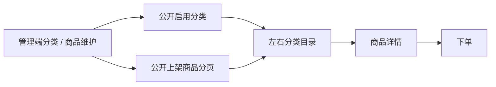
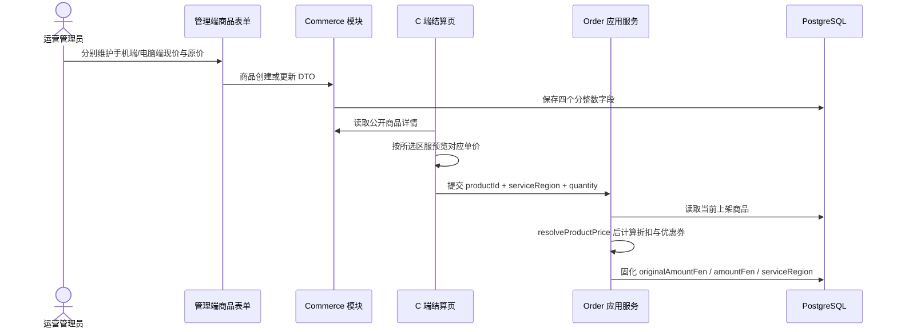
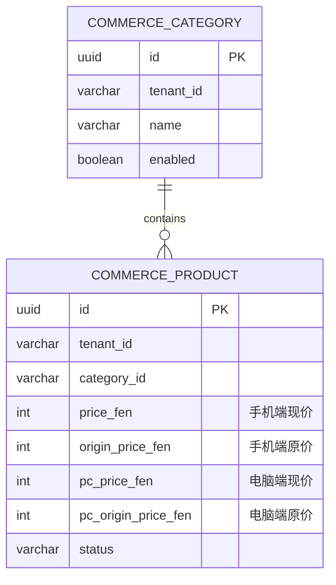
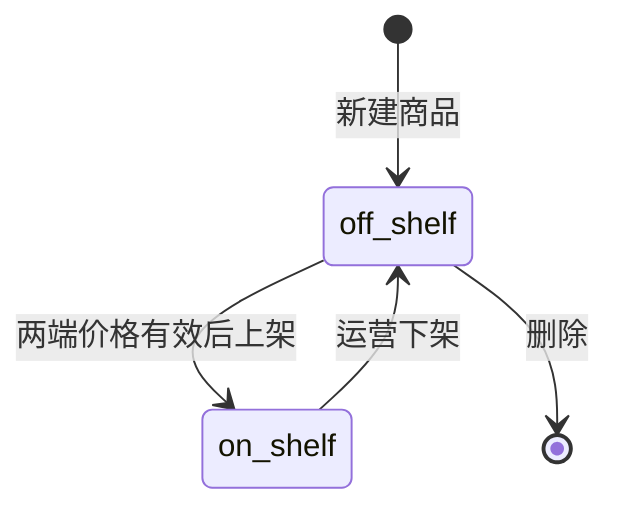

# 商品管理（Commerce）

## 模块职责

陪玩下单平台的商品与分类管理。运营在管理端维护「分类」（一级归类，如大红单/护航单）与「商品」（具体陪玩服务单，含标题、封面图片、封面标语、富文本详情、手机端/电脑端价格、销量、关联负责客服、上下架状态、排序）；C 端（用户端 `apps/client`）通过免登录公开接口读取启用分类与上架商品。

实现的功能：

- **分类 CRUD**：管理端分页查询、创建、更新、删除；同租户下分类名唯一；删除时若分类下仍有商品则拒绝，避免商品失去归属。
- **分类图标（图片 / 文字两种形式）**：分类含图标图片 `icon`（走 `/upload`）与文字图标 `cover`。C 端分类目录优先展示图片图标，未设图片或加载失败则回退文字图标（`cover`，为空再取分类名前两字）。
- **商品 CRUD + 上下架**：管理端分页查询（按分类 / 状态 / 关键字过滤）、创建、更新、删除、上下架切换。新建商品默认「下架」，需显式上架后 C 端才可见。
- **手机端 / 电脑端独立价格**：既有 `priceFen / originPriceFen` 继续表示手机端价格，`pcPriceFen / pcOriginPriceFen` 表示电脑端价格。管理端分别维护，公开详情同时展示；订单模块按下单时的 `serviceRegion` 在服务端选择权威单价。
- **封面图片 + 富文本详情**：商品含封面图片（`cover`，走现有 `/upload` 上传返回 URL）与富文本详情（`description` 存 HTML，管理端用 AiEditor 编辑，图片/视频复用上传接口）。C 端详情主图只展示封面，`coverTitle / coverSub` 在图下独立展示；富文本先净化再转换历史本机媒体地址。首页商品卡片的卖点文案直接取 `coverSub`，不再从富文本详情提取纯文本摘要。
- **关联负责客服（仅客服角色）**：商品可选关联一名「负责客服」（`serviceAgentId`，可空），为后续「下单拉群只拉指定客服」打基础。候选人**仅取拥有内置「客服」角色（`service`）的用户**（非全部用户），管理端表单经 `/commerce/service-agents` 按用户名/昵称远程搜索。客服角色由 `RbacSeeder` 幂等播种，管理员在用户管理中为客服人员分配。
- **C 端商品详情页视觉**：价格区采用战术金渐变面板（大号价格 + 折扣标签 + 划线原价 + 已售），封面底部渐隐衔接，下单按钮为斜切金色渐变；移动端与 PC 端（双栏 + 右侧吸顶信息卡）均适配。
- **C 端只读公开接口**：`/commerce/public/categories`（启用分类）、`/commerce/public/products`（上架商品，可按分类过滤）与 `/commerce/public/products/:id`（单个上架商品），免登录，供首页、分类和详情页渲染。
- **营销工具**：商品列表「营销」入口弹窗，可编辑已售销量（`sold` 走商品更新接口，需 `commerce:product:update`），并可为商品添加自定义评论（昵称/头像自设，走 `POST /review/marketing`，详见 `docs/review.md`）。
- **金额以「分」存储**：四个价格字段均为整数分，杜绝浮点误差；展示层统一 `fenToYuan` 转元，未选择端类型前只展示两端最低“起”价。

## 结构导图（DDD 四层）

```
modules/commerce/
├─ domain/
│  ├─ category.entity.ts                 分类聚合根（TenantScopedEntity：name/cover/sort/enabled）
│  ├─ product.entity.ts                  商品聚合根（categoryId/价格/销量/serviceAgentId/status/sort）
│  ├─ category-repository.interface.ts   分类仓储端口（CATEGORY_REPOSITORY）
│  └─ product-repository.interface.ts    商品仓储端口（PRODUCT_REPOSITORY，含 ProductFilter）
├─ application/
│  ├─ category.mapper.ts                 分类实体 → 管理端/ C 端视图
│  ├─ product.mapper.ts                  商品实体 → 管理端/ C 端视图
│  ├─ product-view.assembler.ts          单商品视图组装（解析分类名 + 负责客服名，供写用例复用）
│  └─ use-cases/                         分类：list/create/update/remove/list-public
│                                        商品：list/create/update/remove/publish/list-public
│                                        客服候选：list-service-agents
├─ infrastructure/
│  ├─ category.repository.ts             TypeORM 实现（按租户过滤；countProducts 聚合各分类商品数）
│  └─ product.repository.ts              TypeORM 实现（按租户过滤；分类/状态/关键字过滤）
└─ interfaces/
   ├─ dto/                               create/update-category、create/update-product、
   │                                     publish、product-list-query、public-product-query
   └─ controllers/                       一路由一文件（分类 4 + 商品 5 + 客服 1 + 公开 2）
```

前端：

- 管理端 `apps/web/src/views/commerce/CategoryListView.vue`（菜单 `commerce:category:menu`）、`ProductListView.vue`（菜单 `commerce:product:menu`）只负责数据加载、提交、删除、上下架等业务编排；UI 拆到 `apps/web/src/components/commerce/`：
  - `category/CategoryStats.vue`、`CategoryDirectory.vue`、`CategoryFormDrawer.vue`
  - `product/ProductStats.vue`、`ProductDirectory.vue`、`ProductFormDrawer.vue`
  - `commerce-ui.types.ts` 收口分类/商品表单与筛选模型
- 管理端 API 门面：`apps/web/src/api/commerce.api.ts`。
- 用户端 `apps/client`：`views/home/HomeView.vue`（分类签 + 商品网格）、`views/category/CategoryView.vue`（搜索 + 左右分类目录）、`views/product/ProductDetailView.vue`（方形完整主图 / 双端价格 / 介绍 / 保障 / 富文本）接入公开接口，API 门面 `apps/client/src/api/commerce.api.ts`；目录分组由 `CategoryGroupCard.vue` 承载，共用支持方形/圆形展示的 `ProductCoverThumb.vue`。

## 权限（RBAC）

| 权限码                     | 名称             | 守卫接口                                                 |
| -------------------------- | ---------------- | -------------------------------------------------------- |
| `commerce:category:menu`   | 分类管理（菜单） | 前端动态路由 `/commerce/categories`                      |
| `commerce:product:menu`    | 商品管理（菜单） | 前端动态路由 `/commerce/products`                        |
| `commerce:category:list`   | 分类-查询        | `GET /commerce/categories`                               |
| `commerce:category:create` | 分类-创建        | `POST /commerce/categories`                              |
| `commerce:category:update` | 分类-更新        | `PATCH /commerce/categories/:id`                         |
| `commerce:category:remove` | 分类-删除        | `DELETE /commerce/categories/:id`                        |
| `commerce:product:list`    | 商品-查询        | `GET /commerce/products`、`GET /commerce/service-agents` |
| `commerce:product:create`  | 商品-创建        | `POST /commerce/products`                                |
| `commerce:product:update`  | 商品-更新        | `PATCH /commerce/products/:id`                           |
| `commerce:product:remove`  | 商品-删除        | `DELETE /commerce/products/:id`                          |
| `commerce:product:publish` | 商品-上下架      | `PATCH /commerce/products/:id/status`                    |

> 管理类接口默认仅超管；其余角色在「角色管理」按需分配。菜单权限由 `MENU_DEFINITIONS` 单一来源经 `RbacSeeder` 幂等播种。

## 接口

| 方法   | 路径                            | 权限                       | 说明                                                                                        |
| ------ | ------------------------------- | -------------------------- | ------------------------------------------------------------------------------------------- |
| GET    | `/commerce/categories`          | `commerce:category:list`   | 分页 `?page&pageSize`，含各分类商品数                                                       |
| POST   | `/commerce/categories`          | `commerce:category:create` | `{ name, cover?, sort?, enabled? }`                                                         |
| PATCH  | `/commerce/categories/:id`      | `commerce:category:update` | 部分更新                                                                                    |
| DELETE | `/commerce/categories/:id`      | `commerce:category:remove` | 分类下有商品则拒绝                                                                          |
| GET    | `/commerce/products`            | `commerce:product:list`    | 分页 `?page&pageSize&categoryId&status&keyword`                                             |
| POST   | `/commerce/products`            | `commerce:product:create`  | 创建，默认下架；包含手机端 `priceFen/originPriceFen` 与电脑端 `pcPriceFen/pcOriginPriceFen` |
| PATCH  | `/commerce/products/:id`        | `commerce:product:update`  | 部分更新，可独立更新四个价格字段                                                            |
| PATCH  | `/commerce/products/:id/status` | `commerce:product:publish` | `{ status: on_shelf \| off_shelf }`                                                         |
| DELETE | `/commerce/products/:id`        | `commerce:product:remove`  | 删除                                                                                        |
| GET    | `/commerce/service-agents`      | `commerce:product:list`    | 负责客服候选 `?page&pageSize&keyword`                                                       |
| GET    | `/commerce/public/categories`   | 公开                       | 启用中的分类（C 端）                                                                        |
| GET    | `/commerce/public/products`     | 公开                       | 上架商品分页 `?page&pageSize&categoryId&keyword`                                            |
| GET    | `/commerce/public/products/:id` | 公开                       | 单个上架商品详情；不存在或下架均返回 404                                                    |

## C 端分类目录

`/category` 按公开分类顺序输出左右目录：左侧是一级分类索引，右侧是可独立滚动的分组；顶部搜索按分类名、商品名和封面文案过滤，组内提供“全部商品”入口与真实上架商品圆形入口，点击商品进入既有详情/下单流程。



- 分类页首先并发读取分类与商品第一页，若总数超过 100 则按总页数继续读取，合并时按商品 ID 去重并只保留归属启用分类的商品；任一请求失败进入可重试错误态。
- 启用但暂无上架商品的分类仍展示空态；无分类、搜索无匹配和接口失败使用不同文案并支持重试。
- 分类图标与商品封面使用稳定圆形尺寸，图片失败回退文字，不改变目录格尺寸；分类和商品长标题最多显示两行。
- 桌面左栏约 `190px`、右侧独立滚动；小于 `768px` 后左栏收窄至约 `94px`，仍由 `MainLayout` 为固定底部导航留白。
- 搜索仅作用于当前已加载的公开数据，不写入敏感状态，也不改变公开 API 权限。
- 商品详情主图使用稳定方形容器和 `object-fit: contain`，保证宣传图文字不被裁切；点击后可查看完整原图，加载失败回退默认徽标。

## 设计要点（无硬编码 / 最小化）

- **上下架单一枚举**：`ProductStatus`（`on_shelf` / `off_shelf`）在 `@app/contracts`，C 端公开查询强制只返回 `on_shelf`，前后端同源。
- **金额以分为单位**：整数存储，展示层 `fenToYuan` 转换；`resolveProductPrice` 是手机端/电脑端价格映射的前后端单一来源，订单服务端仍重新计算，不接受前端传入金额。
- **多租户**：两个实体继承 `TenantScopedEntity`，仓储经 `withTenant` / `applyTenant` 行级隔离。
- **视图组装收口**：`ProductViewAssembler` 统一「实体 → 视图」时的分类名、负责客服名解析，创建/更新/上下架用例复用，避免重复拼装；列表用例批量解析（`findByIds` + `resolveProfiles`）避免 N+1。
- **契约共享**：`CategoryView`、`ProductView`、`ProductPublicView`、`CreateProductPayload` 等在 `@app/contracts`，管理端与用户端复用同一类型定义。
- **表结构**：生产环境固定 `synchronize=false`。双端价格由 `1784908800000-add-product-pc-prices.ts` 正式迁移，禁止依赖自动同步。

## 双端价格流程



客户端显示金额只用于确认与交互。创建订单时服务端重新读取商品并按 `serviceRegion` 计价，篡改客户端页面、请求或缓存不能改变实际订单金额；会员折扣、优惠券和支付幂等边界继续由订单模块负责。

## 数据模型、Migration 与状态





Migration 的 `up` 先锁定商品表并检查历史上架商品：若存在手机端现价小于等于 0 的记录，迁移会报告数量并中止，要求运营先修正数据，避免升级后继续公开不可结算的 0 元商品。检查通过后增加两个电脑端价格列，并把历史手机端价格回填过去，因此既有有效商品两端价格相同且可继续下单。`down` 仅在电脑端价格仍与手机端一致时允许删除新增列；一旦运营已经维护差异价格，回滚会明确失败，防止静默丢失业务数据。订单表不新增字段，既有 `service_region` 与金额快照足以追溯历史成交口径。

## 异常、安全与非目标

- 创建/更新 DTO 校验价格必须是非负整数；上架时两端现价必须大于 0。商品不存在、已下架或所选端价格异常时，创建订单返回明确业务错误，不创建可支付订单。
- 商品、分类查询继续经租户作用域过滤；公开视图不包含负责客服、状态或内部用户资料。富文本继续经 DOMPurify 净化，双端价格不改变上传和 XSS 边界。
- 本次不实现按游戏、时段、打手等级或库存动态调价，不新增价格版本表，也不修改既有会员折扣、优惠券和退款金额规则。
- 公开商品 API 的字段增加后，旧客户端仍可读取既有手机端字段；新客户端才使用电脑端字段。部署必须先执行 migration，再启动读取新列的服务端。

## 测试范围

- 共享规则覆盖手机端、电脑端和最低起价；订单应用测试覆盖两种区服均由服务端选价并参与数量、会员折扣和优惠券计算。
- DTO 测试覆盖缺失、负数和非整数电脑端价格；管理端测试覆盖下架草稿允许零价格、上架商品要求两端正价；PostgreSQL E2E 覆盖历史价格回填、历史上架零价阻断、空表升级、同价安全回滚及差异价格拒绝回滚。
- 管理端通过类型检查和构建验证四字段提交；C 端 Vitest 覆盖结算区服切换后的单价选择，并通过桌面/移动浏览器检查双价、方形主图、完整预览、加载失败与下单跳转。
