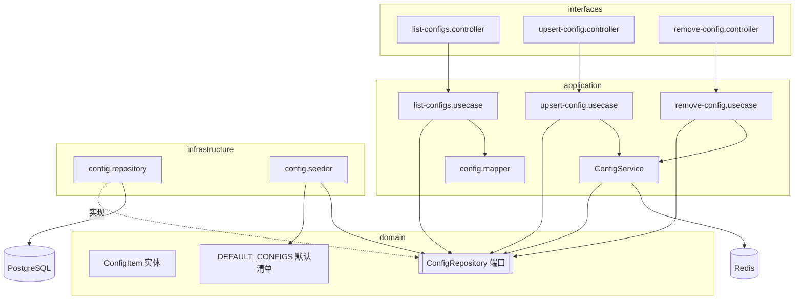
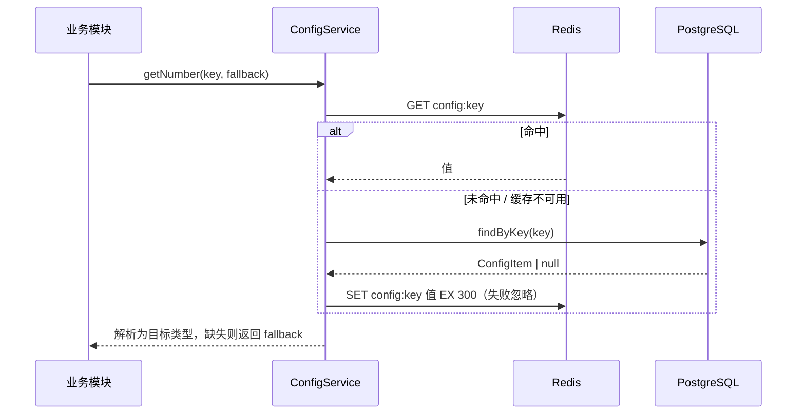

# 配置中心（Config Center）

## 模块职责

平台**唯一的可调参数登记处**。除数据库/Redis 连接信息与部署密钥（这些走 `.env`）外，
所有业务可调参数（令牌有效期、上传驱动、OSS 凭证、IM 历史条数等）全部入库，
其它模块只通过 `ConfigService` 读取，从根本上消除散落各处的硬编码常量。

实现的功能：

- 启动时按默认清单**播种**缺失的配置项（幂等，已存在则跳过）。
- 配置项**列表查询**（密钥类配置值脱敏返回 `******`）。
- 配置项**新增/更新**（upsert）并失效缓存。
- 配置项**删除**并失效缓存。
- 统一**读穿透缓存**（Redis，TTL 300s），并按类型（string/number/boolean/json/richtext）安全读取，缓存不可用时降级回源。
- **富文本配置（richtext）**：值为 HTML 字符串（读取等同 string），配置中心编辑时启用富文本编辑器（AiEditor，图片/视频走 `POST /upload` 返回 URL），渲染前经 DOMPurify 净化防 XSS。如 `im.service.welcome`。
- **历史迁移（幂等）**：`im.service.welcome` 由 string 改为 richtext 仅纠正类型、保留已编辑内容；`upload.maxFileSize` 旧字节默认值迁移为 MB。

## 目录结构（DDD 四层）

```
modules/config/
├── domain/
│   ├── config-item.entity.ts           配置项实体（key/value/type/group/remark/secret）
│   ├── config-repository.interface.ts  仓储端口 + 注入令牌
│   └── config-defaults.ts              默认配置清单（默认值唯一来源）
├── application/
│   ├── config.service.ts               读取服务（Redis 读穿透缓存 + 类型化读取）
│   ├── config.mapper.ts                实体 ↔ DTO（含密钥脱敏）
│   └── use-cases/
│       ├── list-configs.usecase.ts
│       ├── upsert-config.usecase.ts
│       └── remove-config.usecase.ts
├── infrastructure/
│   ├── config.repository.ts            TypeORM 仓储实现
│   └── config.seeder.ts                启动播种器（OnApplicationBootstrap）
└── interfaces/
    ├── dto/upsert-config.dto.ts
    ├── list-configs.controller.ts      GET    /api/config
    ├── upsert-config.controller.ts     POST   /api/config
    └── remove-config.controller.ts     DELETE /api/config/:key
```

## 结构与依赖



## 读取缓存流程（读穿透）



写操作（upsert/remove）完成后调用 `ConfigService.invalidate(key)` 删除缓存，下次读取回源，保证一致性。

## 默认配置清单

| key | 分组 | 默认值 | 说明 | 密钥 |
| --- | --- | --- | --- | --- |
| `auth.accessTokenTtl` | Auth | `3600` | 访问令牌有效期（秒） | |
| `auth.refreshTokenTtl` | Auth | `604800` | 刷新令牌有效期（秒） | |
| `upload.driver` | Upload | `local` | 存储驱动 local/oss | |
| `upload.maxFileSize` | Upload | `10` | 单文件最大体积（MB） | |
| `upload.localBaseUrl` | Upload | `http://127.0.0.1:3000/static` | 本地存储访问基础 URL | |
| `upload.localDir` | Upload | `uploads` | 本地存储根目录 | |
| `upload.ossEndpoint` | Upload | （空） | OSS Endpoint | |
| `upload.ossBucket` | Upload | （空） | OSS Bucket | |
| `upload.ossAccessKeyId` | Upload | （空） | OSS AccessKeyId | ✓ |
| `upload.ossAccessKeySecret` | Upload | （空） | OSS AccessKeySecret | ✓ |
| `im.historyLimit` | Im | `50` | 拉取历史消息默认条数 | |

> 标记为密钥（`secret: true`）的配置项，列表查询时值会被脱敏为 `******`，不会明文返回前端。

## 设计要点

- **读穿透缓存 + 降级**：Redis 不可用时 `safeCacheGet/Set` 静默降级回源，不影响主流程。
- **类型安全读取**：`getString/getNumber/getBoolean/getJson` 均带 fallback，非法值回退默认，避免脏数据击穿业务。
- **默认值唯一来源**：`DEFAULT_CONFIGS` 是默认值的唯一登记处，播种器据此初始化，杜绝重复定义。

## 相关端点

详见 [api-reference.md](./api-reference.md#配置中心)。
