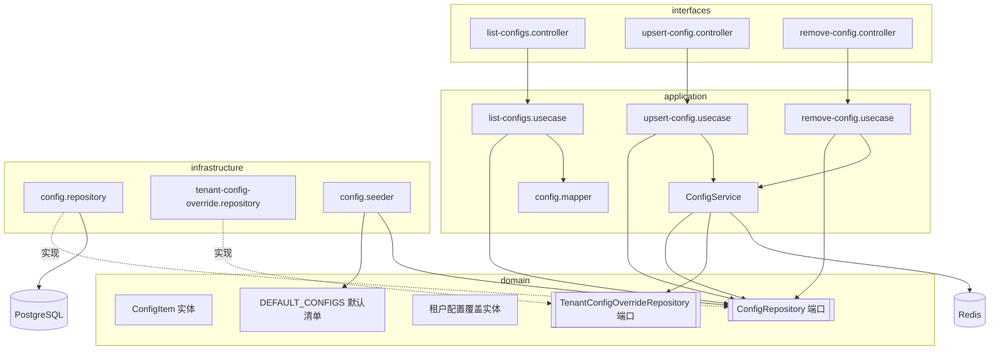
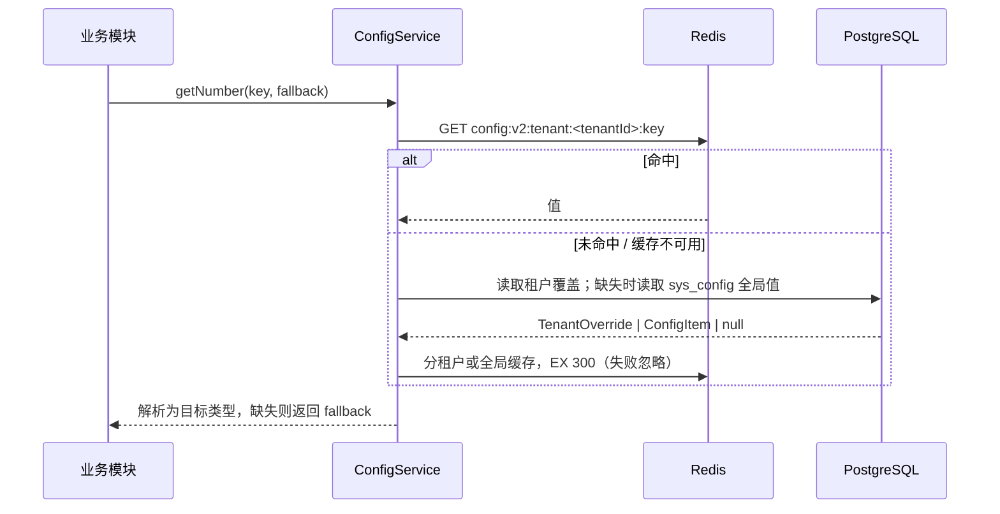
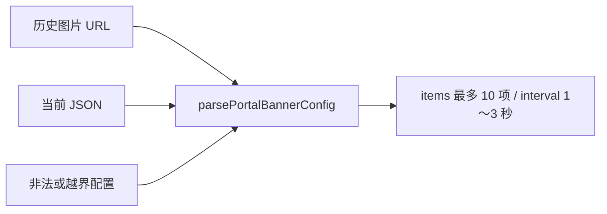
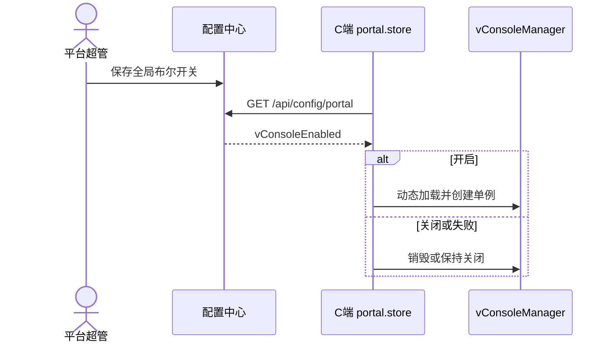
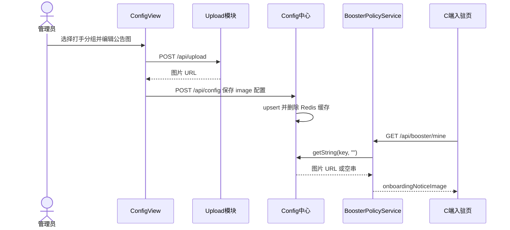
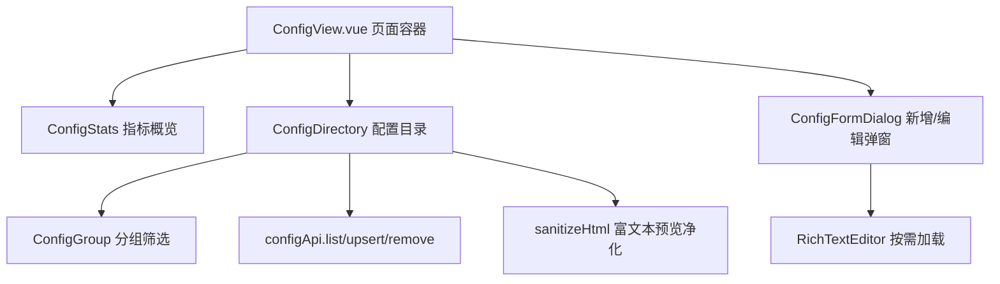

# 配置中心（Config Center）

## 模块职责

平台**唯一的可调参数登记处**。除数据库/Redis 连接信息与部署密钥（这些走 `.env`）外，
所有业务可调参数（令牌有效期、上传驱动、OSS 凭证、IM 历史条数等）全部入库。
`sys_config` 保存平台默认值和元数据，五个站点展示键可由
`sys_tenant_config_override` 按租户覆盖；其它模块只通过 `ConfigService` 读取。

实现的功能：

- 启动时按默认清单**播种**缺失的配置项（幂等，已存在则跳过）。
- 配置项**列表查询**（密钥类配置值脱敏返回 `******`）。
- 配置项**新增/更新**（upsert）并失效缓存。
- 配置项**删除**并失效缓存。
- 租户管理员只可查看和维护网站名称、Logo、首页横幅、排行榜开关与用户协议；支付、
  短信、上传、令牌、vConsole 和其他非白名单配置仅平台超级管理员可维护。
- 统一**读穿透缓存**（Redis，TTL 300s），并按类型（string/number/boolean/json/richtext/image）安全读取，缓存不可用时降级回源。
- **富文本配置（richtext）**：值为 HTML 字符串（读取等同 string），配置中心编辑时启用富文本编辑器（AiEditor，图片/视频走 `POST /upload` 返回 URL），渲染前经 DOMPurify 净化防 XSS。如 `im.service.welcome`。
- **图片配置（image）**：值为图片上传后的可访问 URL（读取等同 string），配置中心编辑时用图片上传控件（走 `POST /upload` 返回 URL）并预览。如软件图标 `system.appLogo`。
- **打手入驻公告图**：`booster.onboardingNoticeImage` 在「打手」分组维护，默认空串；C 端不直接读取配置列表，而是由打手模块通过 `GET /booster/mine` 下发给登录用户。
- **品牌信息**：`system.appName`（软件名称）与 `system.appLogo`（软件图标）可在配置中心修改，并经公开接口 `GET /config/branding` 在登录前下发给前端，用于浏览器标题、favicon、登录页与侧边栏 logo。
- **C 端调试开关**：`portal.vConsoleEnabled` 默认关闭且保持平台全局；只有平台超管可在「运营」分组启停，C 端刷新后按需加载或销毁 vConsole。
- **用户协议**：`auth.userAgreement`（富文本）在配置中心「认证」组编辑，经公开接口 `GET /config/agreement` 登录前下发；C 端登录/注册页需勾选同意后才可提交，弹层查看全文。
- **开发短信固定码**：`sms.development.fixedCode` 默认 `000000`，仅服务端 `NODE_ENV=development` 生效；清空即关闭，生产环境始终忽略。
- **历史迁移（幂等）**：`im.service.welcome` 由 string 改为 richtext 仅纠正类型、保留已编辑内容；`upload.maxFileSize` 旧字节默认值迁移为 MB。

## 目录结构（DDD 四层）

```
modules/config/
├── domain/
│   ├── config-item.entity.ts           配置项实体（key/value/type/group/remark/secret）
│   ├── config-repository.interface.ts  仓储端口 + 注入令牌
│   ├── tenant-config-override.entity.ts / *-repository.interface.ts
│   │                                    租户覆盖实体与仓储端口
│   ├── tenant-config-keys.ts           五项可覆盖键白名单
│   ├── config-defaults.ts              默认配置清单（含打手公告图）
│   └── sms-config-defaults.ts          短信配置清单（由主清单组合）
├── application/
│   ├── config.service.ts               读取服务（Redis 读穿透缓存 + 类型化读取）
│   ├── config.mapper.ts                实体 ↔ DTO（含密钥脱敏）
│   └── use-cases/
│       ├── list-configs.usecase.ts
│       ├── upsert-config.usecase.ts
│       └── remove-config.usecase.ts
├── infrastructure/
│   ├── config.repository.ts            TypeORM 仓储实现
│   ├── tenant-config-override.repository.ts
│   └── config.seeder.ts                启动播种器（OnApplicationBootstrap）
└── interfaces/
    ├── dto/upsert-config.dto.ts
    ├── list-configs.controller.ts      GET    /api/config
    ├── upsert-config.controller.ts     POST   /api/config
    └── remove-config.controller.ts     DELETE /api/config/:key
```

## 结构与依赖


```mermaid
flowchart TB
  subgraph interfaces
    LC[list-configs.controller]
    UC[upsert-config.controller]
    RC[remove-config.controller]
  end
  subgraph application
    LU[list-configs.usecase]
    UU[upsert-config.usecase]
    RU[remove-config.usecase]
    CS[ConfigService]
    MP[config.mapper]
  end
  subgraph domain
    ENT[ConfigItem 实体]
    REPOI[[ConfigRepository 端口]]
    OVERRIDE[租户配置覆盖实体]
    OREPOI[[TenantConfigOverrideRepository 端口]]
    DEF[DEFAULT_CONFIGS 默认清单]
  end
  subgraph infrastructure
    REPO[config.repository]
    OREPO[tenant-config-override.repository]
    SEED[config.seeder]
  end

  LC --> LU --> REPOI
  UC --> UU --> REPOI
  RC --> RU --> REPOI
  LU --> MP
  UU --> CS
  RU --> CS
  REPO -. 实现 .-> REPOI
  OREPO -. 实现 .-> OREPOI
  SEED --> DEF
  SEED --> REPOI
  CS --> REPOI
  CS --> OREPOI
  CS --> RD[(Redis)]
  REPO --> PG[(PostgreSQL)]
```

## 读取缓存流程（读穿透）


```mermaid
sequenceDiagram
  participant M as 业务模块
  participant CS as ConfigService
  participant RD as Redis
  participant DB as PostgreSQL

  M->>CS: getNumber(key, fallback)
  CS->>RD: GET config:v2:tenant:<tenantId>:key
  alt 命中
    RD-->>CS: 值
  else 未命中 / 缓存不可用
    CS->>DB: 读取租户覆盖；缺失时读取 sys_config 全局值
    DB-->>CS: TenantOverride | ConfigItem | null
    CS->>RD: 分租户或全局缓存，EX 300（失败忽略）
  end
  CS-->>M: 解析为目标类型，缺失则返回 fallback
```

子租户管理员写入/删除白名单键时只操作当前租户覆盖并失效当前租户缓存；默认租户
的非超管只能读取全局值，任何配置写入或删除均返回 403。平台超级管理员写入
`sys_config` 全局默认值并失效全局缓存。没有覆盖的租户随后立即读取新的全局值。
平台删除白名单全局键时，外键级联清理覆盖行，服务通过 Redis `SCAN` 分批删除该键的
全部租户缓存；Redis 失败不回滚已成功的数据库删除，残留缓存最迟 300 秒 TTL 后消失。

## 租户配置覆盖

仅以下键允许写入租户覆盖表：

| 配置键 | 作用 |
| --- | --- |
| `system.appName` | 网站名称 |
| `system.appLogo` | 网站 Logo / favicon |
| `portal.homeBanner` | 首页横幅 |
| `portal.showRank` | 排行榜入口开关 |
| `auth.userAgreement` | 用户协议 |

`sys_tenant_config_override` 对 `(tenant_id, key)` 建唯一约束，并分别外键引用
`sys_tenant(id)` 与 `sys_config(key)`。migration 为存量子租户复制升级前当前值，默认租户
继续读取平台全局值；检测到租户有效值分歧时 `down` 拒绝有损回滚。完整状态、安全与生产
执行方式见 [multi-tenant.md](./multi-tenant.md) 和 [deployment.md](./deployment.md)。

## 默认配置清单

| key | 分组 | 默认值 | 说明 | 密钥 |
| --- | --- | --- | --- | --- |
| `system.appName` | System | `基础设施平台` | 软件名称（标题/登录页/侧边栏） | |
| `system.appLogo` | System | （空） | 软件图标（image，作 logo 与 favicon） | |
| `portal.homeBanner` | Portal | `{ "items": [], "intervalSeconds": 3 }` | C 端首页横幅列表、活动关联与 1～3 秒轮播间隔（json） | |
| `portal.vConsoleEnabled` | Portal | `false` | C 端是否加载 vConsole 调试面板，刷新后生效（boolean） | |
| `booster.onboardingNoticeImage` | Booster | （空） | C 端打手入驻页公告图片（image） | |
| `auth.accessTokenTtl` | Auth | `3600` | 访问令牌有效期（秒） | |
| `auth.refreshTokenTtl` | Auth | `604800` | 刷新令牌有效期（秒） | |
| `upload.driver` | Upload | `local` | 存储驱动 local/oss | |
| `upload.maxFileSize` | Upload | `10` | 单文件最大体积（MB） | |
| `upload.localBaseUrl` | Upload | `/static` | 本地存储同源访问路径；独立 API 域名部署时改为完整 URL | |
| `upload.localDir` | Upload | `uploads` | 本地存储根目录 | |
| `upload.ossEndpoint` | Upload | （空） | OSS Endpoint | |
| `upload.ossBucket` | Upload | （空） | OSS Bucket | |
| `upload.ossAccessKeyId` | Upload | （空） | OSS AccessKeyId | ✓ |
| `upload.ossAccessKeySecret` | Upload | （空） | OSS AccessKeySecret | ✓ |
| `im.historyLimit` | Im | `50` | 拉取历史消息默认条数 | |
| `sms.provider` | Sms | `log` | 短信服务商 aliyun/tencent/volcano/log | |
| `sms.development.fixedCode` | Sms | `000000` | 仅 development 生效的 4～8 位固定验证码；清空关闭 | |
| `sms.code.length` | Sms | `6` | 验证码位数 | |
| `sms.code.ttl` | Sms | `300` | 验证码有效期（秒） | |
| `sms.code.sendInterval` | Sms | `60` | 同号两次发送最小间隔（秒） | |
| `sms.countryCode` | Sms | `+86` | 国际区号（E.164） | |
| `sms.aliyun.accessKeyId` / `accessKeySecret` | Sms | （空） | 阿里云凭证 | ✓ |
| `sms.aliyun.signName` / `templateCode` / `endpoint` | Sms | — | 阿里云签名/模板/Endpoint | |
| `sms.tencent.secretId` / `secretKey` | Sms | （空） | 腾讯云凭证 | ✓ |
| `sms.tencent.sdkAppId` / `signName` / `templateId` / `region` | Sms | — | 腾讯云应用/签名/模板/地域 | |
| `sms.volcano.accessKeyId` / `secretAccessKey` | Sms | （空） | 火山引擎凭证 | ✓ |
| `sms.volcano.smsAccount` / `signName` / `templateId` / `region` | Sms | — | 火山引擎账号/签名/模板/地域 | |

> 标记为密钥（`secret: true`）的配置项，列表查询时值会被脱敏为 `******`，不会明文返回前端。短信详见 [sms.md](./sms.md)。

`sms.development.fixedCode` 由现有播种器幂等新增，不覆盖数据库中的已有配置，也不需要 migration。该配置不能单独开启固定码：只有引导级 `NODE_ENV=development` 与非空合法配置同时满足时才生效；`test`、`production` 始终走标准短信流程，且生产环境禁止日志短信驱动。需要持久关闭时应把值保存为空串；若直接删除配置项，下一次启动会被播种器重新补为默认值。

## 首页横幅配置迁移

`portal.homeBanner` 的元数据类型由 `image` 升级为 `json`。启动时 `CONFIG_MIGRATIONS` 只纠正类型，不改写已有 `value`；notice 模块读取时兼容空串、历史单图 URL 和当前 JSON，因此升级不需要停机搬迁数据。


```mermaid
flowchart LR
  Legacy["历史图片 URL"] --> Parse["parsePortalBannerConfig"]
  Json["当前 JSON"] --> Parse
  Dirty["非法或越界配置"] --> Parse
  Parse --> View["items 最多 10 项 / interval 1～3 秒"]
```

- 该配置允许写入租户覆盖；活动关联只保存 UUID，不把活动内容复制进配置。
- 活动数据仍受原活动接口的登录与租户隔离保护，横幅和绑定活动必须属于同一当前租户。
- 管理端通常通过“运营通知”页维护该 JSON；配置中心直接写入的脏值会在公开读取时被归一化或丢弃。

## C 端 vConsole 调试开关

`portal.vConsoleEnabled` 使用现有配置表和播种器，不需要 migration。它不在租户覆盖白名单中，平台超管通过既有 `config:list`、`config:save` 权限维护；子租户管理员不可见也不可写。


```mermaid
sequenceDiagram
  actor Admin as 平台超管
  participant Config as 配置中心
  participant Client as C端 portal.store
  participant Loader as vConsoleManager
  Admin->>Config: 保存全局布尔开关
  Client->>Config: GET /api/config/portal
  Config-->>Client: vConsoleEnabled
  alt 开启
    Client->>Loader: 动态加载并创建单例
  else 关闭或失败
    Client->>Loader: 销毁或保持关闭
  end
```

开启后所有 C 端访客都能看到调试入口，Network 面板可能暴露请求头和业务响应，因此只允许短时排障并应及时关闭。配置缺失、接口失败、模块加载失败或非浏览器环境均回退为关闭；用户白名单、实时推送和自动过期关闭属于明确非目标。

## 打手入驻公告图

管理员在管理端「配置中心 → 打手」编辑 `booster.onboardingNoticeImage`。该项由启动播种器幂等创建，类型为 `image`、默认值为空串、不是敏感配置；已有值不会被启动播种覆盖。


```mermaid
sequenceDiagram
  actor Admin as 管理员
  participant UI as ConfigView
  participant Upload as Upload模块
  participant Config as Config中心
  participant Booster as BoosterPolicyService
  participant Client as C端入驻页

  Admin->>UI: 选择打手分组并编辑公告图
  UI->>Upload: POST /api/upload
  Upload-->>UI: 图片 URL
  UI->>Config: POST /api/config 保存 image 配置
  Config->>Config: upsert 并删除 Redis 缓存
  Client->>Booster: GET /api/booster/mine
  Booster->>Config: getString(key, "")
  Config-->>Booster: 图片 URL 或空串
  Booster-->>Client: onboardingNoticeImage
```

权限与边界：

- 进入配置页并查看目录需要 `config:menu`、`config:list`；保存需要 `config:save`；上传新图还需要 `upload:file:upload`。
- 公告图配置是全平台唯一键，仅平台超级管理员可修改；变更会影响全部租户的 C 端入驻页。
- 管理端图片控件在浏览器侧限制为 `image/*` 且不超过 5 MB；服务端仍以 `upload.maxFileSize` 为最终大小上限，当前不校验真实图片内容。
- 清空或替换配置只改变 URL，不会删除 Upload 模块中的原文件和元数据；需要在文件管理中显式清理。反向操作也需谨慎，删除仍被配置引用的文件会使 C 端加载失败。
- 配置为空时 C 端保留公告文字但不显示图片；URL 加载失败时前端显示失败提示，不阻断申请表单。

## 设计要点

- **读穿透缓存 + 降级**：Redis 不可用时 `safeCacheGet/Set` 静默降级回源，不影响主流程。
- **类型安全读取**：`getString/getNumber/getBoolean/getJson` 均带 fallback，非法值回退默认，避免脏数据击穿业务。
- **默认值唯一来源**：`DEFAULT_CONFIGS` 是默认值的唯一登记处，播种器据此初始化，杜绝重复定义。

## 相关端点

详见 [api-reference.md](./api-reference.md#配置中心)。

## 前端配置中心页

`/config` 是配置中心的页面容器，只编排现有 `configApi` 和表单状态；
展示组件通过 props 接收列表、统计和表单数据，通过事件把新增、编辑、删除和保存交回页面容器处理。

已实现能力：

- 配置总数、覆盖分组、敏感配置、富文本配置四类概览。
- 配置目录保持表格视图，窄屏通过 `AppDataTable` 横向滚动。
- 配置目录按 `ConfigGroup` 提供分组页签，默认进入系统分组，仍可切回全部；搜索只在当前分组范围内过滤。
- 配置目录支持按配置键、分组、类型、备注和非敏感值快速搜索，敏感值不参与前端明文匹配。
- 敏感项列表脱敏展示，编辑敏感项时不回填原值。
- 富文本配置继续按需加载 `RichTextEditor`，列表预览仍先经 `sanitizeHtml` 净化。
- 平台超级管理员可新增配置并编辑全部元数据；子租户管理员只能修改五项白名单配置的值，
  不能伪造类型、分组、备注或敏感标记，删除操作表示恢复平台默认值；默认租户非超管只读。
- 按钮权限继续沿用 `v-permission`，接口调用仍复用 `configApi`。


```mermaid
flowchart TD
  Page["ConfigView.vue 页面容器"] --> Stats["ConfigStats 指标概览"]
  Page --> Directory["ConfigDirectory 配置目录"]
  Page --> FormDialog["ConfigFormDialog 新增/编辑弹窗"]
  Directory --> GroupFilter["ConfigGroup 分组筛选"]
  Directory --> ConfigApi["configApi.list/upsert/remove"]
  FormDialog --> RichText["RichTextEditor 按需加载"]
  Directory --> Sanitize["sanitizeHtml 富文本预览净化"]
```

## 测试范围

- 租户配置单元测试覆盖白名单、双租户不同值、全局回退、默认租户只读、全租户缓存清理与
  Redis 删除/扫描失败降级。
- PostgreSQL migration E2E 覆盖存量值复制、唯一约束、双外键、owner/CRUD 授权、事务锁、
  有损回滚拒绝，以及手工 SQL 的 history 缺表/缺前置/重复/成功登记。
- 管理端测试覆盖租户管理员只能提交原始元数据与新值，且不能新增配置。
