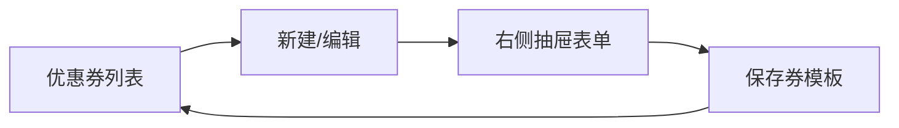

# 优惠券（coupon）

## 实现了什么

1. **管理端发券**：新建/编辑/删除优惠券（满减/折扣、使用门槛、发行总量、单人限领、有效期、上架开关），权限码 `coupon:list/save/remove`，菜单「优惠券管理」。
2. **后台 UI**：列表按「券信息/券面/领取进度/限领/有效期/上架/操作」展示；新建与编辑统一从右侧抽屉打开，中间内容滚动，底部操作区固定且左对齐。
3. **C 端领券中心**：展示上架且在有效期内的券（剩余张数、我已领张数），点击领取；条件自增 `issuedCount < totalCount` 原子防超发，单人限领校验。
4. **我的优惠券**：领取时快照券面信息（券名/面值/门槛/到期时间）到 `user_coupon`，后续管理端改券不影响已领的券；按可用/已使用/已过期展示。
5. **下单抵扣**：下单页选券（前端按 contracts 共享的 `calcCouponDeductionFen` 预览抵扣，与后端同口径），后端在会员折后价上再抵扣，实付至少保留 1 分；条件核销（未使用 → 已使用）防并发重复用券，订单取消时自动回滚券为未使用。
6. **定向发放**：建券时可选发放方式（公开领取/定向发放）；定向券不进领券中心，由管理端指派分发人（客服/打手等任意用户），一人一分发码。
7. **推广发券（C 端）**：分发人在「我的 → 推广发券」查看自己可发放的券与进度，一键复制专属领取链接；用户经链接落地页领取，领取记录归因到分发人（`user_coupon.distributor_user_id`）。
8. **领取记录**：管理端每张券可查领取明细（哪个用户领了、经哪个分发人、何时领取），分发人列表附经其发放张数。

## 结构导图

```
packages/contracts/src/coupon/coupon.ts     # CouponType / CouponAudience / 视图契约 / calcCouponDeductionFen
apps/server/src/modules/coupon/
├── domain/
│   ├── coupon.entity.ts                    # 券模板（库存/限领/有效期/上架/发放方式 audience）
│   ├── user-coupon.entity.ts               # 用户券（券面快照 + 状态 + usedOrderId + 分发人归因）
│   ├── coupon-distributor.entity.ts        # 分发人（couponId + userId + 唯一分发码）
│   └── coupon-repository.interface.ts      # 仓储端口（tryIncrementIssued/分发人/领取记录等）
├── infrastructure/coupon.repository.ts     # TypeORM 实现（原子条件自增/条件核销，租户过滤）
├── application/
│   ├── coupon.mapper.ts                    # 实体 → 管理端/领券中心/我的券/推广/落地页视图
│   ├── coupon-redeem.service.ts            # 供订单模块调用：校验抵扣 / 核销 / 回滚
│   └── use-cases/                          # CRUD + 领取 + 分发人增删查/领取记录/推广券/按码查领（一用例一文件）
├── interfaces/
│   ├── dto/                                # upsert-coupon / add-coupon-distributor
│   └── controllers/                        # 一路由一文件（admin CRUD/分发人/领取记录 + center/claim/mine + share/code）
└── coupon.module.ts                        # 导出 CouponRedeemService 供 order 模块复用

apps/web/src/
├── api/coupon.api.ts                       # 管理端券 CRUD + 分发人/领取记录/候选用户
├── views/coupon/CouponAdminView.vue        # 券列表 + 领取进度 + 分发/领取记录入口
└── components/coupon/
    ├── CouponFormDialog.vue                # 右侧抽屉表单（含发放方式单选）
    ├── CouponDistributorDialog.vue         # 分发人管理（搜索指派/移除/分发码/发放张数）
    ├── CouponClaimsDialog.vue              # 领取记录分页（用户/分发人/时间）
    └── coupon-admin.format.ts              # 券面/进度/日期/标签文案（视图与弹窗共用）

apps/client/src/
├── api/coupon.api.ts                       # center / claim / mine / shareMine / byCode / claimByCode
├── views/coupon/CouponCenterView.vue       # 领券中心（仅公开券）
├── views/coupon/MyCouponsView.vue          # 我的优惠券
├── views/coupon/CouponShareView.vue        # 推广发券（分发人复制专属链接）
├── views/coupon/CouponClaimByCodeView.vue  # 分发链接落地页（按码查看并领取）
├── views/coupon/coupon-format.ts           # 券面/门槛/日期文案
└── views/order/CheckoutView.vue            # 下单选券抵扣（预览与后端同口径）
```

## 后台 UI 流程



## 接口

| 方法 | 路径 | 说明 | 权限 |
| --- | --- | --- | --- |
| GET | /coupon/admin | 分页查询券 | coupon:list |
| POST | /coupon/admin | 新建券 | coupon:save |
| PUT | /coupon/admin/:id | 编辑券 | coupon:save |
| DELETE | /coupon/admin/:id | 删除券 | coupon:remove |
| GET | /coupon/center | 领券中心列表 | 登录 |
| POST | /coupon/:id/claim | 领取券 | 登录 |
| GET | /coupon/mine | 我的优惠券 | 登录 |
| GET | /coupon/admin/:id/distributors | 某券分发人列表 | coupon:list |
| POST | /coupon/admin/:id/distributors | 添加分发人 | coupon:save |
| DELETE | /coupon/admin/:id/distributors/:distributorId | 移除分发人 | coupon:save |
| GET | /coupon/admin/:id/claims | 领取记录分页 | coupon:list |
| GET | /coupon/admin/distributor-candidates | 分发人候选用户搜索 | coupon:save |
| GET | /coupon/share/mine | 我的推广券（分发人） | 登录 |
| GET | /coupon/code/:code | 按分发码查看券 | 登录 |
| POST | /coupon/code/:code/claim | 按分发码领取 | 登录 |

## 设计要点

- **防超发**：`UPDATE coupon SET issued_count = issued_count + 1 WHERE id = ? AND issued_count < total_count`，原子条件自增，并发领取不会超出库存。
- **防重复用券**：核销走 `UPDATE ... WHERE status = 'unused'` 条件更新，并发下单同一张券只有一单成功；核销失败则订单作废。
- **快照隔离**：用户券记录领取时的券面信息，管理端改券/删券不影响已领出的券。
- **同口径计价**：抵扣计算函数 `calcCouponDeductionFen` 放在 contracts，前端预览与后端结算共用，杜绝两端口径漂移。
- **定向隔离**：领券中心查询过滤 `audience = public`；定向券直接按 id 领取会被拒绝，只能经分发码链接领取，复用同一套防超发/限领/快照链路。
- **一人一码**：分发码 10 位（大写字母+数字，去除易混淆字符），`(tenantId, couponId, userId)` 唯一约束防重复指派，码唯一索引撞库自动换码重试。
- **归因可查**：领取记录落在 `user_coupon.distributor_user_id`，移除分发人不影响已领出的券与历史归因。
