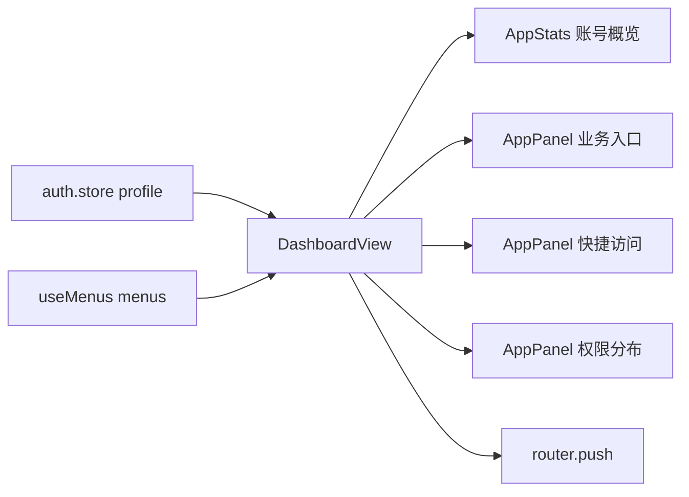

# 工作台 UI 模块

## 模块职责

工作台 UI 模块位于 `apps/web/src/views/DashboardView.vue`，负责把当前账号的身份、角色、权限与可见菜单汇总成首页视图。数据来源保持为既有 `auth.store` 和 `useMenus()`，不新增接口，不改变鉴权或菜单加载逻辑。

实现的功能：

- **账号概览**：展示当前用户、角色数、权限点、可见菜单数量。
- **业务入口**：基于动态菜单渲染模块卡片，点击进入对应菜单或第一个子入口。
- **快捷访问**：从可见叶子菜单派生快捷入口，减少重复导航成本。
- **身份与权限摘要**：展示角色标签、权限命名空间分布、访问状态。
- **响应式布局**：桌面为概览 + 主侧栏布局，中屏自动收拢侧栏，小屏单列展示，导航由 `AppLayout` 切换为抽屉菜单。

## 文件结构

```text
apps/web/src/
├── components/common/
│   ├── AppStats.vue            账号概览统计网格
│   └── AppPanel.vue            业务入口、快捷访问、侧栏信息面板
├── views/
│   ├── DashboardView.vue       工作台数据派生与模板结构
│   └── DashboardView.css       工作台视觉、网格与响应式样式
├── layouts/
│   ├── AppLayout.vue           主框架侧栏、顶部栏、移动端抽屉菜单结构
│   └── AppLayout.css           主导航、菜单、抽屉与响应式样式
├── stores/
│   └── auth.store.ts           当前账号 profile、角色、权限码集合
└── composables/
    └── use-menus.ts            当前账号可见菜单树
```

## 调用结构导图



## 设计约束

- **只改 UI 与视图编排**：不新增后端接口，不改权限判断、不改菜单数据来源。
- **低耦合高内聚**：统计和面板复用 `components/common`，页面标题交给后台顶部栏，工作台 CSS 只保留模块卡片、快捷入口和侧栏摘要。
- **真实数据展示**：统计值只从当前账号和动态菜单派生，不写死业务数量。
- **响应式优先**：核心网格使用 `minmax(0, 1fr)` 与断点布局，避免移动端横向溢出。
