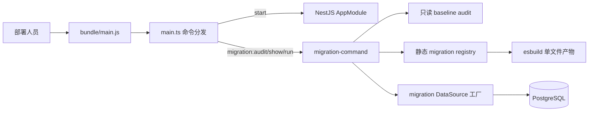
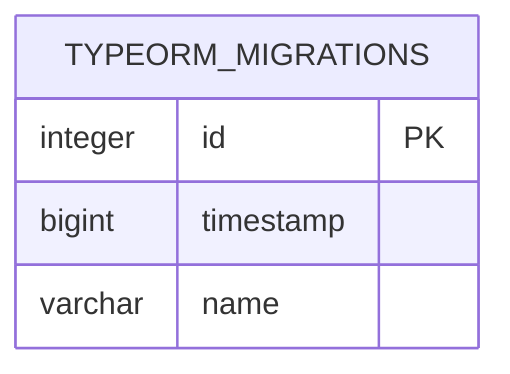
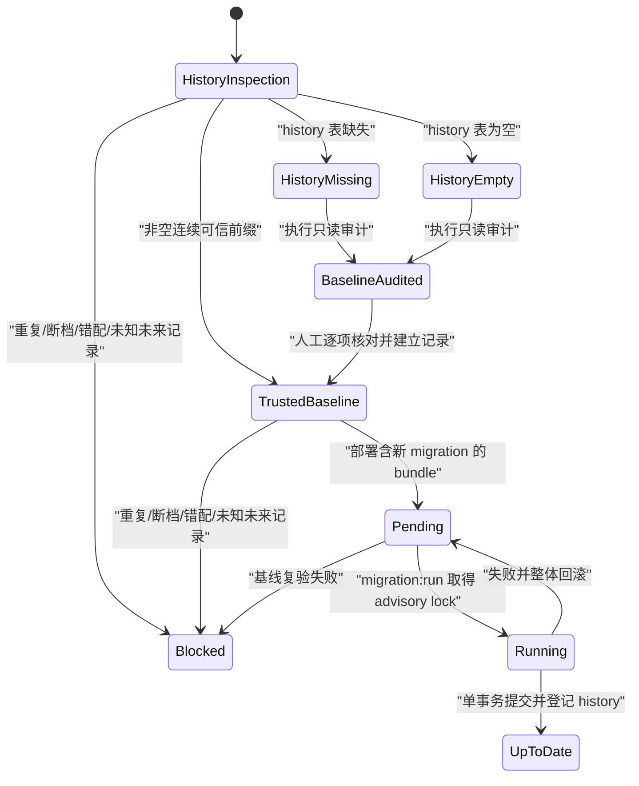
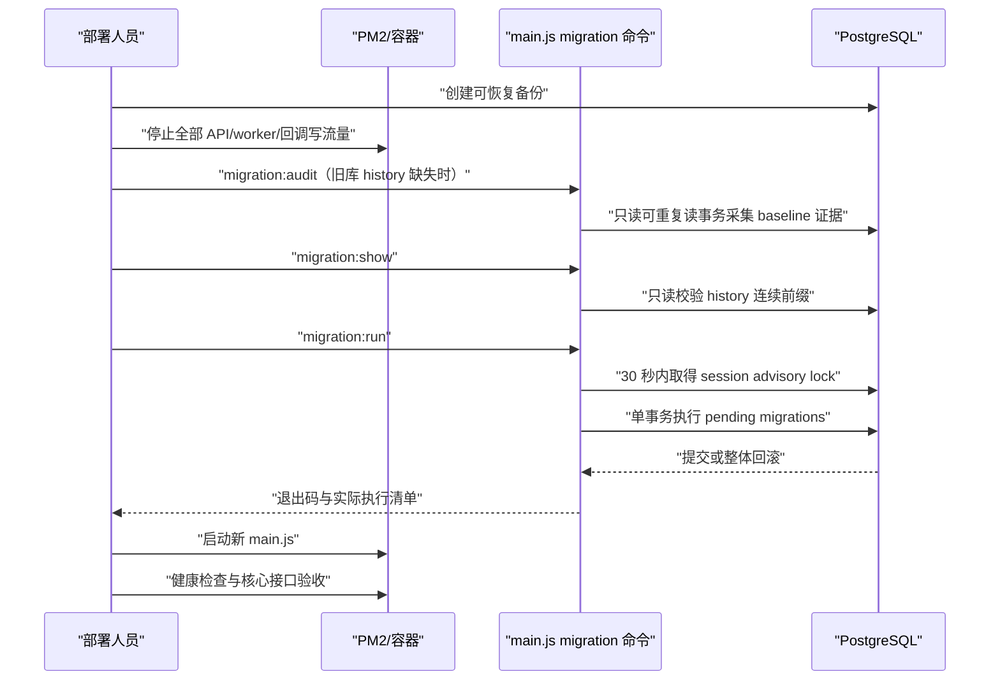

# 单文件数据库迁移

## 功能目标

后端部署产物只有 `main.js` 时，同一文件同时提供 NestJS 服务入口和受控的 TypeORM
migration 命令，不再依赖服务器上的源码、`node_modules`、`ts-node` 或 TypeORM CLI。

已实现：

- `node main.js` / `node main.js start` 启动 HTTP 与 WebSocket 服务；
- `node main.js migration:audit` 在只读、可重复读事务中输出旧库 baseline 证据 JSON；
- `node main.js migration:show` 只读展示已执行和待执行 migration；
- `node main.js migration:run` 在有界等待的 PostgreSQL advisory lock 下执行待迁移项；
- migration 类通过静态清单进入 esbuild 单文件产物；
- history 缺失、为空、重复、断档、名称与时间戳不匹配、数据库版本高于 bundle 时
  fail-closed；
- 所有待执行 migration 使用一个事务，失败时不登记部分 history；
- 命令结束后释放锁并关闭 DataSource，失败进程返回非零退出码。

明确非目标：

- 不在服务启动时自动执行 migration；
- 不用 `DB_SYNCHRONIZE=true` 替代生产 migration；
- 不在单文件产物中提供 `migration:revert`；
- 不自动推断、创建或伪造历史生产库的 migration baseline；
- 当前仓库没有“从空库创建全部基础表”的初始 migration，本命令不能初始化空生产库。

## 目录与职责

```text
apps/server/src/
├── main.ts                              服务/迁移命令分发
└── database/
    ├── migration-registry.ts            静态 migration 清单和可信顺序
    ├── migration-history.ts             history 连续前缀校验与审计诊断
    ├── migration-data-source.ts         单文件与源码命令共用 DataSource 工厂
    ├── migration-command.ts             命令分发、history 校验、执行和输出
    ├── migration-lock.ts                共享 advisory lock 与 30 秒等待上限
    ├── migration-baseline-audit.ts      只读审计编排、解析和 JSON 报告
    ├── migration-baseline-audit.queries.ts 结构与聚合数据审计查询
    ├── data-source.ts                    TypeORM CLI 默认 DataSource 适配
    ├── migrations/*.ts                  可回滚的数据库变更
    └── sql/audit-migration-baseline.sql  历史生产库一次性只读核验
```

该能力属于 Infrastructure 与 bootstrap 装配层，不进入 Domain/Application，也不新增 HTTP
接口、前端状态或业务实体。业务模块仍只通过各自 Entity/Repository 访问迁移后的结构。



## 数据模型与状态

TypeORM 以 `typeorm_migrations` 为唯一执行历史。命令会同时校验时间戳与名称，并要求数据库
记录是当前静态清单的连续前缀；仅仅存在同名列或手工创建一张空 history 表不等于可信基线。





当前静态 registry 的最新受管变更包括：

| 时间戳        | migration                               | `up` 与历史数据语义                                                                        | `down` 风险                  |
| ------------- | --------------------------------------- | ------------------------------------------------------------------------------------------ | ---------------------------- |
| 1785600000000 | `AddConversationMemberTag1785600000000` | `sys_conversation_member.tag` 新增为 `varchar(16) NOT NULL DEFAULT ''`，历史成员回填空标签 | 删除列并永久丢失已有身份标签 |
| 1785700000000 | `AddWithdrawalIdCard1785700000000`      | `wallet_withdrawal_order.idCardNo` 新增为可空 `varchar(18)`，历史提现单保持 `NULL`         | 删除列并永久丢失身份证号     |

两项结构均进入单文件 bundle 的静态清单和 baseline audit。history 尚未记录时，目标字段缺失表示
可由 pending migration 正常创建；字段已存在但 history 未记录则审计失败，必须人工确认来源，禁止
伪造 history。两项 `ALTER TABLE` 都需要取得目标表的 DDL 锁，执行前应停止写流量；如需回滚，必须
先备份对应业务数据。

## 命令与退出语义

```bash
node main.js --help
node main.js migration:audit
node main.js migration:show
node main.js migration:run
node main.js start
```

- `migration:audit`：输出稳定 JSON，仅采集结构、history 名称和聚合异常数量；不输出业务正文，
  不创建 history，也不代表允许建立 baseline。非空 history 若重复、断档、错配或超前，会标记为
  `invalid` 并在 `validationError` 中给出安全摘要。
- `migration:show`：输出 `[X]` 已执行项、`[ ]` 待执行项及待执行数量；有待迁移项仍返回
  `0`，基线不可信或数据库连接失败返回非零。
- `migration:run`：无待执行项时幂等返回 `0`；任一 migration 失败、基线变化或连接失败时
  返回非零。
- 未知命令返回非零且不会误启动服务。
- `migration:run` 完成后才允许启动新版本服务；不能忽略退出码继续发布。

源码环境的下列脚本也走相同安全入口：

```bash
pnpm --filter @app/server migration:audit
pnpm --filter @app/server migration:show
pnpm --filter @app/server migration:run
```

## 发布流程



单文件日常升级示例：

```bash
cd /www/wwwroot/esports-server
pm2 stop esports-server
node main.js migration:show
node main.js migration:run
pm2 restart esports-server --update-env
curl --fail http://127.0.0.1:3000/api/commerce/public/categories
pm2 save
```

若 `migration:show` 报 `typeorm_migrations is missing` 或 `is empty`，立即停止。单文件自身可生成只读审计报告，
服务器不需要仓库源码或额外 SQL 文件：

```bash
node main.js migration:audit > migration-audit.json
```

报告通过固定 advisory lock，在 `REPEATABLE READ READ ONLY` 事务中采集证据并回滚，不会建立
history。`pass` 只表示当前所检查结构/聚合结果相容，`inconclusive` 表示无法从现状证明历史数据
migration 已执行。必须人工逐条核对报告、备份和历史发布记录，再生成该数据库专用的 baseline
SQL；禁止直接插入仓库全部 migration 名称，也禁止先建空 history 表后运行命令。仓库内
`sql/audit-migration-baseline.sql` 仍保留为有源码环境的辅助检查，不是单文件部署前置依赖。

## 配置、权限与安全边界

迁移复用 `.env` 中的 `DB_HOST`、`DB_PORT`、`DB_USER`、`DB_PASSWORD`、`DB_NAME`，且强制
`synchronize: false`。shell 中显式传入的同名变量优先于 `.env`，因此部署时可以临时使用受控
DDL 账号，不需要把高权限密码写进长期运行配置。

迁移账号必须具备：

- 连接目标数据库和使用目标 schema；
- 创建/修改/删除相关表、索引、约束和外键；
- 修改既有表时必须是表 owner，或由数据库管理员提供等价受控权限；
- 读写 `typeorm_migrations`。

常驻应用账号不应长期持有超级管理员或无边界 DDL 权限。迁移日志只输出 migration 名称、数量
与安全错误摘要，不输出密码、令牌、SQL 参数或业务敏感正文。

## 并发、异常与恢复

- 幂等键：`typeorm_migrations` 中的 `(timestamp, name)` 可信前缀；命令还拒绝重复记录。
- 并发领取：所有 runner 先竞争固定 PostgreSQL session advisory lock，最多等待 30 秒；超时以
  非零退出，重新发布时可安全重试。取得锁后会重新读取 history。
- 事务边界：本次所有 pending migration 使用 `transaction: all`；任何一项失败整批回滚。
- 失败恢复：保持服务停止，保存错误输出，修复 migration 或数据前置条件后重新执行；不得删除
  history、强行改列或开启 synchronize 掩盖问题。
- 锁清理：持锁、history 复验、DDL 和 history 写入复用同一个 QueryRunner；正常、异常路径都会
  释放它，连接中断时 PostgreSQL 同时回滚事务并释放 session lock。等待基于单调时钟轮询，且
  不修改 DBA 配置的 `statement_timeout`。
- 回滚：单文件不暴露通用 revert。需要回滚时先核对对应 migration 的 `down` 是否可逆，再在
  维护窗口使用源码工具并保留备份。

## 测试范围

- 单元测试：命令白名单、registry 与目录一一对应、顺序/唯一性、缺 history 拒绝、连续前缀
  校验、单事务参数、锁超时和失败连接清理。
- PostgreSQL E2E：`show` 不隐式建 history、两个 runner 并发仅执行一次、重复运行幂等、
  migration 失败时业务 DDL 与 history 整体回滚、audit 事务只读且不建表、无效 history 在
  bundle 审计和备用手工 SQL 中均 fail-closed。
- 产物验证：构建后把 `bundle/main.js` 单独复制到无 `.env`、无源码、无 `node_modules` 的临时
  目录，使用真实 PostgreSQL 执行 `audit/show/run/run` 并核对目标表和 history；空 history 表
  必须被审计标记并禁止执行历史 migration。

2026-07-28 实际验证结果：

- migration 命令单元测试 11 项通过；
- PostgreSQL E2E 全套 59 项通过，其中 migration 命令定向用例 7 项；
- `pnpm test` 通过：服务端 222 项、管理端 61 项、C 端 72 项；
- `pnpm lint`、`pnpm typecheck`、`pnpm build`、`pnpm build:server`、bundle 构建和
  `git diff --check` 通过；
- 隔离目录中的真实 `bundle/main.js` 已完成只读 audit、1 项 pending 的 show/run 和重复幂等
  run；审计确认 transaction read-only 且 history 缺失时不建表；
- `bundle/main.js` 在独立端口启动成功，公开分类接口返回 HTTP 200，随后进程正常停止；
- 根 `package.json` 尚未配置 `format:check`，该命令已执行并明确返回“Command not found”；
  本次代码、测试和新增迁移文档已使用项目现有 Prettier 做定向检查并通过；
- 管理端生产构建仍有既有的大 chunk 警告，本功能未增加前端依赖或 chunk。

2026-07-29 两项新增 migration 的增量验证结果：

- migration 命令单元测试 11 项通过，静态 registry 已与 13 个 migration 文件一一对应；
- 会话成员标签与提现身份证字段 PostgreSQL `up/down` E2E 共 2 项通过；
- migration 命令 PostgreSQL E2E 7 项通过，新单文件 bundle 已真实完成 4 项 pending migration 的
  `audit/show/run/run`、并发串行化和失败整体回滚；
- 服务端 `typecheck`、单文件 bundle 构建、目标文件 Prettier 与 `git diff --check` 通过。

## 新增 migration 检查清单

1. 在 `apps/server/src/database/migrations/` 新增含 `up/down` 的 migration。
2. 按时间戳顺序显式加入 `migration-registry.ts`。
3. 为结构、历史数据、失败回滚和幂等边界增加 PostgreSQL E2E；新增结构同步加入 baseline audit 查询。
4. 构建新 `main.js`；旧 bundle 永远不会凭空包含新 migration。
5. 在影子库恢复生产备份并执行 `migration:show`、`migration:run`、重复 `migration:run`。
6. 备份生产库、停止写流量、迁移成功后再启动新版本并做健康检查。

## 尚未实现与风险

- 尚无完整初始 schema migration，空生产库必须先补齐经验证的初始基线能力，不能依赖本命令
  或生产 synchronize 初始化。
- 当前生产库的 baseline 尚未完成逐项人工核验；在此完成前，新命令会按设计拒绝迁移。
- migration 的业务前置条件仍由各 migration 自身负责；发布前必须继续使用生产备份做影子库
  演练，单文件能力不替代数据审计。
