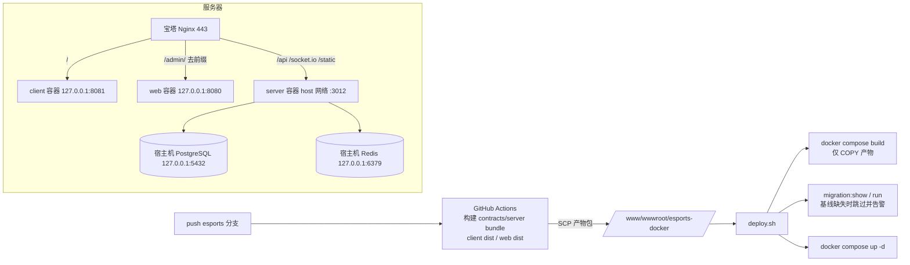
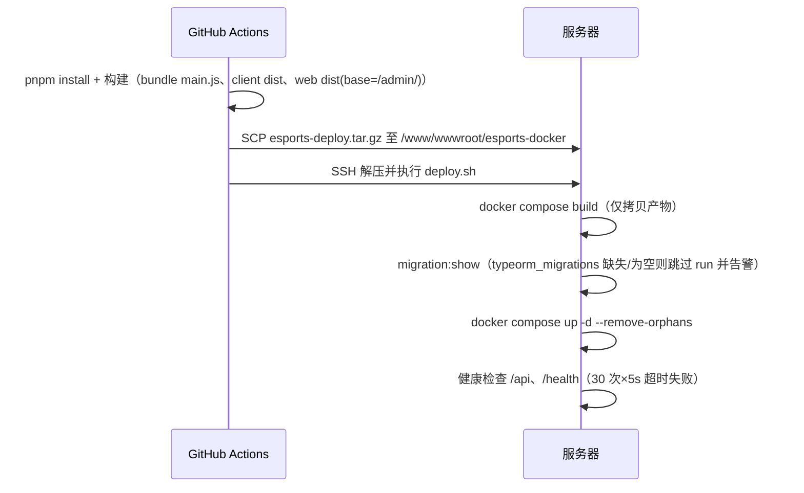

# CI/CD 自动部署（GitHub Actions + Docker）

## 功能目标与非目标

- 目标：push 到 `esports` 分支后自动构建并以 Docker 部署到生产服务器，域名不变（`https://esports.muyuhen.com/`）。
- 复用现有基础设施：继续使用宿主机上已有的 PostgreSQL / Redis 与后端 `.env`，**不迁移、不改动数据库**。
- 非目标：不管理数据库/Redis 容器化，不做多环境（staging）流水线，不做镜像仓库推送。

## 总体架构

因生产服务器仅 2 核 / 1.7G 内存，编译全部放在 GitHub Actions；服务器上仅用轻量
Dockerfile 拷贝预构建产物打镜像（秒级），避免在低内存机器上执行 pnpm/Vite/Nest 构建。

## 部署时序

## 相关文件

| 文件 | 作用 |
| ---- | ---- |
| `.github/workflows/deploy-esports.yml` | 流水线：构建产物 → SCP 上传 → SSH 执行 deploy.sh |
| `deploy/Dockerfile` | 轻量镜像：server（node:20-slim + bundle main.js）、web/client（nginx:alpine + dist） |
| `deploy/docker-compose.prod.yml` | 生产编排：server 用 host 网络直连宿主机 DB/Redis，web/client 仅监听 127.0.0.1 |
| `deploy/nginx-static.conf` | 前端容器内 Nginx：纯静态 + `/health`，`/api` 等由宿主机 Nginx 直接反代后端 |
| `deploy/deploy.sh` | 服务器端部署脚本：build → migration 检查 → up -d → 健康检查 |
| `deploy/.env.example` | 服务器 `deploy/.env` 模板（后端 .env 路径、uploads 目录、端口） |

## 配置项与密钥

- 仓库 Actions secrets（Settings → Secrets and variables → Actions）：
  - `DEPLOY_SSH_HOST`：服务器 IP；
  - `DEPLOY_SSH_USER`：SSH 用户（root）；
  - `DEPLOY_SSH_PASSWORD`：SSH 密码。
- 服务器 `/www/wwwroot/esports-docker/.env`（不入库，模板见 `deploy/.env.example`）：
  - `ESPORTS_SERVER_ENV_FILE`：现有后端 `.env` 绝对路径（含 `PORT=3012`、DB/Redis/JWT 配置）；
  - `ESPORTS_UPLOADS_DIR`：本地上传持久化目录（bind 挂载进 server 容器 `/app/uploads`）；
  - `ESPORTS_WEB_PORT` / `ESPORTS_CLIENT_PORT` / `ESPORTS_SERVER_PORT`：默认 8080/8081/3012。
- 前端构建参数在 workflow 中固定：`VITE_API_BASE_URL=/api`、`VITE_WS_BASE_URL=`（同域）、
  `VITE_CLIENT_BASE_URL=/`；管理端额外 `VITE_BASE=/admin/`。

## 安全边界

- 数据库/Redis 仅监听 127.0.0.1；server 容器使用 `network_mode: host` 直连，不对外新增端口。
- web/client 容器仅绑定 `127.0.0.1:8080/8081`，公网入口只有宿主机 Nginx 443。
- 全部密钥保存在 Actions secrets 与服务器本地 `.env`，仓库内不含任何真实密钥。

## 异常与回滚

- 健康检查失败：`deploy.sh` 非零退出，workflow 标红；旧容器仍在运行（`up -d` 仅替换构建成功的镜像），
  可 `docker compose -f docker-compose.prod.yml logs --tail=100` 排查。
- 回滚：重新 push 一个旧提交（或 revert 后 push）即触发重建旧版本镜像部署。
- 迁移基线：当前生产库 `typeorm_migrations` 缺失，脚本会告警并跳过 `migration:run`；
  按 [database-migrations.md](./database-migrations.md) 完成 `migration:audit` 人工基线核对后，
  后续部署即自动执行迁移。基线补齐前，**包含新 migration 的提交不会应用结构变更**。

## 验证结果

- 首次部署已在生产验证：三容器 healthy；`https://esports.muyuhen.com/`、`/admin/`、
  `/api/config/branding`、两端 assets 均 200；旧 PM2 手动部署（`main`、`esports-server`）已下线删除。
- `pnpm lint / typecheck / build` 通过；`format:check`、`test` 脚本仓库未配置。

## 尚未实现与风险

- migration 基线未建立（见上），需人工执行 `migration:audit` 核对后补齐。
- SSH 使用密码认证；建议后续改为专用部署密钥并限制来源。
- 未做蓝绿/灰度，`up -d` 替换 server 容器时有数秒接口中断。
