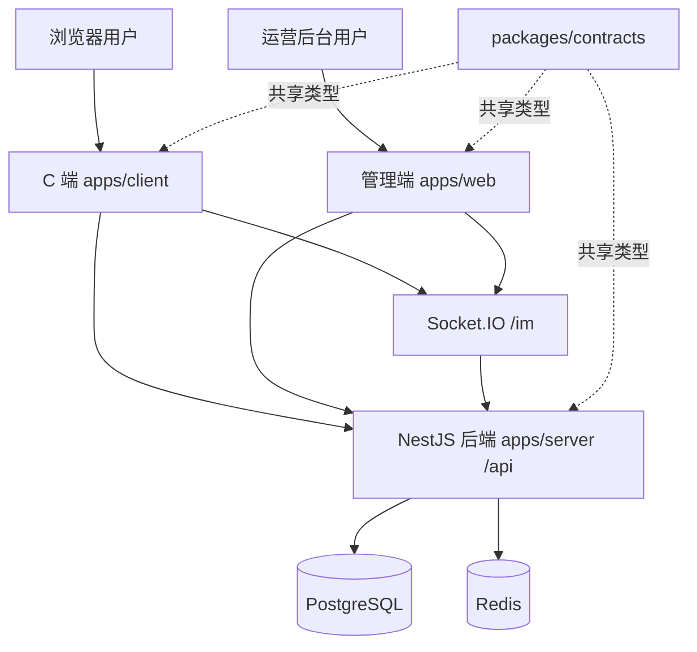

# 部署文档

本文档用于部署 `E-sports-01` 单仓项目，覆盖 NestJS 后端、管理端 `apps/web`、C 端 `apps/client`、共享契约包 `packages/contracts` 以及 PostgreSQL/Redis 基础设施。

## 部署内容

- **后端服务**：`apps/server`，NestJS，默认监听 `3000`，接口统一前缀 `/api`。
- **管理端**：`apps/web`，Vue3 + Pinia + Element Plus。
- **C 端商城**：`apps/client`，Vue3 + Pinia。
- **共享契约**：`packages/contracts`，前后端共享 DTO、枚举、权限码，必须先构建。
- **基础设施**：PostgreSQL 17、Redis 7，由 `docker-compose.yml` 管理。
- **进程管理**：默认使用 Docker Compose；也可使用 PM2 管理宿主机进程。

## 架构导图



## 机器依赖

```bash
node -v        # >= 20
pnpm -v        # >= 9
docker -v
docker compose version
```

如需 PM2：

```bash
npm i -g pm2
pm2 -v
```

本机如果 `pm2` 不在 `PATH`，可直接使用实际路径：

```bash
/Users/yuxinxing/.npm-global/lib/node_modules/pm2/bin/pm2 list
```

## Docker 全栈部署

Compose 会启动 PostgreSQL、Redis、NestJS 后端、管理端 Nginx 和 C 端 Nginx。前端使用同源 `/api`、`/socket.io` 和 `/static` 反代，不依赖写死的宿主机地址。

首次启动前准备后端密钥：

```bash
cp .env.docker.example .env
cp apps/server/.env.example apps/server/.env
```

至少修改根目录 `.env` 中的 `POSTGRES_PASSWORD`，以及 `apps/server/.env` 中的 `JWT_SECRET`、`JWT_REFRESH_SECRET`、`SEED_ADMIN_PASSWORD`。数据库地址和 Redis 地址会由 Compose 覆盖为容器服务名。`VITE_CLIENT_BASE_URL` 必须是管理端用户的浏览器能访问的 C 端地址；示例默认为本机 `http://127.0.0.1:8081`。

构建并启动：

```bash
docker compose up -d --build
docker compose ps
```

默认入口仅绑定本机：

- 管理端：`http://127.0.0.1:8080`
- C 端：`http://127.0.0.1:8081`
- 后端直连：`http://127.0.0.1:3003/api`

端口和绑定地址可在启动命令中覆盖：

```bash
HOST_BIND=0.0.0.0 \
WEB_HOST_PORT=80 \
CLIENT_HOST_PORT=8081 \
SERVER_HOST_PORT=3003 \
VITE_CLIENT_BASE_URL=https://client.example.com \
docker compose up -d
```

公网部署应在容器前增加 TLS 反向代理，不要直接暴露 PostgreSQL 或 Redis。

数据持久化：

- PostgreSQL、Redis 和上传文件分别保存在 Compose 命名卷中。
- `uploads-init` 仅在上传卷首次创建时把 `apps/server/uploads` 的现有文件复制进去。
- `backups/` 下的 SQL 不会自动导入；恢复历史库时需人工确认目标库后执行。
- 项目已提供 TypeORM migration 机制；正式环境必须使用 migration 并保持 `DB_SYNCHRONIZE=false`。当前 Docker 镜像尚未打包 migration CLI 与迁移文件，因此现有 Compose 仅适合本地初始化，不能作为正式迁移流程。

常用维护命令：

```bash
docker compose logs -f server web client
docker compose up -d --build
docker compose down
```

`docker compose down` 保留数据卷；只有明确需要清空全部数据时才使用 `docker compose down -v`。

## 宿主机 / PM2 部署

### 1. 拉代码与安装依赖

```bash
git clone <repo-url> E-sports-01
cd E-sports-01
pnpm install
```

### 2. 准备 PostgreSQL / Redis

PM2 方式需要宿主机可访问的 PostgreSQL 和 Redis。当前 Compose 面向全栈容器部署，数据库与 Redis 只开放在 Compose 内网；宿主机部署请使用已安装的服务或单独的基础设施配置，并确保 `.env` 中连接信息一致。

### 3. 准备环境变量

```bash
cp apps/server/.env.example apps/server/.env
cp apps/web/.env.example apps/web/.env
cp apps/client/.env.example apps/client/.env
```

后端关键项：

```env
NODE_ENV=production
PORT=3000
DB_HOST=127.0.0.1
DB_PORT=5432
DB_USER=infra
DB_PASSWORD=<数据库密码>
DB_NAME=infra_platform
DB_SYNCHRONIZE=false
REDIS_HOST=127.0.0.1
REDIS_PORT=6379
JWT_SECRET=<强随机密钥>
JWT_REFRESH_SECRET=<强随机密钥>
```

`NODE_ENV` 是短信安全门的一部分，必须显式设置为 `development`、`test` 或 `production`；缺失或非法值会让服务启动失败。正式环境必须使用 `production`，不能依赖配置中心关闭开发固定码来弥补错误的运行环境。

生产环境还必须在配置中心把 `sms.provider` 设置为 `aliyun`、`tencent` 或 `volcano` 并配置对应凭证、签名和模板。`sms.development.fixedCode` 在生产环境无条件忽略，`sms.provider=log` 会让发码明确失败，不会把验证码写入日志。

前端关键项：

```env
VITE_API_BASE_URL=http://127.0.0.1:3000/api
VITE_WS_BASE_URL=http://127.0.0.1:3000
VITE_CLIENT_BASE_URL=http://127.0.0.1:5174
```

生产环境建议把 `VITE_API_BASE_URL` 和 `VITE_WS_BASE_URL` 改为正式域名，例如：

```env
VITE_API_BASE_URL=https://api.example.com/api
VITE_WS_BASE_URL=https://api.example.com
VITE_CLIENT_BASE_URL=https://client.example.com
```

### 4. 构建

构建顺序不能省略 `contracts`，否则前后端可能读到旧类型产物。

```bash
pnpm --filter @app/contracts build
pnpm --filter @app/server build
pnpm --filter @app/web build
pnpm --filter @app/client build
```

也可以在确认所有包都能构建时使用：

```bash
pnpm -r build
```

### 5. 执行数据库迁移

确认数据库连接配置无误后，在启动后端前执行：

```bash
pnpm --filter @app/server migration:show
pnpm --filter @app/server migration:run
```

### 6. PM2 启动后端

后端运行 `apps/server/dist/main.js`：

```bash
pm2 start apps/server/dist/main.js \
  --name e-sports-01-server \
  --cwd apps/server \
  --update-env
```

项目里的 `ecosystem.config.cjs` 写入了 `NODE_ENV=development`、本机绝对路径和开发数据库配置，**只用于本机联调，禁止用于生产部署**：

```bash
pm2 start ecosystem.config.cjs --only e-sports-01-server
```

生产环境应使用上方直接启动方式，并由部署平台显式注入 `NODE_ENV=production`、数据库连接和密钥；不要复制本地 ecosystem 文件后只替换数据库密码。

### 7. 启动前端

推荐生产方式是把静态产物交给 Nginx：

- 管理端静态目录：`apps/web/dist`
- C 端静态目录：`apps/client/dist`

如果只是单机预览或内网部署，也可以使用 Vite preview：

```bash
pm2 start apps/web/node_modules/vite/bin/vite.js \
  --name e-sports-01-web \
  --cwd apps/web \
  -- preview --host 127.0.0.1 --port 4173

pm2 start apps/client/node_modules/vite/bin/vite.js \
  --name e-sports-01-client \
  --cwd apps/client \
  -- preview --host 127.0.0.1 --port 4174
```

本项目当前本地联调常用端口是：

- C 端 dev：`http://127.0.0.1:5173`
- 管理端 dev：`http://127.0.0.1:5174`
- 管理端 preview：`http://127.0.0.1:4173`
- 后端：`http://127.0.0.1:3000`

如需按这个本地联调方式启动：

```bash
pm2 start apps/client/node_modules/vite/bin/vite.js \
  --name e-sports-01-client-dev \
  --cwd apps/client \
  -- --host 127.0.0.1 --port 5173

pm2 start apps/web/node_modules/vite/bin/vite.js \
  --name e-sports-01-web-dev \
  --cwd apps/web \
  -- --host 127.0.0.1 --port 5174
```

### 8. 保存 PM2 进程

```bash
pm2 save
pm2 list
```

## 日常更新部署

进入项目目录：

```bash
cd /path/to/E-sports-01
```

确认本地是否有未提交改动：

```bash
git status --short
```

如果有本地改动，先确认远端更新是否会覆盖它们：

```bash
git fetch origin
git diff --name-only HEAD..origin/esports
comm -12 <(git diff --name-only | sort) <(git diff --name-only HEAD..origin/esports | sort)
```

上面第二条如果有输出，说明本地改动和远端更新改了同一批文件，先处理冲突再拉取。无输出时可以快进：

```bash
git pull --ff-only
```

先构建新版本产物：

```bash
pnpm --filter @app/contracts build
pnpm --filter @app/server build
pnpm --filter @app/client build
pnpm --filter @app/web build
```

停止并排空全部服务端与后台任务进程，再执行 migration。`1784736200000` 会按订单重算会员累计消费，旧版本仍写入时执行会造成重复或遗漏，因此迁移完成前不得恢复 API、支付回调或 worker 流量：

```bash
pm2 stop e-sports-01-server
# 如部署了独立 worker/多实例，也必须全部停止并确认没有旧版本任务在途
pnpm --filter @app/server migration:show
pnpm --filter @app/server migration:run
```

迁移失败时保持服务端停止并向前修复，不得删除退款审计或强制执行受保护的 `down`。迁移成功后启动新版本：

```bash
pm2 restart e-sports-01-server --update-env
pm2 restart e-sports-01-client-dev --update-env
pm2 restart e-sports-01-web-dev --update-env
pm2 restart e-sports-01-web --update-env
```

如果实际进程名不同，先查看：

```bash
pm2 list
```

## 开发环境固定验证码验收

本地后端使用 `NODE_ENV=development` 时，配置中心会幂等补齐 `sms.development.fixedCode=000000`。开发者仍需使用已绑定且启用的手机号，先点击“发送验证码”，再输入 `000000` 登录；固定码不会绕过账号、租户、Redis TTL、冷却或一次性消费。

需要临时恢复真实短信联调时，在配置中心清空 `sms.development.fixedCode`，并配置真实 `sms.provider`。只选择 `log` 不会真实发送，也不会在日志输出验证码。改回固定码后无需 migration，重启也不会覆盖管理员已保存的值。

部署前应分别确认：

- 开发环境：发码成功后 `000000` 只能登录一次，未发码不能直接登录。
- 生产环境：即使数据库仍保存 `000000`，固定码也不能登录；`log` 驱动不能发码。
- 日志：不出现完整手机号、验证码、访问令牌或刷新令牌。

## 健康检查

端口检查：

```bash
lsof -nP -iTCP:3000 -iTCP:5173 -iTCP:5174 -iTCP:4173 -sTCP:LISTEN
```

HTTP 检查：

```bash
curl -sS -o /dev/null -w '%{http_code} %{url_effective}\n' http://127.0.0.1:3000/api/commerce/public/categories
curl -sS -o /dev/null -w '%{http_code} %{url_effective}\n' http://127.0.0.1:5173/profile
curl -sS -o /dev/null -w '%{http_code} %{url_effective}\n' http://127.0.0.1:5174/dashboard
curl -sS -o /dev/null -w '%{http_code} %{url_effective}\n' http://127.0.0.1:4173/dashboard
```

后端启动日志应出现：

```text
Nest application successfully started
```

查看日志：

```bash
pm2 logs e-sports-01-server --lines 100
pm2 logs e-sports-01-client-dev --lines 100
pm2 logs e-sports-01-web-dev --lines 100
```

项目内日志：

```bash
tail -n 100 logs/server.log
tail -n 100 logs/server.err.log
tail -n 100 logs/web.log
```

## Nginx 反向代理示例

示例仅说明路由关系，域名、证书路径按实际环境替换。

```nginx
server {
  listen 80;
  server_name admin.example.com;

  root /path/to/E-sports-01/apps/web/dist;
  index index.html;

  location / {
    try_files $uri $uri/ /index.html;
  }
}

server {
  listen 80;
  server_name client.example.com;

  root /path/to/E-sports-01/apps/client/dist;
  index index.html;

  location / {
    try_files $uri $uri/ /index.html;
  }
}

server {
  listen 80;
  server_name api.example.com;

  location /api/ {
    proxy_pass http://127.0.0.1:3000/api/;
    proxy_set_header Host $host;
    proxy_set_header X-Real-IP $remote_addr;
    proxy_set_header X-Forwarded-For $proxy_add_x_forwarded_for;
    proxy_set_header X-Forwarded-Proto $scheme;
  }

  location /socket.io/ {
    proxy_pass http://127.0.0.1:3000/socket.io/;
    proxy_http_version 1.1;
    proxy_set_header Upgrade $http_upgrade;
    proxy_set_header Connection "upgrade";
    proxy_set_header Host $host;
  }

  location /static/ {
    proxy_pass http://127.0.0.1:3000/static/;
  }
}
```

## 常见问题

### 多租户配置表升级

本次站点配置隔离新增 `sys_tenant_config_override`。标准环境使用
`1784995200000-add-tenant-config-overrides.ts`：升级时复制所有存量租户的五个站点展示
配置，之后各租户独立修改；回滚检测到有效值分歧时会拒绝。

当前生产库已确认没有 `typeorm_migrations` 表。由于九条前置 migration 包含会员
消费重算、退款尝试回填和不可逆 IM 脱敏，不能仅凭字段存在就伪造“已执行”
历史。在该现状下，禁止直接运行 `migration:run`，也禁止直接执行建表 SQL。
先备份数据库，再执行一次性只读核验：

```bash
runuser -u postgres -- /www/server/pgsql/bin/psql -d esports \
  -f apps/server/src/database/sql/audit-migration-baseline.sql
```

核验脚本只输出九条前置 migration 的 history、结构证据和数据一致性统计，不会
创建表、修改业务数据或写入 history。将完整输出回传后，再逐条核对并生成针对
该生产库的 baseline SQL；未核对前不提供批量 `INSERT typeorm_migrations`。

只有 `typeorm_migrations` 表存在、九条前置记录的时间戳与类名全部成对，且本次
记录尚不存在时，才可执行：

```bash
runuser -u postgres -- /www/server/pgsql/bin/psql -d esports \
  -f apps/server/src/database/sql/1784995200000-add-tenant-config-overrides.sql
```

建表脚本会在单一事务内取得与 TypeORM migration 相同的 advisory lock，回填存量
子租户、验证结构，对齐 `sys_config` 的 owner 与 CRUD 授权，最后登记本次 history。
前置历史不完整、本次已登记、缺少父表或默认租户时整笔回滚。应用启动前确认：

```sql
SELECT column_name, data_type, is_nullable
FROM information_schema.columns
WHERE table_schema = 'public'
  AND table_name = 'sys_tenant_config_override'
ORDER BY ordinal_position;

SELECT "timestamp", "name"
FROM typeorm_migrations
WHERE "timestamp" = 1784995200000
  AND "name" = 'AddTenantConfigOverrides1784995200000';
```

预期表存在，并含 `tenant_id`、`key`、`value`；`(tenant_id, key)` 必须唯一，
`tenant_id` 必须外键引用 `sys_tenant(id)`。完整模型和回滚规则见
[multi-tenant.md](./multi-tenant.md)。

脚本末尾还会输出新表授权。生产应用角色（当前环境为 `esports`，或它继承的数据库角色）
必须拥有上述四项权限，且新表 owner 必须与 `sys_config` 一致；缺失时不要启动新版本服务。

### 1. contracts 类型没更新

现象：后端或前端构建提示某个共享字段不存在，例如 `CreateOrderResult.xxx does not exist`。

处理：

```bash
pnpm --filter @app/contracts build
pnpm --filter @app/server build
pnpm --filter @app/client build
pnpm --filter @app/web build
```

### 2. 端口被占用

```bash
lsof -nP -iTCP:3000 -sTCP:LISTEN
pm2 list
pm2 restart <进程名>
```

### 3. 数据库连接失败

检查：

```bash
docker compose ps
cat apps/server/.env
```

确认 `DB_HOST`、`DB_PORT`、`DB_USER`、`DB_PASSWORD`、`DB_NAME` 和实际数据库一致。

### 4. 生产环境不要开启自动同步

`DB_SYNCHRONIZE=true` 适合本地开发。生产环境建议：

```env
DB_SYNCHRONIZE=false
```

之后用迁移或手动 SQL 管理表结构变更。

### 5. Git 自动 gc 提示 loose objects

如果出现：

```text
warning: There are too many unreachable loose objects
```

可在确认没有其他 Git 操作运行时清理：

```bash
rm -f .git/gc.log
git gc --prune=now
```

## 快速命令清单

```bash
cd /path/to/E-sports-01
git fetch origin
git pull --ff-only
pnpm install
pnpm --filter @app/contracts build
pnpm --filter @app/server build
pnpm --filter @app/client build
pnpm --filter @app/web build
pm2 restart e-sports-01-server --update-env
pm2 restart e-sports-01-client-dev --update-env
pm2 restart e-sports-01-web-dev --update-env
pm2 restart e-sports-01-web --update-env
pm2 list
```
