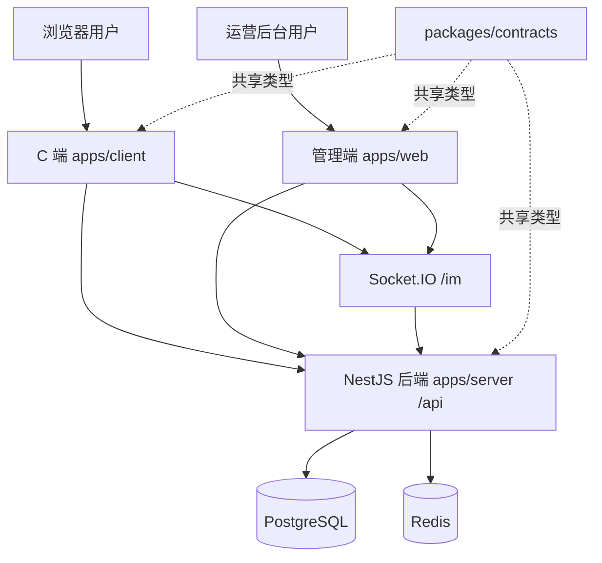

# 部署文档

本文档用于部署 `E-sports-01` 单仓项目，覆盖 NestJS 后端、管理端 `apps/web`、C 端 `apps/client`、共享契约包 `packages/contracts` 以及 PostgreSQL/Redis 基础设施。

## 部署内容

- **后端服务**：`apps/server`，NestJS，默认监听 `3000`，接口统一前缀 `/api`。
- **管理端**：`apps/web`，Vue3 + Pinia + Element Plus。
- **C 端商城**：`apps/client`，Vue3 + Pinia。
- **共享契约**：`packages/contracts`，前后端共享 DTO、枚举、权限码，必须先构建。
- **基础设施**：PostgreSQL 16、Redis 7，可用 `docker-compose.yml` 启动。
- **进程管理**：推荐使用 PM2 管理后端与前端预览/联调服务。

## 架构导图



## 机器依赖

```bash
node -v        # >= 20
pnpm -v        # >= 9
docker -v
docker compose version
```

如需 PM2：

```bash
npm i -g pm2
pm2 -v
```

本机如果 `pm2` 不在 `PATH`，可直接使用实际路径：

```bash
/Users/yuxinxing/.npm-global/lib/node_modules/pm2/bin/pm2 list
```

## 首次部署

### 1. 拉代码与安装依赖

```bash
git clone <repo-url> E-sports-01
cd E-sports-01
pnpm install
```

### 2. 启动 PostgreSQL / Redis

本地或单机部署可直接使用项目内的 compose：

```bash
docker compose up -d
docker compose ps
```

默认容器：

- PostgreSQL：`127.0.0.1:5432`
- Redis：`127.0.0.1:6379`

注意：`docker-compose.yml` 默认 PostgreSQL 密码是 `infra_dev_pwd`。如果使用 `ecosystem.config.cjs`，里面当前写的是 `12345678`，需要和实际数据库密码保持一致。

### 3. 准备环境变量

```bash
cp apps/server/.env.example apps/server/.env
cp apps/web/.env.example apps/web/.env
cp apps/client/.env.example apps/client/.env
```

后端关键项：

```env
NODE_ENV=production
PORT=3000
DB_HOST=127.0.0.1
DB_PORT=5432
DB_USER=infra
DB_PASSWORD=<数据库密码>
DB_NAME=infra_platform
DB_SYNCHRONIZE=false
REDIS_HOST=127.0.0.1
REDIS_PORT=6379
JWT_SECRET=<强随机密钥>
JWT_REFRESH_SECRET=<强随机密钥>
```

前端关键项：

```env
VITE_API_BASE_URL=http://127.0.0.1:3000/api
VITE_WS_BASE_URL=http://127.0.0.1:3000
```

生产环境建议把 `VITE_API_BASE_URL` 和 `VITE_WS_BASE_URL` 改为正式域名，例如：

```env
VITE_API_BASE_URL=https://api.example.com/api
VITE_WS_BASE_URL=https://api.example.com
```

### 4. 构建

构建顺序不能省略 `contracts`，否则前后端可能读到旧类型产物。

```bash
pnpm --filter @app/contracts build
pnpm --filter @app/server build
pnpm --filter @app/web build
pnpm --filter @app/client build
```

也可以在确认所有包都能构建时使用：

```bash
pnpm -r build
```

### 5. PM2 启动后端

后端运行 `apps/server/dist/main.js`：

```bash
pm2 start apps/server/dist/main.js \
  --name e-sports-01-server \
  --cwd apps/server \
  --update-env
```

如果使用项目里的 `ecosystem.config.cjs`：

```bash
pm2 start ecosystem.config.cjs --only e-sports-01-server
```

说明：`ecosystem.config.cjs` 内有绝对路径和环境变量，换机器部署前需要改成目标机器路径与真实数据库密码。

### 6. 启动前端

推荐生产方式是把静态产物交给 Nginx：

- 管理端静态目录：`apps/web/dist`
- C 端静态目录：`apps/client/dist`

如果只是单机预览或内网部署，也可以使用 Vite preview：

```bash
pm2 start apps/web/node_modules/vite/bin/vite.js \
  --name e-sports-01-web \
  --cwd apps/web \
  -- preview --host 127.0.0.1 --port 4173

pm2 start apps/client/node_modules/vite/bin/vite.js \
  --name e-sports-01-client \
  --cwd apps/client \
  -- preview --host 127.0.0.1 --port 4174
```

本项目当前本地联调常用端口是：

- C 端 dev：`http://127.0.0.1:5173`
- 管理端 dev：`http://127.0.0.1:5174`
- 管理端 preview：`http://127.0.0.1:4173`
- 后端：`http://127.0.0.1:3000`

如需按这个本地联调方式启动：

```bash
pm2 start apps/client/node_modules/vite/bin/vite.js \
  --name e-sports-01-client-dev \
  --cwd apps/client \
  -- --host 127.0.0.1 --port 5173

pm2 start apps/web/node_modules/vite/bin/vite.js \
  --name e-sports-01-web-dev \
  --cwd apps/web \
  -- --host 127.0.0.1 --port 5174
```

### 7. 保存 PM2 进程

```bash
pm2 save
pm2 list
```

## 日常更新部署

进入项目目录：

```bash
cd /path/to/E-sports-01
```

确认本地是否有未提交改动：

```bash
git status --short
```

如果有本地改动，先确认远端更新是否会覆盖它们：

```bash
git fetch origin
git diff --name-only HEAD..origin/esports
comm -12 <(git diff --name-only | sort) <(git diff --name-only HEAD..origin/esports | sort)
```

上面第二条如果有输出，说明本地改动和远端更新改了同一批文件，先处理冲突再拉取。无输出时可以快进：

```bash
git pull --ff-only
```

重新构建：

```bash
pnpm --filter @app/contracts build
pnpm --filter @app/server build
pnpm --filter @app/client build
pnpm --filter @app/web build
```

重启：

```bash
pm2 restart e-sports-01-server --update-env
pm2 restart e-sports-01-client-dev --update-env
pm2 restart e-sports-01-web-dev --update-env
pm2 restart e-sports-01-web --update-env
```

如果实际进程名不同，先查看：

```bash
pm2 list
```

## 健康检查

端口检查：

```bash
lsof -nP -iTCP:3000 -iTCP:5173 -iTCP:5174 -iTCP:4173 -sTCP:LISTEN
```

HTTP 检查：

```bash
curl -sS -o /dev/null -w '%{http_code} %{url_effective}\n' http://127.0.0.1:3000/api/commerce/public/categories
curl -sS -o /dev/null -w '%{http_code} %{url_effective}\n' http://127.0.0.1:5173/profile
curl -sS -o /dev/null -w '%{http_code} %{url_effective}\n' http://127.0.0.1:5174/dashboard
curl -sS -o /dev/null -w '%{http_code} %{url_effective}\n' http://127.0.0.1:4173/dashboard
```

后端启动日志应出现：

```text
Nest application successfully started
```

查看日志：

```bash
pm2 logs e-sports-01-server --lines 100
pm2 logs e-sports-01-client-dev --lines 100
pm2 logs e-sports-01-web-dev --lines 100
```

项目内日志：

```bash
tail -n 100 logs/server.log
tail -n 100 logs/server.err.log
tail -n 100 logs/web.log
```

## Nginx 反向代理示例

示例仅说明路由关系，域名、证书路径按实际环境替换。

```nginx
server {
  listen 80;
  server_name admin.example.com;

  root /path/to/E-sports-01/apps/web/dist;
  index index.html;

  location / {
    try_files $uri $uri/ /index.html;
  }
}

server {
  listen 80;
  server_name client.example.com;

  root /path/to/E-sports-01/apps/client/dist;
  index index.html;

  location / {
    try_files $uri $uri/ /index.html;
  }
}

server {
  listen 80;
  server_name api.example.com;

  location /api/ {
    proxy_pass http://127.0.0.1:3000/api/;
    proxy_set_header Host $host;
    proxy_set_header X-Real-IP $remote_addr;
    proxy_set_header X-Forwarded-For $proxy_add_x_forwarded_for;
    proxy_set_header X-Forwarded-Proto $scheme;
  }

  location /socket.io/ {
    proxy_pass http://127.0.0.1:3000/socket.io/;
    proxy_http_version 1.1;
    proxy_set_header Upgrade $http_upgrade;
    proxy_set_header Connection "upgrade";
    proxy_set_header Host $host;
  }

  location /static/ {
    proxy_pass http://127.0.0.1:3000/static/;
  }
}
```

## 常见问题

### 1. contracts 类型没更新

现象：后端或前端构建提示某个共享字段不存在，例如 `CreateOrderResult.xxx does not exist`。

处理：

```bash
pnpm --filter @app/contracts build
pnpm --filter @app/server build
pnpm --filter @app/client build
pnpm --filter @app/web build
```

### 2. 端口被占用

```bash
lsof -nP -iTCP:3000 -sTCP:LISTEN
pm2 list
pm2 restart <进程名>
```

### 3. 数据库连接失败

检查：

```bash
docker compose ps
cat apps/server/.env
```

确认 `DB_HOST`、`DB_PORT`、`DB_USER`、`DB_PASSWORD`、`DB_NAME` 和实际数据库一致。

### 4. 生产环境不要开启自动同步

`DB_SYNCHRONIZE=true` 适合本地开发。生产环境建议：

```env
DB_SYNCHRONIZE=false
```

之后用迁移或手动 SQL 管理表结构变更。

### 5. Git 自动 gc 提示 loose objects

如果出现：

```text
warning: There are too many unreachable loose objects
```

可在确认没有其他 Git 操作运行时清理：

```bash
rm -f .git/gc.log
git gc --prune=now
```

## 快速命令清单

```bash
cd /path/to/E-sports-01
git fetch origin
git pull --ff-only
pnpm install
pnpm --filter @app/contracts build
pnpm --filter @app/server build
pnpm --filter @app/client build
pnpm --filter @app/web build
pm2 restart e-sports-01-server --update-env
pm2 restart e-sports-01-client-dev --update-env
pm2 restart e-sports-01-web-dev --update-env
pm2 restart e-sports-01-web --update-env
pm2 list
```
