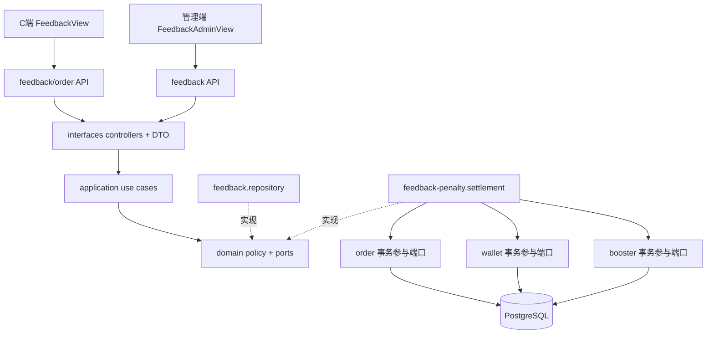
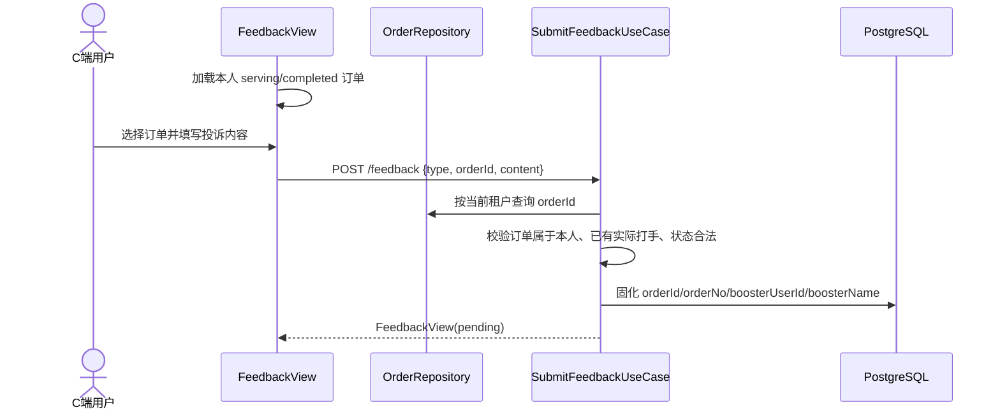
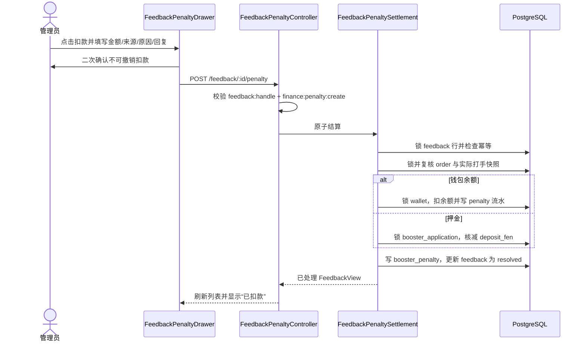
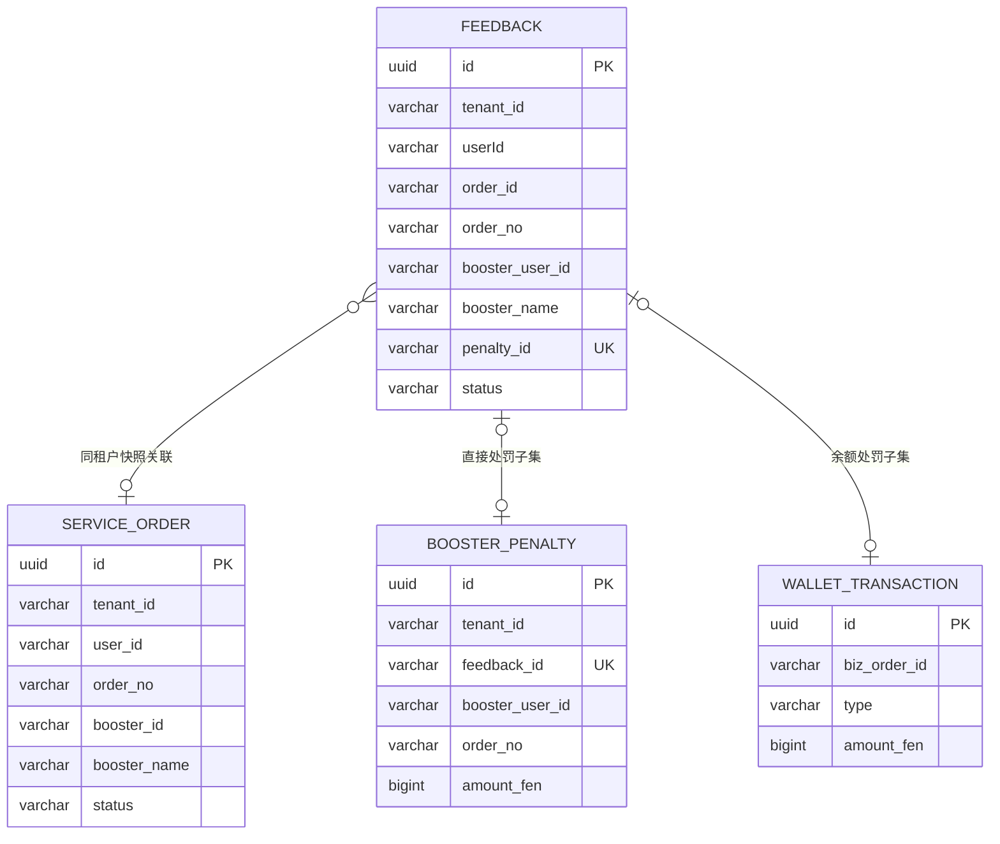
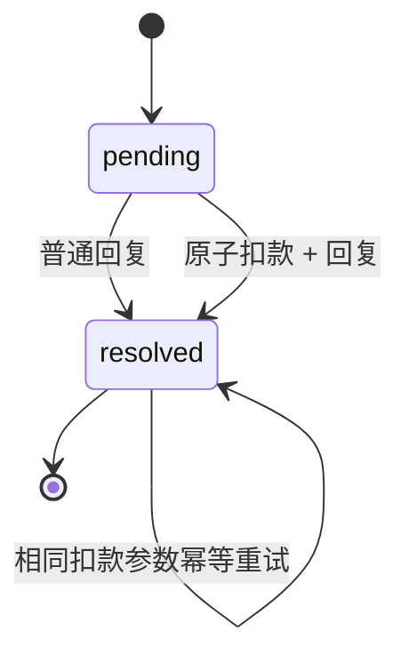

# 反馈管理（Feedback）

## 功能目标与边界

C 端用户提交投诉并查看处理进度；管理端受理、回复，并可对关联真实履约订单的打手直接扣款。直接扣款的目标是消除管理员在反馈管理与打手管理之间复制订单号、姓名和用户 ID 的人工步骤，同时避免根据昵称或自由文本扣错人。

已实现：

- 投诉打手时，C 端从本人“服务中 / 已完成且已有实际接单打手”的订单中选择一单；服务端重新校验订单归属并固化订单、实际打手快照。
- 投诉客服和其他反馈继续支持选填自由文本对象，不建立订单关联。
- 管理端展示关联订单号、打手名称和打手用户 ID；结构化待处理投诉提供“扣款”入口。
- 管理员选择钱包余额或押金，填写金额、内部处罚原因和用户可见回复，经二次确认后扣款。
- 扣款、钱包流水或押金变更、罚款留档、反馈 `pending -> resolved` 在同一 PostgreSQL 事务中完成。
- 同一反馈以反馈 ID 幂等；并发或超时重试不会重复扣款，相同参数返回既有结果，不同参数返回冲突。
- 普通回复也锁定反馈行，避免和扣款或另一处理者竞态覆盖。

明确非目标：

- 不自动处罚，不根据昵称猜测打手，不允许管理端修改已关联的订单或打手。
- 不改变订单履约状态，不自动退款给投诉人，也不实现处罚撤销或资金冲正。
- 历史自由文本只有在“同租户、同投诉人、精确订单号、已有实际打手、服务中/已完成”全部满足时回填；其他历史记录继续人工处理。
- 通用 `POST /finance/penalties` 仍是独立人工罚款入口，本次没有改变其请求契约和历史一致性边界。

## 目录与 DDD 职责

```text
apps/server/src/modules/feedback/
├─ domain/
│  ├─ feedback.entity.ts                       反馈聚合与订单/打手/处罚关联
│  ├─ feedback-repository.interface.ts         查询与锁定处理仓储端口
│  ├─ feedback-penalty.policy.ts               可处罚状态与幂等重试规则
│  └─ feedback-penalty-settlement.interface.ts 原子处罚结算端口
├─ application/
│  ├─ feedback-order-snapshot.ts               本人订单关联规则
│  ├─ feedback.mapper.ts                       实体到共享视图
│  └─ use-cases/                               submit / list / handle / penalty
├─ infrastructure/
│  ├─ feedback.repository.ts                   租户过滤与普通处理行锁
│  └─ feedback-penalty.settlement.ts            TypeORM 跨聚合事务适配器
└─ interfaces/
   ├─ dto/                                     请求校验
   └─ controllers/                             一路由一控制器
```

跨聚合事务只由反馈结算适配器开启；订单、钱包和打手模块分别公开 infrastructure 级事务参与端口，在同一个 `EntityManager` 中访问各自实体：

- `order-feedback-penalty.transaction.ts`：锁定并复核订单快照；
- `wallet-transaction.participant.ts`：供调用方事务复用的钱包锁、余额调整与流水写入；
- `booster-feedback-penalty.transaction.ts`：查询/创建处罚记录并处理押金扣除。

反馈模块不直接导入上述模块的 TypeORM Entity，参与端口也不向外返回持久化实体。

前端复用现有分层：

- `apps/client/src/views/feedback/FeedbackView.vue` 负责页面状态与交互；`utils/feedback-orders.ts` 负责候选订单筛选、分页聚合和请求载荷构造；`api/feedback.api.ts`、`api/order.api.ts` 负责 HTTP。
- `apps/web/src/views/feedback/FeedbackAdminView.vue` 编排列表与抽屉；`FeedbackDirectory.vue` 展示并发出动作；`FeedbackPenaltyDrawer.vue` 完成校验、二次确认和 API 调用。



## 业务流程

### 提交结构化打手投诉



### 管理端直接扣款



## 数据模型与状态机

`feedback` 新增结构化快照，避免后续改名或前端篡改改变处罚对象：

| 字段            | 数据库列                      | 规则                                           |
| --------------- | ----------------------------- | ---------------------------------------------- |
| `orderId`       | `order_id varchar(36)`        | 打手投诉的真实订单 ID；其他/旧未识别记录为空串 |
| `orderNo`       | `order_no varchar(64)`        | 提交时订单号快照                               |
| `boosterUserId` | `booster_user_id varchar(36)` | 订单实际接单打手，不接受客户端传入             |
| `boosterName`   | `booster_name varchar(64)`    | 实际打手显示名快照                             |
| `penaltyId`     | `penalty_id varchar(36) NULL` | 直接扣款生成记录；非空唯一                     |

`booster_penalty.feedback_id` 为可空唯一字段：通用人工罚款为空，投诉直接扣款保存反馈 ID。钱包余额路径的 `wallet_transaction.biz_order_id` 同样保存反馈 ID，流水类型为 `penalty`。





已普通回复的反馈不能再扣款；已扣款反馈使用不同金额、来源、原因或回复重试时返回 `409`。

## Migration

`apps/server/src/database/migrations/1784641800000-add-feedback-direct-penalty.ts`：

- `up` 增加上述字段与三个索引，并安全回填可精确识别的历史打手投诉。
- 历史提交人列的真实名称为大小写敏感的 `feedback."userId"`；回填 SQL 按该旧列名读取，不能改写为 `user_id`。
- 回填同时校验租户、投诉人、订单号、实际打手和订单状态，不匹配的数据保持空关联。
- `down` 先删除唯一/查询索引，再删除 `feedback_id` 和结构化关联列；回滚会丢失新关联和幂等追踪，但保留既有罚款、钱包流水及反馈正文。
- 上线顺序为备份、执行 migration、启动新服务、检查 migration 状态和反馈列表；失败时先停止新服务，再回滚代码与 migration。不得使用 `DB_SYNCHRONIZE=true` 代替。

## API、权限与配置

| 方法   | 路径                        | 权限                                          | 说明                                                                  |
| ------ | --------------------------- | --------------------------------------------- | --------------------------------------------------------------------- |
| `POST` | `/api/feedback`             | 登录                                          | 打手投诉传 `{type:'booster', orderId, content}`；其他类型传 `target?` |
| `GET`  | `/api/feedback/mine`        | 登录                                          | 本人反馈分页                                                          |
| `GET`  | `/api/feedback`             | `feedback:list`                               | 管理端分页                                                            |
| `POST` | `/api/feedback/:id/handle`  | `feedback:handle`                             | 普通回复并原子领取待处理状态                                          |
| `POST` | `/api/feedback/:id/penalty` | `feedback:handle` 且 `finance:penalty:create` | 直接扣款并完成反馈                                                    |

扣款请求只包含 `amountFen`、`source`、`reason`、`replyContent`；订单号和打手 ID 不由浏览器提交。页面按钮同时检查两项权限，服务端 Guard 再次执行全部权限校验。菜单仍使用 `feedback:menu`。

本功能没有新增环境变量或业务配置项；金额使用共享“分”整数，来源使用 `PenaltySource` 枚举，长度限制来自 `FEEDBACK_LIMITS` / `PENALTY_LIMITS`。

## 安全、一致性与失败恢复

- 输入 DTO 校验 UUID、枚举、正整数和长度；事务内再次 trim 并拒绝纯空处罚原因、纯空回复和非法金额。
- 共享 `SubmitFeedbackPayload` 使用按 `type` 区分的联合类型：打手投诉编译期要求 `orderId` 且禁止 `target`，客服/其他反馈则禁止 `orderId`。运行时订单快照规则只抛纯应用错误，由提交 Controller 映射为 `400/404/409`，规则文件不依赖 Nest HTTP 异常。
- 关联订单不存在和订单不属于当前用户均返回相同 `404`，不通过响应差异泄露其他用户订单是否存在。
- 非超管首次读取反馈即附加当前租户条件；超管可跨租户读取，但后续订单、钱包、打手、罚款和流水都以反馈自身 `tenantId` 为锚。
- 锁顺序固定为“反馈 → 订单 → 钱包或打手押金”；同反馈并发串行，同钱包或同打手的不同反馈也在资金行处串行，余额/押金不会透支或丢失更新。缴押金、退押金和通用人工罚款统一经 `BoosterFinanceSettlement` 按“打手 → 钱包”加锁，避免旧入口与投诉处罚互相覆盖。
- 单事务任一步失败均整体回滚，不会出现扣款成功但反馈未处理、处罚记录缺失或只有流水的部分状态。
- 反馈结算适配器只直接访问 `FeedbackEntity`；订单、钱包和打手持久化操作经各模块导出的事务参与端口执行，不跨模块读取 TypeORM Entity。
- 既有打手资料、审核、语音和上下线保存只更新非资金/非进度列；`completed_orders` 在行锁事务内递增；资金事务仅字段级更新 `deposit_fen`。`@VersionColumn` 只作为持久化版本标记，不被错误当成 `Repository.save` 的 CAS 条件。
- 唯一 `feedback_id` / `penalty_id` 与反馈行锁共同防重复；相同请求可安全重试。
- 普通日志不记录反馈正文、用户隐私或令牌；处罚原因仅进入受权限保护的罚款记录和最多 255 字符的钱包审计备注。
- 直接扣款没有自动补偿或撤销。误操作需走后续正式资金冲正能力，不能删除罚款或流水掩盖审计链。
- 删除反馈、订单、罚款或钱包流水的级联清理本期未开放；现有实体采用逻辑 ID 关联且未设置数据库外键，运维清理前必须保留审计链。

## 前端状态

- C 端订单选择与本人反馈列表均覆盖加载、空状态、失败和重试；无合格订单时不能提交打手投诉。历史列表优先展示结构化订单与打手快照。
- 管理端列表覆盖加载、空状态、失败提示和刷新；请求序号保证只有最新筛选/分页响应能落状态，无结构化关联的历史反馈只显示普通“处理”。
- 扣款抽屉锁定订单和打手，校验金额/原因/回复，提交期间禁止关闭和重复请求，确认前有危险操作提示。
- 权限不足时不展示扣款动作；即使伪造请求，服务端仍返回 `403`。

## 测试与验证

自动化覆盖位于：

- `apps/server/test/feedback/feedback-order-snapshot.spec.ts`：本人订单、越权、无实际打手、非打手类型夹带订单。
- `feedback-penalty-policy.spec.ts`：首次处罚、相同参数幂等、不同参数冲突和旧数据拒绝。
- `feedback-penalty.settlement.spec.ts` 与 helper：装配真实事务参与适配器，在内存事务 Harness 中覆盖余额/押金、失败回滚、并发一次扣款、租户/订单/钱包/打手隔离；该项不是 PostgreSQL 行锁 E2E。
- `feedback-resolution.repository.spec.ts`：普通处理并发领取与租户隔离。
- `apps/client/src/utils/feedback-orders.spec.ts`：候选筛选、去重、完整分页和请求载荷。
- `apps/server/test-e2e/feedback-penalty.postgres.e2e.ts`：随机隔离 schema 中用真实多连接与 `pg_blocking_pids` 验证同反馈幂等、旧快照不回写押金、缴押/退款/完成单数与处罚的行锁竞争。
- `apps/server/test-e2e/booster-finance.postgres.e2e.ts`：验证通用余额罚款的原子落账，以及钱包调整后故障时余额、流水和罚款整体回滚。

Migration 已在隔离 PostgreSQL schema 完成 `up -> 回填检查 -> down -> up` 往返，并已在当前本地 PostgreSQL 正式执行。PostgreSQL E2E 通过独立 `pnpm test:e2e:postgres` 执行，7 项均通过并在结束时删除测试 schema。隔离导出的暂存功能树执行 `pnpm test` 为服务端 80 项、C 端 11 项全部通过；当前工作树为服务端 82 项、C 端 18 项，多出的 2/7 项来自未暂存的其他功能。根目录未配置 `format:check`。

本地只读验收确认：未认证查询返回 `401`，管理员登录和反馈列表返回 `200` 且包含全部结构化字段；PM2 服务端及 C 端、管理端 dev/preview 均可访问。真实浏览器已验证管理端关联列、扣款抽屉、二次确认取消，以及 C 端订单选择和 `390x844` 无横向溢出。验收临时数据已清理，未调用扣款接口。由于没有可安全使用的低权限密码且短信会触发外部发送，本次未手工验证真实低权限账号 `403`。

## 尚未实现与残余风险

- 历史昵称或模糊单号不会自动关联，需要管理员普通回复或后续人工补录能力。
- 未实现处罚撤销、资金冲正、投诉证据附件、通知推送和处罚申诉。
- 管理端尚无独立 Vitest 套件，也尚无自动化 HTTP + RBAC E2E；当前权限组合由 Guard 单元边界、未认证 `401` 与真实管理员页面覆盖，低权限账号 `403` 仍待补测。
- 管理端尚无独立 Vitest 用例覆盖列表请求竞态；当前由请求序号实现、类型检查和浏览器验收覆盖。

## 联系客服（既有 IM 复用）

「我的」页联系客服与消息页会话继续复用 `/service`、`GET /api/im/conversations` 和 WebSocket `/im`；本功能未改变 IM 协议。
