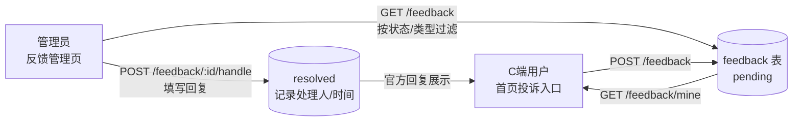

# 反馈管理（Feedback）

## 模块职责

C 端用户对客服 / 打手等对象提交投诉反馈（首页「投诉客服/打手」入口），并可在反馈页查看处理进度与官方回复；管理端在「反馈管理」页按状态 / 类型检索、填写处理回复完成闭环。

实现的功能：

- **C 端提交**：选择类型（投诉打手 / 投诉客服 / 其他）+ 被投诉对象（选填）+ 内容，登录态即可提交。
- **C 端进度**：提交页下方展示「我的反馈」列表，含处理状态与官方回复。
- **管理端受理**：分页列表（按状态 / 类型过滤，提交时间倒序），待处理记录填写回复后标记已处理（仅待处理可处理，防重复）。
- **状态机**：`pending（待处理）→ resolved（已处理）`，处理时记录处理人与处理时间。
- **零硬编码**：类型 / 状态枚举、文案映射、长度约束（`FEEDBACK_LIMITS`）均收口在 `packages/contracts`，前后端共享。

## 结构导图（DDD 四层）

```
modules/feedback/
├─ domain/
│  ├─ feedback.entity.ts                聚合根（userId/type/target/content/状态机/处理回复）
│  └─ feedback-repository.interface.ts  仓储端口（FEEDBACK_REPOSITORY）
├─ application/
│  ├─ feedback.mapper.ts                实体 → 视图（附提交人用户名/昵称）
│  └─ use-cases/                        submit / list-my / list / handle
├─ infrastructure/
│  └─ feedback.repository.ts            TypeORM 实现（按租户过滤）
└─ interfaces/
   ├─ dto/                              submit / handle / list-query
   └─ controllers/                      一路由一文件（submit/mine/list/handle）
```

前端：

- C 端 `client/views/feedback/FeedbackView.vue`（全屏提交页 + 我的反馈列表，首页「投诉客服/打手」入口 → 路由 `/feedback`，需登录）。
- 管理端 `web/views/feedback/FeedbackAdminView.vue`（菜单 `feedback:menu`，统计 + 列表 + 处理回复），组件拆分 `FeedbackStats` / `FeedbackDirectory`。

## 处理流程



## 权限（RBAC）

| 权限码 | 名称 | 守卫接口 |
| --- | --- | --- |
| `feedback:list` | 反馈-查询 | `GET /api/feedback` |
| `feedback:handle` | 反馈-处理 | `POST /api/feedback/:id/handle` |

提交（`POST /api/feedback`）与我的列表（`GET /api/feedback/mine`）仅要求登录态。管理端菜单 `feedback:menu`（系统分组）。

## REST API

见 [api-reference.md](./api-reference.md#反馈管理)。

## 联系客服打通（既有 IM 复用）

本次同步打通了 C 端客服入口（不新增后端能力，全部复用既有 IM 模块）：

- 「我的」页 **联系客服** 卡 → 在线客服聊天页 `/service`（既有 `ServiceChatView`，WebSocket `/im` 命名空间）。
- **消息页「会话消息」** 页签接入真实 IM 会话列表（`GET /api/im/conversations`），展示最近消息摘要 / 时间 / 未读数，点击进入客服聊天。
