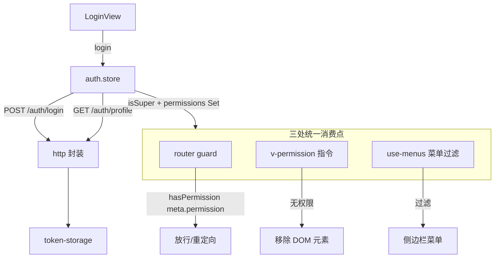
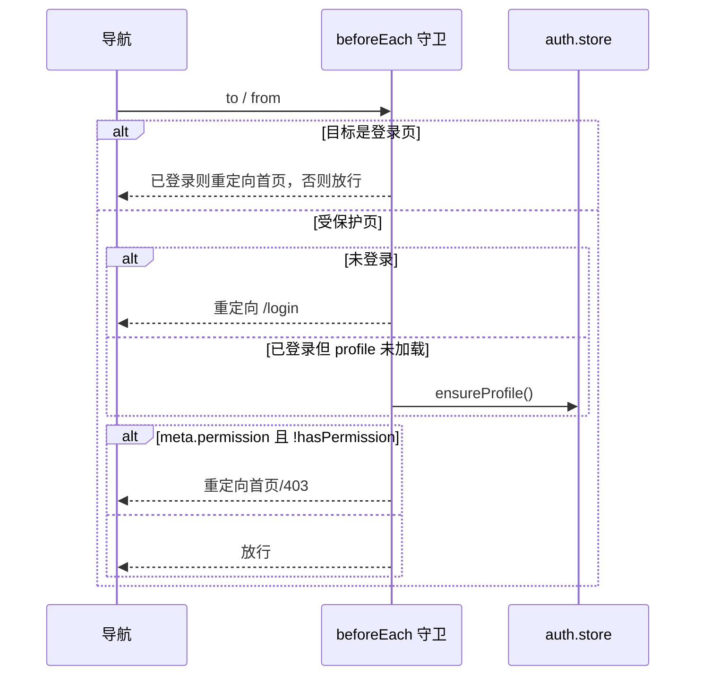
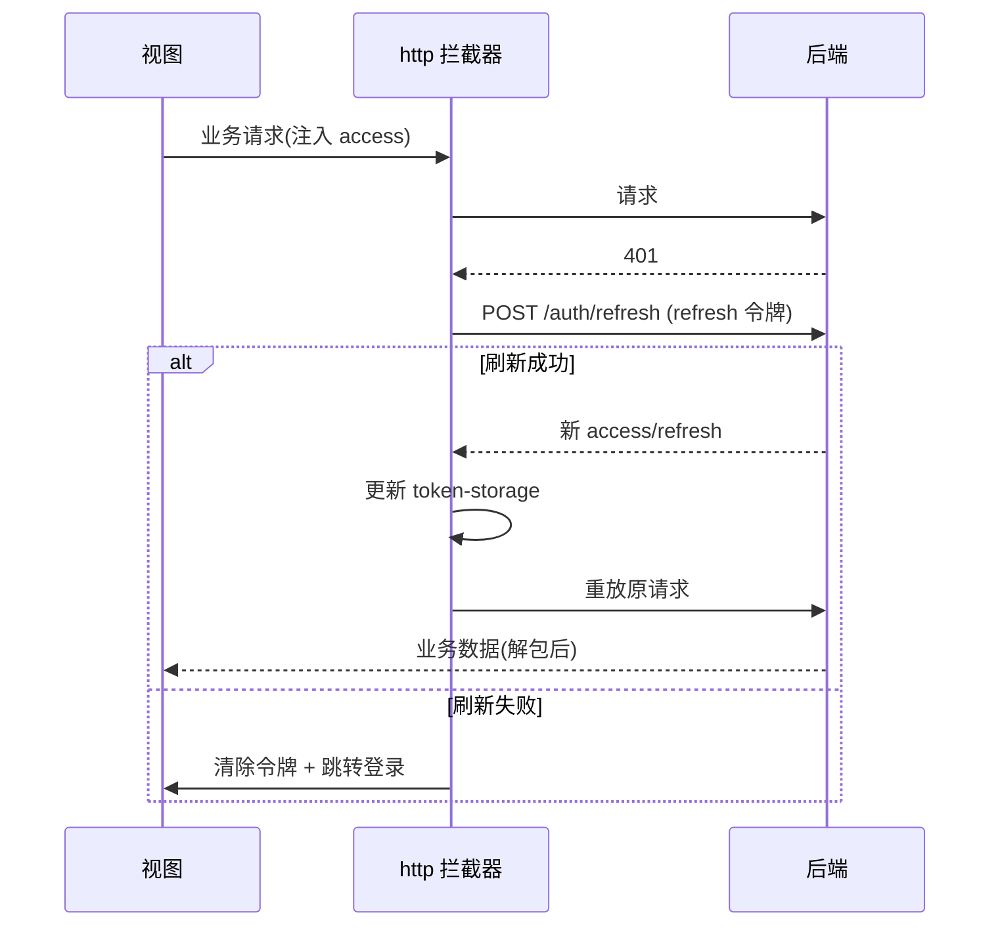

# 前端基座（Vue3 + Pinia）

## 模块职责

Vue3 + Pinia + Element Plus 前端基座，提供：登录鉴权、基于权限的**动态路由与菜单**、
**按钮级 `v-permission` 指令**、统一 axios 封装（401 静默刷新）、WebSocket IM 接入。

实现的功能：

- **鉴权 store**（Pinia）：登录/登出、拉取 profile、维护扁平权限码集合，`hasPermission()` 超管放行。
- **动态路由 + 守卫**：路由 `meta.permission` 声明所需权限，全局 `beforeEach` 守卫强制鉴权 + 鉴权。
- **菜单过滤**：按当前用户权限渲染可见菜单。
- **v-permission 指令**：无权限时直接从 DOM 移除元素（按钮级鉴权）。
- **HTTP 封装**：响应拦截层解包 `ApiResponse`，401 自动用 refresh 令牌静默刷新并重放请求。
- **IM 接入**：`use-im-socket` 组合式函数封装 Socket.IO 连接/收发。

## 目录结构

```
apps/web/src/
├── api/
│   ├── http.ts             axios 实例（请求注入令牌 / 响应解包 / 401 刷新）
│   ├── token-storage.ts    localStorage 令牌读写（infra.accessToken/refreshToken）
│   └── {auth,user,role,permission,config,upload,im}.api.ts  各模块请求函数
├── stores/auth.store.ts    鉴权状态（login/logout/profile/hasPermission）
├── router/
│   ├── routes.ts           路由表（含 meta.permission）
│   ├── guard.ts            全局前置守卫
│   └── index.ts            路由装配
├── directives/permission.directive.ts   v-permission 指令
├── composables/
│   ├── use-menus.ts        按权限过滤菜单
│   └── use-im-socket.ts    Socket.IO 组合式封装
├── layouts/AppLayout.vue   带侧边栏的主框架
├── views/                  Login / Dashboard / rbac / config / upload / im
├── config/env.ts           前端运行时配置（API base、WS URL）
├── App.vue
└── main.ts                 Pinia + Router + Element Plus + v-permission 装配
```

## 鉴权数据流



`hasPermission(code)` 是唯一判定入口：`profile.isSuper === true || permissions.has(code)`。
超管后端走 bypass、显式权限为空，前端据 `isSuper` 字段直接放行，三处消费点行为一致。

## 路由守卫



## HTTP 401 静默刷新



## 设计要点

- **单一判定入口**：所有鉴权收敛到 `hasPermission`，避免分散判断逻辑漂移。
- **响应解包在拦截层**：视图直接拿 `data`，无需层层 `res.data.data`。
- **令牌存储集中**：`token-storage` 统一键名（`infra.accessToken` / `infra.refreshToken`）。
- **权限码共享**：路由 `meta.permission` 与指令复用 contracts 的 `PERMS`，与后端同源。

## 视图清单

| 路由 | 视图 | 所需权限 |
| --- | --- | --- |
| `/login` | LoginView | 公开 |
| `/` | DashboardView | 登录即可 |
| `/rbac/users` | UserListView | `rbac:user:list` |
| `/rbac/roles` | RoleListView | `rbac:role:list` |
| `/rbac/permissions` | PermissionListView | `rbac:permission:list` |
| `/config` | ConfigView | `config:list` |
| `/upload` | UploadView | `upload:file:list` |
| `/im` | ImView | `im:message:history` |
