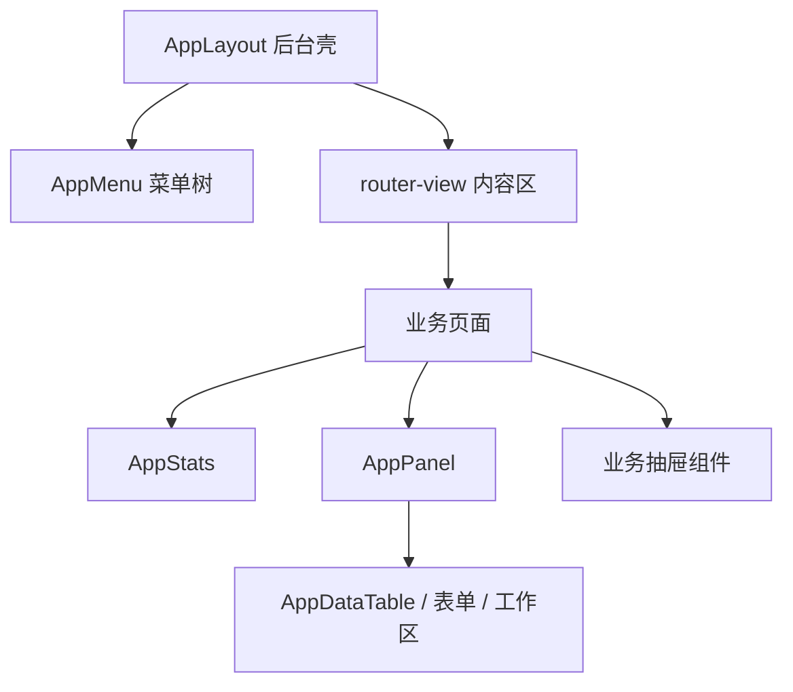
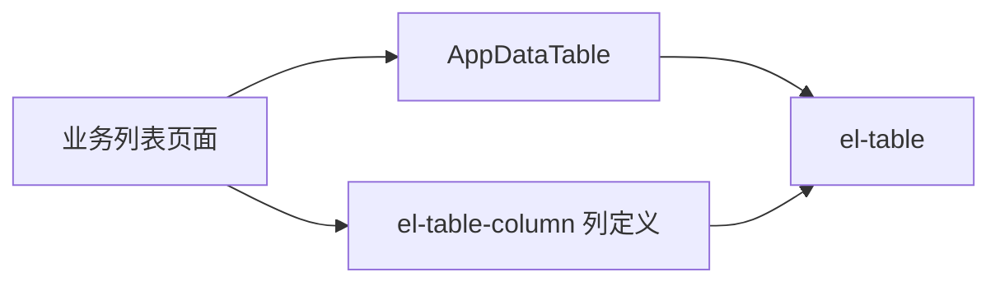
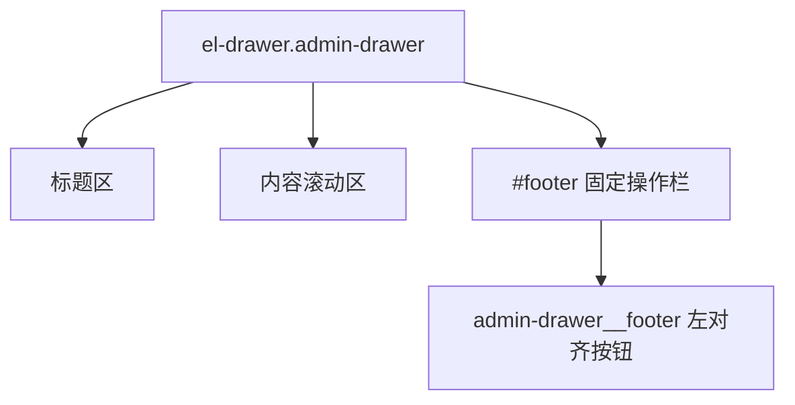
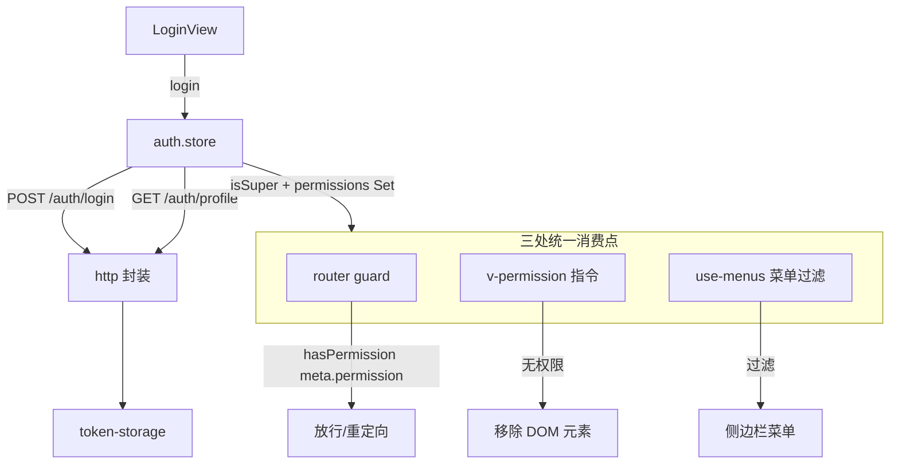
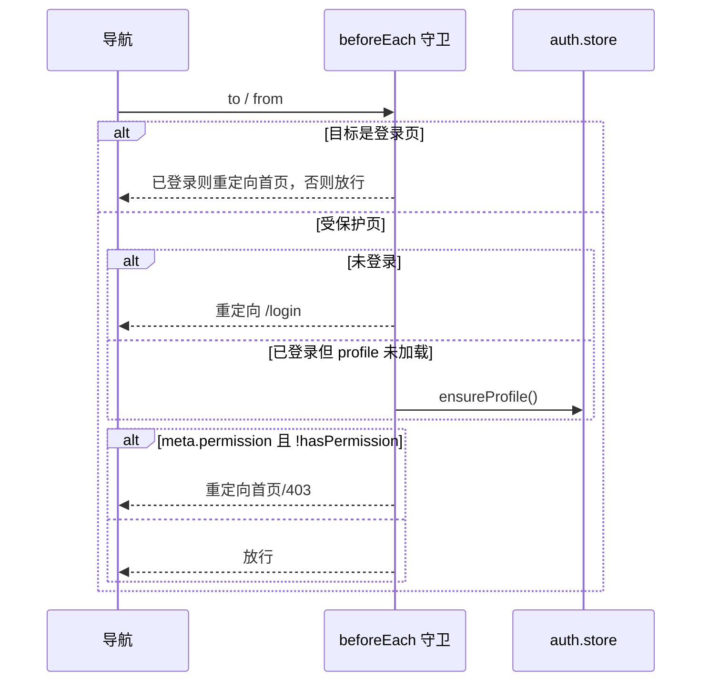
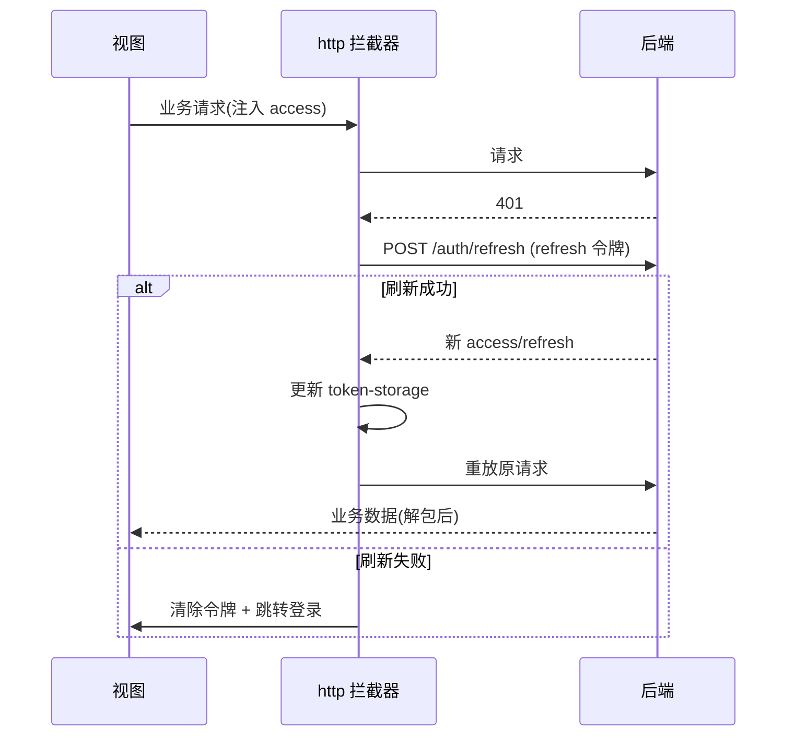
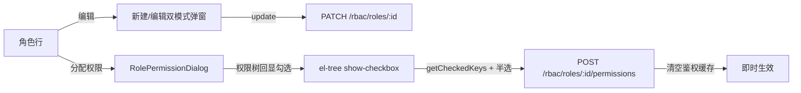
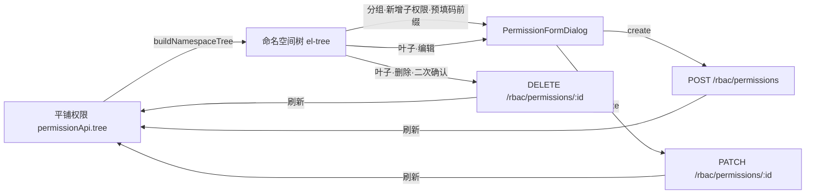
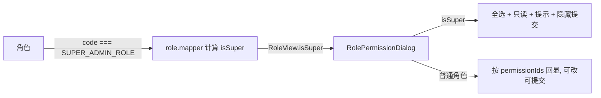
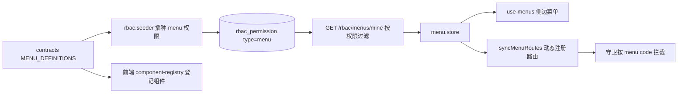

# 前端基座（Vue3 + Pinia）

## 模块职责

Vue3 + Pinia + Element Plus 前端基座，提供：登录鉴权、基于权限的**动态路由与菜单**、
**按钮级 `v-permission` 指令**、统一 axios 封装（401 静默刷新 + 失败统一弹错误提示）、WebSocket IM 接入。

实现的功能：

- **鉴权 store**（Pinia）：登录/登出、拉取 profile、维护扁平权限码集合，`hasPermission()` 超管放行。
- **动态路由 + 守卫**：路由 `meta.permission` 声明所需权限，全局 `beforeEach` 守卫强制鉴权 + 鉴权。
- **菜单过滤**：按当前用户权限渲染可见菜单。
- **路由动画**：根路由只区分登录页/后台壳，后台内部只对内容区使用 Vue Transition，导航框架不随页面跳转重挂载，并尊重 `prefers-reduced-motion`。
- **v-permission 指令**：无权限时直接从 DOM 移除元素（按钮级鉴权）。
- **HTTP 封装**：响应拦截层解包 `ApiResponse`，401 自动用 refresh 令牌静默刷新并重放请求；任意请求失败统一通过 `resolveHttpErrorMessage` 提取后端 message 并 `ElMessage.error` 弹出（单一来源，杜绝静默失败），调用方可在请求配置传 `silent: true` 自行处理。
- **IM 接入**：`use-im-socket` 组合式函数封装 Socket.IO 连接/收发。

## 目录结构

```
apps/web/src/
├── api/
│   ├── http.ts             axios 实例（请求注入令牌 / 响应解包 / 401 刷新 / 失败统一弹提示，可用 silent 关闭）
│   ├── token-storage.ts    localStorage 令牌读写（infra.accessToken/refreshToken）
│   └── {auth,user,role,permission,config,upload,im}.api.ts  各模块请求函数
├── stores/auth.store.ts    鉴权状态（login/logout/profile/hasPermission）
├── router/
│   ├── routes.ts           路由表（含 meta.permission）
│   ├── guard.ts            全局前置守卫
│   └── index.ts            路由装配
├── directives/permission.directive.ts   v-permission 指令
├── composables/
│   ├── use-menus.ts        按权限过滤菜单
│   └── use-im-socket.ts    Socket.IO 组合式封装
├── layouts/
│   ├── AppLayout.vue       带侧栏、顶部栏、移动端抽屉菜单的主框架
│   └── AppLayout.css       主导航、后台内容路由动画与响应式布局样式
├── views/                  Login / Dashboard / rbac / config / upload / im
├── global.css              全局盒模型、body 边距归零、基础字体/背景、根路由动画
├── config/env.ts           前端运行时配置（API base、WS URL）
├── App.vue
└── main.ts                 Pinia + Router + Element Plus + v-permission 装配
```

## 后台 UI 基座重构

除登录页外，后台页面统一改为朴素 Element Plus 管理台风格：白底、细边框、4px 圆角、弱装饰、少层级。页面标题由后台顶部栏承载，内容区不再重复放页面头卡片；业务页面只保留数据加载、动作编排和表格/表单里的业务特有展示。

实现的功能：

- **统一统计区**：`AppStats` 承载 1-4 个统计项，使用响应式网格。
- **统一内容面板**：`AppPanel` 承载标题、操作区、筛选工具栏、主体和底部区域。
- **统一分页交互**：列表分页使用 Element Plus `el-pagination` 的 `sizes` 能力，支持选择每页条数并回到第一页重新查询。
- **统一业务抽屉**：新增、编辑、权限分配、明细展示等内容型弹层统一使用右侧 `el-drawer`，中间内容区滚动，底部操作栏固定且按钮左对齐。
- **统一菜单渲染**：`AppMenu` 复用桌面侧边栏和移动抽屉菜单，避免两份菜单模板重复。
- **页面级样式瘦身**：RBAC、配置、上传、实名、钱包、日志、IM 等页面只保留业务单元样式，如身份块、状态标签、权限树、聊天工作区、上传列表。
- **登录页隔离**：`LoginView` 和 `components/auth` 保持原有视觉，不纳入后台 UI 基座。

```text
apps/web/src/
├── components/common/
│   ├── AppStats.vue        统一统计卡网格
│   ├── AppPanel.vue        内容面板、工具栏、底部区域
│   └── AppDataTable.vue    Element Plus 表格薄封装
├── layouts/
│   ├── AppLayout.vue       后台壳、用户菜单、移动抽屉
│   └── AppMenu.vue         桌面/移动共用菜单树
└── views/
    ├── rbac/ config/ upload/ realname/ wallet/ observability/ im/
    └── LoginView.vue       登录页独立保留
```



新后台页面接入规则：

- 页面根节点使用 `admin-page`，不要重复写页面间距。
- 页面标题交给 `AppLayout` 顶部栏，内容区不要再放独立页面头卡片。
- 有统计数据时使用 `AppStats`，不要在页面内新写统计卡 CSS。
- 数据表使用 `AppDataTable`，只统一外层滚动、空态、加载态和表头风格；列定义、宽度、插槽仍按 Element Plus `el-table-column` 官方方式在业务模块声明。
- 分页使用 `el-pagination` 的 `sizes`、`page-sizes`、`size-change` 和 `current-change`，每页条数选项来自 `PAGINATION_PAGE_SIZES`。
- 内容较多的新增/编辑/详情展示使用 `el-drawer` 并挂 `admin-drawer`，底部按钮放在 `#footer` 内的 `admin-drawer__footer`，不要在业务页面重复写固定底栏样式。
- 页面 CSS 只写业务特有元素，不写 hero、渐变背景、装饰节点和重复面板样式。
- 操作按钮仍使用 Element Plus 按钮和图标，权限按钮继续通过 `v-permission` 控制。

### 公共表格组件

`AppDataTable` 负责把后台列表页的表格视觉统一到 Element Plus 管理台风格，不重新实现表格行为。它保留当前页面已使用的 `data`、`loading`、`minWidth`、`tableClass`、`emptyText` 参数，内部直接渲染 `el-table`，业务列通过默认插槽传入。

实现的功能：

- **官方用法对齐**：保持 `el-table :data` + `el-table-column` 的列声明方式。
- **统一加载与空态**：通过 `v-loading` 和 `empty-text` 复用 Element Plus 能力。
- **横向溢出兜底**：仅由外层容器提供原生横向滚动，不维护自定义滚动条、滚动状态或监听器。
- **最小视觉统一**：只设置 4px 圆角、细边框、表头背景和单元格间距，业务页面不再重复写表格壳样式。



### 公共业务抽屉

`admin-drawer` 是直接作用于 Element Plus `el-drawer` 的轻量样式约定，不封装业务 API。它用于新增、编辑、分配权限、成员管理、交易明细和日志链路详情等内容型弹层。

实现的功能：

- **右侧打开**：业务层直接使用 `el-drawer`，保持 Element Plus 官方交互。
- **内容滚动**：`el-drawer__body` 占满剩余高度并独立滚动，长表单或明细列表不会挤走操作按钮。
- **固定底栏**：`#footer` 插槽固定在底部，按钮使用 `admin-drawer__footer` 左对齐。
- **移动端兜底**：小屏下业务抽屉自动占满宽度，避免固定像素尺寸溢出。



## 鉴权数据流



`hasPermission(code)` 是唯一判定入口：`profile.isSuper === true || permissions.has(code)`。
超管后端走 bypass、显式权限为空，前端据 `isSuper` 字段直接放行，三处消费点行为一致。

## 路由守卫



## HTTP 401 静默刷新



## 角色管理：编辑与权限分配

`RoleListView` 在「新建/删除」之外补齐了角色的两类编辑能力，按钮均受细粒度权限码控制：

| 操作 | 入口按钮 | 权限码 | 调用接口 |
| --- | --- | --- | --- |
| 编辑信息 | 编辑 | `rbac:role:update` | `PATCH /rbac/roles/:id`（仅改名称/备注，编码不可改） |
| 分配权限 | 分配权限 | `rbac:role:assignPermissions` | `POST /rbac/roles/:id/permissions` |



- 新建与编辑复用同一弹窗（`editingId` 区分模式），编辑态下编码字段禁用，与后端 `UpdateRoleDto` 一致。
- 权限分配拆为独立组件 `components/rbac/RolePermissionDialog.vue`：打开时拉取权限树并按 `role.permissionIds` 回显勾选，保存时收集全选 + 半选节点，后端落库后清空鉴权缓存即时生效。

## 权限管理：命名空间树 + CRUD

后端权限是**平铺播种**的（均为 `api` 类型、`parentId` 为空），但权限码本身带命名空间语义（以 `:` 分段，如 `config:list`、`rbac:user:create`）。前端在渲染时按权限码命名空间派生出**嵌套树**，让同前缀权限聚合在同一文件夹下，而非各成根节点的"伪列表"。

层级完全由权限码派生，零数据迁移、零硬编码模块名，工具收敛在 `utils/permission-tree.ts`：

| 函数 | 职责 |
| --- | --- |
| `buildNamespaceTree(nodes)` | 把平铺权限按 code 的 `:` 分段组织成嵌套树；中间段生成虚拟分组文件夹，末段挂载真实权限为叶子 |
| `pickRealPermissionIds(keys)` | 从勾选结果中剔除虚拟分组（id 以 `group:` 前缀），仅保留真实权限 UUID |

```text
config:list / config:save / config:remove
        └─ config（虚拟分组）
             ├─ 配置-查询 (config:list)
             ├─ 配置-保存 (config:save)
             └─ 配置-删除 (config:remove)

rbac:user:create / rbac:role:update / ...
        └─ rbac（虚拟分组）
             ├─ user（虚拟分组）
             │    ├─ 创建用户 (rbac:user:create)
             │    └─ ...
             └─ role（虚拟分组）
                  └─ 更新角色 (rbac:role:update)
```

- 虚拟分组节点：`id = group:<命名空间路径>`、`isGroup = true`、`permission = null`，仅用于聚合展示，**不挂载任何 CRUD 操作**。
- 叶子节点：`id = 真实权限 UUID`、`isGroup = false`，承载编辑/删除/新增子权限。

`PermissionListView` 基于该树渲染（`el-tree`，`default-expand-all`），按钮均受细粒度权限码控制：

| 操作 | 入口按钮 | 权限码 | 调用接口 |
| --- | --- | --- | --- |
| 新增权限 | 顶部·新增权限 | `rbac:permission:create` | `POST /rbac/permissions`（无码前缀） |
| 新增子权限 | 分组·新增子权限 | `rbac:permission:create` | `POST /rbac/permissions`（预填 `<分组路径>:` 作为码前缀） |
| 编辑 | 叶子·编辑 | `rbac:permission:update` | `PATCH /rbac/permissions/:id`（编码、类型不可改） |
| 删除 | 叶子·删除 | `rbac:permission:remove` | `DELETE /rbac/permissions/:id` |



- 表单拆为独立组件 `components/rbac/PermissionFormDialog.vue`：新增/编辑双模式（`permission` 非空即编辑），按权限类型条件渲染字段（菜单显示路由/组件/图标，接口显示方法/路径），与后端 `CreatePermissionDto` / `UpdatePermissionDto` 字段一致。
- 编辑态下「权限码」「权限类型」禁用，对齐 `UpdatePermissionDto`（不接受 code/type 变更）；在分组上「新增子权限」时把该命名空间路径作为 `codePrefix` 预填进权限码输入框，引导用户延续命名空间，无硬编码层级。
- 角色「分配权限」弹窗 `RolePermissionDialog` 复用同一棵命名空间树展示；勾选后通过 `pickRealPermissionIds` 过滤掉虚拟分组 id，仅把真实权限 UUID 提交给 `POST /rbac/roles/:id/permissions`。

## 超级管理员角色：内置全权限只读展示

超级管理员（`code === SUPER_ADMIN_ROLE`）在数据库中**不显式存储任何权限**，而是靠后端 `PermissionsGuard` / `PermissionResolver` 的 `isSuper` 旁路放行全部接口，前端 `hasPermission` 同样以 `isSuper` 优先放行、菜单也据此全量加载。因此它的 `permissionIds` 恒为空——这并非回显 bug，而是设计如此。

为避免"分配权限弹窗一个都没勾选"的误解、又防止误把空权限落库，做了如下处理（单一数据源、零硬编码）：

- contracts `RoleView` 增加 `isSuper: boolean` 字段；后端 `role.mapper` 以 `role.code === SUPER_ADMIN_ROLE` 计算，前端不写死 `'admin'` 字符串。
- `RolePermissionDialog` 中当 `role.isSuper` 为真时：调用 `flattenPermissions` 取全部真实权限 id 自动**全选**，权限树通过 `treeProps.disabled` 置为**只读**，顶部以 `el-alert` 提示「超级管理员内置拥有全部权限，无需也无法单独分配」，并隐藏「确定」按钮（仅保留「关闭」），`submit` 在只读态直接返回，杜绝把空权限提交覆盖。



## 数据库驱动的动态菜单

菜单不再写死在前端路由表，而是作为 `type=menu` 的权限存于数据库、按当前用户权限下
发，实现"角色没有该菜单权限则菜单不加载、路由也访问不到"。

**单一数据源**：菜单清单集中在 `packages/contracts` 的 `MENU_DEFINITIONS`（code/
title/path/icon/sort）。后端据此播种 `menu` 权限，前端据此登记组件，二者同源、不漂
移。

**后端**：

- `rbac.seeder` 启动时把 `MENU_DEFINITIONS` 播种为 `menu` 类型权限（`menu-default
s.ts` 完成映射），可在权限管理里查看/分配。
- `GET /rbac/menus/mine`（`MenuMineController` + `GetMyMenusUseCase`）：取全部 `m
enu` 权限，按当前用户已授权码过滤（超管 `isSuper` 放行全部），按 `sort` 升序下发。

**前端**：

- `menu.api` 调 `GET /rbac/menus/mine`；`stores/menu.store` 缓存菜单并暴露 `load
/reset`。
- `router/component-registry`：菜单 `code` → 页面组件懒加载映射（契合 Vite 静态分
析分包）。新增菜单 = `MENU_DEFINITIONS` 加一条 + 此处登记组件。
- `router/menu-routes` 的 `syncMenuRoutes`：把下发菜单经 `menuToRoute` 转为路由、
挂到 `AppLayout` 之下（`router.addRoute`），重新同步时先移除旧路由防跨用户残留。
- `router/guard`：首次进入受保护页时拉取菜单并注册动态路由，再重解析当前导航（保
留深链 `redirectedFrom`）；菜单 `code` 即路由 `meta.permission`，无权直接回工作台。
- `use-menus` 改为消费 `menu.store`（不再读静态路由表），工作台首页恒置顶且不受菜
单权限控制；登出时 `menu.store.reset()` 确保换用户后重新拉取。



### 侧边栏分组收纳与图标

侧边栏把可见菜单按**业务分组**收纳成两级树（如「系统管理」下含用户/角色/权限/配置/上传/日志，「在线沟通」下含即时通讯/客服工作台），并渲染 Element Plus 图标。

- **分组单一来源**：分组清单在 `contracts` 的 `MENU_GROUPS`（code/title/icon/sort），每个 `MENU_DEFINITIONS` 项用 `group` 字段声明所属分组（不填则顶层平铺）。
- **职责分离**：后端 `GET /rbac/menus/mine` 决定「**可见哪些叶子**」（按权限过滤），`MENU_GROUPS` 决定「**如何收纳**」。`use-menus` 据二者组装树：把可见叶子按 `group` 归位到对应分组，分组与未分组叶子再按 `sort` 升序混排，工作台恒置顶。
- **空组自动隐藏**：某分组无任何可见子菜单时整组不渲染——角色未授予组内任一菜单权限时，该分组不出现。
- **图标**：`main.ts` 全量注册 `@element-plus/icons-vue`，模板以 `<component :is="icon">` 按图标名动态渲染；叶子图标取后端下发（可在权限管理里改），分组图标取 `MENU_GROUPS`。
- `AppLayout` 据树渲染：含 `children` 的节点渲染为 `el-sub-menu`，叶子渲染为 `el-menu-item`（`router` 模式按 `path` 导航）。

## 设计要点

- **单一判定入口**：所有鉴权收敛到 `hasPermission`，避免分散判断逻辑漂移。
- **响应解包在拦截层**：视图直接拿 `data`，无需层层 `res.data.data`。
- **令牌存储集中**：`token-storage` 统一键名（`infra.accessToken` / `infra.refreshToken`）。
- **权限码共享**：路由 `meta.permission` 与指令复用 contracts 的 `PERMS`，与后端同源。

## 视图清单

业务路由由后端菜单动态注册，所需权限即对应菜单 code（来自 `MENU_DEFINITIONS`）；
登录/工作台为静态路由。

| 路由 | 视图 | 所需权限（菜单 code） |
| --- | --- | --- |
| `/login` | LoginView | 公开 |
| `/dashboard` | DashboardView | 登录即可 |
| `/rbac/users` | UserListView | `rbac:user:menu` |
| `/rbac/roles` | RoleListView | `rbac:role:menu` |
| `/rbac/permissions` | PermissionListView | `rbac:permission:menu` |
| `/config` | ConfigView | `config:menu` |
| `/upload` | UploadView | `upload:file:menu` |
| `/im` | ImView | `im:menu` |
| `/im/service` | ServiceConsoleView | `im:service:menu` |
| `/logs` | LogView | `observability:log:menu` |
