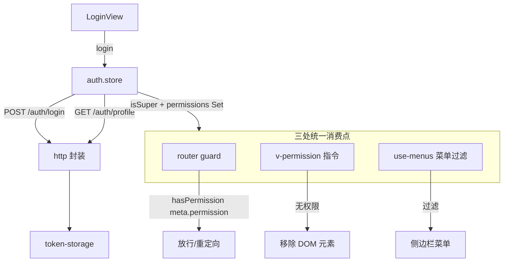
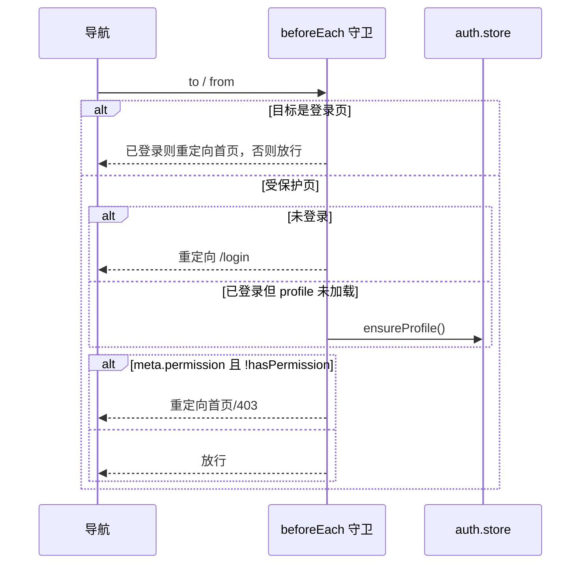
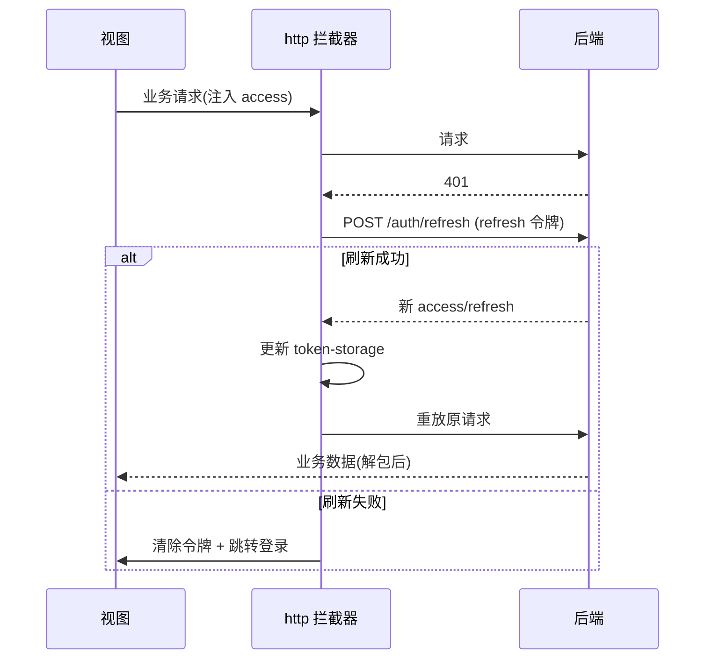
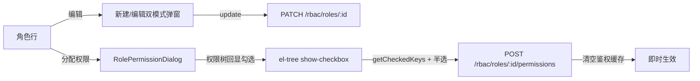
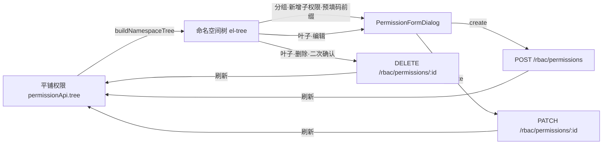

# 前端基座（Vue3 + Pinia）

## 模块职责

Vue3 + Pinia + Element Plus 前端基座，提供：登录鉴权、基于权限的**动态路由与菜单**、
**按钮级 `v-permission` 指令**、统一 axios 封装（401 静默刷新）、WebSocket IM 接入。

实现的功能：

- **鉴权 store**（Pinia）：登录/登出、拉取 profile、维护扁平权限码集合，`hasPermission()` 超管放行。
- **动态路由 + 守卫**：路由 `meta.permission` 声明所需权限，全局 `beforeEach` 守卫强制鉴权 + 鉴权。
- **菜单过滤**：按当前用户权限渲染可见菜单。
- **v-permission 指令**：无权限时直接从 DOM 移除元素（按钮级鉴权）。
- **HTTP 封装**：响应拦截层解包 `ApiResponse`，401 自动用 refresh 令牌静默刷新并重放请求。
- **IM 接入**：`use-im-socket` 组合式函数封装 Socket.IO 连接/收发。

## 目录结构

```
apps/web/src/
├── api/
│   ├── http.ts             axios 实例（请求注入令牌 / 响应解包 / 401 刷新）
│   ├── token-storage.ts    localStorage 令牌读写（infra.accessToken/refreshToken）
│   └── {auth,user,role,permission,config,upload,im}.api.ts  各模块请求函数
├── stores/auth.store.ts    鉴权状态（login/logout/profile/hasPermission）
├── router/
│   ├── routes.ts           路由表（含 meta.permission）
│   ├── guard.ts            全局前置守卫
│   └── index.ts            路由装配
├── directives/permission.directive.ts   v-permission 指令
├── composables/
│   ├── use-menus.ts        按权限过滤菜单
│   └── use-im-socket.ts    Socket.IO 组合式封装
├── layouts/AppLayout.vue   带侧边栏的主框架
├── views/                  Login / Dashboard / rbac / config / upload / im
├── config/env.ts           前端运行时配置（API base、WS URL）
├── App.vue
└── main.ts                 Pinia + Router + Element Plus + v-permission 装配
```

## 鉴权数据流



`hasPermission(code)` 是唯一判定入口：`profile.isSuper === true || permissions.has(code)`。
超管后端走 bypass、显式权限为空，前端据 `isSuper` 字段直接放行，三处消费点行为一致。

## 路由守卫



## HTTP 401 静默刷新



## 角色管理：编辑与权限分配

`RoleListView` 在「新建/删除」之外补齐了角色的两类编辑能力，按钮均受细粒度权限码控制：

| 操作 | 入口按钮 | 权限码 | 调用接口 |
| --- | --- | --- | --- |
| 编辑信息 | 编辑 | `rbac:role:update` | `PATCH /rbac/roles/:id`（仅改名称/备注，编码不可改） |
| 分配权限 | 分配权限 | `rbac:role:assignPermissions` | `POST /rbac/roles/:id/permissions` |



- 新建与编辑复用同一弹窗（`editingId` 区分模式），编辑态下编码字段禁用，与后端 `UpdateRoleDto` 一致。
- 权限分配拆为独立组件 `components/rbac/RolePermissionDialog.vue`：打开时拉取权限树并按 `role.permissionIds` 回显勾选，保存时收集全选 + 半选节点，后端落库后清空鉴权缓存即时生效。

## 权限管理：命名空间树 + CRUD

后端权限是**平铺播种**的（均为 `api` 类型、`parentId` 为空），但权限码本身带命名空间语义（以 `:` 分段，如 `config:list`、`rbac:user:create`）。前端在渲染时按权限码命名空间派生出**嵌套树**，让同前缀权限聚合在同一文件夹下，而非各成根节点的"伪列表"。

层级完全由权限码派生，零数据迁移、零硬编码模块名，工具收敛在 `utils/permission-tree.ts`：

| 函数 | 职责 |
| --- | --- |
| `buildNamespaceTree(nodes)` | 把平铺权限按 code 的 `:` 分段组织成嵌套树；中间段生成虚拟分组文件夹，末段挂载真实权限为叶子 |
| `pickRealPermissionIds(keys)` | 从勾选结果中剔除虚拟分组（id 以 `group:` 前缀），仅保留真实权限 UUID |

```text
config:list / config:save / config:remove
        └─ config（虚拟分组）
             ├─ 配置-查询 (config:list)
             ├─ 配置-保存 (config:save)
             └─ 配置-删除 (config:remove)

rbac:user:create / rbac:role:update / ...
        └─ rbac（虚拟分组）
             ├─ user（虚拟分组）
             │    ├─ 创建用户 (rbac:user:create)
             │    └─ ...
             └─ role（虚拟分组）
                  └─ 更新角色 (rbac:role:update)
```

- 虚拟分组节点：`id = group:<命名空间路径>`、`isGroup = true`、`permission = null`，仅用于聚合展示，**不挂载任何 CRUD 操作**。
- 叶子节点：`id = 真实权限 UUID`、`isGroup = false`，承载编辑/删除/新增子权限。

`PermissionListView` 基于该树渲染（`el-tree`，`default-expand-all`），按钮均受细粒度权限码控制：

| 操作 | 入口按钮 | 权限码 | 调用接口 |
| --- | --- | --- | --- |
| 新增权限 | 顶部·新增权限 | `rbac:permission:create` | `POST /rbac/permissions`（无码前缀） |
| 新增子权限 | 分组·新增子权限 | `rbac:permission:create` | `POST /rbac/permissions`（预填 `<分组路径>:` 作为码前缀） |
| 编辑 | 叶子·编辑 | `rbac:permission:update` | `PATCH /rbac/permissions/:id`（编码、类型不可改） |
| 删除 | 叶子·删除 | `rbac:permission:remove` | `DELETE /rbac/permissions/:id` |



- 表单拆为独立组件 `components/rbac/PermissionFormDialog.vue`：新增/编辑双模式（`permission` 非空即编辑），按权限类型条件渲染字段（菜单显示路由/组件/图标，接口显示方法/路径），与后端 `CreatePermissionDto` / `UpdatePermissionDto` 字段一致。
- 编辑态下「权限码」「权限类型」禁用，对齐 `UpdatePermissionDto`（不接受 code/type 变更）；在分组上「新增子权限」时把该命名空间路径作为 `codePrefix` 预填进权限码输入框，引导用户延续命名空间，无硬编码层级。
- 角色「分配权限」弹窗 `RolePermissionDialog` 复用同一棵命名空间树展示；勾选后通过 `pickRealPermissionIds` 过滤掉虚拟分组 id，仅把真实权限 UUID 提交给 `POST /rbac/roles/:id/permissions`。

## 设计要点

- **单一判定入口**：所有鉴权收敛到 `hasPermission`，避免分散判断逻辑漂移。
- **响应解包在拦截层**：视图直接拿 `data`，无需层层 `res.data.data`。
- **令牌存储集中**：`token-storage` 统一键名（`infra.accessToken` / `infra.refreshToken`）。
- **权限码共享**：路由 `meta.permission` 与指令复用 contracts 的 `PERMS`，与后端同源。

## 视图清单

| 路由 | 视图 | 所需权限 |
| --- | --- | --- |
| `/login` | LoginView | 公开 |
| `/` | DashboardView | 登录即可 |
| `/rbac/users` | UserListView | `rbac:user:list` |
| `/rbac/roles` | RoleListView | `rbac:role:list` |
| `/rbac/permissions` | PermissionListView | `rbac:permission:list` |
| `/config` | ConfigView | `config:list` |
| `/upload` | UploadView | `upload:file:list` |
| `/im` | ImView | `im:message:history` |
