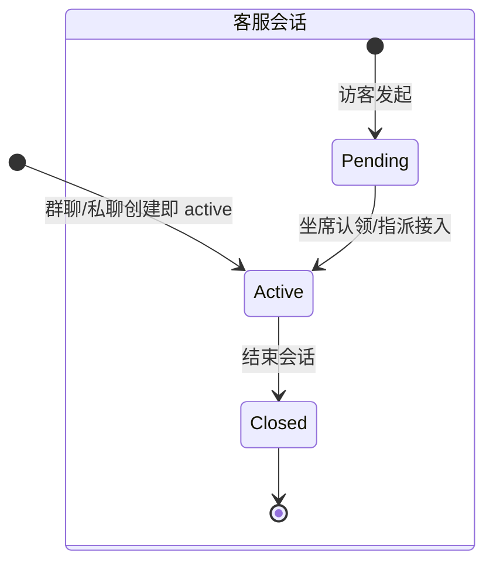
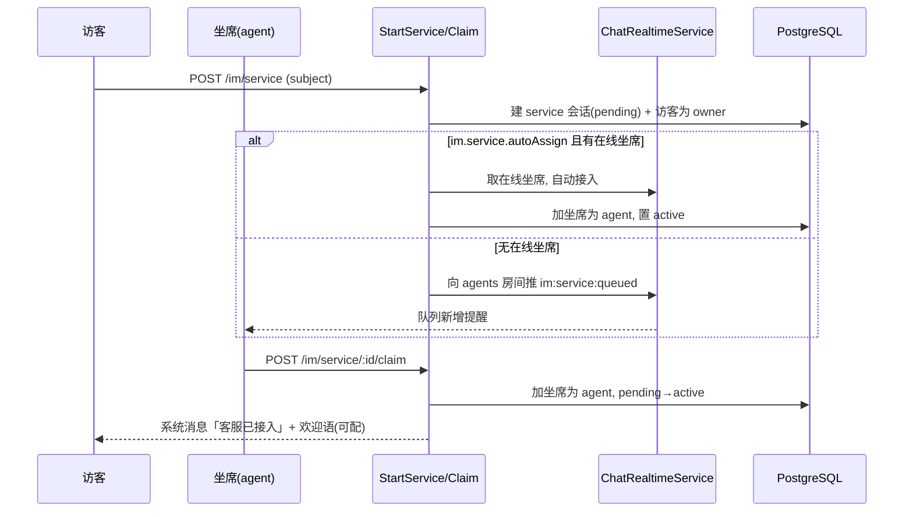
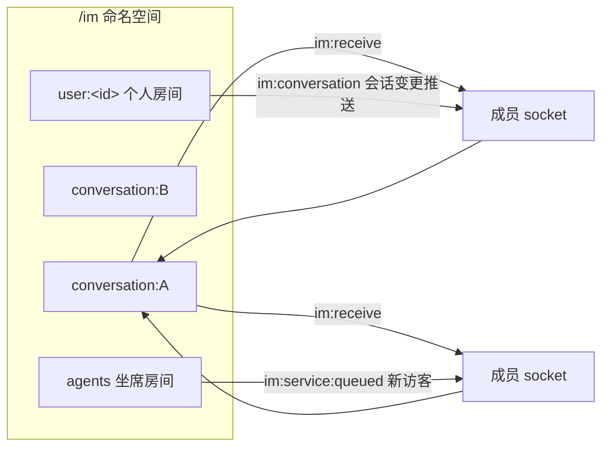
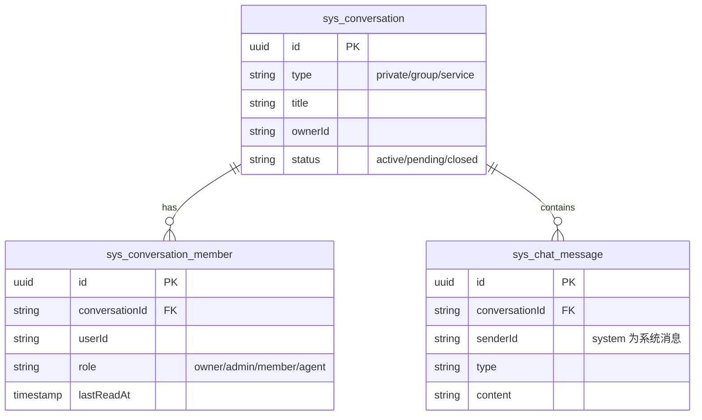
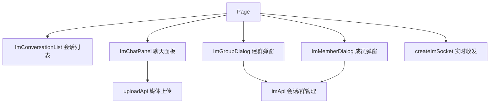

# IM 即时通讯（私聊 / 群聊 / 客服）

## 模块职责

基于 **Socket.IO**（命名空间 `/im`）的即时通讯模块。以**会话 Conversation** 为核心抽象，
统一 **私聊 / 群聊 / 客服** 三类场景：三者复用同一套消息、成员与房间模型，仅在语义与状态机上区分。
握手阶段复用 RBAC 访问令牌鉴权；进房与收发均做**成员校验**，仅会话成员可参与。
消息支持 **文字 / 图片 / 视频**，成员变更与客服接入以 **系统消息** 广播。

实现的功能：

- **握手鉴权**：连接校验 access 令牌，无效则 `im:error` + 断连；连接后自动加入个人房间 `user:<id>`。
- **会话列表**（REST `GET /im/conversations`）：返回当前用户全部会话，含未读数、最后一条消息、显示标题（私聊解析为对端昵称）。
- **群聊**：建群、改名、加/移成员、退群；成员变更广播系统消息（xx 加入/退出）。
- **客服**：访客发起会话进入待接入队列 → 坐席认领/管理员指派 → 接入对话 → 结束；支持配置自动分配与欢迎语。
- **私聊**：按对端用户开启（已存在则复用）。
- **实时收发**（`im:join` / `im:send` / `im:receive`）：进房成员校验，发送持久化后按房间广播；进房/发送同步刷新已读位点。
- **未读统计**：每个成员维护 `lastReadAt`，列表未读数 = 该位点之后的消息条数。

## 会话状态机



- **群聊 / 私聊**：创建即 `active`，无状态流转。
- **客服**：`pending`（待接入队列）→ `active`（坐席接入）→ `closed`（结束）。

## 客服队列与接入流程



## 房间模型



- `conversation:<id>`：会话消息广播房间，进房前校验成员身份。
- `user:<id>`：个人房间，推送会话新增/变更（被拉群、被分配客服等）`im:conversation`。
- `agents`：坐席房间，订阅客服队列推送 `im:service:queued`。

## 目录结构（DDD 四层）

```
modules/im/
├── domain/
│   ├── message.entity.ts                       消息实体
│   ├── conversation.entity.ts                  会话实体(type/title/owner/status)
│   ├── conversation-member.entity.ts           会话成员(角色/lastReadAt)
│   └── *-repository.interface.ts               仓储端口
├── application/
│   ├── chat-realtime.service.ts                房间广播/在线坐席跟踪
│   ├── system-message.service.ts               系统消息生成
│   ├── conversation-access.service.ts          成员校验
│   ├── conversation-view.assembler.ts          列表/详情视图装配(显示标题/未读)
│   ├── conversation-notifier.service.ts        会话变更经个人房间推送
│   ├── service-assignment.service.ts           坐席接入(claim/assign 共用)
│   ├── member.factory.ts                       成员构造
│   └── use-cases/                              每用例一文件(共 16)
│       ├── send-message / get-history / mark-read
│       ├── create-group / list-conversations / get-conversation-detail
│       ├── add-members / remove-member / leave-conversation / rename-group
│       ├── open-private
│       └── start-service / get-service-queue / claim-service / assign-service / close-service
├── infrastructure/
│   ├── message.repository.ts
│   ├── conversation.repository.ts
│   └── conversation-member.repository.ts
└── interfaces/
    ├── ws/im.gateway.ts                         Socket.IO 网关
    ├── dto/                                     7 个请求 DTO
    └── controllers/                             每路由一文件(共 14)
```

## REST 端点

| 方法 | 路径 | 权限 | 说明 |
| --- | --- | --- | --- |
| GET | `/im/messages` | `im:message:history` | 拉取会话历史 |
| GET | `/im/conversations` | 登录 | 我的会话列表 |
| POST | `/im/conversations` | `im:conversation:create` | 建群 |
| POST | `/im/conversations/private` | 登录 | 开启/复用私聊 |
| GET | `/im/conversations/:id` | 成员 | 会话详情(含成员) |
| PUT | `/im/conversations/:id` | `im:conversation:manage` | 群改名 |
| POST | `/im/conversations/:id/members` | `im:conversation:manage` | 加成员 |
| DELETE | `/im/conversations/:id/members/:userId` | `im:conversation:manage` | 移成员 |
| POST | `/im/conversations/:id/leave` | 成员 | 退群 |
| POST | `/im/service` | 登录 | 访客发起客服 |
| GET | `/im/service/queue` | `im:service:agent` | 待接入队列 |
| POST | `/im/service/:id/claim` | `im:service:agent` | 坐席认领 |
| POST | `/im/service/:id/assign` | `im:service:agent` | 指派坐席 |
| POST | `/im/service/:id/close` | `im:service:agent` | 结束会话 |

## WS 事件（contracts 共享）

| 事件 | 方向 | 载荷 | 说明 |
| --- | --- | --- | --- |
| `im:join` | C→S | `conversationId` | 进房(成员校验)+返回历史 |
| `im:send` | C→S | `SendMessagePayload` | 发送消息 |
| `im:receive` | S→C | `ChatMessage` | 房间广播 |
| `im:conversation` | S→C | `ConversationView` | 会话新增/变更(个人房间) |
| `im:service:watch` | C→S | — | 坐席订阅队列(权限校验) |
| `im:service:queued` | S→C | `ServiceQueueItemView` | 新访客入队(坐席房间) |
| `im:error` | S→C | `{ message }` | 鉴权/业务失败 |

## 数据模型



## 配置项（配置中心，无硬编码）

| Key | 说明 |
| --- | --- |
| `im.historyLimit` | 历史消息拉取条数 |
| `im.group.maxMembers` | 群成员上限 |
| `im.service.autoAssign` | 是否自动分配在线坐席 |
| `im.service.welcome` | 客服接入欢迎语（richtext 富文本，支持图片/视频；客户端渲染前经 DOMPurify 净化） |

## 设计要点

- **会话为统一抽象**：私聊/群聊/客服复用同一消息、成员、房间与广播链路，仅状态机/语义不同，避免三套实现。
- **成员校验前移到 WS 边界**：进房 `assertMember`，发送在用例内复核，安全与业务解耦。
- **claim/assign 复用 ServiceAssignmentService**：坐席接入逻辑(置 active、加成员、欢迎语、推送)单一来源。
- **显示标题装配**：私聊无存储标题，`ConversationViewAssembler` 批量解析对端昵称，避免 N+1。
- **事件名/类型共享**：`IM_EVENTS`、各 View/Payload 定义在 `packages/contracts`，前后端复用避免魔法字符串。

## 相关端点

详见 [api-reference.md](./api-reference.md#websocket-im)。

## 前端即时消息页

`/im` 是用户侧消息工作台，页面容器只负责 `imApi`、`uploadApi`、`userApi` 与 WebSocket 状态编排；
展示层拆分为会话列表、聊天面板、建群弹窗和成员弹窗，业务动作全部通过事件回到容器执行。

已实现能力：

- 私聊 / 群聊 / 客服会话统一列表展示，保留未读数、状态、最后消息预览和更新时间。
- 第一屏直接进入通讯工作台，去掉装饰型头图与统计卡，降低运营展示感。
- 聊天面板使用桌面聊天常见的会话头与底部 compose box：头部展示会话头像、类型、状态、成员数和更新时间；输入面板内提供图标化图片/视频工具、多行文本输入和右侧发送按钮，媒体仍复用上传模块。
- 系统富文本消息继续经 DOMPurify 净化。
- 群聊操作保留改名、成员管理、退群；成员管理弹窗保留加成员和移除成员能力。
- 页面保持响应式：桌面左右工作台，窄屏上下布局，消息列表和会话列表各自内部滚动。


