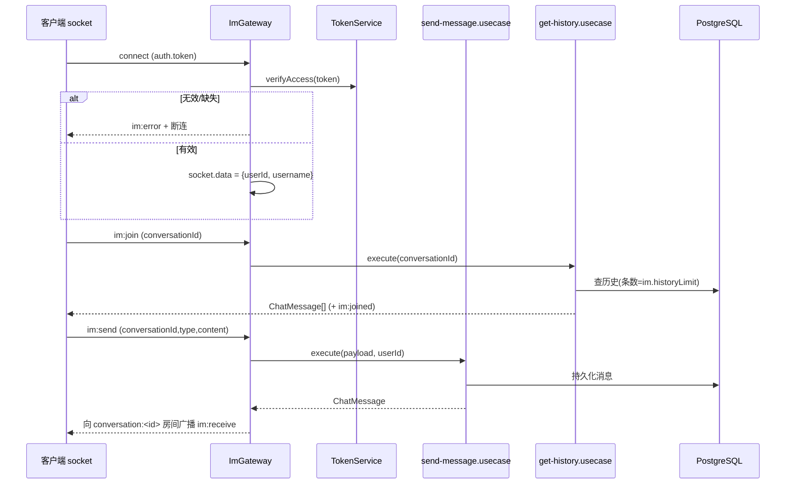
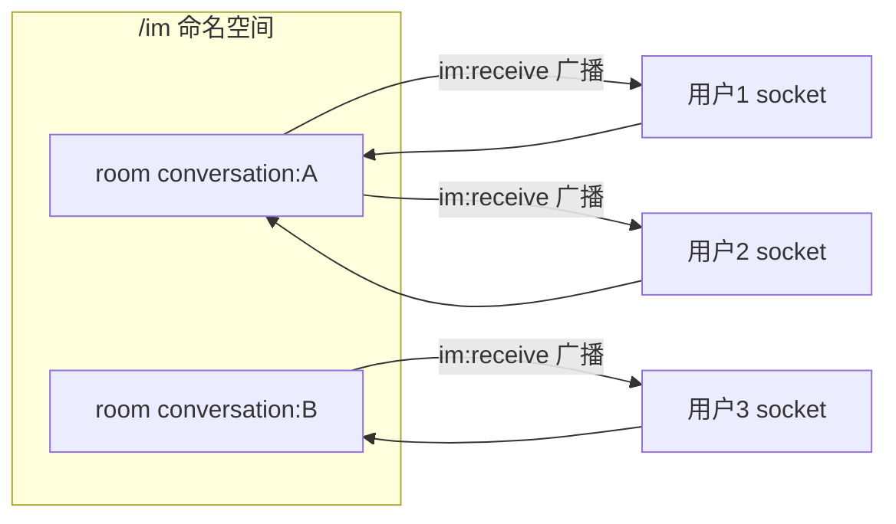

# WebSocket IM 即时通讯

## 模块职责

基于 **Socket.IO** 的即时通讯基础能力，命名空间 `/im`。握手阶段复用 RBAC 访问令牌鉴权，
客户端加入**会话房间**后即可收发消息，消息持久化后按会话房间广播。
支持 **文字 / 图片 / 视频** 三种消息类型，会话维度（private/group/service）为后续**群聊、客服**功能预留扩展点。

实现的功能：

- **握手鉴权**：连接时校验 access 令牌，缺失/无效令牌发 `im:error` 并断连。
- **加入会话**（`im:join`）：进房后返回该会话历史消息。
- **发送消息**（`im:send`）：持久化入库后向会话房间广播 `im:receive`。
- **历史拉取**（REST `GET /api/im/messages`）：受 `im:message:history` 权限保护。
- **错误回传**（`im:error`）：发送失败/鉴权失败统一回传客户端。

## 目录结构（DDD 四层）

```
modules/im/
├── domain/
│   ├── message.entity.ts                消息实体
│   └── message-repository.interface.ts  仓储端口
├── application/
│   ├── message.mapper.ts                实体 ↔ ChatMessage
│   └── use-cases/
│       ├── send-message.usecase.ts      校验+持久化
│       └── get-history.usecase.ts       按会话拉取历史（条数走配置中心）
├── infrastructure/
│   └── message.repository.ts            TypeORM 仓储
└── interfaces/
    ├── ws/
    │   ├── im.gateway.ts                Socket.IO 网关（/im 命名空间）
    │   └── ws-auth.ts                   从握手中提取令牌
    └── controllers/
        └── message.history.controller.ts  GET /api/im/messages
```

## 连接与消息流程



## 房间模型



房间命名 `conversation:<conversationId>`。发送时若发送者未在房间会自动 join，再向房间广播，保证收发双方一致。

## WS 事件与类型（contracts 共享）

| 事件 | 方向 | 载荷 | 说明 |
| --- | --- | --- | --- |
| `im:join` | C→S | `conversationId: string` | 加入会话房间，返回历史 |
| `im:joined` | S→C | `{ conversationId }` | 入房确认 |
| `im:send` | C→S | `SendMessagePayload` | 发送消息 |
| `im:receive` | S→C | `ChatMessage` | 房间广播新消息 |
| `im:error` | S→C | `{ message }` | 鉴权/发送失败 |

```ts
enum MessageType { Text='text', Image='image', Video='video' }
enum ConversationType { Private='private', Group='group', Service='service' } // group/service 预留
interface SendMessagePayload { conversationId: string; type: MessageType; content: string }
interface ChatMessage { id; conversationId; senderId; type; content; createdAt }
```

## 设计要点

- **复用 RBAC 令牌**：握手用 `TokenService.verifyAccess`，与 REST 鉴权同源，无独立账号体系。
- **房间维度即扩展点**：当前只实现基础收发，`ConversationType` 的 group/service 为群聊/客服预留。
- **事件名/类型共享**：`IM_EVENTS` 等定义在 `packages/contracts`，前后端复用避免魔法字符串。
- **历史条数走配置中心**：`im.historyLimit` 可热调。

## 相关端点

详见 [api-reference.md](./api-reference.md#websocket-im)。
