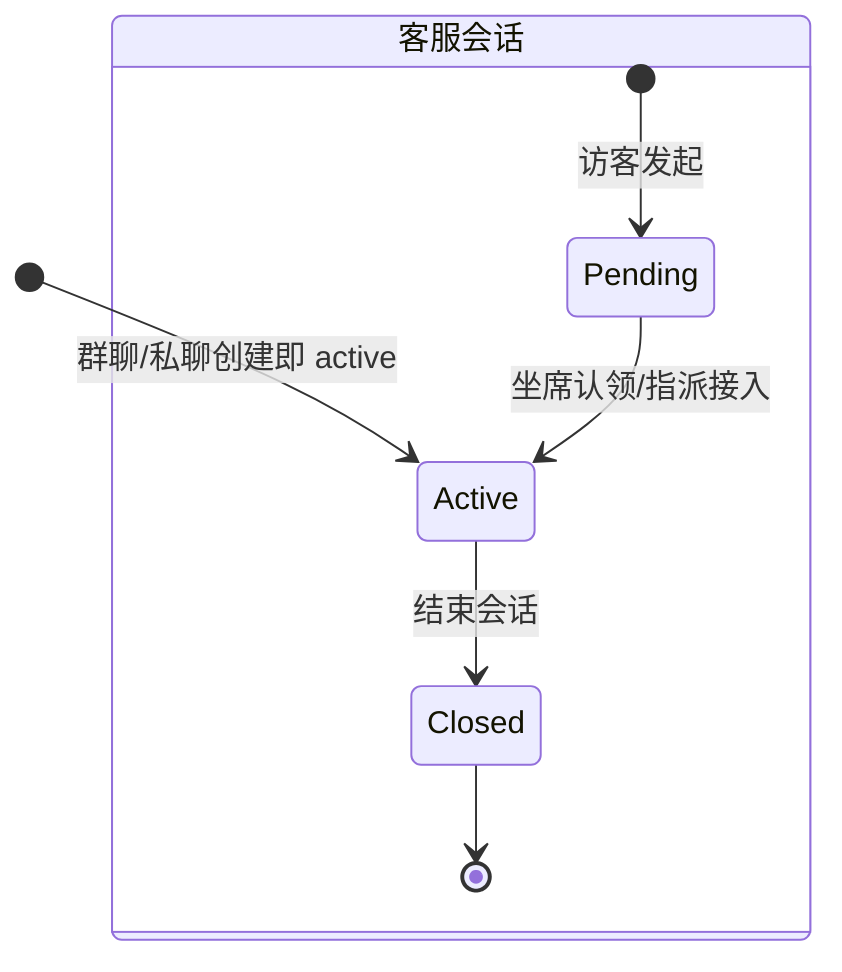
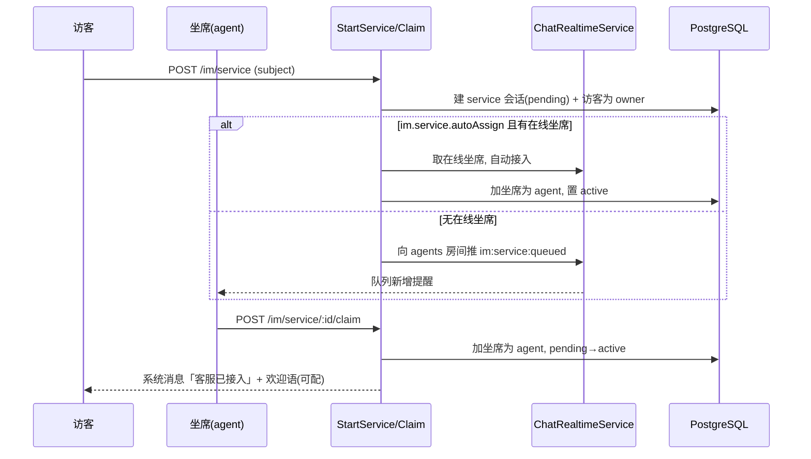
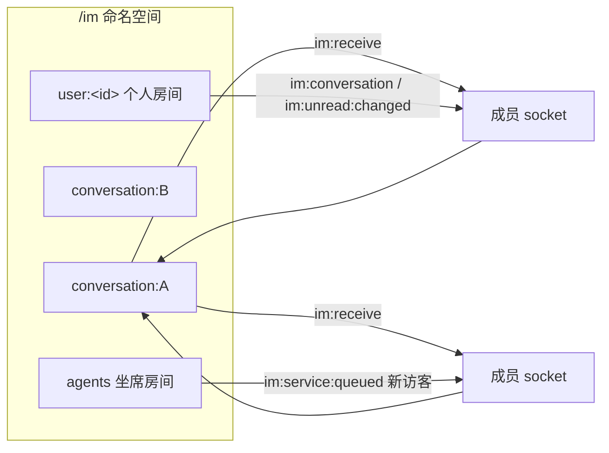
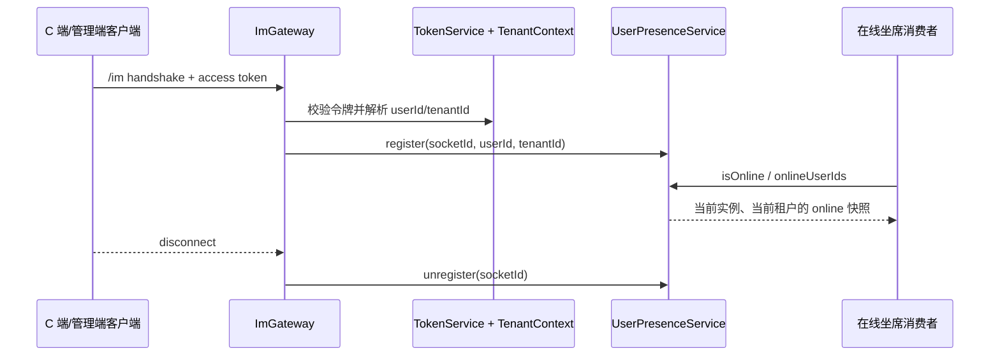
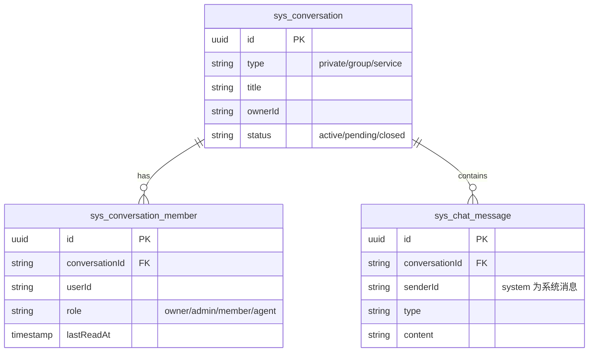
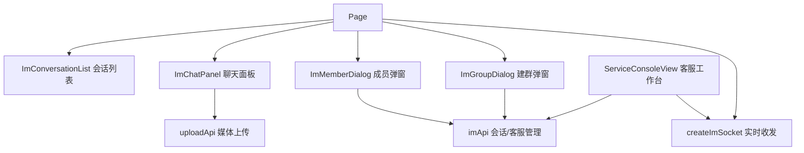
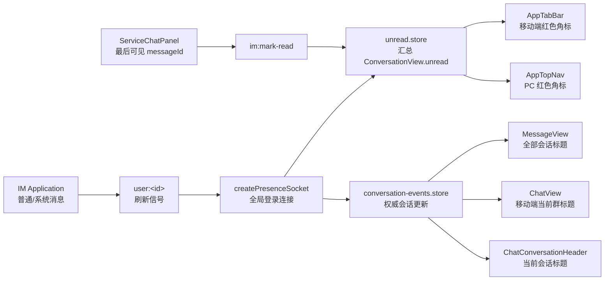
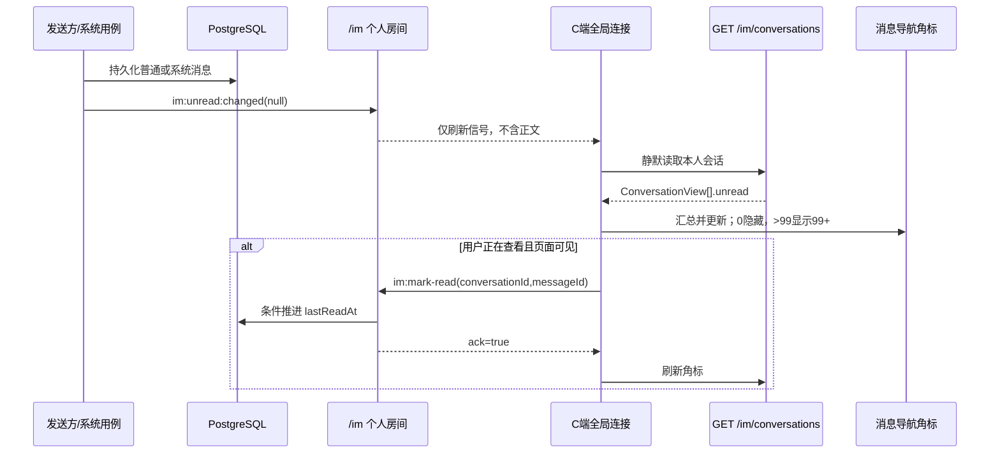

# IM 即时通讯（私聊 / 群聊 / 客服）

## 模块职责

基于 **Socket.IO**（命名空间 `/im`）的即时通讯模块。以**会话 Conversation** 为核心抽象，
统一 **私聊 / 群聊 / 客服** 三类场景：三者复用同一套消息、成员与房间模型，仅在语义与状态机上区分。
握手阶段复用 RBAC 访问令牌鉴权；进房与收发均做**成员校验**，仅会话成员可参与。
消息支持 **文字 / 图片 / 视频**，成员变更与客服接入以 **系统消息** 广播。

实现的功能：

- **握手鉴权**：连接校验 access 令牌，无效则 `im:error` + 断连；连接后自动加入个人房间 `user:<id>`。消息处理前先等待握手鉴权完成（`authReady` 信号），避免客户端连接后立即发消息（如坐席订阅 `im:service:watch`）时身份未就绪被误判无权限。
- **通用连接在线快照**：鉴权成功的每个 `/im` socket 按 `socketId → userId + tenantId` 登记到 `UserPresenceService`；同一用户任一标签页/设备存活即在线，断开最后一个 socket 才离线。该快照继续用于客服在线坐席等即时连接场景；打手是否接单已改由 booster 模块持久化状态维护，不再复用 socket presence。
- **会话列表**（REST `GET /im/conversations`）：返回当前用户全部会话，含未读数、最后一条消息、显示标题（私聊解析为对端昵称）。
- **会话搜索**（REST `GET /im/conversations/search?keyword=`）：在我参与的会话中按显示标题（私聊即对方用户名）忽略大小写模糊匹配，复用列表用例保证口径一致。
- **聊天记录搜索**（REST `GET /im/messages/search`）：会话内按内容关键词 + 日期范围（`dateFrom`/`dateTo`，YYYY-MM-DD 闭区间，两者均可缺省）分页搜索（新 → 旧），仅会话成员可搜；不传关键词时即按日期翻阅当天聊天记录。
  - 管理端 UI：IM 页左侧会话列表顶部搜索框（防抖调会话搜索接口，清空回退全量列表）；聊天面板头部「搜索记录」按钮打开 `ImMessageSearchDialog`（关键词 + 日期范围选择器 + 分页结果）。
- **群聊**：建群、改名、加/移成员、退群；成员变更广播系统消息（xx 加入/退出）。
- **系统建群门面**：`GroupFacade` 供业务模块（如订单支付成功自动建群、打手接单进群）
  以系统身份建群/幂等加人并广播系统消息，不做操作者管理权校验。`ensureSystemGroup` 接收业务方稳定 UUID，重复调用复用群主体并补齐缺失成员；仅新建群或实际补员时推送会话变更，避免详情查询产生重复实时事件。
- **系统群标题同步**：`GroupFacade.syncSystemGroupTitle` 供订单等服务端业务模块幂等更新群标题；仓储按期望实体版本原子窄写，能识别标题值 A→B→A 的 ABA，冲突由业务模块重读权威状态后重试。同标题跳过写库和广播，变化后复用 `ConversationNotifier` 向成员个人房间推送 `im:conversation`，不发送“人工改名”系统消息。`ConversationView.version` 携带会话聚合的单调版本，客户端拒绝逆序到达的旧版本。订单群按 `[待接单]`、`[服务中]`、`[已结束]` 展示阶段，群状态始终保持 `active`。
- **客服**：访客发起会话进入待接入队列 → 坐席认领/管理员指派 → 接入对话 → 结束；支持配置自动分配与欢迎语。
  - **客服角色打通工作台**：内置「客服」角色（`service`）由 RbacSeeder 幂等补齐坐席所需菜单与接口权限（`im:menu` / `im:service:menu` / `im:message:history` / `im:service:agent`），管理员在用户管理中为客服人员分配该角色后即可登录管理端接待访客。
  - **C 端联系客服**：用户端 `apps/client` 消息页移动端点击会话进入 `/service` 全屏聊天；PC 端 `/messages` 采用左侧会话列表 + 右侧聊天面板，聊天面板复用 `ServiceChatPanel`，不重复实现 WebSocket 收发。客服聊天复用进行中的客服会话（否则在 `/service` 新发起 `POST /im/service`），经 `/im` WebSocket 拉历史与实时收发；系统富文本消息经 DOMPurify 净化后渲染。
- **私聊**：按对端用户开启（已存在则复用）。
- **实时收发**（`im:join` / `im:send` / `im:receive`）：进房成员校验，发送持久化后按房间广播；本人发送成功时推进已读位点，历史和实时来信由客户端在页面可见后显式确认。
- **未读统计**：每个成员维护 `lastReadAt`，列表未读数 = 该位点之后的消息条数。C 端导航「消息」入口（底部 TabBar 与 PC 顶部导航）展示红色未读总数角标（超 99 显示 99+）；普通消息和系统消息持久化后均向成员个人房间发送不含正文的 `im:unread:changed`，全局连接据此静默刷新权威会话列表。30 秒轮询、路由切换和页面恢复可见继续兜底，消息页本地列表变化后仍读取服务端权威未读数。

明确非目标：连接在线状态只表示当前服务实例观察到的 socket 存活，不代表打手接单状态；当前没有跨实例 Redis presence、离线推送或心跳业务指标。

## 会话状态机


```mermaid
stateDiagram-v2
  [*] --> Active: 群聊/私聊创建即 active
  state 客服会话 {
    [*] --> Pending: 访客发起
    Pending --> Active: 坐席认领/指派接入
    Active --> Closed: 结束会话
    Closed --> [*]
  }
```

- **群聊 / 私聊**：创建即 `active`，无状态流转。
- **客服**：`pending`（待接入队列）→ `active`（坐席接入）→ `closed`（结束）。
- **订单群**：“已结束”只是持久化标题中的订单阶段，不会把群会话推进为 `closed`。

## 客服队列与接入流程


```mermaid
sequenceDiagram
  participant V as 访客
  participant A as 坐席(agent)
  participant S as StartService/Claim
  participant RT as ChatRealtimeService
  participant DB as PostgreSQL

  V->>S: POST /im/service (subject)
  S->>DB: 建 service 会话(pending) + 访客为 owner
  alt im.service.autoAssign 且有在线坐席
    S->>RT: 取在线坐席, 自动接入
    S->>DB: 加坐席为 agent, 置 active
  else 无在线坐席
    S->>RT: 向 agents 房间推 im:service:queued
    RT-->>A: 队列新增提醒
  end
  A->>S: POST /im/service/:id/claim
  S->>DB: 加坐席为 agent, pending→active
  S-->>V: 系统消息「客服已接入」+ 欢迎语(可配)
```

## 房间模型


```mermaid
flowchart LR
  subgraph ns["/im 命名空间"]
    C1["conversation:A"]
    C2["conversation:B"]
    U["user:&lt;id&gt; 个人房间"]
    AG["agents 坐席房间"]
  end
  S1[成员 socket] --> C1
  S2[成员 socket] --> C1
  C1 -->|im:receive| S1 & S2
  U -->|im:conversation / im:unread:changed| S1
  AG -->|im:service:queued 新访客| S2
```

- `conversation:<id>`：会话消息广播房间，进房前校验成员身份。
- `user:<id>`：个人房间，推送会话新增/变更 `im:conversation` 及无正文未读刷新信号 `im:unread:changed`。
- `agents`：坐席房间，订阅客服队列推送 `im:service:queued`。

### Socket 连接在线状态时序


```mermaid
sequenceDiagram
  participant C as C 端/管理端客户端
  participant G as ImGateway
  participant T as TokenService + TenantContext
  participant P as UserPresenceService
  participant D as 在线坐席消费者

  C->>G: /im handshake + access token
  G->>T: 校验令牌并解析 userId/tenantId
  G->>P: register(socketId, userId, tenantId)
  D->>P: isOnline / onlineUserIds
  P-->>D: 当前实例、当前租户的 online 快照
  C-->>G: disconnect
  G->>P: unregister(socketId)
```

连接在线快照不写 PostgreSQL，也不通过 `im:receive` 广播；多实例部署需后续引入带租户键的 Redis presence，否则不同实例上的在线坐席可能互相不可见。打手目录的 `online` 字段映射 `booster_application.accepting_orders`，不受 socket 连接或实例重启影响。

## C 端页面结构

- `client/views/message/MessageView.vue`：消息页。移动端保留会话列表；PC 端为双栏布局，左侧展示会话摘要与未读数，右侧嵌入聊天面板；列表变化时触发服务端权威未读刷新，避免滞后列表覆盖全局实时结果。
- `client/App.vue`：按登录态管理全局 `/im` 连接、角标轮询、路由与页面恢复刷新；登出时断连并清零。
- `client/composables/use-presence-socket.ts`：复用在线快照连接订阅个人未读与会话变化；令牌刷新重建连接时重新绑定事件。
- `client/composables/use-visible-message-read.ts`：集中处理页面可见性、当前会话校验和恢复可见后的最后消息已读补偿。
- `client/stores/badge-store.factory.ts`：导航角标 store 工厂，封装数量拉取、单飞/尾随刷新、旧响应抑制、轮询与本地同步（消息未读与大厅待接单角标共用）。
- `client/stores/unread.store.ts`：未读消息状态，汇总全部会话未读数供导航角标（`AppTabBar` / `AppTopNav`）展示。
- `client/views/message/ServiceChatView.vue`：在线客服全屏页，只承载全屏版 `ServiceChatPanel`。
- `client/components/message/ServiceChatPanel.vue`：客服聊天核心面板，统一处理会话解析、进房、实时收发、媒体发送、自动滚动与最后可见消息已读确认；同一会话进房期间的标题更新复用当前请求，切换会话时以请求代次丢弃迟到的旧进房响应。
- `client/components/message/ChatMessageFeed.vue`：消息流展示层，集中渲染加载/空状态、系统富文本净化、消息气泡、媒体与引用入口，不持有 Socket 或会话状态。
- `web/views/im/ImView.vue` / `ServiceConsoleView.vue`：管理端会话和客服工作台在历史消息渲染且页面可见后显式确认已读，不依赖进房副作用；IM 列表按 `ConversationView.version` 合并 REST 与实时结果，避免旧响应或迟到事件回滚标题。

## 目录结构（DDD 四层）

```
modules/im/
├── domain/
│   ├── message.entity.ts                       消息实体
│   ├── conversation.entity.ts                  会话实体(type/title/owner/status)
│   ├── conversation-member.entity.ts           会话成员(角色/lastReadAt)
│   └── *-repository.interface.ts               仓储端口
├── application/
│   ├── chat-realtime.service.ts                房间广播/在线坐席跟踪
│   ├── user-presence.service.ts                按 socket/租户维护在线快照（内存）
│   ├── system-message.service.ts               系统消息生成
│   ├── conversation-access.service.ts          成员校验
│   ├── conversation-view.assembler.ts          列表/详情视图装配(显示标题/未读)
│   ├── conversation-notifier.service.ts        会话变更经个人房间推送
│   ├── service-assignment.service.ts           坐席接入(claim/assign 共用)
│   ├── member.factory.ts                       成员构造
│   └── use-cases/                              每用例一文件(共 18)
│       ├── send-message / get-history / mark-read
│       ├── create-group / list-conversations / search-conversations
│       ├── search-messages / get-conversation-detail
│       ├── add-members / remove-member / leave-conversation / rename-group
│       ├── open-private
│       └── start-service / get-service-queue / claim-service / assign-service / close-service
├── infrastructure/
│   ├── message.repository.ts
│   ├── conversation.repository.ts
│   └── conversation-member.repository.ts
└── interfaces/
    ├── ws/im.gateway.ts                         Socket.IO 网关
    ├── dto/                                     8 个请求 DTO
    └── controllers/                             每路由一文件(共 16)
```

## REST 端点

| 方法   | 路径                                    | 权限                        | 说明                                  |
| ------ | --------------------------------------- | --------------------------- | ------------------------------------- |
| GET    | `/im/messages`                          | `im:message:history`        | 拉取会话历史                          |
| GET    | `/im/messages/search`                   | `im:message:history` + 成员 | 搜索聊天记录（关键词/日期范围，分页） |
| GET    | `/im/conversations/search`              | 登录                        | 搜索我的会话（标题关键词）            |
| GET    | `/im/conversations`                     | 登录                        | 我的会话列表                          |
| POST   | `/im/conversations`                     | `im:conversation:create`    | 建群                                  |
| POST   | `/im/conversations/private`             | 登录                        | 开启/复用私聊                         |
| GET    | `/im/conversations/:id`                 | 成员                        | 会话详情(含成员)                      |
| PUT    | `/im/conversations/:id`                 | `im:conversation:manage`    | 群改名                                |
| POST   | `/im/conversations/:id/members`         | `im:conversation:manage`    | 加成员                                |
| DELETE | `/im/conversations/:id/members/:userId` | `im:conversation:manage`    | 移成员                                |
| POST   | `/im/conversations/:id/leave`           | 成员                        | 退群                                  |
| POST   | `/im/service`                           | 登录                        | 访客发起客服                          |
| GET    | `/im/service/queue`                     | `im:service:agent`          | 待接入队列                            |
| POST   | `/im/service/:id/claim`                 | `im:service:agent`          | 坐席认领                              |
| POST   | `/im/service/:id/assign`                | `im:service:agent`          | 指派坐席                              |
| POST   | `/im/service/:id/close`                 | `im:service:agent`          | 结束会话                              |

## WS 事件（contracts 共享）

| 事件                 | 方向 | 载荷                            | 说明                               |
| -------------------- | ---- | ------------------------------- | ---------------------------------- |
| `im:join`            | C→S  | `conversationId`                | 进房(成员校验)+返回历史            |
| `im:mark-read`       | C→S  | `{ conversationId, messageId }` | 按最后可见消息单调推进已读位点     |
| `im:send`            | C→S  | `SendMessagePayload`            | 发送消息                           |
| `im:receive`         | S→C  | `ChatMessage`                   | 房间广播                           |
| `im:unread:changed`  | S→C  | `null`                          | 个人房间未读刷新信号，不含消息正文 |
| `im:conversation`    | S→C  | `ConversationView`              | 会话新增/变更(个人房间)            |
| `im:service:observe` | C→S  | —                               | 只观察队列，不登记自动分配在线状态 |
| `im:service:watch`   | C→S  | —                               | 客服工作台订阅并登记在线坐席       |
| `im:service:queued`  | S→C  | `ServiceQueueItemView`          | 新访客入队(坐席房间)               |
| `im:error`           | S→C  | `{ message }`                   | 鉴权/业务失败                      |

## 数据模型


```mermaid
erDiagram
  sys_conversation ||--o{ sys_conversation_member : has
  sys_conversation ||--o{ sys_chat_message : contains
  sys_conversation {
    uuid id PK
    string type "private/group/service"
    string title
    string ownerId
    string status "active/pending/closed"
  }
  sys_conversation_member {
    uuid id PK
    string conversationId FK
    string userId
    string role "owner/admin/member/agent"
    timestamp lastReadAt
  }
  sys_chat_message {
    uuid id PK
    string conversationId FK
    string senderId "system 为系统消息"
    string type
    string content
  }
```

Socket 连接状态没有 ER 实体或 migration；`UserPresenceService` 是应用实例生命周期内的内存索引，socket 断开即清理。租户 ID 参与索引和消费查询，不能把不同租户的同一用户 ID 合并。打手接单状态的数据模型与 migration 见 [booster.md](./booster.md)。

## 配置项（配置中心，无硬编码）

| Key                     | 说明                                                                            |
| ----------------------- | ------------------------------------------------------------------------------- |
| `im.historyLimit`       | 历史消息拉取条数                                                                |
| `im.group.maxMembers`   | 群成员上限                                                                      |
| `im.service.autoAssign` | 是否自动分配在线坐席                                                            |
| `im.service.welcome`    | 客服接入欢迎语（richtext 富文本，支持图片/视频；客户端渲染前经 DOMPurify 净化） |

## 设计要点

- **会话为统一抽象**：私聊/群聊/客服复用同一消息、成员、房间与广播链路，仅状态机/语义不同，避免三套实现。
- **成员校验前移到 WS 边界**：进房 `assertMember`，发送在用例内复核，安全与业务解耦。
- **claim/assign 复用 ServiceAssignmentService**：坐席接入逻辑(置 active、加成员、欢迎语、推送)单一来源。
- **显示标题装配**：私聊无存储标题，`ConversationViewAssembler` 批量解析对端昵称，避免 N+1；同时下发会话实体 `version` 作为实时视图的单调顺序标记。
- **事件名/类型共享**：`IM_EVENTS`、各 View/Payload 定义在 `packages/contracts`，前后端复用避免魔法字符串。
- **个人事件只作刷新信号**：未读事件不包含消息正文、会话 ID 或其他用户数据；客户端收到后重新读取本人会话列表，不直接信任事件载荷。
- **系统群可恢复**：系统群的核心会话与成员写入失败会向业务应用服务抛出，由业务方使用同一稳定 UUID 重试；欢迎消息和实时通知属于非核心副作用，失败只记录错误，不让已创建的群丢失关联。
- **系统标题以业务状态为准**：IM 只提供群标题 CAS 保存和通知端口，不依赖订单实体或状态；订单 Application 负责映射、128 字符截断、冲突重读及失败补偿，保持模块边界。人工改名接口仍按既有群管理员权限工作，后续订单状态同步会恢复系统标题。

## 相关端点

详见 [api-reference.md](./api-reference.md#websocket-im)。

## 安全、异常与验证

- 握手失败会发送 `im:error` 后断开；未完成 `authReady` 前的消息会等待鉴权，避免连接竞态把合法用户误判为无权限。
- `UserPresenceService` 只保存 socket ID、用户 ID 和租户 ID，不保存令牌、昵称或消息正文；断开清理由网关统一执行。
- 系统消息个人信号查询失败不会回滚已持久化消息，服务端记录固定警告，C 端在下一次轮询、路由切换或页面恢复时发现未读。
- 系统群补建只接受服务端业务模块提供的 UUID，不开放新 HTTP 入口；同一租户下重复调用会复用会话并按唯一成员关系补齐，不把实时通知失败伪装成建群失败。
- 系统标题同步不新增 REST/WS 事件、权限码、配置项、数据库字段或 migration；会话仓储继续受租户上下文约束，通知只发送给当前群成员。实时通知失败时标题已经持久化，客户端下次读取会话列表即可收敛。
- Socket presence 当前没有 Redis/数据库持久化和跨实例广播；实例重启或负载均衡切换会暂时影响在线坐席判断，但不会改变打手本人持久化的上线/下线状态。
- `apps/server/test/im/user-presence.spec.ts` 覆盖多设备任一在线、最后连接离线和租户隔离；尚缺 Socket.IO 握手 + HTTP 端到端、跨实例 presence 和断线重连实测。
- 根目录 `pnpm test` 当前串行执行服务端、管理端和客户端测试，实际结果与数量以交付汇报为准；上述端到端和多实例风险仍未覆盖。

## 前端即时消息页

`/im` 是用户侧消息工作台，页面容器只负责 `imApi`、`uploadApi`、`userApi` 与 WebSocket 状态编排；
展示层拆分为会话列表、聊天面板、建群弹窗和成员弹窗，业务动作全部通过事件回到容器执行。

已实现能力：

- 私聊 / 群聊 / 客服会话统一列表展示，保留未读数、状态、最后消息预览和更新时间。
- 全局个人房间连接把完整 `im:conversation` 载荷发布到 `conversation-events.store`，消息列表与移动端全屏 `ChatView` 据此更新会话；Store 按会话版本拒绝迟到旧事件，并用单调本地修订号保留请求期间的最新事件。页面监听修订号后批量读取各会话更新，避免 Vue 同一 tick 合并 watcher 时漏掉中间会话，也避免 REST 旧响应覆盖实时标题。当前聊天面板同样拒绝较旧会话版本；同会话进房中的更新不重复建连，切换会话则以请求代次丢弃迟到的旧 ACK，避免旧消息和旧标题回滚新状态。该链路复用现有 Socket 与 Pinia，不额外建立连接。
- 第一屏直接进入通讯工作台，去掉装饰型头图与统计卡，降低运营展示感。
- 聊天面板使用桌面聊天常见的会话头与底部 compose box：头部展示会话头像、类型、状态、成员数和更新时间；输入面板内提供图标化图片/视频工具、多行文本输入和右侧发送按钮，媒体仍复用上传模块。
- `/im` 工作台高度跟随视口固定，聊天记录区独立滚动；打开会话、收到新消息以及媒体加载完成后都会自动滚动到最新消息。
- `/service` 用户侧客服聊天页保持独立全屏路由，移动端沿用全宽头部和底部输入栏，PC 端将头部、消息流、输入栏统一收敛到内容宽度。
- `/im/service` 为坐席侧客服工作台：左侧展示待接入队列、队列汇总和访客工单；右侧展示当前接待会话、系统欢迎语、消息气泡和桌面式回复输入框，布局同样固定在视口内并由消息区独立滚动。
- 系统富文本消息继续经 DOMPurify 净化。
- 群聊操作保留改名、成员管理、退群；成员管理弹窗保留加成员和移除成员能力。
- 页面保持响应式：桌面左右工作台，窄屏上下布局，消息列表和会话列表各自内部滚动。


```mermaid
flowchart TD
  Page --> List["ImConversationList 会话列表"]
  Page --> Chat["ImChatPanel 聊天面板"]
  Page --> GroupDialog["ImGroupDialog 建群弹窗"]
  Page --> MemberDialog["ImMemberDialog 成员弹窗"]
  Page --> Socket["createImSocket 实时收发"]
  ServiceConsole["ServiceConsoleView 客服工作台"] --> Socket
  Chat --> UploadApi["uploadApi 媒体上传"]
  ServiceConsole --> ImApi["imApi 会话/客服管理"]
  GroupDialog --> ImApi
  MemberDialog --> ImApi
```

## C 端消息导航角标

### 目标、边界与结构

目标是让已登录用户在移动端底部「消息」和 PC 顶部「消息」入口及时看到本人全部会话未读总数。现有角标展示、会话列表和已读位点直接复用；不新增数据库字段、REST 路由、权限码、配置项或依赖。离线系统通知、系统级推送、多实例 Socket 广播及会话列表增量缓存不是本次目标。


```mermaid
flowchart LR
  Server["IM Application<br/>普通/系统消息"] --> Room["user:&lt;id&gt;<br/>刷新信号"]
  Room --> GlobalSocket["createPresenceSocket<br/>全局登录连接"]
  GlobalSocket --> UnreadStore["unread.store<br/>汇总 ConversationView.unread"]
  GlobalSocket --> ConversationStore["conversation-events.store<br/>权威会话更新"]
  UnreadStore --> TabBar["AppTabBar<br/>移动端红色角标"]
  UnreadStore --> TopNav["AppTopNav<br/>PC 红色角标"]
  ConversationStore --> MessageList["MessageView<br/>全部会话标题"]
  ConversationStore --> FullscreenChat["ChatView<br/>移动端当前群标题"]
  ConversationStore --> ChatHeader["ChatConversationHeader<br/>当前会话标题"]
  ChatPanel["ServiceChatPanel<br/>最后可见 messageId"] --> MarkRead["im:mark-read"]
  MarkRead --> UnreadStore
```

前端层次边界：Socket composable 只转换协议事件，`unread.store` 持有跨组件数量，`conversation-events.store` 分发权威会话视图，TabBar/顶部导航/会话标题组件只负责展示；服务端 Application 在消息或会话持久化完成后通知成员，Domain 的会话、消息和 `lastReadAt` 规则不变。

### 实时与已读流程


```mermaid
sequenceDiagram
  participant S as 发送方/系统用例
  participant DB as PostgreSQL
  participant RT as /im 个人房间
  participant C as C端全局连接
  participant API as GET /im/conversations
  participant UI as 消息导航角标

  S->>DB: 持久化普通或系统消息
  S->>RT: im:unread:changed(null)
  RT-->>C: 仅刷新信号，不含正文
  C->>API: 静默读取本人会话
  API-->>C: ConversationView[].unread
  C->>UI: 汇总并更新；0隐藏，>99显示99+
  alt 用户正在查看且页面可见
    C->>RT: im:mark-read(conversationId,messageId)
    RT->>DB: 条件推进 lastReadAt
    RT-->>C: ack=true
    C->>API: 刷新角标
  end
```

角标状态只有 `0`（隐藏）与正整数（展示）；展示上限只是文案 `99+`，Store 保留真实总数。已读状态仍以服务端 `lastReadAt` 为唯一事实来源，客户端本地清零只用于即时 UI，不能代替服务端确认。位点推进和未读比较均在 PostgreSQL 内完成，避免 JavaScript `Date` 的毫秒精度截断数据库微秒时间。

### API、权限、安全与并发

- `GET /im/conversations` 仅要求登录，服务端按当前 `userId` 的成员关系及租户上下文返回，不接受目标用户参数；背景刷新使用 `silent`，失败不弹重复 Toast。
- `im:unread:changed` 和 `im:conversation` 只在 JWT 握手成功后的个人房间接收；令牌刷新会重建连接并恢复订阅，登出会断连、停用旧结果并将角标清零。
- 实时事件、路由、轮询和页面恢复可能同时触发刷新。Store 同一时刻只执行一个请求，突发期间最多追加一轮；请求代次与 `setTotal` 会阻止旧响应覆盖新的已读结果。
- `im:mark-read` 同时校验会话成员和消息归属，仓储只允许 `lastReadAt` 单调前进；隐藏页面收到消息不会提前确认已读，恢复可见后再提交最后展示消息。
- `im:mark-read` 的客户端 ACK 最多等待 5 秒；断线或超时返回失败，不留下永久悬挂 Promise，角标由实时信号和轮询继续重试收敛。
- 系统消息的个人信号属于可降级副作用；查询成员或实时发送失败时保留已落库消息，由 30 秒轮询、路由切换和页面恢复补偿。

### 测试与残余风险

- 客户端测试覆盖全局连接订阅、令牌重连/删除、`markRead` ack、`im:conversation` 标题更新订阅、列表请求期间多会话事件保留、逆序版本拒绝、同一 tick 批量消费、失败保留、突发刷新合并、旧响应抑制、本地更新和轮询清理。
- 服务端测试覆盖普通消息排除发送者、系统消息通知全部成员、个人信号失败不回滚消息，以及真实 PostgreSQL 微秒时间精确推进并归零未读。
- `im-conversation-title.postgres.e2e.ts` 覆盖标题 CAS 并发竞争、错误期望值和租户隔离；订单用例测试覆盖 CAS 冲突后重读最新订单状态。
- 真实浏览器验证需覆盖移动 TabBar 的 0 隐藏、正数展示、新消息实时增加与进入会话后清除，并检查应用控制台错误。
- 多实例仍没有 Redis Socket adapter；连接落在不同实例时实时信号可能缺失，但持久化未读与轮询结果保持正确。完整会话列表聚合在会话规模增大后仍可能产生额外查询，应在出现真实性能数据后再优化。

## 管理端菜单角标语义

- “即时通讯”角标汇总 `GET /api/im/conversations` 返回的本人非坐席会话 `unread`，包括私聊、群聊及本人作为 `owner/member` 的访客侧客服会话。
- “客服工作台”角标为 `GET /api/im/service/queue` 的待接入请求数，加上本人以 `viewerRole=agent` 参与的客服会话 `unread`；共享 `ConversationView.viewerRole` 来源于既有成员角色，不新增数据库字段。
- 新消息持久化后向除发送者外的成员个人房间发送不含正文的 `im:unread:changed`，布局据此实时刷新两项角标；突发信号由单飞与一轮尾随机制合并，30 秒轮询、路由切换和页面恢复可见继续兜底。无权访问的菜单不会发起对应请求。活动且可见的会话发送最后可见 `messageId`，服务端校验成员与消息归属，并通过条件更新保证 `lastReadAt` 单调前进。
- `service:agents` 已拆为租户队列房间与超级管理员观察房间；管理端布局通过 `im:service:observe` 只观察变化，不会成为自动分配候选，只有客服工作台通过 `im:service:watch` 登记在线。在线自动分配候选只取同租户普通坐席；前端收到队列事件后重新拉取受授权 REST 队列，不直接信任事件载荷。

详细模块图、状态机、并发防旧响应和测试见 [menu-badges.md](./menu-badges.md)。
