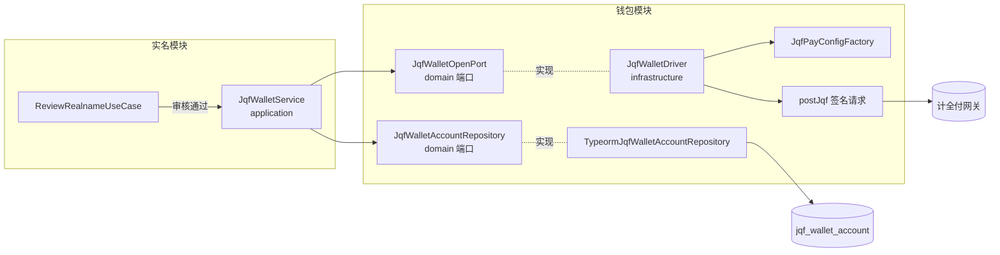
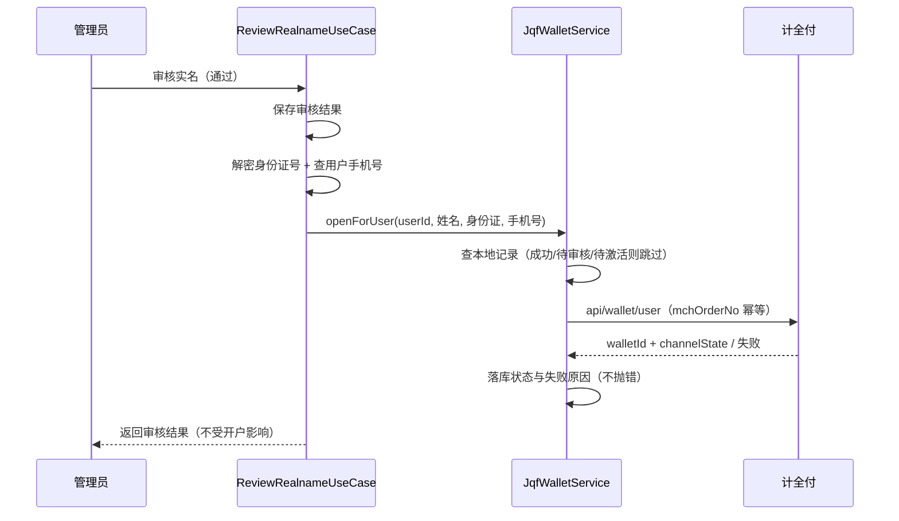

# 计全付钱包自动开户（实名审核通过触发）

## 功能目标与非目标

已实现：

- 用户实名认证审核**通过**时，自动调用计全付「创建钱包用户」接口（`api/wallet/user`，`ifCode=hnawalletpay`，报文版本 2.0）为用户开通渠道钱包；
- 本地表 `jqf_wallet_account` 保存开户记录：渠道 `walletId`、渠道开户状态 `channelState`、最近失败原因 `errMsg`、最近同步时间 `syncedAt`；
- 幂等与防重：每用户每租户至多一条记录，`mchOrderNo`（前缀 `JQFW`）为发往渠道的全局幂等单号，失败重试复用原单号；渠道状态为开户成功/待审核/待激活时不再重复发起；
- 失败不阻断：开户是实名审核的附带动作，配置缺失、渠道异常、用户无手机号等任何失败只记录状态与原因，实名审核结果不受影响。

非目标（本期未实现）：

- 用户注册时开户（注册仅有手机号，缺少身份证要素，无法满足渠道必填项）；
- 绑定银行卡（渠道另有独立绑卡接口 `api/wallet/bankcard/bind`）；
- 钱包余额支付订单、用户钱包充值、提现走计全付钱包；
- 管理端开户记录列表与手动重试入口（当前重试路径为：再次审核通过其他实名记录不适用，失败记录会在下次触发时复用单号重试；如需管理端入口另行排期）。

## 开户条件

1. 商户已在计全付开通钱包能力（`hnawalletpay` 渠道）；
2. 配置中心已配置计全付凭证（管理端「支付配置」页）：`wallet.jqf.apiBase`（HTTPS）、`wallet.jqf.mchNo`、`wallet.jqf.appId`、`wallet.jqf.apiKey`；未配置时静默跳过开户；
3. 用户具备实名要素：身份证号（实名记录密文解密）、真实姓名、绑定手机号；无手机号时记录失败原因，不发起渠道调用。

## 模块结构

- `domain/jqf-wallet-account.entity.ts`：开户记录实体与渠道状态常量；
- `domain/jqf-wallet-open-port.interface.ts`：渠道端口（isConfigured / openWallet / queryWallet）；
- `domain/jqf-wallet-account-repository.interface.ts`：仓储端口；
- `application/jqf-wallet.service.ts`：开户编排（幂等、跳过、失败记录）；
- `infrastructure/drivers/jqf-wallet.driver.ts`：渠道适配器，复用计全付 MD5 签名请求封装（钱包接口使用 2.0 版本报文）；
- `infrastructure/jqf-wallet-account.repository.ts`：TypeORM 仓储（租户隔离）。

## 业务流程

## 数据模型与状态

表 `jqf_wallet_account`（migration `1786200000000-add-jqf-wallet-account`，`down` 为整表删除）：

| 字段 | 说明 |
| --- | --- |
| tenant_id + user_id | 唯一约束，每用户每租户一条 |
| mch_order_no | 全局唯一，渠道幂等单号（前缀 JQFW） |
| wallet_id | 渠道钱包 ID |
| channel_state | 渠道状态：0 未开户 / 1 成功 / 2 待审核 / 3 审核拒绝 / 4 待激活 / 5 失败 / 6 已注销 |
| err_msg | 最近失败原因（截断 255） |
| synced_at | 最近一次渠道交互时间 |

状态 1/2/4 视为「已提交，不再重复开户」；0/3/5/6 允许再次发起（复用原 `mchOrderNo`）。

## 安全边界

- 身份证号仅在开户调用瞬间由实名记录密文解密后存在内存，不写入新表、不写日志；
- 计全付 apiKey 只经配置中心读取，不落日志；
- 本地表经 `TenantScopedEntity` + 仓储 `withTenant` 做租户隔离。

## 异常与失败恢复

| 场景 | 行为 |
| --- | --- |
| 计全付未配置 | 记日志跳过，不落记录 |
| 用户未绑定手机号 | 落记录并记录原因，不调渠道 |
| 渠道返回失败/网络异常 | 落记录 errMsg，审核流程不受影响 |
| 重试 | 下次触发时对非 1/2/4 状态记录复用原幂等单号重发 |

## 测试

- `apps/server/test/wallet/jqf-wallet.spec.ts`：开户成功落库、1/2/4 状态防重、失败重试复用幂等单号、未配置跳过、渠道异常不抛错、无手机号不调渠道（6 项）；
- migration 清单校验与 migration:show/run 测试同步覆盖新迁移；
- 全量 `pnpm lint / typecheck / build / build:server / test` 通过（root 未配置 `format:check`）。

## 风险与后续扩展

- skill 文档的开户示例携带银行卡号/开户行字段，本实现未传（另有独立绑卡接口）；若渠道实际要求必填，开户会返回失败并留痕，需以 doc.jeequan.com 在线文档或渠道联调确认；
- 开户可能返回待审核/待激活，当前未做定时查询渠道状态（`queryWallet` 已就绪，可后续接入任务或管理端手动同步）；
- 尚无管理端开户记录页与手动重试按钮，可按需排期。
