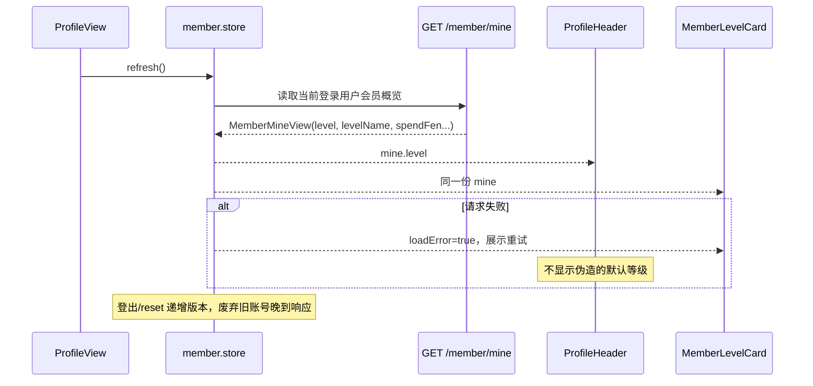

# 用户会员等级（Member）

## 模块职责

用户按累计消费金额自动定级的会员体系：等级档位（名称/累计消费门槛/下单折扣万分比）由管理端在「会员等级」页配置（存配置中心 `member.levels`），支付成功即累计消费额，下单时按当前等级折扣计算应付金额并在订单上固化原价/折扣快照。

实现的功能：

- **档位配置**：管理端增删改档位并保存（`member:level:set`）；配置为空时回退契约默认档位 `MEMBER_LEVEL_DEFAULTS`。
- **自动定级**：等级不落库，读时由「档位 + 累计消费」实时解析（`resolveMemberLevel`），改档位即时生效。
- **下单折扣**：创建订单时按当前等级折扣（万分比）计算应付（`calcDiscountedFen`，向上取整保证平台不亏损），订单固化 `originalAmountFen`/`discountBp` 快照。
- **消费累计与退款冲正**：订单支付事务内经 `MemberSpendTransactionParticipant.record` 原子累加，并在订单记录 `memberSpendRecorded`；全额退款仅对已记录的本单贡献做事务内冲正，不能扣减其他订单消费。
- **C 端概览**：`GET /member/mine` 返回当前等级/折扣/累计消费与晋升下一等级还需金额。

## 结构导图（DDD 四层）

```
modules/member/
├─ domain/
│  ├─ member-profile.entity.ts          会员画像（租户内 user 唯一；累计消费 spendFen）
│  └─ member-repository.interface.ts    会员档案查询与持久化仓储端口
├─ application/
│  ├─ member-level.service.ts           档位读写/校验 + 定级解析 + mine 视图组装
│  └─ use-cases/                        get-my-member / get·set-member-levels
├─ infrastructure/
│  ├─ member.repository.ts              TypeORM 查询与会员档案写入
│  └─ member-spend-transaction.participant.ts
│                                       支付/退款事务内原子累计与冲正窄写口
└─ interfaces/
   ├─ dto/set-member-levels.dto.ts
   └─ controllers/                      一路由一文件（mine / levels.get / levels.set）
```

前端：

- 管理端 `web/views/member/MemberLevelAdminView.vue`（菜单 `member:menu` 会员等级，电竞运营分组）：档位表格编辑（名称/消费门槛（元）/折扣万分比，增删行 + 保存）。
- C 端 `client/stores/member.store.ts` 以 `GET /member/mine` 为个人中心唯一会员数据源；`ProfileHeader.vue` 的头像旁等级徽标和 `MemberLevelCard.vue` 的会员卡共享同一概览，避免徽标与会员卡等级漂移。

### C 端个人中心同步流程



## 权限（RBAC）

| 权限码             | 名称             | 守卫接口                                  |
| ------------------ | ---------------- | ----------------------------------------- |
| `member:menu`      | 会员等级（菜单） | 前端动态路由 `/member/levels`（管理后台） |
| `member:level:set` | 会员-等级配置    | `PUT /member/levels`                      |

> `GET /member/mine`、`GET /member/levels` 仅需登录态。

## 接口

| 方法 | 路径             | 权限               | 说明                                                                                |
| ---- | ---------------- | ------------------ | ----------------------------------------------------------------------------------- |
| GET  | `/member/mine`   | 登录               | `{ level, levelName, discountBp, spendFen, spendYuan, nextLevelName, nextNeedFen }` |
| GET  | `/member/levels` | 登录               | 档位列表                                                                            |
| PUT  | `/member/levels` | `member:level:set` | 保存档位 `{ tiers }`                                                                |

## 设计要点（无硬编码 / 最小化）

- **配置驱动**：档位存配置中心 `CONFIG_KEYS.member.levels`（分组 `ConfigGroup.Member`），前后端共用契约 `MemberLevelTier` 与校验常量 `MEMBER_LEVEL_LIMITS`。
- **金额契约**：金额一律以分（整数）存取；折扣/费率一律万分比（`FEE_RATE_BASE = 10000`），与钱包模块口径一致。
- **最小写口**：下单折扣复用 `MemberLevelService`；订单基础设施只通过导出的 `MemberSpendTransactionParticipant` 参与支付/退款事务，不直接访问会员仓储。
- **逐单幂等依据**：`service_order.member_spend_recorded` 表示该单是否贡献了累计消费。支付成功原子置为 `true`，退款冲正后原子置为 `false`；0 元订单保持 `false`。
- **历史数据修复**：migration `1784736200000` 按未退款的已支付订单重算 `member_profile.spend_fen`，补建缺失档案并回填逐单标记；已有退款记录或退款订单状态时拒绝 `down`，空数据回滚只移除标记列且不反向破坏已修正的累计值。
- **部署边界**：该历史重算不支持旧服务并行写入。必须先停止并排空全部 API/支付回调/worker，再运行 migration，成功后才启动新版本；禁止按“旧进程在线迁移后再滚动重启”的顺序发布。
- **多租户**：实体继承 `TenantScopedEntity`，仓储经 `withTenant` 行级隔离。
- **前端会话隔离**：会员 store 在登出时清空快照并废弃在途响应，不能把旧账号等级带入下一次登录；加载失败保留明确错误和重试入口，不回退为固定 `Lv.1`。

## 测试与非目标

- C 端 store 单测覆盖 3 级权威数据发布、失败后重试和会话重置后丢弃晚到响应；头像徽标与会员卡只消费 store 数据，不各自重复请求。
- PostgreSQL E2E 覆盖历史累计重算、缺失档案补建、逐单标记，以及支付后退款只冲正一次。
- 本次不改变会员定级、折扣计算、档位配置，也不定义打手身份下头像徽标是否切换为打手等级。
