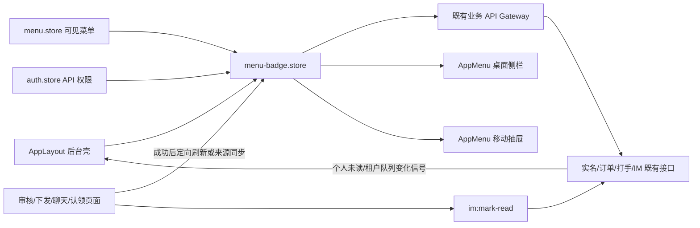
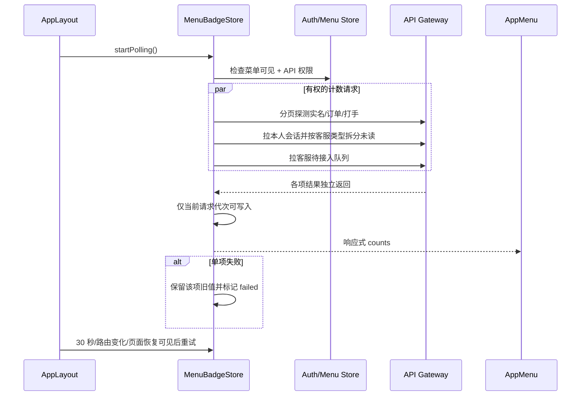
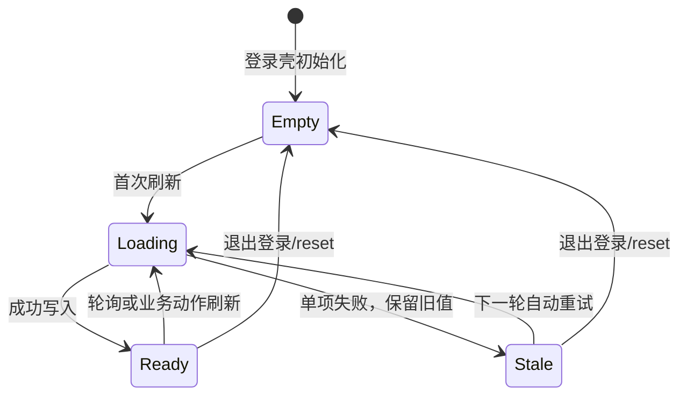

# 管理端菜单待办角标

## 功能目标、已实现能力与非目标

管理端左侧菜单和移动端抽屉菜单为需要处理的业务显示红色数量角标，使客服和管理员无需逐页进入即可发现待办。

已实现能力：

- 实名管理显示当前可见范围内的待审核实名数量。
- 订单管理显示当前可见范围内的待客服处理订单数量；客服角色仍只统计本人负责商品的订单。
- 打手管理显示当前可见范围内待审核入驻申请数量。
- 即时通讯显示当前用户私聊、群聊和访客侧客服会话的未读消息总数，不与坐席客服消息重复计数。
- 客服工作台显示当前可见范围内待接入请求数与当前坐席已认领客服会话未读数之和。
- 活动且页面可见的会话收到新消息后，通过共享 `im:mark-read` 事件提交最后可见 `messageId`；服务端只把 `lastReadAt` 单调推进到该消息时间，既不提前吞掉尚未展示的并发消息，也不会因乱序写入回退。
- 桌面侧栏和移动抽屉共用同一状态，数量超过 99 时由 Element Plus 显示 `99+`。
- 新消息通过个人房间 `im:unread:changed` 实时触发 IM/客服角标刷新，新客服排队通过租户队列房间触发；布局使用只观察不接单的 `im:service:observe`，只有客服工作台使用 `im:service:watch` 登记在线坐席。30 秒轮询、路由切换和页面恢复可见作为断线兜底，退出登录立即清零。

非目标：

- 不新增通知中心、声音提醒、浏览器推送或邮件/短信通知。
- 不新增服务端跨模块聚合 API，不新增表、字段、索引或 migration。
- 不把已认领客服会话改造成可恢复的多会话工作台；该能力需单独设计会话归属和恢复流程。

## 计数口径与复用接口

| 菜单 code          | 计数口径                                  | 复用接口                                                        | 数据权限                                       |
| ------------------ | ----------------------------------------- | --------------------------------------------------------------- | ---------------------------------------------- |
| `realname:menu`    | `status=pending` 的分页 `total`           | `GET /api/realname?page=1&pageSize=1&status=pending`            | `realname:list` + 页面可见范围                 |
| `order:admin:menu` | `status=pending_service` 的分页 `total`   | `GET /api/order/admin?page=1&pageSize=1&status=pending_service` | `order:admin:list` + 租户/客服归属过滤         |
| `booster:menu`     | `status=pending` 的分页 `total`           | `GET /api/booster?page=1&pageSize=1&status=pending`             | `booster:list` + 页面可见范围                  |
| `im:menu`          | 非坐席会话 `unread` 之和                  | `GET /api/im/conversations`                                     | 登录用户只能取得本人参与的会话                 |
| `im:service:menu`  | 待接入队列长度 + 坐席角色客服会话未读之和 | `GET /api/im/service/queue` + `GET /api/im/conversations`       | `im:service:agent` + 队列范围/本人会话成员关系 |

“页面可见范围”沿用现有服务端授权：普通账号受租户过滤，超级管理员为跨租户全局。共享 `ConversationView.viewerRole` 暴露当前查看者在会话中的既有成员角色；只有 `ConversationType.Service + viewerRole=agent` 进入客服角标，访客侧客服会话仍进入即时通讯，避免同一账号兼具访客/坐席身份时误分流。

## 目录结构与职责

```text
apps/web/src/
├── api/
│   ├── http.ts               刷新令牌失败时广播统一会话失效事件
│   ├── http.spec.ts          验证失效事件与令牌清理
│   ├── realname.api.ts       复用实名分页，支持 silent 请求
│   ├── order.api.ts          复用后台订单分页，支持 silent 请求
│   ├── booster.api.ts        复用打手分页，支持 silent 请求
│   └── im.api.ts             复用本人会话和客服队列，支持 silent 请求
├── stores/
│   ├── menu.store.ts         后端下发的可见菜单
│   ├── menu-badge.store.ts   权限裁剪、计数、轮询、失败保留和并发代次
│   └── menu-badge.store.spec.ts
├── layouts/
│   ├── AppLayout.vue         订阅实时变化、启停轮询、路由/可见性刷新、退出清理
│   ├── AppMenu.vue           只按 menu code 渲染数量角标
│   ├── AppMenu.spec.ts       验证 99+ 上限与 0 隐藏
│   └── AppLayout.css         固定角标尺寸和菜单尾部布局
└── views/                    审核、下发、已读、认领后本地同步对应角标

packages/contracts/src/im/message.ts              共享已读与未读变化事件名
apps/server/src/modules/im/
├── interfaces/ws/im.gateway.ts                   成员校验与已读协议转换
├── application/chat-realtime.service.ts          个人/租户级房间和在线索引
├── application/use-cases/mark-read.usecase.ts    校验最后可见消息游标
├── infrastructure/conversation-member.repository.ts 单调推进已读时间
└── application/use-cases/send-message.usecase.ts 向其他成员发未读刷新信号
```



## 刷新流程与状态流转



角标自身没有业务状态机，不写数据库；前端状态如下：



## 异常、并发、安全与清理

- 角标探测请求使用 `silent: true`，后台轮询失败不反复弹窗；store 保留上一次成功值并记录失败项，下一轮自动重试。
- 每个菜单 code 有独立请求代次。后发请求先完成时，较慢的旧响应会被丢弃，不能覆盖新计数；页面本地来源同步和退出 `reset` 也会废弃在途请求。
- 客服角标的“坐席会话未读”和“待接入队列”分别维护结果、失败标记与请求代次；任一来源失败或被页面本地同步废弃时，另一来源仍可独立落入新值。
- 菜单不可见、未登录或缺少对应 API 权限时不请求该业务数据并将角标清零，避免通过数字侧信道泄露无权数据。
- 现有业务接口继续执行租户、客服归属和会话成员过滤；前端菜单权限不能替代服务端授权。
- 客服实时队列房间和在线坐席索引按 `tenantId` 分区；布局的 `im:service:observe` 只加入队列房间，不进入自动分配索引，只有打开客服工作台并发送 `im:service:watch` 的连接才声明可接单。普通坐席只接收同租户队列事件，超级管理员进入独立跨租户观察房间且不参与自动分配。前端收到事件后仍重新拉取受服务端授权的队列，不信任广播载荷直接计算角标。
- 普通消息持久化成功后只向除发送者外的会话成员个人房间发送无正文的 `im:unread:changed` 信号；布局收到后重拉受授权计数，不在广播中携带敏感消息内容。突发信号使用单飞加一轮尾随刷新合并，不按消息条数并发放大全量会话查询；客服排队事件只刷新队列来源。
- 活动且可见的会话收到消息后才发送 `im:mark-read`，载荷包含会话和最后可见消息游标；服务端再次校验成员/消息归属，并以条件更新保证 `lastReadAt` 只前进不后退。页面隐藏期间的新消息继续计为未读，恢复可见后再推进位点。
- HTTP 刷新令牌失败会广播统一的会话失效事件；`AppLayout` 收到后立即断开常驻 Socket、停止轮询、清空鉴权/菜单/角标状态并跳转登录，避免已失效账号继续留在个人或客服房间。其他标签页退出或清除令牌时，同一清理流程由既有 localStorage 令牌键的 `storage` 事件触发。
- `AppLayout` 卸载时停止定时器、移除监听并清空角标；主动退出、令牌失效跳转登录和账号切换均不会残留上一账号数字。

## 测试范围

`apps/web/src/stores/menu-badge.store.spec.ts` 使用 Vitest 覆盖：

- 五类菜单到既有接口的计数映射、访客/坐席客服未读分流及静默请求参数。
- 菜单或 API 权限不足时跳过请求并清零。
- 单项失败保留旧值，其他角标仍可更新。
- 客服未读/队列来源部分失败和交错响应互不覆盖。
- 并发旧响应抑制。
- 实时消息突发采用单飞与至多一轮尾随刷新。
- 页面本地来源同步的数量规范化、退出清零和在途请求失效。
- 轮询立即刷新、30 秒周期、重复启动幂等和停止后不再请求。

`apps/web/src/composables/use-im-socket.spec.ts` 覆盖已读事件在未连接时安全失败、连接后的共享事件名与确认结果、个人未读变化订阅，以及队列观察/在线接单事件分离。服务端 IM 测试覆盖消息只通知其他成员、租户坐席房间、布局观察不进入自动分配索引、在线候选隔离、超级管理员观察房间和成员/越权已读。

`apps/web/src/api/http.spec.ts` 覆盖刷新令牌失败后的令牌清理与会话失效通知；`apps/server/test/im/mark-read-cursor.spec.ts` 覆盖消息归属校验、按消息时间推进、租户条件和数据库单调更新谓词。

`apps/web/src/layouts/AppMenu.spec.ts` 使用 Vue SSR 与真实 Element Plus `ElBadge` 验证 `120 → 99+` 和 0 时 `display:none`。真实浏览器验证桌面侧栏的订单 2、即时通讯 1、其余三项 0 隐藏，并通过元素边界检查确认标题、角标和菜单项不重叠。移动抽屉复用同一 `AppMenu` 和固定布局样式，但本轮浏览器控制面无法切换移动视口，未声称完成移动截图验收。

## 尚未实现与后续路线

- 单实例内的新消息和新客服请求已实时触发刷新，30 秒 REST 轮询负责断线兜底；多实例之间若要保持秒级一致，仍需 Redis Socket.IO adapter。
- 客服角标已统计已认领会话未读，但工作台尚未提供已认领多会话列表和跨页面恢复入口；当前角标可能提示存在未读，坐席仍需通过即时通讯会话列表进入，后续需单独完善工作台会话恢复。
- `GET /api/im/conversations` 会组装完整会话视图；规模增大后应增加按成员、会话类型聚合的轻量未读计数查询，避免轮询触发 N+1。
- 多实例实时事件需引入带租户键的 Redis adapter/presence；当前 30 秒 REST 轮询不依赖实例内存状态。
