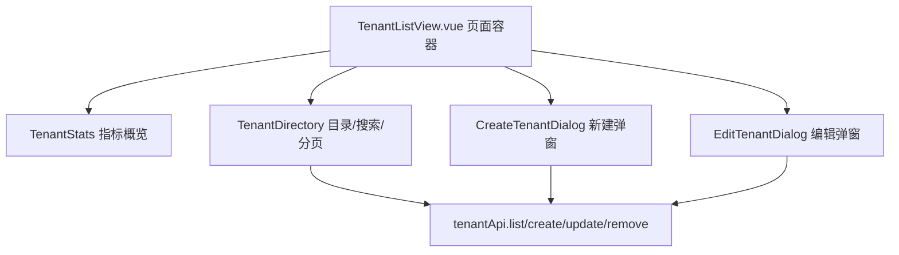

# 多租户数据隔离

## 隔离策略

采用**行级隔离**（共享库 + `tenant_id` 列 + 自动过滤/回填）：单一 Postgres 实例，
租户域数据表统一携带 `tenant_id` 列，查询自动按当前租户过滤、写入自动回填租户号，
业务代码无需逐层手写租户条件，从根上杜绝越权读写。

选择行级隔离而非「库 / Schema per tenant」：最契合现有单库 + `synchronize`，零数据
迁移；历史数据随建列默认值归入内置默认租户。

## 租户域 vs 平台域

| 范畴 | 实体 | 是否带 tenantId |
| --- | --- | --- |
| 租户域 | 用户、角色、会话、会话成员、消息、上传文件、系统日志 | 是 |
| 平台域 | 权限、菜单、配置中心 | 否（全平台共享） |

- **权限/菜单**：系统级 RBAC 元数据，跨租户共用同一份目录。
- **配置中心**：JWT TTL、短信凭证、上传限额等会在「启动期/无请求上下文」被读取，
  必须保持平台级全局，故不分租户。

## 核心机制

- **租户上下文**：`TenantContextService` 基于 `AsyncLocalStorage`，复刻
  `TraceContextService` 范式。`TenantContextMiddleware` 为每个 HTTP 请求建立空上
  下文，`JwtStrategy.validate` 鉴权通过后写入 `tenantId / isSuper`；WebSocket 在
  `ImGateway` 握手后按连接身份建立上下文。
- **自动回填（写）**：`TenantSubscriber` 监听 `beforeInsert`，当实体含 `tenantId`
  且未显式赋值时，回填当前租户号。播种器/跨租户创建场景显式赋值则不被覆盖。
- **自动过滤（读）**：仓储层用 `withTenant()` / `applyTenant()` 注入当前租户条件；
  `TenantContextService.scopeId()` 在「平台超管」或「无租户上下文」时返回 `null`，
  即不加过滤（超管跨租户可见）。
- **JWT 载荷**：`TokenPayload` 增加 `tenantId`，令牌自带租户信息，刷新令牌透传。

## 登录与租户解析

- 登录/注册/短信登录均支持选填 **租户编码**（`tenantCode`）。
- `TenantResolver.resolveOptionalId`（登录读场景）：按编码解析租户，停用/不存在则
  拒绝；留空则不限定租户（用于平台超管或默认租户内唯一账号）。
- `TenantResolver.resolveForWrite`（注册写场景）：留空时落入默认租户。
- 账号唯一性约束改为「租户内唯一」（`@Index(['tenantId','username'], { unique })`，
  角色 code 同理）。

## 默认租户与新租户播种

- **默认租户**：固定主键 `00000000-0000-0000-0000-000000000001`、编码 `default`、
  `builtin=true`，作为各租户表 `tenant_id` 列默认值，承载历史数据与平台超级管理员。
  启动播种器幂等创建。
- **新建租户**（`CreateTenantUseCase`）自动播种：
  - 「租户管理员」角色 `tenant_admin`，授予本租户全部业务权限，但**排除**平台级
    `rbac:tenant:*` 权限，故不能跨租户。
  - 初始管理员账号（默认 `<编码>_admin` + 平台初始密码），绑定上述角色，开箱即用。

## 权限边界

- **平台超管**（角色 `admin`）：`isSuper` 旁路，跨租户可见可管；唯一可访问「租户管理」。
- **租户管理员**（角色 `tenant_admin`）：仅限本租户，无 `rbac:tenant:*` 权限。

## 租户管理 API（仅平台超管）

| 方法 | 路径 | 权限码 | 说明 |
| --- | --- | --- | --- |
| GET | `/rbac/tenants` | `rbac:tenant:list` | 分页查询租户 |
| POST | `/rbac/tenants` | `rbac:tenant:create` | 新建租户（含播种管理员角色/账号） |
| PATCH | `/rbac/tenants/:id` | `rbac:tenant:update` | 更新名称/状态/备注（内置租户不可禁用） |
| DELETE | `/rbac/tenants/:id` | `rbac:tenant:remove` | 删除租户（内置默认租户不可删除） |

## 前端租户管理页

`/rbac/tenants` 只承载平台超管的租户目录管理，不下沉后端业务规则；页面容器负责
调用 `tenantApi`，展示组件只接收数据和抛出事件，便于后续复用到其他 RBAC 管理页。

已实现能力：

- 租户总数、本页启用数、普通租户数概览。
- 租户编码/名称关键字搜索，复用已有 `GET /rbac/tenants?keyword=` 查询能力。
- 租户目录保持表格视图，窄屏通过目录容器横向滚动，按钮权限沿用 `v-permission`。
- 目录表格复用 `AppDataTable`，统一横向滚动、滚动条和 Element Plus 表格基础样式。
- 分页使用 Element Plus `sizes`，支持选择每页 10/20/50/100 条并回到第一页重新查询。
- 创建租户与编辑租户弹窗，内置租户禁用/删除限制由接口兜底，前端只做视觉提示。

