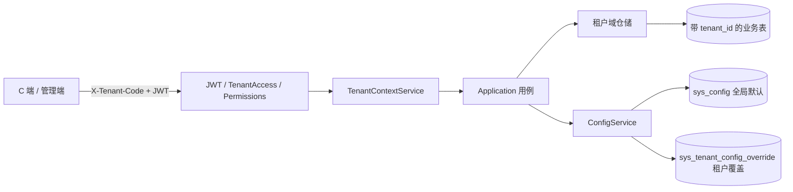
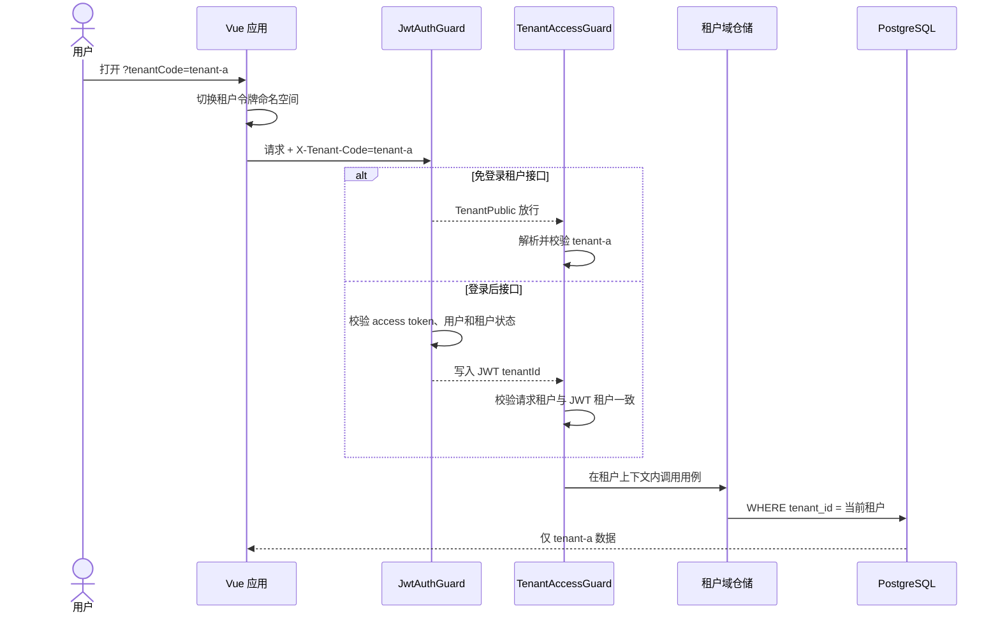
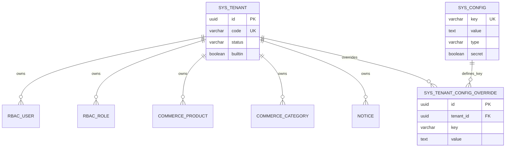
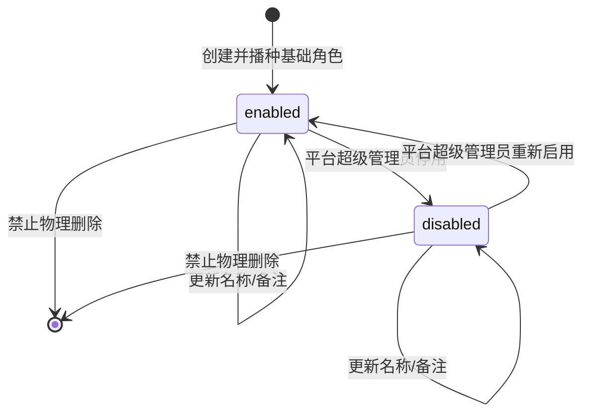

# 多租户数据隔离

## 功能目标与边界

本模块采用共享 PostgreSQL 数据库、业务表 `tenant_id` 行级隔离的方式，使管理端、
C 端、HTTP、刷新令牌与 IM WebSocket 使用同一租户边界。

已实现能力：

- C 端和管理端通过 `?tenantCode=<code>` 选择站点，所有 HTTP 请求携带
  `X-Tenant-Code`。
- 登录、注册、短信验证码、访问令牌和刷新令牌均绑定租户。
- 商品、分类、通知、横幅、评论及其他租户域仓储按当前租户过滤。
- 网站名称、Logo、首页横幅、排行榜开关和用户协议允许每个租户独立覆盖。
- 平台密钥、支付、短信、上传驱动和其他非白名单配置仍是平台全局配置。
- 租户目录与权限目录仅默认租户的平台超级管理员可访问。
- 新租户在同一数据库事务中创建租户与租户管理员、会员、客服、打手四类基础角色；不再同步创建初始管理员账号，账号由平台超管在用户管理中单独创建并选择所属租户。
- 租户不允许物理删除，只能停用，避免遗留业务数据和外部资源。

明确非目标：

- 不实现独立数据库或 Schema per tenant。
- 不实现平台管理员模拟登录、租户自定义域名或租户间数据迁移。
- 不把支付、短信、存储密钥等基础设施配置下放给租户管理员。
- 不对支付/充值回调强制要求租户请求头，回调仍按已有业务标识恢复订单租户。

## 模块与分层

```text
apps/server/src/
├── shared/tenant/                         请求级租户上下文、写入回填和查询作用域工具
├── modules/rbac/
│   ├── domain/                            租户、用户、角色、权限边界与租户开通事务端口
│   ├── application/                       租户解析、令牌校验、实时权限解析和租户创建编排
│   ├── infrastructure/                    租户/用户/角色 TypeORM 仓储、租户开通事务和启动播种
│   └── interfaces/auth/                   JWT、TenantPublic、PlatformOnly 和全局守卫
├── modules/config/
│   ├── domain/                            租户覆盖实体、白名单和仓储端口
│   ├── application/                       全局默认值 + 租户覆盖值读取与管理权限
│   └── infrastructure/                    TypeORM 覆盖仓储
└── database/migrations/                   租户配置覆盖表 migration

apps/client/src/tenant/                    C 端租户入口与当前上下文
apps/web/src/tenant/                       管理端租户入口与当前上下文
```


```mermaid
flowchart LR
  Client["C 端 / 管理端"] -->|"X-Tenant-Code + JWT"| Guards["JWT / TenantAccess / Permissions"]
  Guards --> Context["TenantContextService"]
  Context --> UseCases["Application 用例"]
  UseCases --> Repositories["租户域仓储"]
  Repositories --> Business[("带 tenant_id 的业务表")]
  UseCases --> Config["ConfigService"]
  Config --> Global[("sys_config 全局默认")]
  Config --> Override[("sys_tenant_config_override 租户覆盖")]
```

## 入口与请求流程

前端按以下优先级确定当前租户：

1. URL 查询参数 `tenantCode`；
2. 当前应用自己的 `sessionStorage`；
3. 内置编码 `default`。

C 端和管理端使用不同的会话键，认证令牌也按租户编码分别存储，避免管理端/C 端或
租户 A/租户 B 复用同一令牌。管理端租户目录的“访问站点”会打开
`<VITE_CLIENT_BASE_URL>/?tenantCode=<code>`。
显式配置优先；本地开发未配置时按管理端端口 +1 推断 C 端入口（如 5173 → 5174），同域
`/admin/` 部署未配置时回退到当前域名根路径。空值且无法安全推断、无效 URL 或非 HTTP(S)
协议会关闭跳转并提示配置错误，避免误打开管理端自身。


```mermaid
sequenceDiagram
  actor User as 用户
  participant FE as Vue 应用
  participant JWT as JwtAuthGuard
  participant TG as TenantAccessGuard
  participant Repo as 租户域仓储
  participant DB as PostgreSQL

  User->>FE: 打开 ?tenantCode=tenant-a
  FE->>FE: 切换租户令牌命名空间
  FE->>JWT: 请求 + X-Tenant-Code=tenant-a
  alt 免登录租户接口
    JWT-->>TG: TenantPublic 放行
    TG->>TG: 解析并校验 tenant-a
  else 登录后接口
    JWT->>JWT: 校验 access token、用户和租户状态
    JWT-->>TG: 写入 JWT tenantId
    TG->>TG: 校验请求租户与 JWT 租户一致
  end
  TG->>Repo: 在租户上下文内调用用例
  Repo->>DB: WHERE tenant_id = 当前租户
  DB-->>FE: 仅 tenant-a 数据
```

`@TenantPublic()` 用于免登录但必须建立租户上下文的业务接口：

- 品牌、门户配置和用户协议；
- 公开商品和分类；
- 公开通知、首页横幅和商品评论；
- 登录、注册、短信验证码和刷新令牌。

普通 `@Public()` 只保留给支付/充值回调。未知或停用租户返回未授权；同一请求的
header、query、body 出现不同租户编码时返回参数错误；登录后请求头与 JWT 租户不一致
时返回禁止访问。未指定租户只解析 `default`，不再退化为全库查询。

## 认证与实时通信

- access token 和 refresh token 都携带 `tenantId` 与 token `type`。
- JWT 请求会重新读取用户状态、用户真实租户和租户启用状态，不只信任令牌载荷。
- refresh 必须同时匹配当前站点租户、用户真实租户和令牌租户。
- IM 握手执行与 HTTP JWT 相同的用户、token type、租户一致性和启用状态校验；每条
  WS 消息在该连接的租户上下文中执行。
- 前端切换租户时清理内存档案和常驻连接；旧租户的晚到刷新响应不会写入或清理新租户
  会话。

## 数据模型

租户域实体继承 `TenantScopedEntity`，统一含 `tenant_id`。`TenantSubscriber` 只负责
插入时回填，读取必须由仓储使用 `withTenant()` 或 `applyTenant()` 施加条件；平台超管
可跨租户读取，普通用户和租户管理员只能读取当前租户。


```mermaid
erDiagram
  SYS_TENANT ||--o{ RBAC_USER : owns
  SYS_TENANT ||--o{ RBAC_ROLE : owns
  SYS_TENANT ||--o{ COMMERCE_PRODUCT : owns
  SYS_TENANT ||--o{ COMMERCE_CATEGORY : owns
  SYS_TENANT ||--o{ NOTICE : owns
  SYS_TENANT ||--o{ SYS_TENANT_CONFIG_OVERRIDE : overrides
  SYS_CONFIG ||--o{ SYS_TENANT_CONFIG_OVERRIDE : defines_key

  SYS_TENANT {
    uuid id PK
    varchar code UK
    varchar status
    boolean builtin
  }
  SYS_CONFIG {
    varchar key UK
    text value
    varchar type
    boolean secret
  }
  SYS_TENANT_CONFIG_OVERRIDE {
    uuid id PK
    uuid tenant_id FK
    varchar key
    text value
  }
```

`sys_tenant_config_override` 对 `(tenant_id, key)` 建唯一约束，租户外键删除策略为
`CASCADE`。应用当前仍禁止物理删除租户；该外键只作为数据库完整性兜底。

## 租户配置覆盖

`sys_config` 继续保存平台默认值和配置元数据。仅以下键可写入租户覆盖表：

| 配置键               | 作用                |
| -------------------- | ------------------- |
| `system.appName`     | 网站名称            |
| `system.appLogo`     | 网站 Logo / favicon |
| `portal.homeBanner`  | 首页横幅            |
| `portal.showRank`    | 排行榜入口开关      |
| `auth.userAgreement` | 用户协议            |

读取顺序为“当前租户覆盖值 -> `sys_config` 全局默认值 -> 调用方 fallback”。租户缓存键
为 `config:v2:tenant:<tenantId>:<key>`，只缓存覆盖值或“无覆盖”标记；全局值使用
`config:v2:global:<key>`，因此平台更新默认值后，没有覆盖的租户可立即读取新值。

租户管理员的配置列表只返回上述白名单；写入或删除非白名单配置会被后端拒绝。
支付、短信、存储、令牌和其他非白名单配置保持全局，仅平台超级管理员可维护。
平台超级管理员在配置中心修改五个白名单键时，写入的仍是
`sys_config` 全局默认值；默认租户不创建冗余覆盖，默认租户非超管的任何配置写删均拒绝。
删除白名单全局键时，数据库级联删除覆盖行，Redis `SCAN` 分批清理该键的全部租户缓存；
缓存不可用时数据库操作仍成功，残留缓存由 300 秒 TTL 收敛。

## RBAC 与租户生命周期

平台超级管理员必须同时满足：

- 用户属于固定默认租户；
- 角色属于同一默认租户；
- 角色编码为 `admin`。

仅凭子租户中的 `admin` 字符串不能获得 `isSuper`。租户目录和权限目录使用
`@PlatformOnly()` 二次保护，即使错误授予权限码也不能由子租户调用。

新建租户时创建以下角色：

| 角色编码       | 用途                                     |
| -------------- | ---------------------------------------- |
| `tenant_admin` | 本租户管理，排除平台目录与全局规则写权限 |
| `member`       | C 端普通用户                             |
| `service`      | 客服工作台和被授权的订单操作             |
| `booster`      | 打手领域流程授予                         |

启动播种器会为存量租户幂等补齐缺失角色。租户状态只有 `enabled` 与 `disabled`；默认
租户不可停用，其他租户可由平台超级管理员停用。
`admin`、`tenant_admin`、`member`、`service` 和 `booster` 均为内置角色，通用角色删除接口返回 409；
自定义角色仍可删除。
租户开通通过 `TenantProvisioningTransaction` 端口进入 TypeORM 事务，租户与四类角色任一写入失败都会整体回滚；并发创建相同编码时，数据库唯一约束错误会转换为业务 409。
租户创建不再播种初始管理员账号；平台超管在「用户管理→新建用户」中选择所属租户单独创建，在「角色管理→新建角色」中选择所属租户创建自定义角色；非超管指定其他租户返回 403，绑定跨租户角色返回 403。
角色授权页读取 `/rbac/roles/grantable-permissions`；子租户只能看到可授予的业务权限，写入端再次拒绝平台权限 ID。


```mermaid
stateDiagram-v2
  [*] --> enabled: 创建并播种基础角色
  enabled --> disabled: 平台超级管理员停用
  disabled --> enabled: 平台超级管理员重新启用
  enabled --> enabled: 更新名称/备注
  disabled --> disabled: 更新名称/备注
  enabled --> [*]: 禁止物理删除
  disabled --> [*]: 禁止物理删除
```

## Migration 与回滚

`1784995200000-add-tenant-config-overrides.ts` 的 `up`：

- 创建覆盖表、唯一约束、租户外键和租户索引；
- 为所有存量子租户复制五个白名单键的当前全局值，保证升级瞬间行为不变；
- 默认租户不生成覆盖，继续以 `sys_config` 作为平台站点当前值；
- 新租户没有覆盖时自动回退全局默认值。

`down` 会计算所有租户对每个白名单键的真实有效值（覆盖值或全局回退值）。只要任一键
在租户间已分歧，就拒绝回滚；全部一致时才折叠回 `sys_config` 并删除覆盖表。

生产库如果尚未建立 `typeorm_migrations` 基线，不能直接执行全量 `migration:run`，也不能
直接执行本次建表 SQL。单文件部署先运行
`node main.js migration:audit > migration-audit.json`；有源码环境可再用
`apps/server/src/database/sql/audit-migration-baseline.sql` 交叉检查。回传九条前置 migration 的
结构与聚合数据证据后再生成经核对的 baseline，不得根据列存在自动插入历史。

生产手工升级脚本位于
`apps/server/src/database/sql/1784995200000-add-tenant-config-overrides.sql`，仅在 history 表存在、九条前置时间戳/类名成对且本次未登记时执行。TypeORM 与手工 SQL 取得同一事务
advisory lock；脚本对齐 `sys_config` owner 和 CRUD 授权，验证成功后在同一事务登记本次 history。

## 异常、安全与并发边界

- Redis 不可用时配置缓存降级为数据库读取，不跳过租户过滤；权限解析不做跨请求缓存，确保停用用户、撤权和租户停用立即生效。
- 用户、角色与令牌租户不一致时拒绝，而不是尝试自动修复或跨租户查找。
- 租户停用后，HTTP、refresh、新建 IM 连接以及既有 IM 连接的下一条入站事件都会重新校验并拒绝。
- IM 被动广播仍依赖当前实例内存房间；多实例下需要后续接入带租户键的 Redis adapter/presence。
- 租户物理删除被禁用；业务表、上传文件、缓存、索引和审计记录的完整级联清理未实现。
- 生产库没有 `typeorm_migrations` 基线时，本次 SQL fail-closed；必须先做只读基线核验，不能盲目补历史记录。

## 测试范围

自动化覆盖：

- 默认、未知、停用和冲突租户解析；
- JWT/header 冲突、refresh 跨租户、伪 `admin`、跨租户角色绑定；
- 平台目录 `PlatformOnly`；
- IM access/refresh token 类型、用户/租户状态和真实租户一致性；
- 前端 URL 解析、租户请求头、令牌命名空间、profile 校验和刷新竞态；
- 配置白名单、两租户不同值、全局回退、缓存失效和租户管理员越权；
- 配置 migration `up/down`、唯一约束、外键级联与有损回滚拒绝；
- 真实 PostgreSQL + HTTP 的公开商品/分类双租户隔离。

交付前执行根目录 `pnpm lint`、`pnpm typecheck`、`pnpm test`、`pnpm build`、
`pnpm build:server`、适用的 PostgreSQL E2E、应用启动和 `git diff --check`。仓库未配置
`format:check` 时必须如实报告，不能声称已通过。
