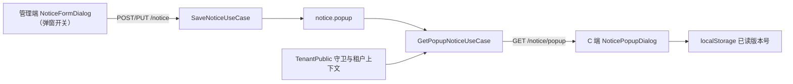
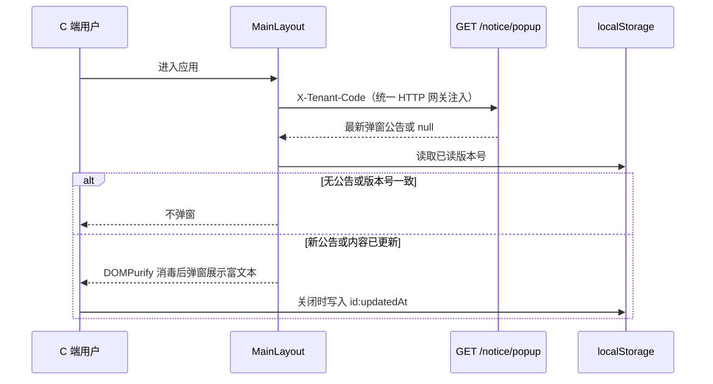
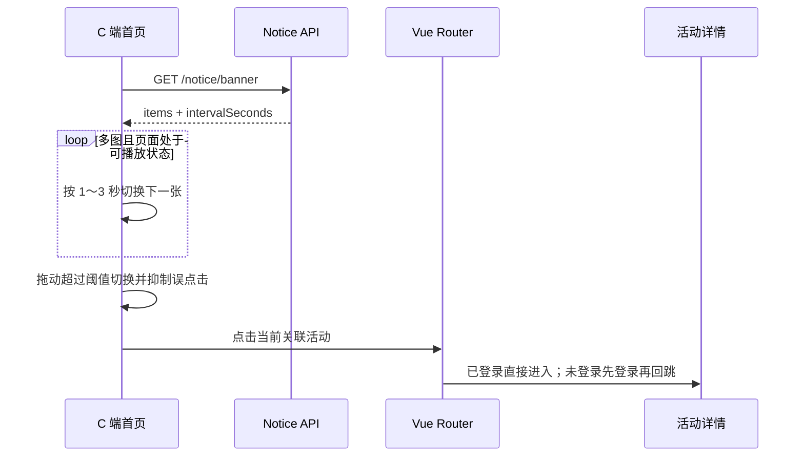

# 运营通知与首页横幅（notice）

## 功能目标

- 管理端维护最多 10 张首页横幅、显示顺序、关联活动和 1 ～ 3 秒轮播间隔；空列表表示撤下横幅。
- C 端按固定横幅区域自动轮播，支持指示点、鼠标/触摸拖动；悬停、键盘聚焦、页面隐藏或系统减少动态效果时暂停。
- 关联活动的横幅可点击进入 `/activities/:id`；未登录用户由既有路由守卫登录后回跳。
- 通知公告继续支持标题、富文本详情、启停和排序，公开端只读取启用记录。
- 通知可标记为【弹窗公告】：C 端首次进入时弹窗展示本租户最新一条，关闭后本机不再重复弹出；弹窗支持点击「查看详情」进入公告详情页（`/notices/:id`，复用公开详情接口），进入前同样记已读关闭弹窗。
- 弹窗面板复用 Canvas UI `Flame Wrap` 火焰边框特效；WebGL2 不可用时保留普通弹窗，HTML-in-canvas 不可用时使用真实 DOM + SVG 边缘热浪 + 透明火焰层，系统要求减少动态时只保留静态形变。
- 商品卡片的富文本摘要固定保留两行高度，描述为空或有内容时价格、销量的纵向位置一致。

非目标：不做弹窗阅读回传/服务端已读记录（已读只存本机），不做定时上下线和多条弹窗队列。

本次新增业务字段 `notice.popup`（布尔，默认 false，带索引），由 migration `AddNoticePopup1785500000000` 建列与回滚。横幅使用可按租户覆盖的配置键 `portal.homeBanner`，值由历史单图字符串兼容升级为 JSON。

## 模块结构




```text
packages/contracts/src/notice/notice.ts       # PortalBannerItem/View、限制与通知契约
apps/server/src/modules/notice/
├── domain/notice.entity.ts                   # 租户内通知聚合根
├── infrastructure/notice.repository.ts       # 通知仓储与租户过滤
├── application/portal-banner.config.ts       # 历史值解析、脏值归一化
├── application/use-cases/                    # 横幅读写、通知 CRUD/公开读取
└── interfaces/                               # DTO 与一路由一控制器
apps/web/src/components/notice/BannerPanel.vue # 上传、排序、活动关联、间隔设置
apps/client/src/components/home/HomeBanner.vue # 轮播、拖动、暂停、失败图剔除、跳转
apps/client/src/components/notice/NoticePopupDialog.vue # 首次进入弹窗、消毒渲染、本机已读
apps/client/src/components/canvasui/FlameWrap.vue # 公告局部火焰边框，含 WebGL2 与普通 DOM 降级
apps/client/src/components/canvasui/flame-wrap-options.ts # Flame Wrap 参数和 undefined 安全默认值
apps/client/src/components/canvasui/flame-wrap.ts # Canvas UI WebGL 生命周期、尺寸和可见性管理
apps/client/src/components/home/product-card.utils.ts # 商品卡片富文本摘要
apps/client/src/tenant/tenant-context.ts       # C 端统一租户入口（?tenantCode= → sessionStorage）
```

## 弹窗公告

### 选取规则

- 只取【启用中 + 弹窗】的通知，按 `sort` 升序、`createdAt` 倒序取第一条；同时开启多条时只弹最靠前的一条。
- 无符合条件的公告时接口返回 `null`，C 端不弹窗、不报错。

### 租户隔离

弹窗接口免登录，但通过既有 `@TenantPublic()` 守卫建立租户上下文，仓储继续复用
`withTenant` 自动过滤：

- C 端统一从 `?tenantCode=<编码>` 或 `sessionStorage` 解析租户，缺省为 `default`；请求由
  HTTP 网关携带 `X-Tenant-Code`。
- 服务端守卫经 `TenantResolver.resolveOptionalId` 校验并写入请求上下文；编码不存在或租户
  已停用直接拒绝，弹窗用例不重复实现租户解析。

### 本机只弹一次

C 端关闭弹窗后把【公告 id + 更新时间】写入 `client.notice.popup.seen.<租户编码>`：

- 同一条公告不重复弹；后台修改内容（`updatedAt` 变化）或换新公告则重新弹出。
- 已读按租户分键，同域多租户入口不串号。



## 配置模型

```jsonc
{
  "items": [
    { "image": "/static/banner-a.webp", "activityId": "" },
    { "image": "/static/banner-b.webp", "activityId": "活动 UUID" }
  ],
  "intervalSeconds": 3
}
```

- `items` 最多 10 项；图片只接受 HTTP(S) 或站内绝对路径，`activityId` 为空串或 UUID v4。
- `intervalSeconds` 只接受整数 1、2、3，缺失或历史值回退 3 秒。
- 启动时配置迁移只把元数据类型从 `image` 纠正为 `json`，不覆盖已保存值；读取用例把历史纯图片 URL 转为单个无跳转条目。
- `sys_config.value` 已是字符串列，横幅配置本身没有表结构变化；弹窗字段仍需执行上述 migration。

## REST 接口

| 方法            | 路径                             | 权限                            | 说明                                                               |
| --------------- | -------------------------------- | ------------------------------- | ------------------------------------------------------------------ |
| GET             | `/api/notice/banner`             | 公开                            | 返回 `{ items, intervalSeconds }`；无有效图片时 `items` 为空       |
| PUT             | `/api/notice/banner`             | `notice:banner`                 | 保存完整横幅配置；`items: []` 撤下全部横幅                         |
| GET             | `/api/notice/public`             | 公开                            | 启用通知列表（sort 升序、创建时间倒序）                            |
| GET             | `/api/notice/popup`              | 公开租户接口                    | 当前租户最新一条弹窗公告，无则 `null`；租户由 `X-Tenant-Code` 指定 |
| GET             | `/api/notice/public/:id`         | 公开                            | 单条启用通知详情                                                   |
| GET             | `/api/notice`                    | `notice:list`                   | 管理端通知分页列表                                                 |
| POST/PUT/DELETE | `/api/notice`、`/api/notice/:id` | `notice:save` / `notice:remove` | 通知新增、编辑、删除                                               |

管理端读取活动下拉还需要 `activity:list`。没有该权限或活动列表加载失败时仍可维护无跳转横幅，但界面会明确提示活动关联不可用。

## 交互流程



## 安全、异常与边界

- 公开横幅接口只下发配置，不直接公开受租户保护的活动列表或详情接口，避免无租户上下文时泄露跨租户数据。
- 横幅配置和活动均按当前租户读取；租户覆盖缺失时回退 `sys_config` 平台默认值。绑定活动仍由活动接口执行同租户校验，不能通过横幅读取其他租户活动内容。
- C 端复用 `resolveMediaUrl` 兼容站内和历史本机地址；单图加载失败会从轮播剔除，全部失败则隐藏横幅且不影响首页商品。
- 移动端横幅按 21:9 收敛，桌面保持最高 160px 的短横幅；切换不改变容器尺寸。滑动超过阈值后短暂抑制点击，避免滚动或拖动误进活动。
- 通知富文本仍经 DOMPurify 净化，横幅接口不返回活动正文或其他租户数据。
- 弹窗接口只下发展示字段（id/标题/正文/时间），复用公开租户守卫与仓储行级过滤，不会因免登录而泄露其他租户公告；
  接口失败时 C 端静默降级（不弹窗、不弹错误提示），不影响首页主流程。
- 已读状态只存本机，换浏览器/清缓存会重新弹出；如需按账号只弹一次，需另做服务端已读记录，不在本次范围。
- Flame Wrap 只作用于公告弹窗局部，不读取或修改公告正文；WebGL2 不可用时不挂载特效，HTML-in-canvas 不可用时由真实 DOM 承载内容、SVG 位移滤镜让边缘内容随热浪变化、透明 canvas 绘制火焰，特效不会成为公告功能的硬依赖。

## 验证范围

- 弹窗公告用例单测（`apps/server/test/notice/get-popup-notice.spec.ts`）覆盖结果映射与无公告返回
  `null`；租户编码解析、未知/停用拒绝和仓储过滤复用既有租户守卫与隔离测试。
- 配置解析测试覆盖空值、历史 URL、合法 JSON、非法图片/活动 ID、数量及间隔收敛。
- C 端 `Flame Wrap` 参数测试覆盖 `undefined` 不覆盖颜色/数值默认值和显式零值；商品摘要测试覆盖富文本标签、空白和空描述。
- 商品卡片视觉回归覆盖有描述/无描述时价格与销量基线一致；公告弹窗视觉回归覆盖火焰 canvas、普通面板降级、关闭和查看详情。
- 页面回归覆盖单图不轮播、多图自动轮播、暂停/恢复、指示点、横向拖动、纵向滚动不误触、活动登录回跳、失败图降级和桌面/移动尺寸。
- 最终 lint、typecheck、test 和构建结果以本次交付汇报为准。
