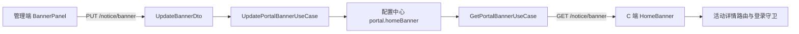
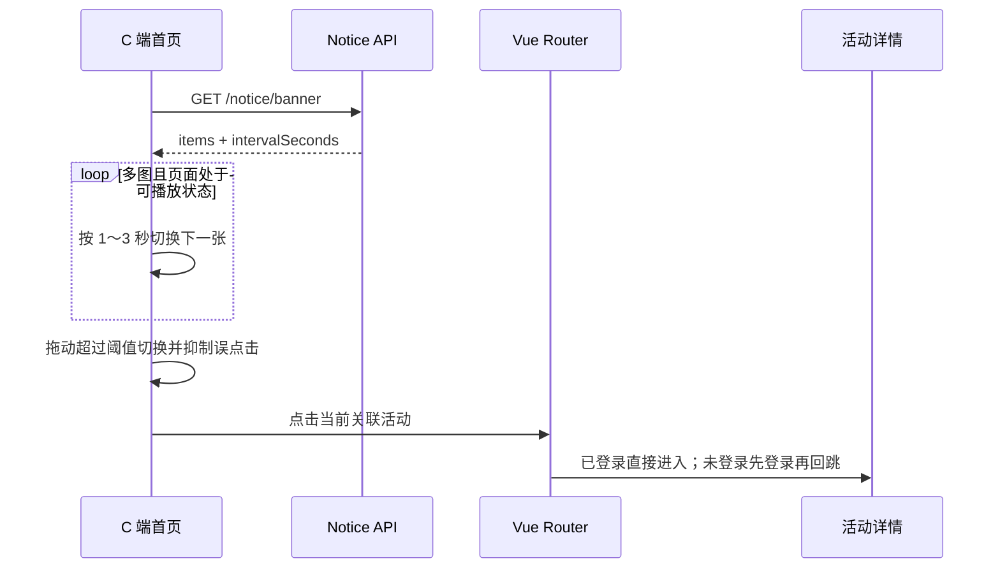

# 运营通知与首页横幅（notice）

## 功能目标

- 管理端维护最多 10 张首页横幅、显示顺序、关联活动和 1～3 秒轮播间隔；空列表表示撤下横幅。
- C 端按固定横幅区域自动轮播，支持指示点、鼠标/触摸拖动；悬停、键盘聚焦、页面隐藏或系统减少动态效果时暂停。
- 关联活动的横幅可点击进入 `/activities/:id`；未登录用户由既有路由守卫登录后回跳。
- 通知公告继续支持标题、富文本详情、启停和排序，公开端只读取启用记录。

本次不新增业务表。横幅仍使用全局配置键 `portal.homeBanner`，值由历史单图字符串兼容升级为 JSON。

## 模块结构



```text
packages/contracts/src/notice/notice.ts       # PortalBannerItem/View、限制与通知契约
apps/server/src/modules/notice/
├── domain/notice.entity.ts                   # 租户内通知聚合根
├── infrastructure/notice.repository.ts       # 通知仓储与租户过滤
├── application/portal-banner.config.ts       # 历史值解析、脏值归一化
├── application/use-cases/                    # 横幅读写、通知 CRUD/公开读取
└── interfaces/                               # DTO 与一路由一控制器
apps/web/src/components/notice/BannerPanel.vue # 上传、排序、活动关联、间隔设置
apps/client/src/components/home/HomeBanner.vue # 轮播、拖动、暂停、失败图剔除、跳转
```

## 配置模型

```jsonc
{
  "items": [
    { "image": "/static/banner-a.webp", "activityId": "" },
    { "image": "/static/banner-b.webp", "activityId": "活动 UUID" }
  ],
  "intervalSeconds": 3
}
```

- `items` 最多 10 项；图片只接受 HTTP(S) 或站内绝对路径，`activityId` 为空串或 UUID v4。
- `intervalSeconds` 只接受整数 1、2、3，缺失或历史值回退 3 秒。
- 启动时配置迁移只把元数据类型从 `image` 纠正为 `json`，不覆盖已保存值；读取用例把历史纯图片 URL 转为单个无跳转条目。
- `sys_config.value` 已是字符串列，本次没有表结构变化，不需要数据库 migration。

## REST 接口

| 方法 | 路径 | 权限 | 说明 |
| --- | --- | --- | --- |
| GET | `/api/notice/banner` | 公开 | 返回 `{ items, intervalSeconds }`；无有效图片时 `items` 为空 |
| PUT | `/api/notice/banner` | `notice:banner` | 保存完整横幅配置；`items: []` 撤下全部横幅 |
| GET | `/api/notice/public` | 公开 | 启用通知列表（sort 升序、创建时间倒序） |
| GET | `/api/notice/public/:id` | 公开 | 单条启用通知详情 |
| GET | `/api/notice` | `notice:list` | 管理端通知分页列表 |
| POST/PUT/DELETE | `/api/notice`、`/api/notice/:id` | `notice:save` / `notice:remove` | 通知新增、编辑、删除 |

管理端读取活动下拉还需要 `activity:list`。没有该权限或活动列表加载失败时仍可维护无跳转横幅，但界面会明确提示活动关联不可用。

## 交互流程



## 安全、异常与边界

- 公开横幅接口只下发配置，不直接公开受租户保护的活动列表或详情接口，避免无租户上下文时泄露跨租户数据。
- 横幅配置是平台全局数据，活动是租户数据。多租户环境中，其他租户可能无法访问绑定活动；若业务要求租户独立横幅，需要改为租户实体并另做 migration，不在本次范围内。
- C 端复用 `resolveMediaUrl` 兼容站内和历史本机地址；单图加载失败会从轮播剔除，全部失败则隐藏横幅且不影响首页商品。
- 移动端横幅按 21:9 收敛，桌面保持最高 160px 的短横幅；切换不改变容器尺寸。滑动超过阈值后短暂抑制点击，避免滚动或拖动误进活动。
- 通知富文本仍经 DOMPurify 净化，横幅接口不返回活动正文或其他租户数据。

## 验证范围

- 配置解析测试覆盖空值、历史 URL、合法 JSON、非法图片/活动 ID、数量及间隔收敛。
- 页面回归覆盖单图不轮播、多图自动轮播、暂停/恢复、指示点、横向拖动、纵向滚动不误触、活动登录回跳、失败图降级和桌面/移动尺寸。
- 最终 lint、typecheck、test 和构建结果以本次交付汇报为准。
