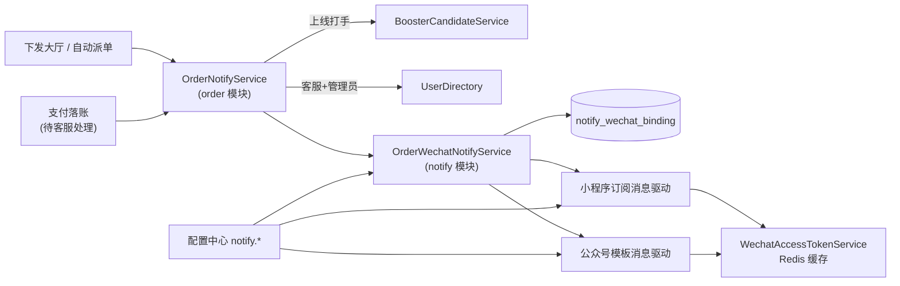
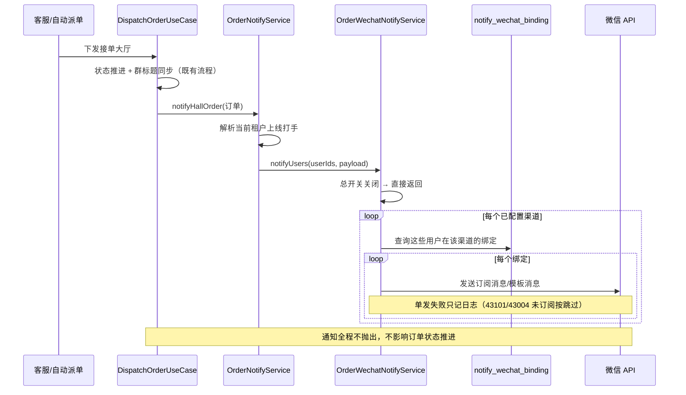
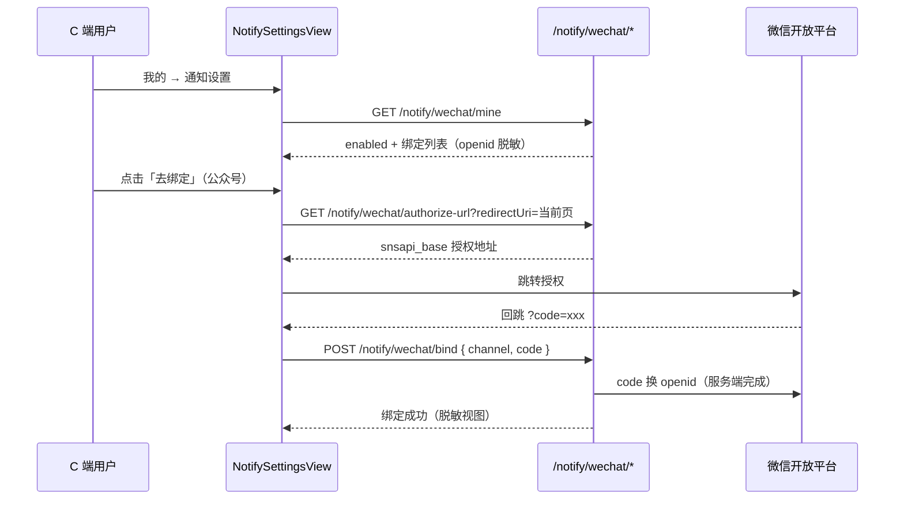
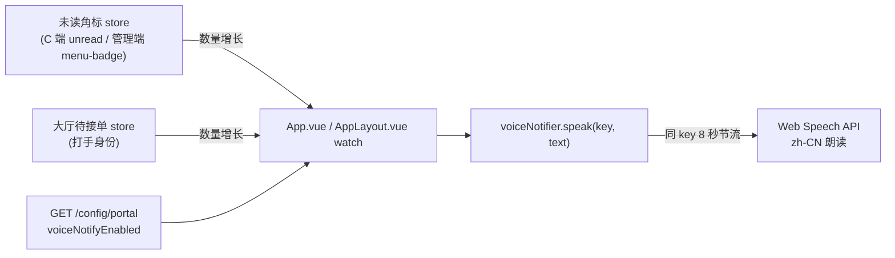
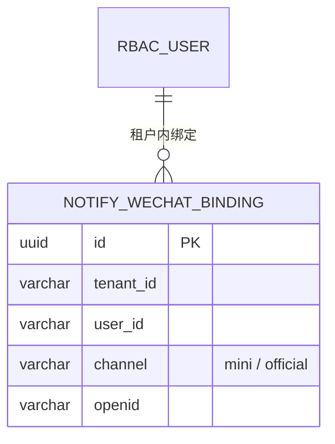

# 通知（notify）：微信推送与语音播报

## 功能目标

- **订单微信通知**：订单进入接单大厅时通知已上线打手；订单支付成功进入「待客服处理」时通知商品关联客服与平台管理员。支持两条渠道：
  - 微信小程序订阅消息（打手/工作人员在小程序内订阅后接收）；
  - 微信公众号（订阅号/服务号）模板消息（关注公众号并绑定后接收）。
- **语音播报**：
  - C 端打手身份：接单大厅待接单数增长时播报「接单大厅有新的订单」；登录用户消息未读总数增长时播报「您有新的消息」。
  - 管理端：订单待办角标增长时播报「您有新的订单」；IM/客服工作台未读合计增长时播报「您有新的消息」。
- **用户微信绑定**：C 端「我的 → 通知设置」管理绑定；公众号走网页授权（snsapi_base）回跳换 code，小程序绑定在小程序内完成（复用同一绑定接口）。
- **多租户**：绑定记录按 `tenant_id` 行级隔离；通知收件人（上线打手、管理员、客服）全部在订单所属租户上下文内解析。

非目标：本次不实现 APP 原生推送、短信通知、通知历史记录/重发、订阅次数管理和小程序端页面本身；微信凭证为平台全局配置，不按租户拆分（多租户共用同一套小程序/公众号）。

## 配置项（配置中心「通知」分组，全部由管理员自行配置）

| key | 类型 | 默认 | 说明 |
| --- | --- | --- | --- |
| `notify.voice.enabled` | boolean | `true` | 浏览器语音播报总开关（C 端与管理端共用，经公开接口 `GET /config/portal` 下发） |
| `notify.wechat.enabled` | boolean | `false` | 微信通知总开关；关闭时不发送、C 端隐藏绑定入口 |
| `notify.wechat.mini.appId` / `appSecret`（密钥） | string | 空 | 小程序凭证 |
| `notify.wechat.mini.orderTemplateId` | string | 空 | 小程序「新订单」订阅消息模板 ID |
| `notify.wechat.mini.orderPage` | string | 空 | 订阅消息点击跳转页面路径（留空不跳转） |
| `notify.wechat.mini.orderFields` | json | `{}` | 模板字段映射：`{"character_string1":"orderNo",...}` |
| `notify.wechat.official.appId` / `appSecret`（密钥） | string | 空 | 公众号凭证 |
| `notify.wechat.official.orderTemplateId` | string | 空 | 公众号「新订单」模板消息模板 ID |
| `notify.wechat.official.orderUrl` | string | 空 | 模板消息点击跳转链接（留空不跳转） |
| `notify.wechat.official.orderFields` | json | `{}` | 模板字段映射：`{"keyword1":"orderNo",...}` |

字段映射的值只接受订单通知逻辑字段：`title` / `orderNo` / `product` / `amount` / `time` / `remark`（`ORDER_NOTIFY_PAYLOAD_KEYS`，脏配置在解析时安静丢弃）。凭证与模板未配置齐全的渠道在发送时直接跳过。

## 模块结构（DDD 四层）

```text
packages/contracts/src/notify/notify.ts          # 渠道枚举、绑定视图、逻辑字段、语音文案与节流常量
apps/server/src/modules/notify/
├── domain/
│   ├── wechat-binding.entity.ts                 # 绑定聚合（租户+用户+渠道唯一）
│   ├── wechat-binding-repository.interface.ts   # 仓储端口
│   └── wechat-notify-port.interface.ts          # 发送端口 + 公众号授权端口
├── application/
│   ├── order-field-mapping.ts                   # 字段映射解析与模板 data 装配
│   ├── order-wechat-notify.service.ts           # 群发编排（开关/渠道/绑定解析，失败只记日志）
│   └── use-cases/                               # 绑定概览 / 绑定 / 解绑 / 公众号授权地址
├── infrastructure/
│   ├── wechat-binding.repository.ts             # TypeORM 仓储（withTenant 过滤）
│   ├── wechat-access-token.service.ts           # access_token 获取 + Redis 缓存（提前 5 分钟过期）
│   └── drivers/
│       ├── wechat-mini-notify.driver.ts         # 订阅消息 + jscode2session 换 openid
│       └── wechat-official-notify.driver.ts     # 模板消息 + 网页授权换 openid
└── interfaces/                                  # DTO 与一路由一控制器（共 4 路由）

apps/server/src/modules/order/application/order-notify.service.ts
                                                 # 订单侧编排：解析收件人 + 装配通知内容
apps/client/src/utils/voice-notifier.ts          # C 端语音播报器（Web Speech API + 节流）
apps/client/src/views/profile/NotifySettingsView.vue # 通知设置页（绑定管理）
apps/client/src/components/profile/NotifyEntryCard.vue # 打手身份「我的」页入口卡
apps/client/src/api/notify.api.ts                # 绑定接口封装
apps/web/src/utils/voice-notifier.ts             # 管理端语音播报器（同实现）
apps/web/src/layouts/AppLayout.vue               # 管理端角标增长播报接线
```



## 业务流程





### 语音播报



- 播报复用既有角标数据源（实时信号 + 30 秒轮询），不新增请求；数量下降或首次加载不播报。
- 同一事件 key 8 秒内只播报一次（`NOTIFY_VOICE_MIN_INTERVAL_MS`）；文案集中在 `NOTIFY_VOICE_TEXTS`。
- 浏览器不支持 Speech API、被自动播放策略拦截或配置关闭时静默降级，不影响页面。

## 数据模型与 Migration



`1785900000000-add-notify-wechat-binding.ts` 建表并加 `(tenant_id, user_id, channel)` 唯一约束与租户/用户索引，`down` 直接删表（回滚丢失全部绑定，用户需重新绑定）。migration 已登记到 `migration-registry.ts` 与基线审计清单。

## REST 接口

所有路径带全局 `/api` 前缀，均要求登录（无需额外权限码）。

| 方法 | 路径 | 说明 |
| --- | --- | --- |
| GET | `/notify/wechat/mine` | 本人绑定概览：`{ enabled, bindings[] }`，openid 只回显末四位 |
| POST | `/notify/wechat/bind` | `{ channel, code }`；服务端凭 code 向微信换 openid，重复绑定覆盖更新 |
| POST | `/notify/wechat/unbind` | `{ channel }`；幂等解绑 |
| GET | `/notify/wechat/authorize-url` | `?redirectUri=`；生成公众号 snsapi_base 授权地址（回跳地址仅接受 HTTP(S)） |

## 安全、异常与边界

- 客户端不能直接提交 openid，只能提交微信授权 code，由服务端换取；绑定查询/写入/删除全部经 `withTenant` 行级过滤，openid 不明文回显、不写入日志。
- 通知编排任何一步失败（配置读取、绑定查询、微信 API）只记录日志，绝不回滚或阻断订单支付、下发、指派主流程；43101（小程序未订阅）与 43004（未关注公众号）按正常业务态跳过。
- 单次订单事件的收件人截断到 `NOTIFY_LIMITS.wechatRecipientsMax`（200），大租户不会因群发拖垮请求；小程序订阅消息本身是一次性订阅，用户未续订时微信侧自然限流。
- access_token 缓存在 Redis（`notify:wechat:token:<appId>`，提前 5 分钟过期）；Redis 不可用时直接回源微信。
- AppSecret 标记为敏感配置，配置中心列表脱敏为 `******`。
- 公众号授权 redirectUri 由服务端校验协议后再拼接授权地址，不开放任意协议跳转。
- 微信通知总开关默认关闭：未配置凭证的环境零外呼；`GET /notify/wechat/mine` 下发 `enabled` 供 C 端隐藏绑定入口。

## 已知限制与后续扩展

- 微信凭证是平台全局配置，多租户共用同一小程序/公众号；如需按租户独立公众号，需把 `notify.wechat.*` 纳入租户覆盖白名单并按租户缓存 access_token。
- 小程序订阅消息是一次性订阅，每次通知消耗一次订阅额度；小程序端需在合适时机引导用户重复订阅（小程序端不在本仓库范围）。
- 未实现通知历史、失败重试队列和送达统计；发送失败只有服务端日志。
- 语音播报依赖浏览器 Web Speech API 与页面交互后的自动播放许可，首次进入未交互时部分浏览器会跳过播报，由下次事件重试。

## 测试与验证

- `apps/server/test/notify/order-field-mapping.spec.ts`：字段映射解析（合法字段、脏值丢弃、非对象配置）与模板 data 装配。
- `apps/server/test/notify/order-wechat-notify.spec.ts`：总开关关闭、双渠道群发、未配置渠道跳过（不查绑定）、单个收件人失败不影响其他人、空收件人早退。
- `apps/server/test/config/portal-config.spec.ts`：门户配置新增 `voiceNotifyEnabled` 的默认值与下发。
- `apps/client/src/utils/voice-notifier.spec.ts`、`apps/web/src/utils/voice-notifier.spec.ts`：播报、同 key 节流、不同 key 互不影响、无 Speech API 降级。
- 既有订单测试（余额支付、群恢复、群标题）已按新依赖注入通知桩并通过。
- 真实微信推送需在配置中心补全凭证并用真实小程序/公众号验证，本地无法自动化，交付时如实报告未覆盖。
