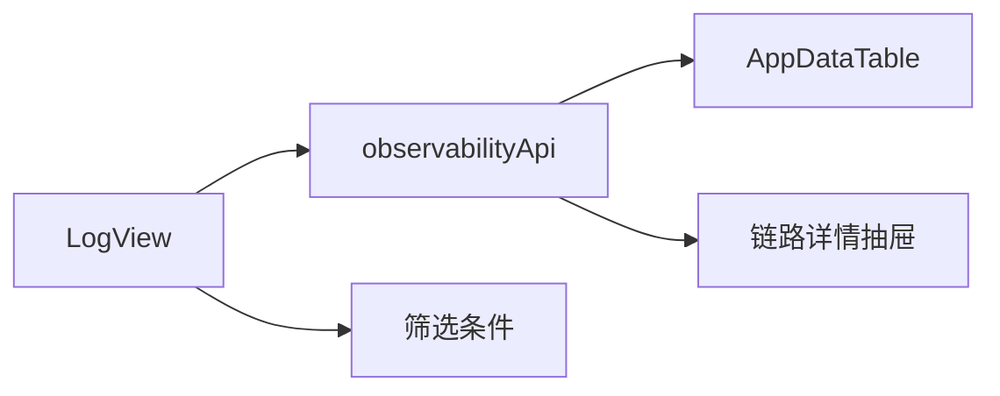
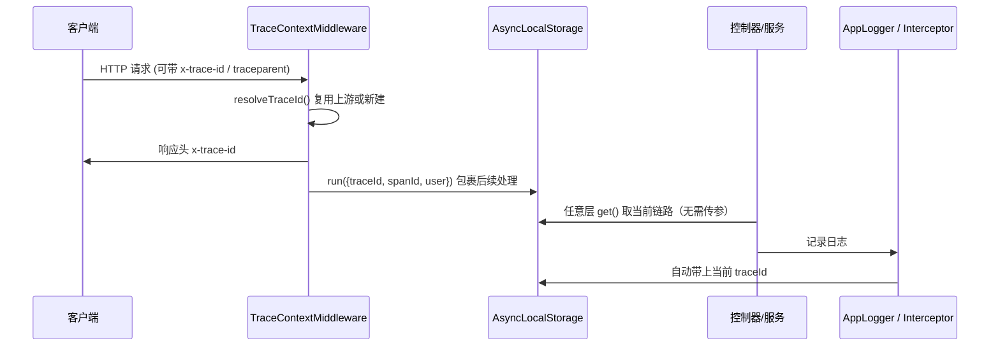
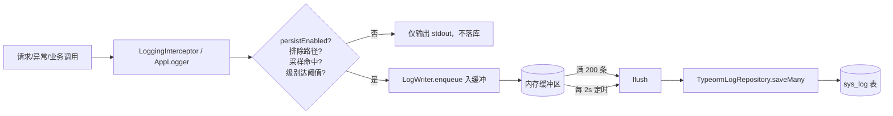
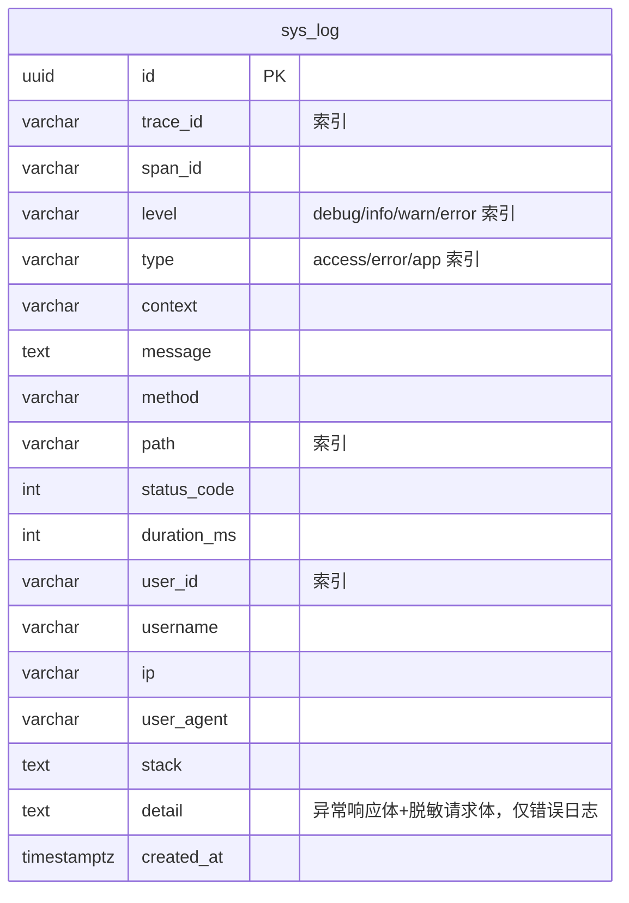

# 链路追踪与日志管理（Observability）

## 模块职责

可观测性基础能力，模块 `modules/observability`。在**不侵入业务代码**的前提下，为每个 HTTP 请求与 WS 消息生成统一的 **traceId / spanId** 链路标识，并把**访问日志 / 错误日志 / 应用日志**结构化后**异步落库**，再通过 RBAC 保护的查询接口按多条件检索、按 `traceId` 还原全链路、按保留天数清理。

实现的功能：

- **链路追踪**：基于 `AsyncLocalStorage`，每个请求生成 `traceId`/`spanId`，兼容透传上游 `x-trace-id` / W3C `traceparent`，响应头回写 `x-trace-id`；WS 消息处理同样在独立链路上下文中执行。
- **结构化日志**：`AppLogger` 输出 JSON（time/level/traceId/context/message/stack），统一替换裸 `console`。
- **访问/错误日志自动采集**：全局 `LoggingInterceptor` 记录 method/path/status/耗时/userId/ip/ua/traceId，异常时附错误栈，**带缓冲异步落库**，不阻塞响应。
- **错误详情 `detail`**：错误日志额外落库异常响应体（含 `ValidationPipe` 的 `message` 字段数组，直指哪个入参不合法）与脱敏请求体（`password`/`token`/`secret`/`authorization` 等字段替换为 `***`），便于在链路详情里直接定位校验失败原因；超 4000 字符截断。
- **日志查询**（REST `GET /api/observability/logs`）：分页 + 多条件（level/type/traceId/path/userId/时间段）。
- **链路详情**（REST `GET /api/observability/logs/trace/:traceId`）：同一 traceId 下按时间排序的全部 span。
- **日志清理**（REST `DELETE /api/observability/logs`）：按保留天数删除过期日志，缺省取配置中心 `log.retentionDays`。
- **前端日志台**：`LogView` 提供日志总览、筛选、分页目录、链路详情抽屉和清理入口；表格复用 `AppDataTable`，窄屏保留横向滚动能力。
- **全程配置驱动**：是否落库、最低级别、采样率、保留天数、排除路径均来自配置中心，零硬编码。

## 目录结构（DDD 四层）

```
modules/observability/
├── domain/
│   ├── sys-log.entity.ts                日志实体（含 traceId/path/userId 等索引）
│   ├── log-record.ts                    LogRecordDraft（待落库）/ LogFilter（查询条件）
│   ├── log-repository.interface.ts      仓储端口 + LOG_REPOSITORY 注入令牌
│   ├── log-defaults.ts                  日志配置默认值（落库兜底，不写死在逻辑里）
│   └── trace.constants.ts              链路相关请求头常量
├── application/
│   ├── trace-context.service.ts         AsyncLocalStorage 链路上下文
│   ├── app-logger.service.ts            结构化 JSON 日志 + 按级别阈值落库
│   ├── log-writer.service.ts            带缓冲的异步落库器（定时/批量 flush）
│   ├── log-settings.service.ts          日志配置快照（短 TTL 缓存，供同步路径使用）
│   ├── log.mapper.ts                    SysLog → LogView
│   └── use-cases/
│       ├── list-logs.usecase.ts         分页多条件查询
│       ├── get-trace-detail.usecase.ts  按 traceId 还原全链路
│       └── purge-logs.usecase.ts        按保留天数清理
├── infrastructure/
│   └── typeorm-log.repository.ts        TypeORM 仓储（批量插入/分页/按链路/过期删除）
└── interfaces/
    ├── trace-context.middleware.ts      全局中间件：初始化链路上下文 + 回写响应头
    ├── logging.interceptor.ts           全局拦截器：采集访问/错误日志
    ├── dto/
    │   ├── list-logs-query.dto.ts       查询入参校验 + 转 LogFilter
    │   └── purge-logs.dto.ts            清理入参校验
    └── controllers/
        ├── log.list.controller.ts       GET  /observability/logs
        ├── log.trace-detail.controller.ts GET /observability/logs/trace/:traceId
        └── log.purge.controller.ts       DELETE /observability/logs
```

## 前端页面结构

```
apps/web/src/views/observability/
├── LogView.vue                         日志状态、筛选、链路详情、清理交互
├── LogView.css                         桌面端头图、统计、筛选、表格样式
├── LogView.drawer.css                  链路详情抽屉与错误详情样式
└── LogView.responsive.css              窄屏布局与抽屉响应式
```



## 链路传播流程



> WS 侧：`ImGateway` 在每次 `im:join`/`im:send` 处理时通过 `trace.run()` 新建链路上下文（带握手身份），使 WS 行为与 HTTP 一致可追踪。

## 日志落库管道



**异步非阻塞**：拦截器/日志器只把 `LogRecordDraft` 投入内存缓冲即返回；`LogWriter` 按**批量阈值（200 条）**或**定时（2s）**整批写库，应用退出时 `onModuleDestroy` 兜底 flush，避免逐条写库拖慢请求。

## 数据模型（ER）



## 配置项（配置中心，零硬编码）

| Key | 类型 | 默认 | 说明 |
| --- | --- | --- | --- |
| `log.persistEnabled` | boolean | `true` | 是否将日志异步落库 |
| `log.level` | string | `info` | 应用日志落库的最低级别（按权重阈值过滤） |
| `log.requestSampleRate` | number | `1` | 访问日志采样率 0~1（错误日志不采样，恒记录） |
| `log.retentionDays` | number | `14` | 清理接口默认保留天数 |
| `log.excludePaths` | json | `["/api/observability/logs"]` | 不记录访问日志的路径前缀（避免查询接口自我刷屏） |

配置经 `LogSettingsService` 以**短 TTL 快照**缓存，热更新生效且不会让高频拦截器每次都打配置中心。

## 权限码（RBAC）

| 权限码 | 名称 | 保护端点 |
| --- | --- | --- |
| `observability:log:list` | 日志-查询 | GET `/observability/logs` |
| `observability:log:detail` | 日志-链路详情 | GET `/observability/logs/trace/:traceId` |
| `observability:log:purge` | 日志-清理 | DELETE `/observability/logs` |

## 设计要点

- **AsyncLocalStorage 透明传递**：链路标识随异步调用链自动流动，任意层 `trace.get()` 即可读取，避免层层传 `traceId` 参数污染签名。
- **采集与写入解耦**：拦截器只管"采集 + 入队"，`LogWriter` 只管"批量落库"，单一职责且互不阻塞。
- **同步/异步两条取配置路径**：`AppLogger` 走同步快照 `current()`，用例/拦截器走异步 `resolve()`，兼顾性能与实时性。
- **不泄露堆栈给前端**：错误栈只入库（供运维排查），对外响应仍由 `AllExceptionsFilter` 归一化，绝不外泄。
- **类型与码共享**：`LogLevel`/`LogType`/`LogView` 等定义在 `packages/contracts`，前后端复用；权限码、配置键同源单一来源。

## 相关端点

详见 [api-reference.md](./api-reference.md#observability-日志)。
