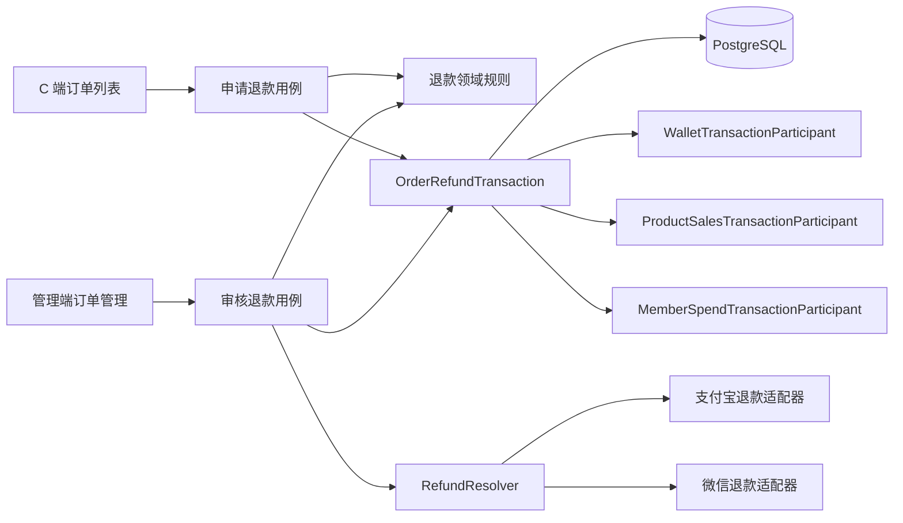
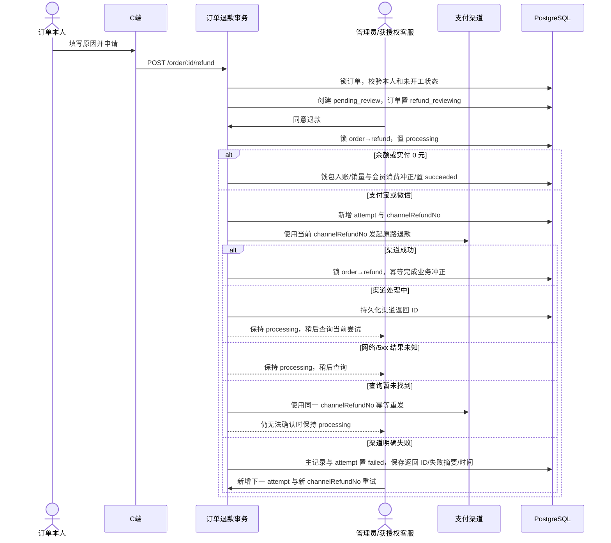
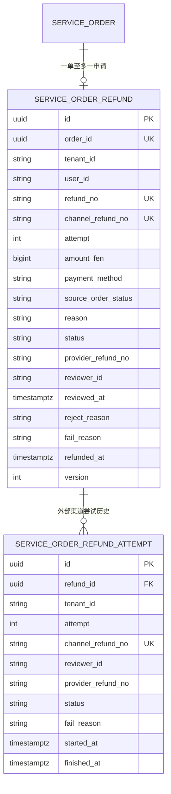
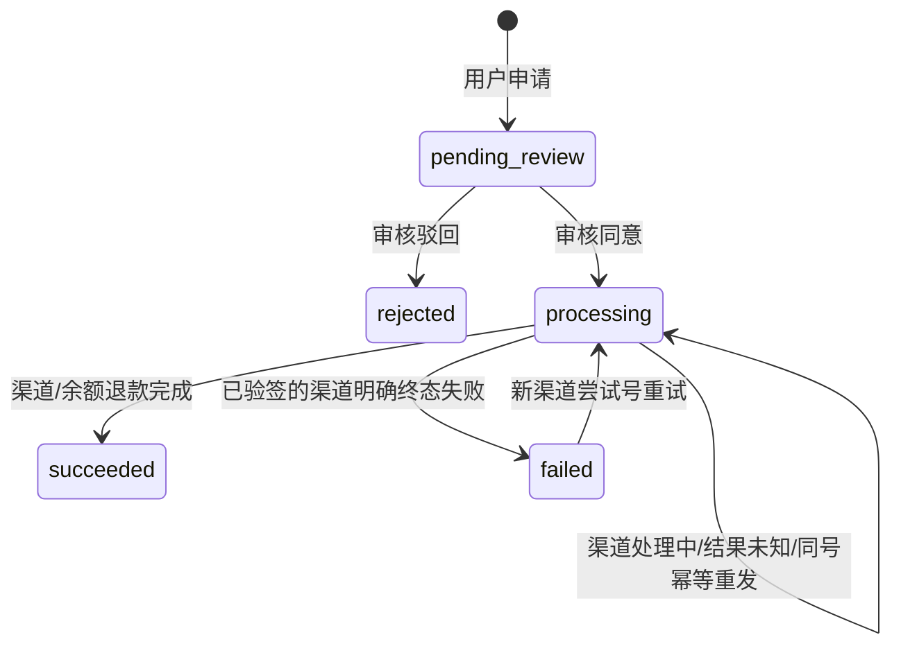
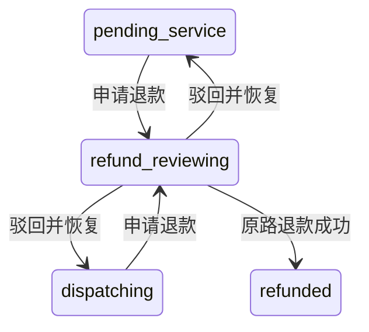

# 订单退款审核

## 功能目标与边界

订单退款为服务订单模块的子能力，解决已付款订单无法退款的问题：订单本人提交原因，后台人工审核，审核通过后按原支付方式全额退回。客服是否能审核由独立 RBAC 权限控制。

已实现：

- 仅 `pending_service`（待客服处理）和 `dispatching`（待接单）订单可申请。
- 申请后订单进入 `refund_reviewing`，立即退出接单大厅并冻结下发、指派和接单。
- 管理员可同意或驳回；客服必须显式获得 `order:admin:refund:review`，且仍只能处理本人负责商品。
- 余额订单原路退回钱包并写 `order_refund` 入账流水。
- 支付宝调用 `alipay.trade.refund`，微信调用支付 v3 国内退款接口；稳定业务 `refundNo` 与渠道尝试号分离，处理中查询当前尝试，查询暂未找到时使用同一渠道号幂等重发，只有渠道明确失败后的重试才使用新渠道号。
- 每次外部渠道尝试独立保留操作者、渠道号、渠道返回 ID、状态、失败摘要和起止时间；退款主记录的首次审核人和审核时间不可被重试覆盖。
- 退款成功后订单进入 `refunded`，商品销量与会员累计消费同步冲正，订单群标题更新为“已退款”。
- C 端：列表卡片的申请入口只使用服务端 `canRequestRefund`；申请弹层原因必填，提交期间禁用关闭和重复提交，API 失败保留输入；详情沿用既有加载失败/重试；申请、审核与到账时间按浏览器本地时区展示。

明确非目标：

- 不支持部分退款、批量退款或自动审批。
- 不支持 `serving`、`completed` 订单退款；这些场景涉及服务争议、打手提成与完成单数追缴，当前没有安全规则。
- 本期只退实付金额，不返还已使用优惠券。
- 不自动关闭或删除订单群，不删除订单、退款审计、支付流水或聊天记录。
- 未建设定时任务或退款渠道回调；渠道处于 `processing` 时由有权限人员在管理端再次点击“查询退款”。

## 目录与职责

```text
packages/contracts/src/order/order.ts
  OrderStatus / OrderRefundStatus / C 端与管理端退款投影 / 输入约束

apps/server/src/modules/order/
├── domain/
│   ├── order-refund.entity.ts                  一单一退款申请聚合
│   ├── order-refund-attempt.entity.ts          每次渠道退款尝试审计
│   ├── order-refund.rules.ts                   可申请/可审核领域规则
│   └── order-refund-transaction.interface.ts   事务端口与结果类型
├── application/use-cases/
│   ├── request-order-refund.usecase.ts         本人申请并冻结履约
│   ├── approve-order-refund.usecase.ts         同意、查询或新渠道号重试
│   └── reject-order-refund.usecase.ts          驳回并恢复原履约状态
├── application/order.mapper.ts                  owner/admin/hall/booster 安全投影
├── infrastructure/
│   └── order-refund.transaction.ts             order→refund→attempt→资金冲正事务
└── interfaces/
    ├── dto/                                     申请/驳回原因校验
    └── controllers/                             一个路由一个 Controller

apps/server/src/modules/wallet/
├── domain/refund-port.interface.ts              原路退款端口
├── application/refund.resolver.ts               支付渠道策略解析
└── infrastructure/drivers/
    ├── alipay-refund.driver.ts                  支付宝退款与查询
    ├── wechat-refund.driver.ts                  微信退款与查询
    └── wechat-pay.request.ts                    微信请求签名与响应验签

apps/client/src/components/order/
├── OrderRefundRequestDialog.vue                 退款申请弹层（订单列表入口）
└── OrderRefundPanel.vue                         退款状态与结果（订单详情展示）

apps/web/src/components/order/OrderRefundActions.vue
apps/web/src/composables/use-order-refund-review.ts
```

## 模块结构



## 业务流程



## 数据模型

迁移：

- `apps/server/src/database/migrations/1784736000000-add-order-refund-review.ts` 创建退款主表。
- `apps/server/src/database/migrations/1784736100000-add-order-refund-channel-attempt.ts` 增加当前渠道尝试字段和尝试审计表；存量 `processing` / `failed` / `succeeded` 记录按原渠道号回填为第 1 次尝试。
- `apps/server/src/database/migrations/1784736200000-add-order-member-spend-ledger.ts` 增加订单逐单消费标记，按未退款的已支付订单重算会员累计消费，使退款只冲正目标订单的贡献；历史 `member_profile.version` 无数据库默认值，补建档案时显式初始化为 `1`。



- `order_id` 为原生 `uuid` 外键，`ON DELETE RESTRICT`，避免删除订单后丢失退款审计。
- `refund_no` 是全局唯一且稳定的业务退款号；不再直接作为渠道重试幂等键。
- `channel_refund_no` 是当前尝试号且全局唯一，`attempt` 从 1 递增；`processing` 查询必须使用当前值，进入 `failed` 后才允许创建新值。
- `service_order_refund_attempt` 以 `(refund_id, attempt)` 和 `channel_refund_no` 双重唯一约束保留每次财务操作；渠道返回 ID 在 `processing`、`failed` 和 `succeeded` 均持久化。
- `source_order_status` 只允许 `pending_service` / `dispatching`，驳回时精确恢复。
- 金额使用非负 `bigint` 分值；原因和审核结果有长度约束。
- migration 的 `down` 先按 `service_order → service_order_refund` 顺序加表锁；存在任一退款记录，或订单仍处于 `refund_reviewing` / `refunded` 时直接拒绝回滚，避免销毁财务审计或留下无法解释的订单状态。只有从未产生退款业务数据且无退款状态时才允许删除空表。
- 渠道尝试 migration 在尝试表非空，或主表存在当前渠道号/非零尝试次数时拒绝 `down`；必须先完成合规审计归档，不能用回滚删除资金操作历史。
- 会员逐单消费 migration 会锁定订单和会员档案并重算历史累计，不能与旧版本支付写入并行。部署时必须先构建新版本，停止并排空全部 API、支付回调、worker 和服务端实例，再依次执行三条 migration；成功后才能启动新版本。失败时保持服务端停止并向前修复，不能删除退款审计或强制回滚。

## 状态机



订单履约状态：



## API、权限与安全边界

| 方法   | 路径                                  | 权限                        | 说明                                                 |
| ------ | ------------------------------------- | --------------------------- | ---------------------------------------------------- |
| `POST` | `/api/order/:id/refund`               | 登录且订单本人              | `{ reason }`，创建全额退款申请并返回最新 `OrderView` |
| `POST` | `/api/order/admin/:id/refund/approve` | `order:admin:refund:review` | 待审核时同意；处理中查当前尝试；失败时新建尝试重试   |
| `POST` | `/api/order/admin/:id/refund/reject`  | `order:admin:refund:review` | `{ reason }`，仅待审核状态可驳回                     |

- 退款审核权限不在客服默认权限中；启动播种器为所有存量租户管理员幂等补齐，并在实际发生补权后通过 `PermissionResolver.invalidateAll()` 清除 Redis 权限缓存，避免已登录管理员继续命中旧权限。Redis 不可用时沿用解析器既有降级，缓存最迟在 TTL 到期后失效。
- 客服即使获得权限，仍经过 `ServiceAgentScope`，不能审核其他客服负责商品的订单。
- C 端是否显示申请按钮只使用服务端 `canRequestRefund`，不在前端复制状态规则。
- C 端退款投影不返回退款记录 id、退款单号和审核人；管理端投影保留审计字段。大厅和打手投影固定返回 `refund: null`、`canRequestRefund: false`，驳回恢复履约后也不会泄露用户退款记录。
- 外部网络调用不放在数据库事务中，避免长事务和锁表；调用前先把退款申请占位为 `processing`。
- 对待审核、处理中或失败重试的外部渠道退款，先在不发出网络请求的前提下预检商户私钥、平台公钥/证书和验签材料；预检失败不会创建渠道 attempt，申请仍可修复配置后重试或在待审核阶段驳回。已成功终态不依赖当前渠道配置即可幂等返回。
- 渠道结果写回同时校验当前 `channelRefundNo`，旧尝试的迟到响应不能覆盖新尝试；主记录首次审核人/时间只写一次，每次重试操作者写入独立尝试审计。
- 支付宝退款创建与查询均启用 SDK `validateSign`；验签失败转换为不包含渠道签名和完整响应的安全异常。微信退款的成功和错误 HTTP 响应都必须先校验 `Wechatpay-Timestamp`、`Wechatpay-Nonce`、`Wechatpay-Signature`、`Wechatpay-Serial`，再解析响应体。
- 已验签的成功或处理中响应还必须核对原订单号、当前渠道退款号和退款金额；微信同时核对原单总额和人民币币种。字段缺失或不匹配时不完成本地退款、不冲正账本，申请保持当前 `processing` attempt 等待人工核查。
- 日志和接口不返回商户密钥、签名、完整渠道响应或用户敏感账号信息。只有明确的渠道结果未知异常会记录 `provider` 和异常类型的脱敏告警并保持 `processing`；配置、输入和验签错误向接口清晰抛出，不静默返回成功。错误日志对 `POST /api/order/:id/refund` 与 `POST /api/order/admin/:id/refund/reject` 请求体的顶层 `reason` 写入 `***`；匹配限定为这两个路由，不影响其他业务 `reason` 的错误诊断。

## 配置与渠道

没有新增配置项或依赖。支付宝退款复用 `AlipayClientFactory`，微信退款复用 `WechatPayConfigFactory` 和既有商户凭证。配置仍来自 `wallet.*` 配置中心键；业务代码不读取 `process.env`。

支付宝/微信驱动在协议级测试中校验请求金额、渠道尝试号、响应验签、订单号与金额匹配、状态映射和查询恢复；支付宝额外覆盖带 traceId 的 429/5xx、安全验签异常和无效密钥预检，微信额外覆盖签名篡改、证书序列号不匹配和缺少验签材料。交付环境没有可用于扣款的真实商户订单，因此真实渠道到账必须在具备有效商户权限后做沙箱或小额验收。

## 并发、异常与恢复

- 申请、下发、指派和接单共享订单行锁；申请与接单竞争时至多一方推进。
- 待付款取消与余额支付/渠道回调共享订单行锁；数据库内只允许取消或支付一方推进，避免陈旧订单实体把已支付状态覆盖为已取消。
- 完成退款固定使用 `order → refund → attempt → wallet/product/member` 顺序；重复完成只返回既有结果，不重复入账或冲正。
- 余额退款、钱包流水、订单终态、销量和会员消费在同一事务提交，任一步失败整体回滚。
- 渠道返回成功后若本地事务暂时失败，申请保留 `processing`；再次点击查询可读取渠道成功结果并重做本地幂等完成。
- 网络传输失败、限流或 5xx 不能证明退款失败，因此不恢复履约、不标记成功，也不生成新渠道尝试号；再次操作先查询当前尝试。
- 查询当前尝试暂未找到时，以同一 `channelRefundNo` 幂等重发创建请求；仍无法确认则保持 `processing`，避免旧请求迟到成功后又开放新退款号。只有已验签且命中明确终态失败白名单的渠道结果才进入 `failed`；系统类、未知业务码和未知退款状态一律保持当前 attempt。管理员只对明确失败重试，原子递增 `attempt` 并生成新 `channelRefundNo`。驳回只允许 `pending_review`，不能撤回已发起的渠道退款。
- 当前没有退款数据删除入口；订单删除由外键阻止，不需要联动清理文件、缓存或索引。
- 已产生退款记录或退款订单状态的环境不支持直接执行该 migration 的 `down`；此时应采用向前修复。不得为强行回滚而删除退款审计记录。

## 前端状态

- C 端：申请退款入口在「我的订单」列表卡片（低调的下划线文字按钮，仅 `canRequestRefund` 为真时显示），点击打开申请弹层，提交成功后刷新列表；订单详情不再提供申请按钮，仅在已有退款记录时展示审核/渠道进度。弹层原因必填，提交期间禁用关闭和重复提交，API 失败保留输入；申请、审核与到账时间按浏览器本地时区展示。
- 管理端：无权限时不渲染详情中的退款操作行，按钮仍由 `v-permission` 二次保护；单订单从确认/输入弹窗开始持有独立提交锁，取消弹窗不提交请求也不产生未处理拒绝。
- `pending_review` 显示同意/驳回，`processing` 显示查询，`failed` 显示重试，终态只展示结果。
- 订单菜单角标：所有有列表权限者看到 `pending_service`；只有具备退款审核权限者额外统计 `refund_reviewing`。

## 测试范围

- 领域/应用：可申请阶段、本人隔离、重复申请、余额退款、渠道成功/处理中/明确失败/超时、驳回恢复，以及 owner/admin/hall/booster 退款隐私投影。
- 权限：权限播种、客服默认不授权、Controller 权限元数据、获授权客服商品范围，以及存量租户管理员补权后的全局缓存失效与重复启动幂等。
- HTTP E2E：真实启动隔离 Nest 路由与全局权限守卫，覆盖未登录、无审核权限、已授权客服跨负责商品、订单本人/他人隔离和正常审核；不新增测试依赖。
- 渠道：支付宝和微信创建/查询、金额换算、尝试号、查询未找到时同号幂等重发、重复单号、终态失败白名单、预检、响应验签，以及订单号/退款号/金额不匹配拒绝。
- PostgreSQL E2E：余额退款只入账一次，销量/会员消费只冲正一次，双审核、失败重试新渠道号、首审不可覆盖、逐次尝试审计、申请与接单/下发竞争、支付与取消竞争、订单仓储跨租户隔离，以及驳回无资金变更。
- migration E2E：在显式事务中真实执行 `up/down`，验证存量尝试回填、唯一约束、列类型、会员累计历史重算与逐单标记，以及退款/渠道尝试审计存在时拒绝 `down`。
- 安全日志：两个退款原因路由精确脱敏，非退款路由的普通 `reason` 保持可诊断。
- 前端：C 端和管理端退款状态纯函数、管理端菜单角标权限分流、审核确认/输入阶段单飞、取消弹窗和详情操作行权限判断。

## 尚未实现与风险

- 支付宝/微信真实商户到账未在本地环境验证，发布前需使用真实已支付订单做小额退款验收。
- 扫码渠道已实际扣款、但用户取消先在数据库落库时，晚到支付回调仍会按既有终态幂等规则被忽略；彻底处理需要渠道关单或主动对账补偿，本次不扩大范围实现。
- 渠道处理中目前依赖人工查询；后续可在明确运维需求后增加验签回调或受控补偿任务。
- 服务中/已完成退款需要先设计争议裁决、提成追缴、打手完成单数和群聊收尾规则。
- 驳回后一单不允许再次提交新申请；需要多轮申诉时应改为多申请历史并增加“活动申请”部分唯一索引。
- 优惠券不会返还；若后续返券，必须先定义已过期券、活动券和并发复用规则，并加入同一事务补偿。
