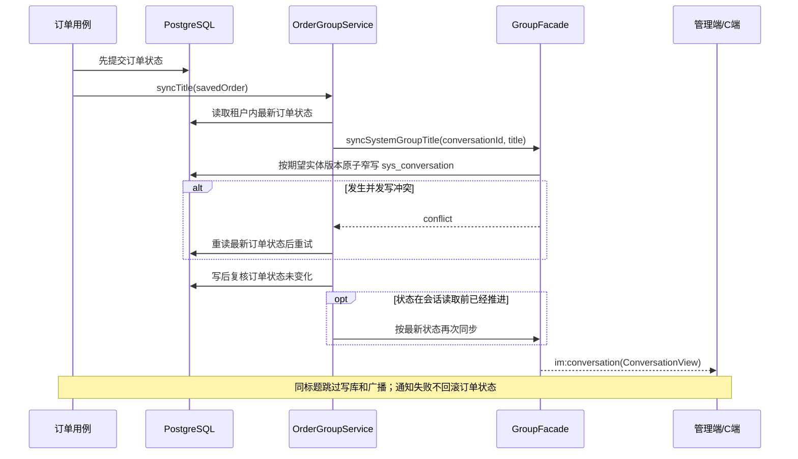
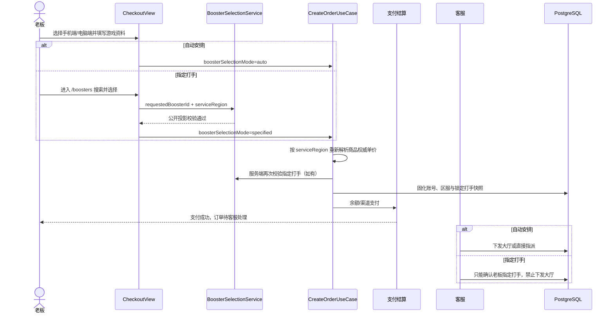
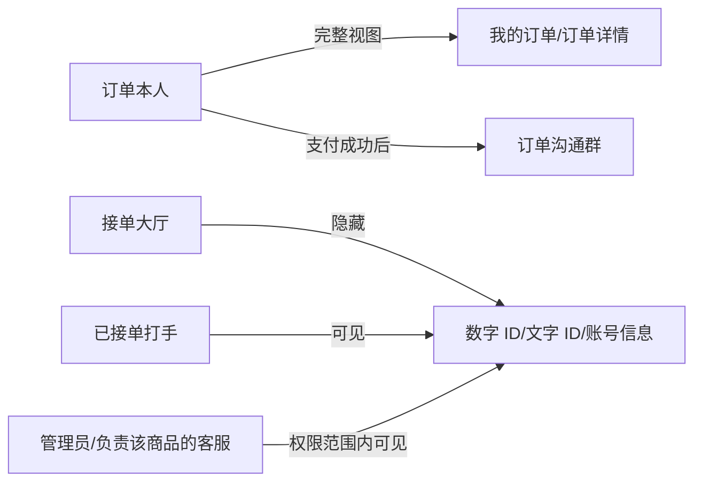
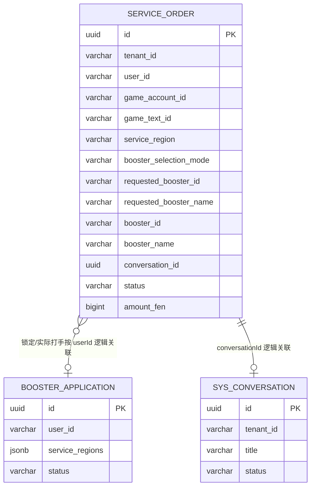
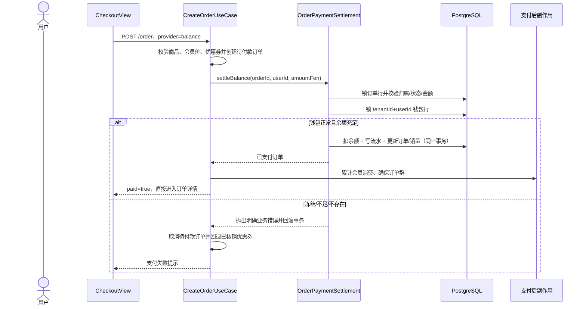

# 服务订单模块（order）

用户在 C 端商品详情页下单陪玩/代打服务，可用支付宝/微信扫码或钱包余额支付，
支付成功后订单进入「待客服处理」并自动创建订单沟通群（用户 + 商品关联客服 + 平台管理员）；
客服可把订单下发接单大厅或直接指派指定打手，
打手（booster 角色）接单/被指派后自动进群 → 服务 → 完成。

## 实现的功能

- C 端商品详情页：方形主图完整展示商品封面并支持原图预览，封面主副标语位于图片下方的独立介绍区，同时展示手机端/电脑端价格与四项服务保障；富文本经净化后渲染且兼容历史本机媒体地址。进入结算页后复用既有区服控件选择手机端或电脑端，金额、会员折扣、优惠券和支付金额随所选端同步重算
- 备注附件：下单备注支持上传图片/视频（`RemarkMediaUploader`，复用 `/upload/self` 自助上传，最多 `ORDER_LIMITS.remarkMediaMax` 个），订单固化 `remarkMedia` jsonb 快照，详情页/大厅详情/管理端抽屉以缩略图展示（`RemarkMediaGallery`）
- 账号信息：下单可选填 `accountInfo`（游戏账号等敏感信息）；仅本人、接单后的打手与管理端可见，接单大厅列表/详情经 `toHallOrderView` 置空不下发
- 结构化游戏资料：数字游戏 ID（1 ～ 32 位数字，必填）、文字游戏 ID（选填，最多 64）、本单区服（`delta-mobile` / `delta-pc`）和其他账号信息分字段收集；历史订单字段为空串兼容，不把大厅可见数据与接单后敏感数据混用
- 打手选择：结算页可选「自动安排」或「指定打手」；指定时从 C 端脱敏目录选择，服务端复核打手支持区服、本人排除、实名和押金门禁，并固化 `requestedBoosterId` / `requestedBoosterName` 快照
- 指定打手履约约束：指定订单支付成功后仍处于「待客服处理」，不能下发公共接单大厅；客服只能确认老板锁定的打手，不能改派他人，实际 `boosterId` / `boosterName` 仅在确认接单时写入
- 下单支付：订单使用独立 `OrderPaymentMethod`（`alipay` / `wechat` / `balance`）。支付宝、微信复用钱包收款驱动并返回二维码；余额支付在创建订单请求内完成扣款并直接进入详情，不生成二维码
- 全额退款审核：已付款且未开工的 `pending_service` / `dispatching` 订单可由本人申请，申请后冻结履约；后台按独立权限审核，余额退钱包、支付宝/微信原路退回，成功后冲正销量与会员累计消费。完整状态机、数据模型和失败恢复见 [order-refund.md](./order-refund.md)
- 结算页钱包状态：独立调用 `GET /wallet/mine` 展示可用余额；加载失败可重试，冻结或余额不足时禁用余额方式，金额/优惠券变化造成不足时自动退出；可复用充值弹层原地充值并刷新余额
- 会员折扣：下单时按用户当前会员等级折扣（member 模块 `MemberLevelService`）计应付，订单固化 `originalAmountFen`/`discountBp` 快照
- 优惠券抵扣：下单可选用未使用的我的优惠券（coupon 模块 `CouponRedeemService`），在会员折后价上再抵扣（最低 0 分，0 元单直接落账），订单固化 `userCouponId`/`couponDeductionFen` 快照；条件核销防并发重复用券，取消订单时自动回滚券为未使用（详见 docs/coupon.md）
- 支付回调：渠道异步回调验签解析，事务 + 行锁内幂等落账（待付款 → 待客服处理），并在同一事务累加商品销量与用户会员累计消费；订单以 `memberSpendRecorded` 记录本单是否已计入，供退款逐单冲正
- 主动查单兜底：支付二维码弹窗轮询 `GET /order/:id/pay/query`，后端调渠道官方查单接口（支付宝 `alipay.trade.query` / 微信 `GET /v3/pay/transactions/out-trade-no`），查到已支付则与回调共用 `OrderPaymentSettleService` 幂等落账——回调丢失/延迟也能正常完成支付流程
- 我的订单：分页列表（商品快照/数量/金额/状态），待付款订单可取消；PC 端标题、紧凑状态筛选、列表统一收敛到内容区宽度，移动端保持全屏滚动
- C 端订单详情页（`/orders/:id`）：支付成功（含 0 元单免扫码）自动跳转进入，也可点击订单卡片进入；展示商品快照、状态、服务信息（接单打手显示名快照 `boosterName`/接单时间/完成时间，打手接单或被指派后展示）、价格明细（原价/会员折扣减免/优惠券抵扣/实付）、订单信息（订单号/支付方式/备注）与全量时间线（下单/支付/下发大厅 `dispatchedAt`/接单 `acceptedAt`/完成 `completedAt`/取消 `cancelledAt`，未发生的不展示）；已建群订单提供「进入订单群」入口（跳全屏聊天页 `/chat/:id`），待付款可取消
- C 端订单详情打手入口：已产生实际 `boosterId` 时，打手显示名可点击跳转 `/boosters/:userId` 主页；尚未接单时展示锁定打手快照，并与实际接单字段明确区分
- 订单全量时间线与打手快照：订单实体新增 `booster_name`（接单/被指派时经 RBAC `UserDirectory` 固化昵称||用户名，改名不影响历史订单）与 `dispatched_at`/`accepted_at`/`completed_at`/`cancelled_at` 时间列，分别由下发/接单与指派/完成/取消用例回填；`OrderView` 契约同步下发 `boosterId`/`boosterName` 与四个时间字段，C 端/大厅/打手/管理端视图共用
- 管理端订单管理：分页检索全量订单（状态/订单号过滤）+ 详情抽屉（商品快照/归属用户/关联客服/渠道交易号），
  权限码 `order:admin:list` / `order:admin:detail`，菜单「电竞运营 / 订单管理」由播种器幂等补齐
- 支付渠道配置沿用配置中心既有 `wallet.*` 键（网关地址、商户密钥、回调基址 `wallet.notify.base-url`），无新增配置
- 支付成功自动建群：落账后经 im 模块 `GroupFacade` 自动创建订单群（下单用户 + 商品关联客服 + 平台管理员，延迟补建时同时拉入已接单打手，客服缺省时管理员兜底为群主）。系统群固定使用订单 UUID，重复补建复用同一群并补齐成员；首次建群失败仅记日志、不回滚支付，支付查单、本人详情、管理详情和后台进群会幂等补建或校正标题
- 订单群阶段标题：订单状态是唯一事实来源，`pending_service` / `dispatching` 显示 `[待接单] 订单群·商品标题`，`serving` 显示 `[服务中] 订单群·商品标题`，`completed` 显示 `[已结束] 订单群·商品标题`；管理端与 C 端复用 `ConversationView.title`，收到 `im:conversation` 后无需刷新即可更新当前会话和会话列表
- 后台订单群入口：详情抽屉「进入订单群」→ POST `/order/admin/:id/group/join` 幂等加群（客服仅限自己负责的订单）→ 跳转 IM 页并自动选中该群会话（`/im?conversation=xxx`）
- 客服订单可见性：客服角色（非管理员）在管理端订单列表/详情/下发/指派均被强制限定为自己负责商品的订单（`ServiceAgentScope`）；客服角色默认权限已含订单菜单与处理接口
- 下发大厅：管理端「待客服处理」订单可下发接单大厅（权限码 `order:admin:dispatch`），订单进入「待接单」
- 指派打手：客服/管理员可直接指派指定平台打手（权限码 `order:admin:assign`，POST `/order/admin/:id/assign`），「待客服处理/待接单」→「服务中」；候选列表只返回同租户审核通过、账号启用、具备打手角色且已自主上线的用户，提交指派时再次复核上线、实名、押金和区服
- 接单大厅（C 端打手身份）：分页浏览待接单订单，支持按订单号/商品名搜索以及“全部、手机端、电脑端”服务区服筛选，顶部可自主上线/下线；提供手动刷新，页面可见时每 5 秒按当前筛选自动刷新并在失败时保留旧列表。移动端刷新按钮声明 `touch-action: manipulation`，防止连续触控被浏览器解释为双击缩放，同时保留页面滚动和双指缩放。点卡片进入大厅详情页（`/hall/:id`），可见商品、区服、金额、备注和下发时间，账号信息继续隐藏；只有上线且满足目录、实名、押金和区服门禁的打手能接单
- 完成结算：打手完成订单时按其当前等级费率（booster 模块 `BoosterProgressService`）计提成经 `WalletLedger` 入账（commission 流水），订单落 `commissionFen`/`commissionRateBp` 快照并累计完成单数
- 打手订单中心（C 端打手身份）：分页查看本人接下的订单（全部/服务中/已完成），点卡片进入打手订单详情页（`/booster/orders/:id`，GET `/order/booster/mine/:id`，展示用户备注/附件/账号信息，服务中可直接完成）；列表服务中可标记完成
- C 端身份切换：拥有 booster 角色的账号可在「我的」页切换老板/打手身份（本地持久化），
  打手身份下一级导航变为「接单大厅/订单中心/消息/我的」，「接单大厅」入口展示红色待接单数角标（`stores/hall-badge.store.ts` 基于通用角标工厂 `badge-store.factory.ts` 轮询大厅总数，大厅页刷新时本地同步）；接单接口由后端 `BoosterAccess` 断言角色

明确非目标：

- 指定打手不等于支付后自动开工，客服仍需确认并推进到服务中；当前不做自动接单、超时改派或候补队列。
- 本次不实现订单打赏、分阶段付款、多人共同履约或基于在线状态的自动派单。
- 退款本期不支持部分退款、自动审批、服务中/已完成退款或返还优惠券；相关资金与提成边界见 [order-refund.md](./order-refund.md)。
- “已结束”只用于订单群标题，订单状态仍为“已完成”，群会话仍保持 `active`；本次不自动关闭群聊，也不禁止具备管理权限的成员临时改名。
- C 端跨页结算草稿只保存在当前内存会话，退出登录、令牌失效或支付完成会清除；不提供跨设备草稿恢复。

## 订单状态机

```
pending_payment（待付款）
   ├─ 渠道回调/查单成功 ─▶ pending_service（待客服处理）
   ├─ 钱包事务扣款成功 ──▶ pending_service（待客服处理）
   └─ 用户取消 ──────▶ cancelled（已取消）
pending_service（待客服处理）
   ├─ 自动安排 + 客服下发大厅 ─▶ dispatching（待接单）
   ├─ 自动安排 + 客服指派打手 ─▶ serving（服务中）
   └─ 指定打手 + 客服确认指派 ─▶ serving（服务中）
 dispatching ──┬─ 打手接单 ──▶ serving（服务中）── 打手完成 ──▶ completed（已完成）
               └─ 客服指派打手 ─▶ serving（服务中）
pending_service / dispatching ── 用户申请 ─▶ refund_reviewing（退款处理中）
refund_reviewing ──┬─ 审核驳回 ─▶ 申请前的 pending_service / dispatching
                   └─ 原路退款成功 ─▶ refunded（已退款）
```

指定订单没有 `pending_service → dispatching` 转换；客服尝试下发公共大厅会被拒绝，指派其他打手也会被拒绝。

### 订单群标题状态流

| 订单状态                          | 订单群标题                   | 触发或补偿入口               |
| --------------------------------- | ---------------------------- | ---------------------------- |
| `pending_service` / `dispatching` | `[待接单] 订单群·商品标题`   | 支付建群、下发大厅、详情补偿 |
| `serving`                         | `[服务中] 订单群·商品标题`   | 打手接单、客服指派、进群补偿 |
| `completed`                       | `[已结束] 订单群·商品标题`   | 完成订单、后续详情补偿       |
| `refund_reviewing`                | `[退款审核] 订单群·商品标题` | 用户申请退款、后续详情补偿   |
| `refunded`                        | `[已退款] 订单群·商品标题`   | 原路退款成功、后续详情补偿   |



标题总长按 `sys_conversation.title` 的 128 个 Unicode 字符约束截断，并优先保留阶段前缀。待付款和已取消订单不会创建订单群，因此不支持生成群标题；人工改名会暂时覆盖系统标题，下一次状态流转或详情补偿会恢复系统格式。

## 业务流程与敏感字段可见性





接单大厅在 `toHallOrderView` 中清空 `accountInfo`、`gameAccountId`、`gameTextId`；区服和打手安排方式仍可用于接单判断。订单详情中的实际打手名称和锁定打手名称均为快照，名称按钮只在存在对应用户 ID 时跳转打手主页。

## 结构导图

```
packages/contracts/src/order/order.ts        # OrderPaymentMethod / OrderStatus / CreateOrderPayload / OrderView
apps/server/src/modules/order/
├── domain/                                  # 领域层
│   ├── order.entity.ts                      # 订单聚合根（商品快照 + orderNo 幂等键）
│   ├── order-repository.interface.ts        # 仓储抽象（分页 + 原子 claimForServing）
│   └── order-payment-settlement.interface.ts # 支付事务端口
├── infrastructure/
│   ├── order.repository.ts                  # TypeORM 实现（租户过滤 + 悲观写锁领取）
│   ├── order-payment.settlement.ts          # 订单/钱包/流水/销量原子落账
│   └── order-feedback-penalty.transaction.ts # 反馈事务中的订单快照复核
├── application/
│   ├── order.mapper.ts                      # 实体 → 视图
│   ├── order-booster-selection.ts            # 指定订单大厅/改派约束
│   ├── booster-access.service.ts            # 打手角色访问断言（复用 RBAC RoleGranter）
│   ├── order-group-title.ts                 # 订单状态 → 三阶段群标题（128 字符约束）
│   ├── order-group.service.ts               # 建群/进群/标题同步编排（失败不阻断主流程）
│   ├── service-agent-scope.service.ts       # 客服可见范围解析（客服仅限自己负责的订单）
│   └── use-cases/
│       ├── create-order.usecase.ts          # 校验在架 → 固化快照 → 渠道下单取二维码
│       ├── handle-order-callback.usecase.ts # 回调验签 → 幂等标记已支付 + 累加销量
│       ├── get-my-order.usecase.ts          # 单笔查询（支付轮询）
│       ├── list-admin-orders.usecase.ts     # 管理端分页检索（状态/订单号过滤）
│       ├── list-hall-orders.usecase.ts      # 大厅分页（订单/商品关键词 + 区服过滤）
│       ├── get-admin-order.usecase.ts       # 管理端单笔详情
│       ├── list-my-orders.usecase.ts        # 我的订单分页
│       ├── cancel-my-order.usecase.ts       # 取消待付款订单
│       ├── dispatch-order.usecase.ts        # 客服下发大厅（待客服处理 → 待接单）
│       ├── assign-order-booster.usecase.ts  # 客服指派指定打手（→ 服务中，指派后进群）
│       ├── list-booster-candidates.usecase.ts # 可指派打手候选分页（仅打手角色）
│       ├── join-order-group.usecase.ts      # 管理端幂等加入订单群（返回会话 id）
│       ├── list-hall-orders.usecase.ts      # 接单大厅分页（仅打手，账号信息置空）
│       ├── get-hall-order.usecase.ts        # 接单大厅订单详情（仅打手，账号信息置空）
│       ├── get-booster-order.usecase.ts     # 打手本人订单详情（接单后账号信息可见）
│       ├── accept-hall-order.usecase.ts     # 打手接单（待接单 → 服务中，回填 boosterId）
│       ├── list-booster-orders.usecase.ts   # 打手订单中心分页（可按状态过滤）
│       └── complete-booster-order.usecase.ts# 打手完成服务（服务中 → 已完成，提成结算入账）
├── interfaces/
│   ├── dto/create-order.dto.ts
│   ├── dto/order-admin-list-query.dto.ts    # 分页 + 状态/订单号过滤
│   ├── dto/assign-order.dto.ts              # 指派打手请求体（boosterId）
│   └── controllers/                         # 一个路由一个文件
│       ├── order.create.controller.ts       # POST /order
│       ├── order.callback.controller.ts     # POST /order/pay/callback/:provider（公开）
│       ├── order.mine.list.controller.ts    # GET  /order/mine
│       ├── order.admin.list.controller.ts   # GET  /order/admin（order:admin:list）
│       ├── order.admin.detail.controller.ts # GET  /order/admin/:id（order:admin:detail）
│       ├── order.admin.dispatch.controller.ts # POST /order/admin/:id/dispatch（order:admin:dispatch）
│       ├── order.admin.assign.controller.ts # POST /order/admin/:id/assign（order:admin:assign）
│       ├── order.admin.group-join.controller.ts # POST /order/admin/:id/group/join（order:admin:detail）
│       ├── order.admin.booster-candidates.controller.ts # GET /order/admin/booster-candidates（order:admin:assign）
│       ├── order.hall.list.controller.ts    # GET  /order/hall（仅打手）
│       ├── order.hall.detail.controller.ts  # GET  /order/hall/:id（仅打手）
│       ├── order.booster.detail.controller.ts # GET /order/booster/mine/:id（仅打手本人）
│       ├── order.hall.accept.controller.ts  # POST /order/hall/:id/accept（仅打手）
│       ├── order.booster.list.controller.ts # GET  /order/booster/mine（仅打手）
│       ├── order.booster.complete.controller.ts # POST /order/booster/:id/complete（仅打手）
│       ├── order.mine.detail.controller.ts  # GET  /order/:id
│       └── order.cancel.controller.ts       # POST /order/:id/cancel
└── order.module.ts                          # 模块装配（静态路由先于 :id 注册）

复用的既有能力：
- im：GroupFacade（系统建群/幂等进群 + 系统消息 + 会话推送，订单群编排复用）
- rbac：RoleGranter（客服/管理员角色判定）/ UserDirectory（打手候选、平台管理员名录）
- commerce：GET /commerce/public/products/:id（本次新增公开商品详情）+ 商品仓储导出
- wallet：PaymentResolver / PaymentPort 策略（支付宝/微信驱动、验签、应答报文）+ WalletLedger 提成入账
- booster：BoosterDepositGuard（接单押金门控）/ BoosterProgressService（完成单数累计 + 等级费率解析）
- member：`MemberLevelService`（下单折扣解析）/ `MemberSpendTransactionParticipant`（支付累计与退款冲正事务窄写口）

apps/client/src/
├── api/order.api.ts                         # 下单/详情/我的订单/取消/大厅/接单/打手订单/完成
├── stores/conversation-events.store.ts      # 全局个人房间会话更新事件（Pinia）
├── stores/role.store.ts                     # 身份切换状态（老板/打手，本地持久化）
├── config/nav.ts                            # 老板/打手两套一级导航配置
├── views/product/ProductDetailView.vue      # 商品详情（纯展示，立即下单进下单页）
├── views/product/ProductDetailView.responsive.css # 商品详情 PC 响应式布局
├── views/order/CheckoutView.vue             # 下单页状态与提交编排
├── components/order/CheckoutServiceForm.vue  # 游戏 ID/区服/打手模式/备注表单
├── components/booster/SelectedBoosterNotice.vue # 已选打手快照与主页入口
├── components/order/CheckoutPaymentMethods.vue # 渠道/余额、刷新、冻结/不足、原地充值
├── views/order/MyOrdersView.vue             # 我的订单页编排（筛选/分页/评价弹层/进详情）
├── views/order/OrderDetailView.vue          # 订单详情页（价格明细/订单信息/订单群入口）
├── views/order/OrderDetailView.css          # 订单详情页样式（移动全屏 + PC 收敛）
├── views/message/ChatView.vue               # 全屏会话聊天页（订单群/群聊/客服复用 ServiceChatPanel）
├── components/message/ServiceChatPanel.vue  # 聊天连接、历史与实时会话更新编排
├── components/message/ChatMessageFeed.vue   # 消息流、系统富文本净化与引用入口展示
├── components/message/ChatConversationHeader.vue # 会话标题与状态头部展示
├── views/order/HallView.vue                 # 接单大厅（打手一级 Tab，接单/点卡片看详情）
├── views/order/HallOrderDetailView.vue      # 大厅订单详情（/hall/:id，含备注附件，可接单）
├── views/order/BoosterOrderDetailView.vue   # 打手订单详情（/booster/orders/:id，含账号信息，可完成）
├── views/order/BoosterOrdersView.vue        # 打手订单中心（状态 tabs + 完成订单）
└── components/order/
    ├── PayDialog.vue                        # 扫码支付弹层（轮询支付结果）
    ├── OrderStatusTabs.vue                  # 订单状态筛选：移动横滑，PC 居中分段筛选
    ├── OrderCard.vue                        # 单条订单卡片：快照/金额/状态/取消/评价，点击进详情
    ├── BoosterOrderCard.vue                 # 打手侧订单卡片（大厅/订单中心共用，接单后展示账号信息）
    ├── CheckoutServiceForm.vue              # 结构化游戏资料、打手选择、数量与备注
    ├── CheckoutPaymentMethods.vue           # 支付方式与钱包余额状态
    ├── RemarkMediaUploader.vue              # 下单备注图片/视频上传
    └── RemarkMediaGallery.vue               # 备注附件展示（详情页共用）

apps/web/src/
├── api/order.api.ts                         # 管理端订单列表/详情/加入订单群
├── views/order/OrderAdminView.vue           # 订单管理页（筛选/分页/详情抽屉/下发/指派/进订单群）
├── components/order/OrderDetailDrawer.vue   # 详情抽屉（完整字段 + 价格明细 + 订单群入口）
└── components/order/AssignBoosterDialog.vue # 指派打手弹窗（远程搜索打手候选）
```

## 数据模型与 Migration

订单新增字段与原订单快照同属 `service_order` 聚合，不创建额外的打手选择表：

| 字段                                          | 数据库列 / 类型                      | 规则与可见性                                         |
| --------------------------------------------- | ------------------------------------ | ---------------------------------------------------- |
| `gameAccountId`                               | `game_account_id` varchar(32)        | 必填数字，1 ～ 32 位；大厅视图隐藏                   |
| `gameTextId`                                  | `game_text_id` varchar(64)           | 选填；大厅视图隐藏                                   |
| `serviceRegion`                               | `service_region` varchar(32)         | `delta-mobile` / `delta-pc`；历史订单为空串          |
| `boosterSelectionMode`                        | `booster_selection_mode` varchar(16) | `auto` 或 `specified`                                |
| `requestedBoosterId` / `requestedBoosterName` | varchar(36) / varchar(64)            | 锁定打手及下单时显示名快照；自动安排为空             |
| `boosterId` / `boosterName`                   | 既有列                               | 实际接单或客服指派后才写入，名称固化不随用户改名变化 |



`apps/server/src/database/migrations/1784332800000-add-booster-directory-order-selection.ts` 为 `service_order` 增加上述六个结构化/锁定字段、三项 Check Constraint 和指定打手索引，同时为 `booster_application` 增加 `voice_url`。migration 提供可回滚 `up` / `down`；回滚会丢失新增快照字段但不删除上传文件。执行前需备份，不能以 `synchronize` 代替迁移。

商品双端价格由 commerce migration `1784908800000-add-product-pc-prices.ts` 管理；订单不复制商品的四个价格字段，而是继续固化所选 `serviceRegion`、`originalAmountFen` 和最终 `amountFen`。因此商品后续改价不会改写历史订单，退款仍以订单实付快照为准。

ER 图中的打手关系是通过租户内 `userId` 的逻辑关联，订单群也沿用既有 `conversationId` 逻辑关联，两者均未新增外键。打手被删除或失去资格后，历史订单仍保留锁定/实际名称快照，后续主页跳转可能返回 404。本次标题同步只更新既有 `sys_conversation.title`，无数据库字段或 migration 变化。

## 设计要点

- **支付契约隔离**：订单使用 `OrderPaymentMethod`，钱包充值继续使用 `PaymentProvider`；`balance` 不会进入充值渠道解析器，避免出现“余额给钱包充值”的非法组合
- **策略模式复用**：订单的支付宝/微信收款复用钱包模块 `PaymentResolver` → `PaymentPort`，仅回调地址不同（`/order/pay/callback/:provider`）
- **幂等回调**：以 `orderNo`（商户订单号，前缀 `O`）为幂等键，事务内行锁校验
  「待付款 + 金额一致」才落账，重复回调直接应答成功
- **支付与取消竞争**：用户取消和余额支付/渠道回调都在订单行锁内复核 `pending_payment`；并发时只有先持锁的一方能推进，另一方返回当前状态错误，避免陈旧实体整行保存覆盖已支付结果
- **余额事务**：固定按“订单行 → 当前租户和用户的钱包行”加悲观写锁，在一个事务内校验订单本人、待付款、方式、金额、钱包状态和余额，随后扣款、写 `order_payment` 出账流水、推进 `pending_service`、写支付时间并增加商品销量。同一订单并发只首笔生效，同一钱包的不同订单串行扣款且不能透支
- **失败补偿**：余额未开通、被冻结、余额不足或渠道下单失败时，新建的待付款订单改为已取消，并回退该订单已核销的优惠券。事务已经提交后，会员累计、建群或标题通知失败只记录错误，不反向取消已支付订单；所有已支付订单均可由查单/详情入口调用 `ensurePaidOrderGroup` 幂等补群或校正标题，且不会重复累计会员消费
- **回调租户恢复**：支付渠道回调是公开入口，事务返回订单后以 `paidOrder.tenantId` 重建非超管租户上下文，再累计会员消费和解析订单群管理员，防止无上下文查询跨租户成员
- **快照固化**：订单固化商品标题/封面/关联客服，商品后续改动不影响历史订单；
  `serviceAgentId` 快照用于建群拉客服、客服可见性过滤与指派打手归属判定
- **投诉关联**：C 端投诉打手只提交本人订单 ID；反馈用例按当前租户复核订单属于提交人、状态为服务中/已完成且已有实际打手，再固化 `orderId/orderNo/boosterUserId/boosterName`（`boosterUserId` 来源于订单 `boosterId`）。处罚事务通过订单模块公开的事务参与端口重新锁定订单并校验快照，不能用昵称、前端打手 ID 或过期关系扣款；处罚不改变订单状态。
- **指定打手两阶段语义**：创建订单用 `requestedBooster*` 锁定唯一履约人，不提前写实际 `booster*`；客服确认该打手后才进入服务中。`assertOrderCanDispatch` 阻止指定订单进入公共大厅，`assertRequestedBooster` 同时约束后台指派和大厅接单，禁止改派或被其他打手领取
- **服务端再次校验**：C 端目录的 `selectable` 只用于交互提示；`CreateOrderUseCase`、大厅接单与后台指派必须重新校验打手仍上线、可见、支持本单区服、不是本人且实名/押金满足要求，防止使用过期或篡改的前端状态
- **双端价格单一口径**：详情和结算页复用共享 `resolveProductPrice` 预览，`CreateOrderUseCase` 必须重新读取在架商品并按 `serviceRegion` 计算；请求不接收客户端金额，不能通过篡改前端价格少付。端类型切换会使可用优惠券和余额可用性重新计算
- **大厅检索隔离**：`keyword` 与 `serviceRegion` 由 DTO 校验，关键词限制长度并使用参数化 `ILIKE`；Repository 始终附加 `dispatching` 状态和租户作用域，筛选只影响可见待接单列表，不扩大详情或接单权限
- **原子领取**：`OrderRepository.claimForServing` 在 PostgreSQL 短事务中对订单行加 `pessimistic_write` 锁，锁内复核租户、允许状态、`boosterId` 为空、下单人不是打手、`expectedRequestedBoosterId` 未变化及锁定人一致；竞争失败返回 `null`，用例转换为 409，只有成功者进入订单群
- **完成进度并发**：打手累计完成单数通过 `BoosterRepository.recordCompletedOrder` 在 `booster_application` 行锁事务内递增，不再用旧实体整行保存；与投诉押金处罚并发时完成单数和押金字段均不会丢失。
- **指派门禁**：管理端在 `tenant.run` 中复用 `BoosterSelectionService`；有区服订单校验目录、区服、启用账号、booster 角色、实名和押金，历史空区服订单只跳过区服匹配。门禁未知异常继续上抛，不被伪装成“不可选”
- **订单群编排**：`OrderGroupService` 复用 im 模块 `GroupFacade` 建群/进群，
  订单 UUID 同时作为系统群 UUID，首次写入、补成员、订单回填任一步失败后均可定位原群重试，不会创建重复群；欢迎消息与实时通知失败不阻断群主体和订单关联；
  群关联通过租户作用域内的 `updateConversationId` 窄写回填，避免支付后的旧订单实体整行保存覆盖并发状态；若状态用例的旧实体随后把群关联清空，标题同步会用稳定订单 UUID 幂等找回原群并重新回填；标题同步重新读取数据库最新订单，并以期望实体版本执行原子 compare-and-set，冲突时重读最新订单后重试；写入后再次复核订单状态，覆盖“旧同步读完订单、新状态先写完会话”的窗口；版本条件还可识别标题被人工改回旧值的 ABA，避免迟到副作用把“已结束”倒退为“服务中”；
  标题变化后复用 `ConversationNotifier` 向成员个人房间发送权威 `ConversationView`，共享契约携带单调会话版本，管理端与 C 端拒绝逆序到达的旧版本；同标题不写库、不广播，也不发送人工改名系统消息；
  建群/进群失败仅记日志，不阻断支付落账与接单主流程；补建只修复群关系，不重复累计消费；
  平台管理员解析优先租户管理员、无则回退超管（`resolveAdminIds`），避免后台无人在群看不到订单群；
  后台未在群的工作人员可经 `JoinOrderGroupUseCase` 幂等加群后进入会话
- **C 端 UI 分层**：`MyOrdersView` 只负责页面状态与接口编排，状态筛选和订单卡片分别下沉到
  `OrderStatusTabs`、`OrderCard`，避免 PC/移动端样式互相污染，也让单文件保持在 500 行以内
- **身份切换与导航**：`role.store` 只维护当前激活身份（是否拥有 booster 角色由 auth.store 角色码派生，
  无角色时强制回退老板）；`AppTabBar`/`AppTopNav` 按身份选用 `NAV_ITEMS`/`BOOSTER_NAV_ITEMS`
- **打手接口防线在后端**：大厅/接单/打手订单接口统一经 `BoosterAccess.assert` 断言 booster 角色，
  前端导航仅是展示层控制；角色授予/回收后 `RoleGranter` 会失效权限缓存，新角色即时生效

## 钱包余额支付时序



## API、权限与安全边界

所有路径带全局 `/api` 前缀。老板侧创建/查询接口只允许当前用户；大厅和打手订单接口还需 `booster` 角色，后台订单接口由 `order:admin:*` 权限与客服商品归属范围共同门控。

| 方法 | 路径                                                      | 权限                                      | 说明                                                                                                                                                                                                                 |
| ---- | --------------------------------------------------------- | ----------------------------------------- | -------------------------------------------------------------------------------------------------------------------------------------------------------------------------------------------------------------------- |
| POST | `/api/order`                                              | 登录                                      | `{ productId, quantity, provider, gameAccountId, gameTextId?, serviceRegion, boosterSelectionMode, requestedBoosterId?, accountInfo?, remark?, remarkMedia?, userCouponId? }`；`provider` 为 `alipay/wechat/balance` |
| GET  | `/api/order/:id`                                          | 登录，本人                                | 订单详情；含实际/指定打手快照与时间线                                                                                                                                                                                |
| GET  | `/api/order/:id/pay/query`                                | 登录，本人                                | 渠道支付主动查单兜底                                                                                                                                                                                                 |
| GET  | `/api/order/mine`                                         | 登录，本人                                | 我的订单分页                                                                                                                                                                                                         |
| POST | `/api/order/:id/cancel`                                   | 登录，本人                                | 仅待付款可取消                                                                                                                                                                                                       |
| POST | `/api/order/:id/refund`                                   | 登录，本人                                | 未开工订单提交全额退款申请 `{ reason }`，申请后冻结履约                                                                                                                                                              |
| GET  | `/api/order/hall` / `/api/order/hall/:id`                 | 打手角色                                  | 待接单大厅列表支持 `?keyword&serviceRegion=delta-mobile\|delta-pc&page&pageSize`；详情继续隐藏账号字段                                                                                                               |
| POST | `/api/order/hall/:id/accept`                              | 打手角色且当前上线                        | 原子接单；指定订单只能由指定人接单，下线返回业务错误                                                                                                                                                                 |
| GET  | `/api/order/booster/mine` / `/api/order/booster/mine/:id` | 打手角色                                  | 本人接单订单及详情，接单后可见账号字段                                                                                                                                                                               |
| POST | `/api/order/booster/:id/complete`                         | 打手角色                                  | 完成服务并结算提成                                                                                                                                                                                                   |
| GET  | `/api/order/admin` / `/api/order/admin/:id`               | `order:admin:list` / `order:admin:detail` | 管理端列表/详情；客服仅能看自己负责商品                                                                                                                                                                              |
| POST | `/api/order/admin/:id/group/join`                         | `order:admin:detail`                      | 幂等加入订单群并返回 `conversationId`                                                                                                                                                                                |
| POST | `/api/order/admin/:id/dispatch`                           | `order:admin:dispatch`                    | 自动安排订单下发大厅；指定订单拒绝                                                                                                                                                                                   |
| GET  | `/api/order/admin/booster-candidates`                     | `order:admin:assign`                      | 仅搜索当前上线且资格有效的指派候选                                                                                                                                                                                   |
| POST | `/api/order/admin/:id/assign`                             | `order:admin:assign`                      | 指派打手；指定订单只能指派老板选定者                                                                                                                                                                                 |
| POST | `/api/order/admin/:id/refund/approve`                     | `order:admin:refund:review`               | 同意退款；处理中时查单，明确失败时使用新渠道尝试号重试；客服仍受商品归属范围限制                                                                                                                                     |
| POST | `/api/order/admin/:id/refund/reject`                      | `order:admin:refund:review`               | 驳回待审核退款 `{ reason }` 并恢复申请前履约状态                                                                                                                                                                     |

数字游戏 ID、区服和指定模式由 DTO 与数据库约束双重校验；账号信息和游戏 ID 不会返回给未接单的大厅打手。实际打手显示名使用昵称或安全 ID 后缀快照，避免向老板暴露登录用户名。

## 数据与验证边界

- `service_order.provider`、`wallet_transaction.type` 仍是 `varchar`，但本次结构化游戏资料、锁定打手和语音字段由 `1784332800000-add-booster-directory-order-selection.ts` 正式迁移管理。
- C 端在 `393×852` 视口确认刷新按钮计算样式为 `touch-action: manipulation`，按钮宽 369px，页面 `clientWidth` 与 `scrollWidth` 均为 393px，连续桌面指针双击后 `visualViewport.scale` 保持 1。当前自动化不能生成微信 WebView 的真实触屏手势，仍需真机确认连续触控不放大且双指缩放可用。
- 后端测试覆盖 DTO 支付方式/游戏资料校验、手机端/电脑端权威计价、大厅关键词与区服筛选、指定订单大厅与改派约束、余额不足/冻结/金额或归属不符、同订单幂等、原子并发接单/指派（`order-assignment.spec.ts`，两请求仅一方成功）以及提交后副作用失败不回滚；`order-hall-http.postgres.e2e.ts` 通过真实 PostgreSQL 与临时 Nest HTTP 入口验证大厅双租户隔离、订单号/商品名查询、`%`/`_`/反斜杠按字面量转义、区服分页、已审核上线打手访问以及匿名/无资格用户的 401/403；`order-payment-member-spend.postgres.e2e.ts` 验证支付、会员累计、退款冲正的同事务原子性及支付与取消竞争；`order-group-recovery.spec.ts` 覆盖成功建群、窄写回填、成员补齐和失败补建；`order-group-title.spec.ts` 覆盖三阶段映射、128 字符边界、关联丢失恢复、下发与完成保存顺序、订单读取与会话写入交错、ABA 与 CAS 冲突重试、同标题幂等和通知/进群失败；`im-conversation-title.postgres.e2e.ts` 在真实 PostgreSQL 验证同一实体版本只有一个竞争者成功、错误期望版本不写入及跨租户更新被拒绝。
- C 端测试覆盖 `im:conversation` 订阅、逆序版本拒绝、同一 tick 多会话批量消费和 REST 请求期间事件保留。真实三阶段浏览器验收仍需具备可操作订单群的 C 端测试账号及订单数据，当前交付不得把该项写作已通过。
- 根目录 `pnpm test` 串行执行服务端、管理端和客户端测试；本次实际结果与数量见交付汇报及反馈模块文档，避免在多个文档复制易漂移计数。
- C 端支付弹层只把明确的已支付状态或非空 `paidAt` 视为成功；`cancelled` 会停止轮询并提示未支付，请求失败采用单请求保护后自动重试。
- `POST /order` 仍沿用既有“每次请求创建一个新订单”的语义，尚未提供客户端幂等键；网络响应丢失后自动重放请求可能生成第二张订单。客户端通过提交中禁用降低重复点击，但生产接入自动重试前应补充租户 + 用户 + 幂等键唯一约束。

尚未覆盖的风险包括：目录选择到支付之间打手资料/押金/上下线状态变化（会在创建或确认时失败并需用户重试）、真实支付渠道回调和浏览器端语音播放。扫码渠道已扣款但数据库取消先提交时，晚到支付回调仍可能被终态规则忽略，后续需要渠道关单或主动对账补偿。订单群没有独立后台任务队列，补建或标题纠偏依赖后续查单、详情或后台进群请求；并发接单/指派已由行锁和 409 处理，指定订单仍依赖客服最终确认。完成订单的进度累计、提成入账与订单保存仍是既有的多步非单事务流程，并发重复完成存在资金与计数风险，本次标题同步不扩大范围处理该问题。

## 管理端菜单角标

“订单管理”角标复用 `GET /api/order/admin`：所有有订单列表权限者探测 `pending_service`，具备 `order:admin:refund:review` 时额外探测 `refund_reviewing` 并合计。客服角色继续经 `ServiceAgentScope` 只看到本人负责商品的订单；下发、指派或退款审核后页面立即刷新角标。完整实现见 [menu-badges.md](./menu-badges.md)。
