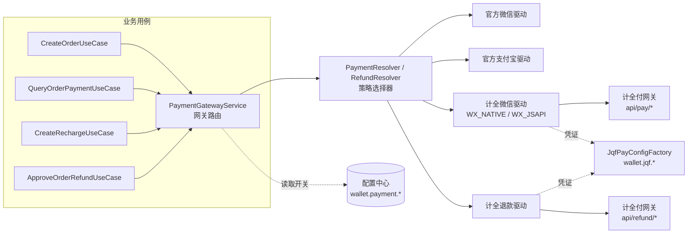
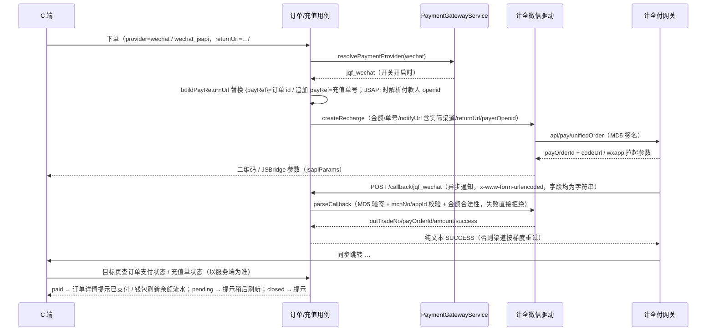
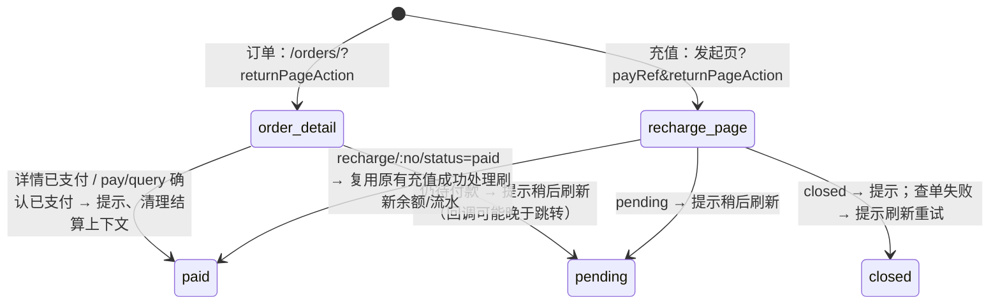

# 支付网关抽象与计全付接入

## 1. 功能目标与非目标

**目标**

- 把「支付方式」（微信扫码 / 微信公众号 JSAPI / 支付宝）与「执行网关」（官方直连 / 计全付聚合）解耦：同一支付方式可在管理端「支付配置」页一键切换网关，业务层（订单、充值、退款）不感知网关差异。
- 接入计全付（jeepay 协议，见仓库根目录 `jqfpay-skill/`）：微信扫码（WX_NATIVE）、微信公众号（WX_JSAPI）、支付宝扫码（ALI_QR）下单、查单、异步回调验签、原路退款；用户提现走计全付转账（`api/transferOrder`，支付宝 ALIPAY_CASH / 微信零钱 WX_CASH），结果由转账通知 + 主动查单收敛（提现状态机见 [wallet.md](./wallet.md)）。
- 平台内部钱包仍是主账本（余额/冻结/流水/展示）；充值、订单支付、退款、提现的真实资金经计全付渠道处理，渠道手续费（计全付 `mchFeeAmount` / `mchOrderFeeAmount + mchApicostFeeAmount`）落到充值单/订单/提现单的 `channelFeeFen` 供财务对账。
- 支付配置可视化：管理端「支付配置」菜单页，平台超管可维护微信支付 / 支付宝支付 / 用户提现三个网关开关与计全付凭证（网关地址 / mchNo / appId / apiKey）。
- 同步跳转回应用：复用官方渠道支付成功后的既有落点，不新增支付结果页。下单上送 `returnUrl=…/#/orders/{payRef}`（服务端替换为订单 id → 直接回订单详情），充值上送发起充值的页面地址（钱包页 / 结算页，服务端追加 `payRef=充值单号`）；计全付支付完成后携 `returnPageAction` 跳回，目标页**以服务端查单结果为准**再走原有成功处理（订单详情提示已支付；钱包/结算页刷新余额与流水）。
- 充值支持微信公众号 JSAPI：微信内且后台开启 `wallet.wechat.jsapiEnabled` 时，充值直接拉起微信收银台（与订单结算页一致），不再只能展示二维码。

**非目标**

- 不接入计全付「钱包」产品（特约商户托管钱包，需身份证+银行卡开户，不支持提到微信零钱/支付宝），也不调用商户自身余额提现 `api/cashout`。
- 不接入计全付分账：分账需先绑定接收方且比例受通道上限约束（微信官方默认 30%），与平台打手提成比例冲突，属业务模式决策，提成仍由内部钱包记账。
- 不改动订单 / 充值 / 退款 / 提现的业务状态机；数据模型仅新增渠道手续费与提现渠道快照字段（migration `1786200000000`）。
- 同步跳转参数（`returnPageAction` 等）不作为支付成功依据，入账仍只由异步回调与主动查单完成；不新增对账定时任务。

## 2. 目录结构与分层职责

```text
apps/server/src/modules/wallet/
├── application/
│   ├── payment-gateway.service.ts     # 网关路由：官方渠道 → 实际执行渠道（按配置开关）
│   ├── pay-return-url.ts              # 回跳地址写入业务单据：替换 {payRef} 占位符或追加 payRef（兼容 hash 路由，校验 128 字符上限）
│   ├── wechat-jsapi-payer.service.ts  # 公众号 JSAPI 付款人 openid（开关 + 微信身份），充值/订单共用
│   ├── payment.resolver.ts            # 支付渠道策略选择器（已有，复用）
│   └── refund.resolver.ts             # 退款渠道策略选择器（已有，复用）
└── infrastructure/drivers/
    ├── jqf-pay.config.ts              # 计全付凭证装配（配置中心 wallet.jqf.*，缺失拒绝资金请求）
    ├── jqf-pay.request.ts             # MD5 签名/验签、公共参数、HTTP 调用与响应包裹解析
    ├── jqf-pay.trade.ts               # 统一下单/查单/回调解析等交易公共函数
    ├── jqf-wechat-payment.driver.ts   # 计全微信扫码（WX_NATIVE，payDataType=codeUrl）
    ├── jqf-wechat-jsapi-payment.driver.ts # 计全微信公众号（WX_JSAPI，payData 为 JSBridge 拉起参数）
    ├── jqf-alipay-payment.driver.ts   # 计全支付宝扫码（ALI_QR）
    ├── jqf-refund.driver.ts           # 计全原路退款（微信 Native/JSAPI 与支付宝各一个 provider）
    └── jqf-transfer.driver.ts         # 计全转账：支付宝 ALIPAY_CASH / 微信零钱 WX_CASH（发起/查单/通知验签）
apps/server/src/modules/wallet/application/
    ├── withdrawal-settlement.service.ts        # 提现渠道结果 → 账本状态收敛（审核/通知/查单共用）
    └── use-cases/handle-withdrawal-callback.usecase.ts / sync-withdrawal.usecase.ts

apps/web/src/views/finance/PaymentConfigView.vue   # 管理端「支付配置」页
packages/contracts/src/wallet/wallet.ts            # PaymentProvider 新增 jqf_* 渠道、PaymentGateway 枚举、回跳契约 PAY_RETURN_URL_MAX_LENGTH/PAY_RETURN_REF_PLACEHOLDER/PAY_RETURN_QUERY_KEYS

apps/client/src/
├── utils/pay-return.ts                # 生成 returnUrl（origin+pathname+#/目标页）、识别回跳访问、读取/清理 payRef（hash query / location.search 兼容）
├── composables/use-pay-return-recharge.ts  # 钱包页/结算页挂载时消费 payRef：查充值单状态，paid 复用页面原有充值成功处理
├── views/order/OrderDetailView.vue    # 订单回跳落点：回跳访问且仍待付款时调 pay/query 确认，已付提示并清理结算上下文
├── views/wallet/WalletView.vue        # 充值回跳落点（钱包页）：paid → 刷新余额与流水
├── components/order/CheckoutPaymentMethods.vue  # 充值回跳落点（结算页）：paid → 刷新余额
└── components/wallet/RechargeDialog.vue  # 微信内 + 开关开启时走 wechat_jsapi 拉起收银台，否则二维码
```

设计模式：**策略模式**（`PaymentPort`/`RefundPort` 多驱动注册，Resolver 按渠道挑选）+ **适配器模式**（计全付驱动把 jeepay 协议适配为仓库统一的支付/退款端口）+ **网关路由**（`PaymentGatewayService` 按配置把官方渠道映射为实际执行渠道）。计全付渠道即普通策略成员，后续接入新聚合网关只需新增驱动并在 `PaymentGatewayService` 补映射。

## 3. 模块结构图



## 4. 支付时序图



### 同步回跳在目标页的处理



- 目标页先 `router.replace` 清掉 `payRef`/`returnPageAction`，刷新页面不重复查单；`returnPageAction=SUCCESS_PAGE` 本身不作为支付依据。

## 5. 配置项与状态

| 配置键 | 说明 |
| --- | --- |
| `wallet.payment.wechatGateway` | 微信支付网关：`official` 官方直连 / `jqf` 计全付（扫码与 JSAPI 一起切换） |
| `wallet.payment.alipayGateway` | 支付宝网关：`official` 官方直连 / `jqf` 计全付（ALI_QR 扫码，退款走 `JqfAlipayRefundDriver`） |
| `wallet.payout.gateway` | 提现网关：`official` 官方支付宝转账 / `jqf` 计全付转账（支付宝 + 微信零钱）；提现单创建时固定执行渠道 |
| `wallet.notifyBaseUrl` | 回调公网基地址；转账通知为 `{notifyBaseUrl}/wallet/withdrawal/callback/{jqf_alipay\|jqf_wechat}` |
| `wallet.jqf.apiBase` | 计全付网关地址（必须 `https://`，末尾不带 `/`） |
| `wallet.jqf.mchNo` / `wallet.jqf.appId` | 计全付商户号与应用 appId |
| `wallet.jqf.apiKey` | 接口私钥（**敏感项密文保存，不回显**；编辑留空表示保持原值） |

- 渠道枚举：`PaymentProvider` 新增 `jqf_wechat` / `jqf_wechat_jsapi` / `jqf_alipay`，`PayoutProvider` 新增 `jqf_alipay` / `jqf_wechat`；回调路由 `/wallet/recharge/callback/:provider`、`/order/pay/callback/:provider` 复用现有控制器，按渠道分发驱动。
- 订单支付方式不感知网关：`toOrderPaymentMethod` 把计全渠道回归对应微信支付方式；充值单持久化实际执行渠道，回调/查单不受后续网关切换影响。
- 计全付协议要点：MD5 签名（key ASCII 字典序 + `&key=apiKey` 后取大写 MD5）、金额单位分、`reqTime` 东八区 `yyyyMMddHHmmss`、支付成功 `state=2`、应答 `SUCCESS`。
- 异步回调为表单编码，`state`/`amount` 到达时是字符串：`parseJqfCallback` 接受十进制整数字符串，非整数（如 `5.00`、`paid`）拒绝；回调 `mchNo`/`appId` 必须与配置一致；成功回调缺金额或金额非法拒绝。入账时仍由订单/充值回调用例比对单据金额并幂等。
- 同步跳转契约（`packages/contracts` `PAY_RETURN_*`）：`returnUrl` 含 `{payRef}` 占位符时服务端原位替换为单据 id（订单 → `#/orders/<id>`），否则在末尾追加 `payRef=<充值单号>`（充值 → `#/wallet?payRef=…`）；计全付再追加 `returnPageAction=SUCCESS_PAGE|CANCEL_PAGE`（及 `mchOrderNo` 等通知参数）。C 端为 hash 路由，参数落在 `#` 之后进入 `route.query`；充值目标页同时兼容参数被拼在 `#` 之前的情形。`returnUrl` 受计全付字段长度限制（128），写入后超长直接拒绝下单。
- 充值 `provider` 对客户端仅开放 `alipay` / `wechat` / `wechat_jsapi`（`RECHARGE_PAYMENT_PROVIDERS`），内部 `jqf_*` 渠道由服务端按网关配置映射，客户端不可直选。

## 6. 权限与安全边界

- 「支付配置」页挂在财务分组菜单（`finance:payment:menu`）；配置写入走配置中心统一入口，**平台全局配置仅平台超管可改**（租户管理员被 `UpsertConfigUseCase` 拒绝）。
- `apiKey` 标记 `secret`：列表接口返回掩码，编辑留空不清空原值，前端不回显。
- 计全付凭证缺失或网关地址非 HTTPS 时，`JqfPayConfigFactory` 直接拒绝发起任何资金请求（`ServiceUnavailableException`），不带凭证明文的报错提示指引到「支付配置」页。
- 回调验签失败、商户号/appId 不匹配、金额非法均抛 `BadRequestException`，不落账、不回 SUCCESS；日志不记录 apiKey 与回调原文中的敏感字段。
- 同步跳转不可信：目标页不读取回跳参数中的金额/状态入账，只用路径中的订单 id / `payRef` 定位单据并调登录态查单接口（`GET /wallet/recharge/:outTradeNo/status`、`GET /order/:id/pay/query`，均按当前用户隔离）；订单详情、钱包、结算页均 `requiresAuth`，未登录先跳登录后回到原地址。
- JSAPI 付款人 openid 由服务端从当前登录用户的微信身份解析，不接受客户端上送；开关关闭或未绑定微信时拒绝并提示。

## 7. 异常与失败恢复

- 下单/查单：网关不可达抛 `BadGatewayException`（业务可提示稍后重试）；业务失败（`code!=0`）抛带渠道 msg 的 `BadRequestException`。
- 退款为资金操作，遵循与官方渠道一致的「结果未知不误判」原则：
  - 传输失败 / 响应异常 → `RefundOutcomeUnknownError`，上层保留处理中状态并主动查询；
  - 业务报错先按 `mchRefundNo` 查退款单，已存在以查询结果为准（幂等），确认不存在才判失败；
  - 状态映射：`state=2` 成功 / `state=3` 失败（截取 errMsg ≤255）/ 其余处理中。
- 网关切换风险：查单与退款按「当前」网关配置路由；**切换网关前先处理完在途待支付订单**（充值单已持久化实际渠道，不受影响）。
- 异步通知丢失/延迟：充值弹层与结算弹层在打开期间轮询查单（页面恢复可见时补查）；用户跳去微信付款后由回跳目标页（订单详情 / 钱包 / 结算页）再查一次单；两条查单路径与回调共用幂等入账，不会重复加余额。
- JSAPI 拉起取消/失败：弹层保留充值单，提示后可重新拉起；支付成功以查单为准，不凭 JSBridge 返回值入账。
- 回跳地址写入业务参数后超过 128 字符会拒绝下单（`BadRequestException`）；该地址由 C 端部署域名决定，属于部署期可发现的确定性错误，不会在线上随机出现。

## 8. 测试与验证

- 单测 `apps/server/test/wallet/jqf-pay.spec.ts`：签名规则（排序/过滤空值/大写 MD5）、验签接受与篡改拒绝、回调成功/未支付映射、表单字符串数值兼容与非整数拒绝、mchNo/appId 不匹配拒绝、东八区时间戳、网关路由（开启计全付微信切换 / 支付宝始终官方 / 官方直通）。
- 单测 `apps/server/test/wallet/create-recharge.spec.ts`：回跳地址（`{payRef}` 占位符替换与编码 / 无占位符追加 payRef / 已带 query / `?x#/...` / 超长拒绝）、Native 充值透传 returnUrl 且 `jsapiParams=null`、JSAPI 充值解析 openid 并返回拉起参数、低于下限不落充值单。
- C 端 Vitest `apps/client/src/utils/pay-return.spec.ts` / `composables/use-pay-return-recharge.spec.ts`：回跳地址生成、回跳访问识别、payRef 读取（hash query / location.search）与清理、充值查单结果映射（paid/pending/closed/error）。
- 既有订单用例单测通过直通网关桩（`test/order/payment-gateway.stub.ts`）聚焦自身逻辑。
- 提现链路单测 `test/wallet/jqf-transfer.spec.ts`（转账驱动：状态映射/验签/手续费/发起失败分类/查单）与 `test/wallet/withdrawal-settlement.spec.ts`（审核、通知、查单三条路径的状态收敛与幂等），详见 [wallet.md](./wallet.md)。
- 真实计全付回调/跳转/转账未在沙箱环境验证（无商户凭证），上线后需小额实测；本地验证结果以每次交付汇报为准。

## 9. 尚未实现与后续路线

- 计全付回调通知的对账任务（当前依赖异步通知 + 用户侧查单兜底，与官方渠道一致）；提现「转账中」单据目前由财务手动同步，定时自动同步待后续。
- 计全付分账（接收方绑定 + 通道比例上限）需业务确认后再评估。
- 官方微信商家转账驱动仍为占位（`available=false`），微信零钱提现需开启计全付提现网关。
- 渠道下单失败时已落库的 pending 充值单没有自动关单（既有行为，不影响余额），后续可结合对账任务定时关闭。
- 同步跳转只在计全付渠道有效；官方微信/支付宝渠道忽略 `returnUrl`，仍依赖弹层轮询与回调。
- 真实计全付回调与同步跳转需在具备商户凭证的环境验证一次（本次仅单测与构建）。
- 支付配置页仅平台级；如需租户级网关开关，需把配置键纳入租户覆盖白名单并评估资金归集问题。
