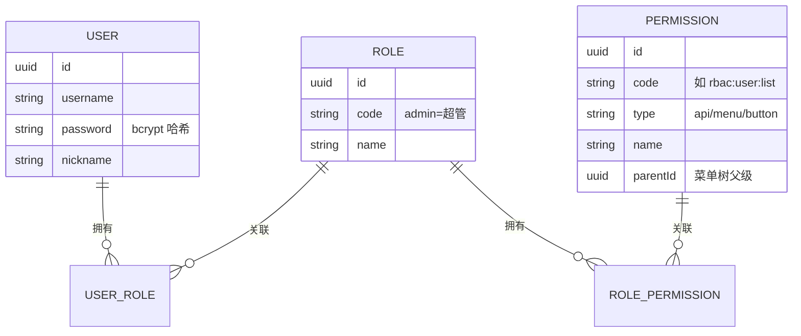
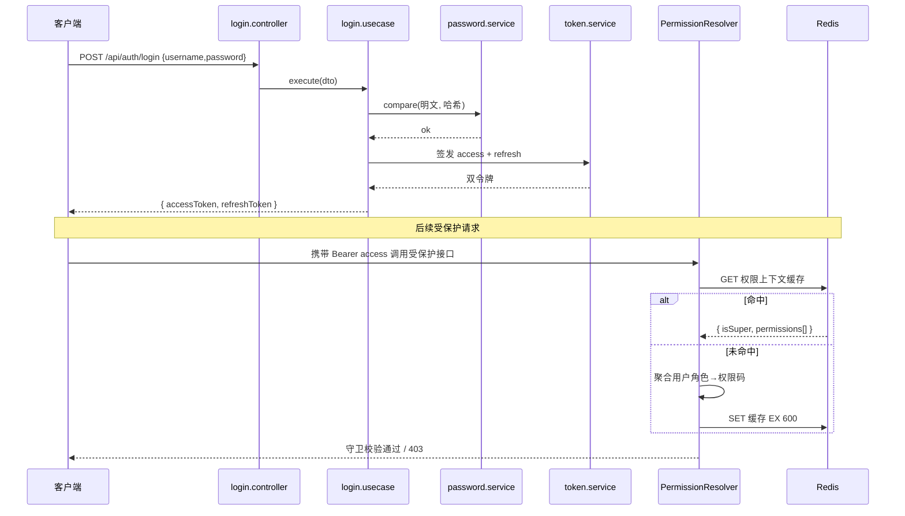

# RBAC 权限管理

## 模块职责

基于 **用户 / 角色 / 权限** 三层模型的权限系统，权限颗粒度细到 **API / 菜单 / 按钮** 三种类型。
JWT **双令牌**（access + refresh）鉴权，超级管理员走 bypass 拥有全部权限。

实现的功能：

- **认证**：注册、登录（发放双令牌）、刷新令牌、获取当前用户 profile。
- **用户管理**：列表/创建/更新/删除、给用户分配角色。
- **角色管理**：列表/创建/更新/删除、给角色分配权限。
- **权限管理**：列表/创建/更新/删除（权限带类型：api/menu/button）。
- **鉴权基础设施**：JWT 守卫 + 权限守卫，`@Public` / `@Permissions` 装饰器，`@CurrentUser` 注入。
- **权限解析缓存**：`PermissionResolver` 将用户的扁平权限码集合缓存到 Redis（TTL 600s），超管直接放行。
- **启动播种**：创建超级管理员角色 `admin` 与初始管理员账号，按权限码登记处播种 api 权限，并按 contracts `MENU_DEFINITIONS` 播种 menu 权限（菜单码按「业务命名空间 + `:menu`」组织，如 `rbac:user:menu`、`im:service:menu`，使其与同域接口/按钮权限归并到同一棵权限树；启动时清理不在清单内的历史 menu 权限）。
- **可见菜单下发**：`GET /rbac/menus/mine` 返回当前用户可见菜单（按其授权码过滤，超管全量），前端据此渲染菜单并动态注册路由。

## 目录结构（DDD 四层）

```
modules/rbac/
├── domain/
│   ├── user.entity.ts / role.entity.ts / permission.entity.ts
│   ├── *-repository.interface.ts        三个仓储端口
│   ├── permission-codes.ts              权限码常量（与 contracts 同步）
│   ├── permission-defaults.ts           默认权限/菜单清单
│   └── rbac.constants.ts                SUPER_ADMIN_ROLE 等领域常量
├── application/
│   ├── permission-resolver.service.ts   解析并缓存用户权限上下文（Redis 600s）
│   ├── token.service.ts                 签发/校验 access & refresh 令牌
│   ├── {user,role,permission}.mapper.ts 实体 ↔ DTO
│   └── use-cases/                       20 个用例，一个动作一个文件
├── infrastructure/
│   ├── {user,role,permission}.repository.ts  TypeORM 仓储
│   ├── password.service.ts              bcrypt 加解密
│   └── rbac.seeder.ts                   超管/管理员/权限播种
└── interfaces/
    ├── auth/                            guards / strategy / decorators
    ├── dto/                             各操作入参 DTO（class-validator 校验）
    └── controllers/                     18 个控制器，一个路由一个文件
```

## 实体关系



## 登录与鉴权流程



## 权限校验（守卫链）

```mermaid
flowchart LR
  REQ[请求] --> JG[JwtAuthGuard]
  JG -->|@Public 跳过| PASS1[放行]
  JG -->|校验 access 令牌| PG[PermissionsGuard]
  PG -->|无 @Permissions 要求| PASS2[放行]
  PG -->|isSuper=true| PASS3[放行]
  PG -->|拥有所需权限码| PASS4[放行]
  PG -->|否则| DENY[403 Forbidden]
```

- `@Public()`：标记免鉴权端点（登录、注册、刷新）。
- `@Permissions(code)`：声明端点所需权限码，由 `PermissionsGuard` 校验。
- `@CurrentUser()`：将解析出的登录身份注入控制器方法参数。
- **超管 bypass**：`isSuper` 为真时所有权限校验直接放行；其 profile 的显式 `permissions` 为空，前端据 `isSuper` 字段同步放行（见 [frontend.md](./frontend.md)）。

## 权限颗粒度

| 类型 | 用途 | 示例 |
| --- | --- | --- |
| `api` | 后端接口级，`@Permissions` 引用 | `rbac:user:list` |
| `menu` | 前端菜单可见性，路由 `meta.permission` | `rbac:user:list` |
| `button` | 前端按钮级，`v-permission` 指令 | `rbac:user:create` |

权限码集中定义在 `packages/contracts/src/rbac/permission-codes.ts`（`PERMS`），后端控制器、播种器、前端路由与指令复用同一份常量。

## 设计要点

- **解析器 + 缓存**：`PermissionResolver` 把"用户→角色→权限码"的多表聚合结果缓存到 Redis，避免每次请求重复 JOIN。
- **端口-适配器**：用例只依赖仓储接口，TypeORM 实现可替换。
- **用例粒度**：20 个动作各自独立文件，符合"一个函数只做一件事"。
- **密码安全**：`password.service` 用 bcrypt，明文密码不落库、不出现在响应。

## 相关端点

详见 [api-reference.md](./api-reference.md#rbac-权限)。
