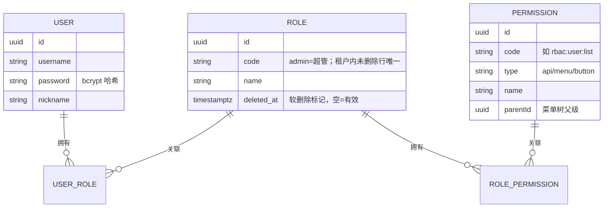
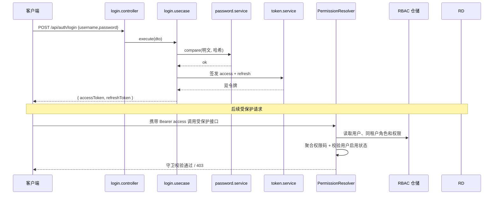
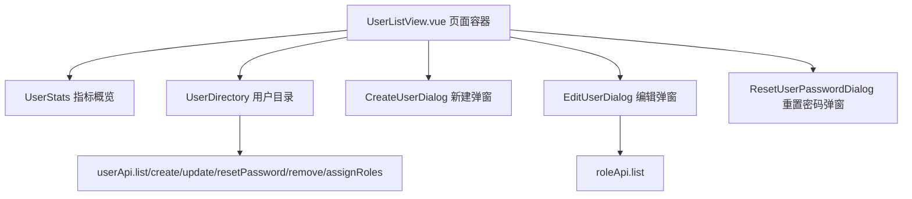
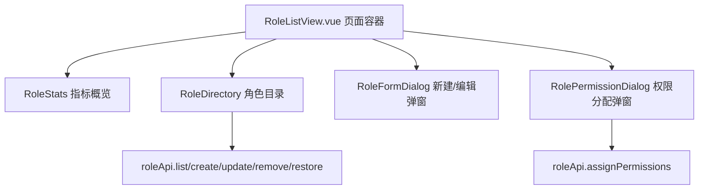
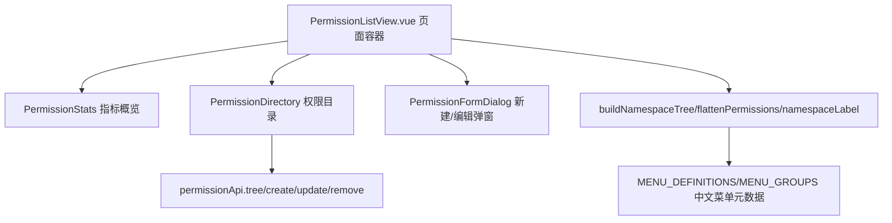

# RBAC 权限管理

## 模块职责

基于 **用户 / 角色 / 权限** 三层模型的权限系统，权限颗粒度细到 **API / 菜单 / 按钮** 三种类型。
JWT **双令牌**（access + refresh）鉴权，超级管理员走 bypass 拥有全部权限。

实现的功能：

- **认证**：注册、登录（发放双令牌）、刷新令牌、获取当前用户 profile。
- **用户管理**：列表/搜索筛选/创建/更新/删除、重置用户密码、给用户分配角色。
- **角色管理**：列表/创建/更新/软删除/恢复、给角色分配权限；仅默认租户的平台超管角色禁止删除。
- **权限管理**：列表/创建/更新/删除（权限带类型：api/menu/button）。
- **鉴权基础设施**：JWT、租户访问与权限三段守卫；`@TenantPublic` 建立免登录租户上下文，
  `@PlatformOnly` 保护租户/权限目录，`@Permissions` 校验业务权限。
- **权限实时解析**：`PermissionResolver` 每次从用户真实角色聚合权限，不做跨请求缓存，用户停用、撤权和租户停用立即生效。
- **启动播种**：创建超级管理员角色 `admin` 与初始管理员账号，按权限码登记处播种 api 权限，并按 contracts `MENU_DEFINITIONS` 播种 menu 权限（菜单码按「业务命名空间 + `:menu`」组织，如 `rbac:user:menu`、`im:service:menu`，使其与同域接口/按钮权限归并到同一棵权限树；启动时清理不在清单内的历史 menu 权限）。内置角色只在缺失时新建（新建的 `tenant_admin`、`member`、`booster` 不带权限，`service` 带客服工作台默认权限）；**已存在的角色不回填、不新增任何权限**，管理员手动收窄的授权不会因部署/重启而恢复。启动时唯一的角色权限写操作是从非默认租户角色中剔除平台级权限（只删不增）。
- **可见菜单下发**：`GET /rbac/menus/mine` 返回当前用户可见菜单（按其授权码过滤，超管全量），前端据此渲染菜单并动态注册路由。

## 目录结构（DDD 四层）

```
modules/rbac/
├── domain/
│   ├── user.entity.ts / role.entity.ts / permission.entity.ts
│   ├── *-repository.interface.ts        三个仓储端口
│   ├── permission-codes.ts              权限码常量（与 contracts 同步）
│   ├── permission-defaults.ts           默认权限/菜单清单
│   └── rbac.constants.ts                SUPER_ADMIN_ROLE 等领域常量
├── application/
│   ├── permission-resolver.service.ts   实时解析用户、角色、权限和租户安全上下文
│   ├── token.service.ts                 签发/校验 access & refresh 令牌
│   ├── {user,role,permission}.mapper.ts 实体 ↔ DTO
│   └── use-cases/                       21 个用例，一个动作一个文件
├── infrastructure/
│   ├── {user,role,permission}.repository.ts  TypeORM 仓储
│   ├── password.service.ts              bcrypt 加解密
│   └── rbac.seeder.ts                   超管/管理员/权限播种
└── interfaces/
    ├── auth/                            guards / strategy / decorators
    ├── dto/                             各操作入参 DTO（class-validator 校验）
    └── controllers/                     19 个控制器，一个路由一个文件
```

## 实体关系


```mermaid
erDiagram
  USER ||--o{ USER_ROLE : 拥有
  ROLE ||--o{ USER_ROLE : 关联
  ROLE ||--o{ ROLE_PERMISSION : 拥有
  PERMISSION ||--o{ ROLE_PERMISSION : 关联

  USER {
    uuid id
    string username
    string password "bcrypt 哈希"
    string nickname
  }
  ROLE {
    uuid id
    string code "admin=超管；租户内未删除行唯一"
    string name
    timestamptz deleted_at "软删除标记，空=有效"
  }
  PERMISSION {
    uuid id
    string code "如 rbac:user:list"
    string type "api/menu/button"
    string name
    uuid parentId "菜单树父级"
  }
```

## 登录与鉴权流程


```mermaid
sequenceDiagram
  participant C as 客户端
  participant Lg as login.controller
  participant LU as login.usecase
  participant PW as password.service
  participant TK as token.service
  participant PR as PermissionResolver
  participant DB as RBAC 仓储

  C->>Lg: POST /api/auth/login {username,password}
  Lg->>LU: execute(dto)
  LU->>PW: compare(明文, 哈希)
  PW-->>LU: ok
  LU->>TK: 签发 access + refresh
  TK-->>LU: 双令牌
  LU-->>C: { accessToken, refreshToken }

  Note over C,RD: 后续受保护请求
  C->>PR: 携带 Bearer access 调用受保护接口
  PR->>DB: 读取用户、同租户角色和权限
  PR->>PR: 聚合权限码 + 校验用户启用状态
  PR-->>C: 守卫校验通过 / 403
```

## 权限校验（守卫链）

```mermaid
flowchart LR
  REQ[请求] --> JG[JwtAuthGuard]
  JG -->|@Public / @TenantPublic 跳过 JWT| TG[TenantAccessGuard]
  JG -->|校验 access 令牌| TG
  TG -->|解析公开租户/核对 JWT 与 header| PG[PermissionsGuard]
  PG -->|无 @Permissions 要求| PASS2[放行]
  PG -->|isSuper=true| PASS3[放行]
  PG -->|拥有所需权限码| PASS4[放行]
  PG -->|否则| DENY[403 Forbidden]
```

- `@TenantPublic()`：登录、注册、刷新和公开业务接口免 JWT，但必须解析并校验租户。
- `@Public()`：仅用于支付、充值等由业务标识恢复租户且依赖外部签名的回调。
- `@PlatformOnly()`：只有默认租户的 `admin` 超级管理员可访问。
- `@Permissions(code)`：声明端点所需权限码，由 `PermissionsGuard` 校验。
- `@CurrentUser()`：将解析出的登录身份注入控制器方法参数。
- **超管 bypass**：用户和 `admin` 角色必须都属于固定默认租户才产生 `isSuper`；子租户
  创建同名角色不能越权。其 profile 的显式 `permissions` 为空，前端据 `isSuper` 放行。
- **租户管理员边界**：内置 `tenant_admin` 创建时不带任何权限，由平台超管在角色授权页按需授予；
  可授予范围排除平台级权限——租户/权限目录、会员等级、打手等级、押金策略、实名策略、邀请奖励
  五类全局写权限，以及角色的创建/修改/删除/授权四个角色管理写权限（`isPlatformOnlyPermission`）。
  对应 Controller 同时由 `@PlatformOnly()` 作后端二次保护，启动播种器还会剔除租户角色中遗留的平台级权限。
- **角色管理边界**：`POST/PATCH/DELETE /rbac/roles`、`PUT /rbac/roles/:id/permissions`、
  `GET /rbac/roles/grantable-permissions` 仅默认租户平台超管可用；租户管理员只能查看本租户角色，
  并通过 `PUT /rbac/users/:id/roles` 把本租户已有角色分配给本租户用户（绑定跨租户角色返回 403）。
- **内置角色生命周期**：`admin`、`tenant_admin`、`member`、`service`、`booster`（contracts
  `BUILTIN_ROLE_OPTIONS`，服务端 `RESERVED_ROLE_CODES` 同源）由系统播种或领域流程维护；若某租户内缺失，
  平台超管可通过 `POST /rbac/roles` 直接补建，仅受租户内编码唯一约束（重复返回 409 `角色编码已存在`）。
  非默认租户内补建的 `admin` 不会获得平台超管旁路（`PermissionResolver` 仅承认默认租户的 `admin`）。
  `RoleView.isBuiltin` 标识内置编码，`isSuper` 仅标识 `admin`，`deletable` 标识是否允许删除。
- **角色软删除与恢复**：`DELETE /rbac/roles/:id` 只标记 `rbac_role.deleted_at`（TypeORM `@DeleteDateColumn`），
  不删除 `rbac_user_role` / `rbac_role_permission` 关联行；唯一不可删的是默认租户的 `admin`（409），其余内置编码
  与自定义角色均可删，角色不存在返回 404。已删角色在默认查询、用户角色加载与 `PermissionResolver`（基于
  `findByIds` 实时读取角色）中自动失效，持有者立即失去对应权限。
  `POST /rbac/roles/:id/restore`（复用 `rbac:role:remove`，`@PlatformOnly`）恢复后原有绑定与权限重新生效；
  若同编码角色已被重建则返回 409，未删除/不存在返回 404。租户内编码唯一约束改为部分唯一索引
  `UQ_rbac_role_tenant_code_alive`（`WHERE deleted_at IS NULL`），因此软删后可重建同编码角色；migration
  `1786300000000-add-rbac-role-soft-delete.ts`（`down` 会物理清除已软删行后恢复全量唯一索引）。启动播种器
  用 `existsByCodeForTenantWithDeleted` 判重，不会复活管理员已删除的内置角色。
- **角色列表筛选**：`GET /rbac/roles` 支持 `keyword`（名称/编码模糊）、`code`（编码精确，用于按内置编码
  分类查看）、`kind=builtin|custom|deleted`（内置/自定义/已删除分类，`deleted` 只返回软删除行），均经
  `ListRolesQueryDto` 校验；`code` 与 `kind` 同时传入时以 `code` 为准，`keyword` 与编码条件叠加时只匹配名称。
  查询仍经租户作用域过滤。

## 权限颗粒度

| 类型 | 用途 | 示例 |
| --- | --- | --- |
| `api` | 后端接口级，`@Permissions` 引用 | `rbac:user:list` |
| `menu` | 前端菜单可见性，路由 `meta.permission` | `rbac:user:list` |
| `button` | 前端按钮级，`v-permission` 指令 | `rbac:user:create` |

权限码集中定义在 `packages/contracts/src/rbac/permission-codes.ts`（`PERMS`），后端控制器、播种器、前端路由与指令复用同一份常量。

## 设计要点

- **实时权限解析**：`PermissionResolver` 聚合“用户→同租户角色→权限码”，同时返回用户启用状态、真实租户和默认租户超管判定；角色权限关系变化无需等待缓存失效。
- **端口-适配器**：用例只依赖仓储接口，TypeORM 实现可替换。
- **用例粒度**：21 个动作各自独立文件，符合"一个函数只做一件事"。
- **密码安全**：`password.service` 用 bcrypt，明文密码不落库、不出现在响应。
- **租户开通事务**：`TenantProvisioningTransaction` 端口保证租户与四类内置角色同事务创建；不再同步创建初始管理员账号，账号由平台超管在用户管理中单独创建。
- **租户/账号/角色解耦**：创建用户与创建角色支持 `tenantId` 可选入参，仅平台超管可指定其他租户，缺省归当前请求租户；非超管指定其他租户返回 403，目标租户不存在返回 400，绑定跨租户角色返回 403。
- **编辑变更所属租户**：`PATCH /rbac/users/:id` 支持可选 `tenantId`，仅平台超管可变更（非超管 403）；目标租户不存在返回 400，用户名/手机号在目标租户已占用返回 409；角色属于租户，迁移时自动解绑原租户全部角色，需在目标租户重新分配；持有平台超管角色的账号不可迁移（403）。

## 相关端点

详见 [api-reference.md](./api-reference.md#rbac-权限)。

## 前端用户管理页

`/rbac/users` 是 RBAC 用户目录的页面容器，只编排现有 `userApi` / `roleApi`，
不把后端权限规则写进视图层。展示组件通过 props 接收用户、角色、分页与状态格式化
函数，通过事件把新建、编辑、删除、翻页交回页面容器处理。

已实现能力：

- 用户总数、本页启用、绑定手机、已分配角色四类概览。
- 用户目录保持表格视图，窄屏通过目录容器横向滚动，平台超管额外显示所属租户。
- 目录表格复用 `AppDataTable`，统一 Element Plus 表格的横向滚动与最小宽度策略。
- 列表支持关键词、状态和角色筛选；关键词匹配用户 ID、用户名、昵称和手机号，角色筛选仅在当前用户拥有 `rbac:role:list` 时加载角色目录并展示。
- 分页使用 Element Plus `sizes`，支持选择每页 10/20/50/100 条并回到第一页重新查询。
- 新建用户弹窗维护用户名、密码、昵称、手机号；平台超管额外选择所属租户（必选，租户目录按需加载）。
- 编辑用户弹窗维护昵称、手机号、启停状态、多角色绑定；平台超管额外可变更所属租户（切换租户后角色选项过滤为目标租户角色并清空已选，保存后原租户角色自动解绑）。一个账号可同时拥有多个角色（如用户 + 打手，上限见 contracts `USER_ROLES_MAX`）。
- 重置密码使用独立抽屉和 `POST /api/rbac/users/:id/password/reset`，后端复用 bcrypt 哈希和权限缓存失效能力，不回显旧密码。
- 按钮权限继续沿用 `v-permission`，重置密码复用 `rbac:user:update`，接口调用仍复用 `userApi` 与 `roleApi`。


```mermaid
flowchart TD
  Page["UserListView.vue 页面容器"] --> Stats["UserStats 指标概览"]
  Page --> Directory["UserDirectory 用户目录"]
  Page --> CreateDialog["CreateUserDialog 新建弹窗"]
  Page --> EditDialog["EditUserDialog 编辑弹窗"]
  Page --> ResetDialog["ResetUserPasswordDialog 重置密码弹窗"]
  Directory --> UserApi["userApi.list/create/update/resetPassword/remove/assignRoles"]
  EditDialog --> RoleApi["roleApi.list"]
```

## 前端角色管理页

`/rbac/roles` 是 RBAC 角色目录的页面容器，只编排现有 `roleApi` 与权限分配弹窗；
展示组件通过 props 接收角色、分页和时间格式化函数，通过事件把新建、编辑、删除、
分配权限和翻页交回页面容器处理。

已实现能力：

- 角色总数、内置角色、可配置角色、已绑定权限四类概览。
- 筛选栏：按名称/编码关键词搜索，按编码分类（全部 / 各内置编码 / 自定义角色 / 已删除（可恢复））查看；搜索、改分类、重置均回到第一页。
- 新建角色的编码为可搜索下拉：直接选内置编码补建（租户内重复时后端 409；名称为空时自动带出内置名称），或输入自定义编码回车新增（`allow-create`）；类型列区分内置超管 / 内置·xx / 自定义角色 / 已删除。
- 删除为软删除：删除按钮仅对 `deletable=false`（默认租户平台超管）禁用，确认框提示持有者立即失去权限、可在「已删除」分类恢复；「已删除（可恢复）」分类展示回收站（时间列改为删除时间），行操作只保留「恢复」（二次确认，按钮权限复用 `rbac:role:remove`，调 `roleApi.restore`）。
- 角色目录保持表格视图，窄屏通过目录容器横向滚动。
- 目录表格复用 `AppDataTable`，避免不同 RBAC 页面重复维护滚动容器样式。
- 分页使用 Element Plus `sizes`，支持选择每页 10/20/50/100 条并回到第一页重新查询。
- 新建/编辑角色弹窗维护编码、名称、备注，编辑态编码下拉禁用只读（自定义编码以「自定义（xx）」展示）；平台超管新建时额外选择所属租户（必选，租户目录按需加载）。
- 分配权限继续复用 `RolePermissionDialog` 与 `roleApi.assignPermissions`。
- 按钮权限继续沿用 `v-permission`，接口调用仍复用 `roleApi`。


```mermaid
flowchart TD
  Page["RoleListView.vue 页面容器"] --> Stats["RoleStats 指标概览"]
  Page --> Directory["RoleDirectory 角色目录"]
  Page --> FormDialog["RoleFormDialog 新建/编辑弹窗"]
  Page --> PermissionDialog["RolePermissionDialog 权限分配弹窗"]
  Directory --> RoleApi["roleApi.list/create/update/remove/restore"]
  PermissionDialog --> AssignApi["roleApi.assignPermissions"]
```

## 前端权限管理页

`/rbac/permissions` 是 RBAC 权限目录的页面容器，只编排现有 `permissionApi`
和 `PermissionFormDialog`；权限树仍由 `buildNamespaceTree` 按权限码命名空间派生，
不在视图层硬编码业务模块。

已实现能力：

- 权限总数、命名空间、接口权限、前端权限四类概览。
- 权限目录保持树形视图，展示分组、权限类型、权限码以及路由或接口信息。
- 根命名空间显示中文模块名（如 `rbac` 显示为「角色与权限」），菜单命名空间优先复用 contracts `MENU_DEFINITIONS` 的标题，无菜单承载和历史兼容命名空间（如旧 `player`、`penalty`）集中在 `permission-tree.ts` 映射。
- 窄屏通过目录容器横向滚动，避免树节点操作区遮挡。
- 新增顶级权限和命名空间子权限，新增时自动带入权限码前缀。
- 编辑/删除真实权限节点，虚拟分组只提供新增子权限入口。
- 按钮权限继续沿用 `v-permission`，接口调用仍复用 `permissionApi`。


```mermaid
flowchart TD
  Page["PermissionListView.vue 页面容器"] --> Stats["PermissionStats 指标概览"]
  Page --> Directory["PermissionDirectory 权限目录"]
  Page --> FormDialog["PermissionFormDialog 新建/编辑弹窗"]
  Page --> TreeUtil["buildNamespaceTree/flattenPermissions/namespaceLabel"]
  TreeUtil --> MenuMeta["MENU_DEFINITIONS/MENU_GROUPS 中文菜单元数据"]
  Directory --> PermissionApi["permissionApi.tree/create/update/remove"]
```
