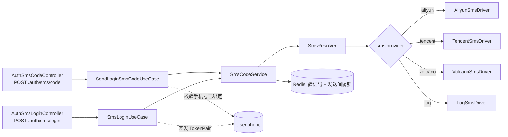

# 短信登录

多云短信验证码登录，**策略模式 + 配置驱动**：阿里云 / 腾讯云 / 火山引擎 / 日志模拟四套驱动统一实现 `SmsPort` 接口，运行时由配置中心 `sms.provider` 选择，新增服务商只需实现接口并注册，上层用例不变。

## 设计

```
modules/sms/
├── domain/sms-port.interface.ts        SmsPort 策略接口 + SMS_PORTS 注入令牌
├── application/
│   ├── sms.resolver.ts                 按 sms.provider 解析当前生效驱动
│   └── sms-code.service.ts             验证码生成/Redis 存储/发送限流/校验消费
└── infrastructure/drivers/
    ├── log-sms.driver.ts               日志模拟（默认，无密钥联调）
    ├── aliyun-sms.driver.ts            @alicloud/dysmsapi20170525
    ├── tencent-sms.driver.ts           tencentcloud-sdk-nodejs-sms v20210111
    └── volcano-sms.driver.ts           @volcengine/openapi
```



## 流程

1. **发码** `POST /auth/sms/code` `{ phone }`：
   - 校验手机号已绑定**启用中**的账号（不存在直接拒绝，**不自动注册**）；
   - 命中发送间隔（`sms.code.sendInterval`）则限流拒绝；
   - 生成定长随机验证码（CSPRNG），交由当前驱动发送，成功后写入 Redis（TTL=`sms.code.ttl`）并置发送间隔锁；
   - 返回 `{ cooldown }` 供前端倒计时。验证码本身**绝不回传**。
2. **登录** `POST /auth/sms/login` `{ phone, code }`：
   - 校验并消费验证码（一次性，校验通过即删除）；
   - 按手机号取启用账号，签发与账号密码登录同一套 `TokenPair`。

## 账号绑定

- `User` 实体新增 `phone` 字段（空串表示未绑定）；非空手机号的**唯一性在应用层校验**。
- 在「用户管理」新建/编辑用户时维护手机号；仅已绑定手机号的现有用户可短信登录。

## 配置（全部在配置中心 `sms.*`）

| key | 默认 | 说明 |
| --- | --- | --- |
| `sms.provider` | `log` | 生效服务商：aliyun/tencent/volcano/log |
| `sms.code.length` | `6` | 验证码位数 |
| `sms.code.ttl` | `300` | 验证码有效期（秒） |
| `sms.code.sendInterval` | `60` | 同号两次发送最小间隔（秒，限流） |
| `sms.countryCode` | `+86` | 国际区号（腾讯云等需带区号） |
| `sms.aliyun.*` | — | accessKeyId/accessKeySecret/signName/templateCode/endpoint |
| `sms.tencent.*` | — | secretId/secretKey/sdkAppId/signName/templateId/region |
| `sms.volcano.*` | — | accessKeyId/secretAccessKey/smsAccount/signName/templateId/region |

> 凭证类（accessKey/secret）标记为 secret，在配置中心脱敏展示。默认 `provider=log` 时不真正发短信，仅把验证码打到后端日志，便于无密钥联调。各云模板的验证码变量约定为 `${code}`（腾讯云按模板参数顺序，验证码为第一个）。
