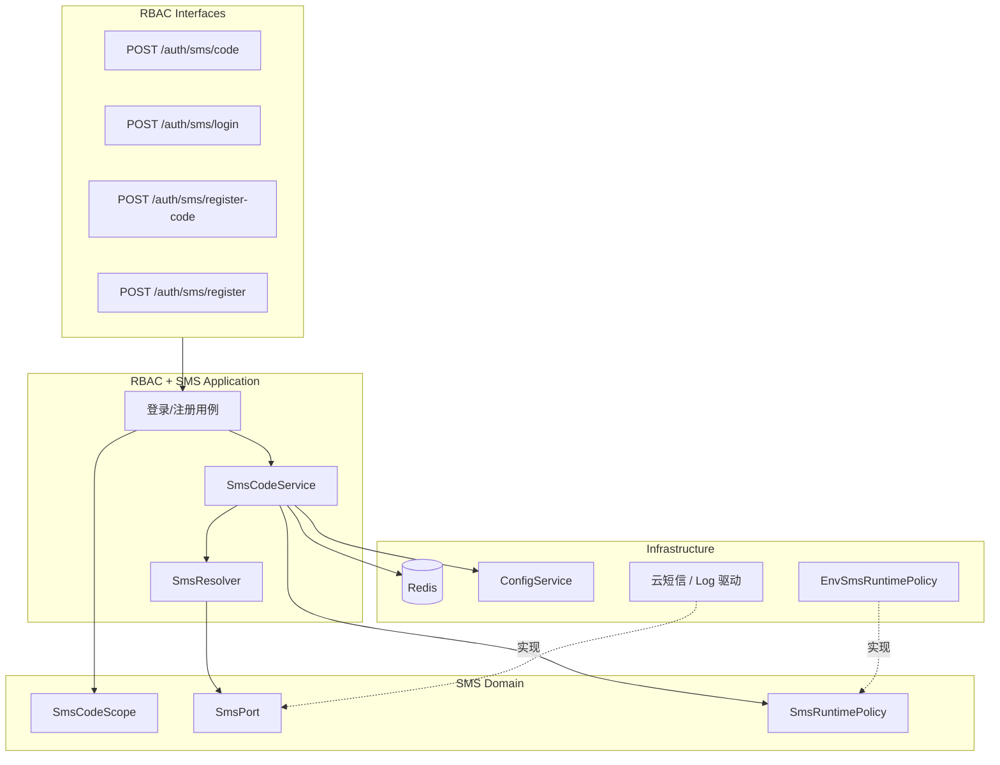
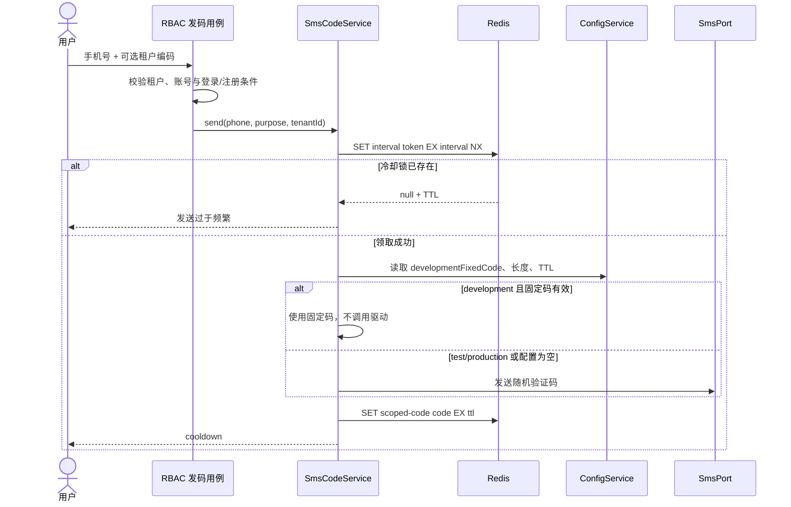
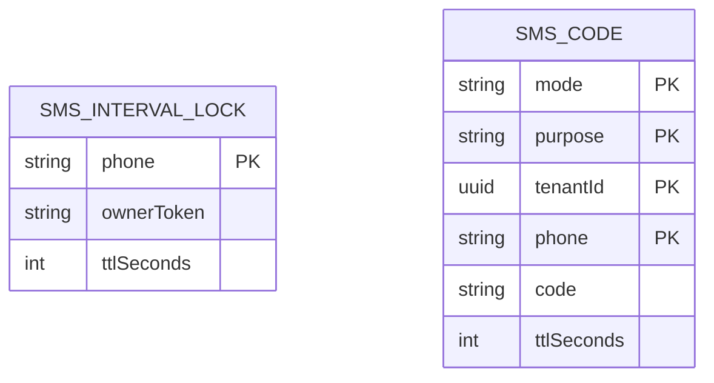
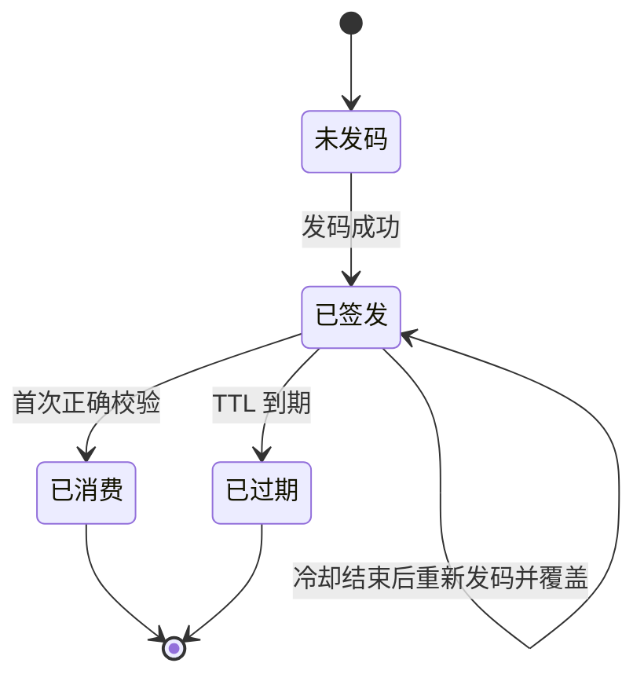

# 短信验证码

短信模块为登录和注册提供统一验证码能力。开发环境可使用配置中心固定码完成稳定联调，生产环境只允许真实短信驱动；两种模式都复用同一套发码入口、Redis 有效期、发送冷却和一次性消费规则。

## 功能目标与边界

已实现：

- 登录、注册分别发码和校验，验证码按租户、用途隔离。
- `NODE_ENV=development` 且 `sms.development.fixedCode` 非空时，使用固定码并跳过短信驱动；默认值为 `000000`。
- 固定码仍必须先调用发码接口写入 Redis，不能直接提交登录；校验成功后立即消费。
- 生产环境忽略固定码配置，并拒绝 `sms.provider=log`，必须配置阿里云、腾讯云或火山引擎驱动。
- 发码冷却通过 Redis `SET NX EX` 原子领取；验证码通过 Lua 比较后删除，防止并发重复消费。
- 日志驱动只记录脱敏手机号，不记录验证码或完整手机号。

非目标：

- 不在前端预填手机号或验证码，不自动创建开发账号。
- 不绕过手机号已绑定、账号启用、租户启用等现有认证规则。
- 不新增数据库表或修改 HTTP DTO；配置项由现有配置播种器幂等补齐，无 migration。
- 当前发送冷却按手机号全局生效，不按租户或用途拆分；IP、设备维度风控不在本次范围。

## 目录与职责

```text
modules/sms/
├── domain/
│   ├── sms-port.interface.ts             短信驱动端口
│   ├── sms-code-scope.ts                 租户与登录/注册用途作用域
│   └── sms-runtime-policy.interface.ts   运行环境只读端口
├── application/
│   ├── sms.resolver.ts                   驱动解析与生产环境安全门
│   └── sms-code.service.ts               发码、冷却、Redis 存储与原子消费
└── infrastructure/
    ├── env-sms-runtime.policy.ts         NODE_ENV 运行策略适配器
    └── drivers/
        ├── log-sms.driver.ts             脱敏日志模拟
        ├── aliyun-sms.driver.ts          阿里云短信
        ├── tencent-sms.driver.ts         腾讯云短信
        └── volcano-sms.driver.ts         火山引擎短信
```

认证 Controller 与登录/注册用例仍位于 RBAC 模块。Controller 只校验 DTO 并调用用例；RBAC 用例负责账号、租户规则并把 `SmsCodeScope` 传给短信应用服务。


```mermaid
flowchart TB
  subgraph Presentation["RBAC Interfaces"]
    SendLogin["POST /auth/sms/code"]
    Login["POST /auth/sms/login"]
    SendRegister["POST /auth/sms/register-code"]
    Register["POST /auth/sms/register"]
  end
  subgraph Application["RBAC + SMS Application"]
    AuthUseCases["登录/注册用例"]
    SmsCode["SmsCodeService"]
    Resolver["SmsResolver"]
  end
  subgraph Domain["SMS Domain"]
    Scope["SmsCodeScope"]
    SmsPort["SmsPort"]
    RuntimePort["SmsRuntimePolicy"]
  end
  subgraph Infrastructure["Infrastructure"]
    Redis[(Redis)]
    Config["ConfigService"]
    EnvPolicy["EnvSmsRuntimePolicy"]
    Drivers["云短信 / Log 驱动"]
  end

  Presentation --> AuthUseCases --> SmsCode
  AuthUseCases --> Scope
  SmsCode --> Redis
  SmsCode --> Config
  SmsCode --> RuntimePort
  SmsCode --> Resolver --> SmsPort
  EnvPolicy -.实现.-> RuntimePort
  Drivers -.实现.-> SmsPort
```

## 业务流程

### 发码


```mermaid
sequenceDiagram
  actor User as 用户
  participant Auth as RBAC 发码用例
  participant Sms as SmsCodeService
  participant Redis as Redis
  participant Config as ConfigService
  participant Driver as SmsPort

  User->>Auth: 手机号 + 可选租户编码
  Auth->>Auth: 校验租户、账号与登录/注册条件
  Auth->>Sms: send(phone, purpose, tenantId)
  Sms->>Redis: SET interval token EX interval NX
  alt 冷却锁已存在
    Redis-->>Sms: null + TTL
    Sms-->>User: 发送过于频繁
  else 领取成功
    Sms->>Config: 读取 developmentFixedCode、长度、TTL
    alt development 且固定码有效
      Sms->>Sms: 使用固定码，不调用驱动
    else test/production 或配置为空
      Sms->>Driver: 发送随机验证码
    end
    Sms->>Redis: SET scoped-code code EX ttl
    Sms-->>User: cooldown
  end
```

驱动或 Redis 写入失败时，服务只删除自己持有 token 的冷却锁，允许修复后重试；不会删除其他并发请求的新锁。

### 校验与登录

1. 登录用例先解析租户并确认手机号对应启用账号；注册用例先解析目标租户。
2. `SmsCodeService.verify` 依据当前环境和配置选择固定码或标准码命名空间。
3. Redis Lua 脚本仅在值匹配时删除 key；同一验证码并发校验最多一个请求成功。
4. 登录继续签发现有 `TokenPair`；注册继续创建普通用户并签发令牌。

固定码与标准码使用不同命名空间。运行期间清空固定码后，之前尚未消费的固定码立即不可用于校验，并在 TTL 到期后自动清理；在两个非空固定码之间切换时，已签发验证码仍按原值存活到消费或 TTL 到期，新发码会覆盖它。

## 数据模型与状态

本功能不写 PostgreSQL，也没有 migration。以下为 Redis 逻辑数据模型：


```mermaid
erDiagram
  SMS_INTERVAL_LOCK {
    string phone PK
    string ownerToken
    int ttlSeconds
  }
  SMS_CODE {
    string mode PK
    string purpose PK
    uuid tenantId PK
    string phone PK
    string code
    int ttlSeconds
  }
```

| 数据     | Redis key                                                             | 生命周期                                      |
| -------- | --------------------------------------------------------------------- | --------------------------------------------- |
| 发送冷却 | `sms:code:interval:{phone}`                                           | 原子领取；发送失败按 token 释放；否则到期删除 |
| 验证码   | `sms:code:{development-fixed\|standard}:{purpose}:{tenantId}:{phone}` | 发码成功写入；匹配后原子删除；否则到期删除    |


```mermaid
stateDiagram-v2
  [*] --> 未发码
  未发码 --> 已签发: 发码成功
  已签发 --> 已消费: 首次正确校验
  已签发 --> 已过期: TTL 到期
  已签发 --> 已签发: 冷却结束后重新发码并覆盖
  已消费 --> [*]
  已过期 --> [*]
```

## API 与权限

HTTP 契约：

| API                                | 请求                                      | 结果           | 规则                         |
| ---------------------------------- | ----------------------------------------- | -------------- | ---------------------------- |
| `POST /api/auth/sms/code`          | `{ phone, tenantCode? }`                  | `{ cooldown }` | 登录注册合一：未注册手机号也可发码，已禁用账号拒绝 |
| `POST /api/auth/sms/login`         | `{ phone, code, tenantCode? }`            | `SmsLoginResult` | 登录码匹配并一次性消费；首登自动注册 member 并回传 `registered` 标记 |
| `POST /api/auth/sms/register-code` | `{ phone, tenantCode? }`                  | `{ cooldown }` | 仅未注册手机号可发注册码（保留兼容旧客户端） |
| `POST /api/auth/sms/register`      | `{ phone, code, nickname?, tenantCode? }` | `TokenPair`    | 注册码匹配后创建普通用户（保留兼容旧客户端，C 端已改用登录注册合一） |

认证端点保持公开，但受手机号状态、租户、Redis 冷却与验证码约束。固定码配置通过现有配置中心维护，查看与修改继续使用 `config:list`、`config:save` 权限。

## 配置

| key                         | 默认值   | 说明                                                          |
| --------------------------- | -------- | ------------------------------------------------------------- |
| `auth.smsLoginEnabled` | `true` | 手机号验证码登录/注册总开关；关闭后发码与短信登录注册接口均 403，可与微信登录共存或二选一 |
| `sms.development.fixedCode` | `000000` | 仅精确的 `NODE_ENV=development` 生效；4 至 8 位数字；清空关闭 |
| `sms.provider`              | `log`    | `aliyun` / `tencent` / `volcano` / `log`；生产禁止 `log`      |
| `sms.code.length`           | `6`      | 随机验证码位数                                                |
| `sms.code.ttl`              | `300`    | 验证码有效期（秒）                                            |
| `sms.code.sendInterval`     | `60`     | 同一手机号两次发码最小间隔（秒）                              |
| `sms.countryCode`           | `+86`    | 国际区号                                                      |
| `sms.aliyun.*`              | -        | 阿里云凭证、签名、模板与 endpoint                             |
| `sms.tencent.*`             | -        | 腾讯云凭证、应用、签名、模板与地域                            |
| `sms.volcano.*`             | -        | 火山引擎凭证、账号、签名、模板与地域                          |

开发固定码配置为空时恢复短信驱动；若此时仍选择 `log`，日志不会输出验证码，因此不能据此完成登录。生产部署必须配置真实服务商及其密钥、签名和模板。

## 异常、安全与恢复

- `NODE_ENV` 必须显式为 `development`、`test` 或 `production`；非法或缺失时服务启动失败，避免环境误判。
- `test` 与 `production` 都忽略固定码。任何标准发码流程选择 `log` 都明确失败；开发固定码路径不会调用驱动。
- 固定码配置非法时发码返回服务端错误并释放冷却锁；修正配置后可立即重试。
- Redis 不可用时发码或校验失败，不降级为无状态固定码，避免绕过一次性消费和有效期。
- 验证码不返回前端、不进入日志；日志手机号脱敏。配置中心的云凭证继续按 secret 脱敏。
- 作用域隔离阻止登录码用于注册、跨租户使用；固定码只改变验证码来源，不改变权限或账号校验。
- 删除或清空配置不需要清理数据库；未消费 Redis key 由 TTL 自动清理。

## 测试范围

- 单元测试：开发固定码、配置清空、生产忽略、非法配置、并发发码、开发/生产日志驱动禁用、日志脱敏。
- Redis E2E：真实 Redis 下并发领取、用途隔离和并发一次性消费。
- HTTP 验收：开发环境先发码，再以 `000000` 登录现有已绑定手机号；响应只检查成功与令牌存在，不输出手机号或令牌。
- 全仓检查：`pnpm lint`、`pnpm typecheck`、`pnpm test`、`pnpm test:e2e:postgres`、`pnpm build`、`pnpm build:server`、`git diff --check`。仓库未配置 `pnpm format:check`。

2026-07-23 实际验证结果：服务端单元测试 155 项、管理端 35 项、C 端 50 项全部通过；PostgreSQL/Redis/HTTP E2E 38 项全部通过；lint、typecheck、全仓构建、服务端构建和 diff 检查通过。重启本地服务后，真实 HTTP 发码与登录均返回 200，令牌对存在，同码重放返回 401。`format:check` 脚本未配置，因此未声称该项通过。

## 尚未实现与风险

- 未提供开发账号或前端自动填充；开发者仍需使用已有绑定手机号并点击发送验证码。
- 当前只有手机号维度冷却，没有 IP、设备、失败次数或黑名单风控；公网认证接口需要在网关或后续风控模块补强。
- 清空固定码会立即切换命名空间；直接删除配置项则会在下次启动时被播种器恢复为默认值，应保存空串来持久关闭。
