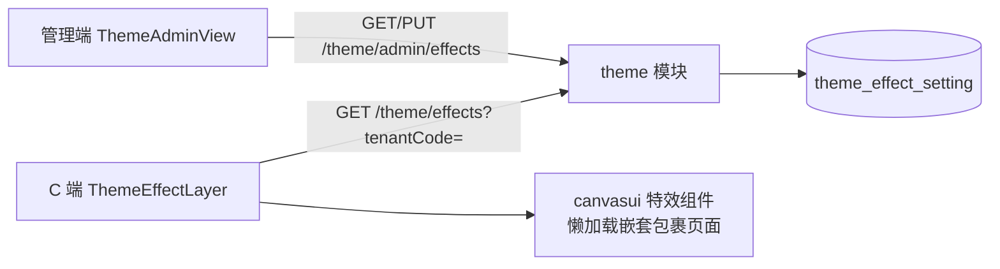

# 主题特效（Canvas UI 背景特效）

## 功能目标

- 管理端按租户配置 C 端启用的全站背景特效（可多选同时启用，空即全部关闭）。
- C 端首次进入按租户编码拉取配置，用启用的特效组件逐层包裹页面内容渲染。
- 多租户隔离：管理端读写走登录租户上下文；C 端公开接口按显式租户编码解析。

## 已实现能力

- 4 个 [Canvas UI](https://canvasui.dev) 特效（Vue 版源码按官方 shadcn 方式落库于 `apps/client/src/components/canvasui/`，为第三方原样引入，不受本仓库 500 行文件上限约束）：
  - `clouds` 云雾漂浮、`blaze` 底部火焰、`laser` 激光扫描、`grid` 3D 瓷砖波纹。
- 服务端 `theme` 模块（DDD 四层）+ 建表 migration `AddThemeEffectSetting1785800000000`。
- 管理端「主题特效」菜单页（勾选保存，权限 `theme:effects:list` / `theme:effects:save`）。
- C 端 `ThemeEffectLayer` 挂在 `MainLayout`，特效组件按需懒加载，不进入首屏包。

## 非目标

- 未提供每个特效的参数（颜色/强度等）可视化调参；当前使用组件默认参数。
- 未注册 Chrome Origin Trial；生产域名如需免开关生效，需自行注册并下发 token。

## 浏览器兼容与降级

特效基于 Chrome html-in-canvas API：本地体验需开启 `chrome://flags/#canvas-draw-element`；
生产可为域名注册 Chrome Origin Trial 免开关生效。不支持的浏览器中组件自动降级——
内容按普通 HTML 渲染、无特效、无报错。

## 目录结构

```text
apps/server/src/modules/theme/
├── domain/          theme-setting.entity.ts（每租户至多一条，effects 存 JSON 数组文本）
│                    theme-setting-repository.interface.ts
├── application/     theme.mapper.ts（JSON 解析 + sanitizeThemeEffects 安全回退）
│                    use-cases/（管理端读/写、C 端公开读）
├── infrastructure/  theme-setting.repository.ts（管理端按租户上下文过滤）
└── interfaces/      controllers/（公开 GET、管理 GET/PUT）、dto/
```

共享契约：`packages/contracts/src/theme/theme.ts`（`ThemeEffect` 枚举、
`THEME_EFFECT_OPTIONS` 选项、`sanitizeThemeEffects` 清洗函数）。

## 模块结构图



## 业务时序


## 数据模型

`theme_effect_setting`：BaseEntity 审计字段 + `tenant_id`（索引）+ `effects text default '[]'`。
每租户至多一条，管理端保存为整量覆盖（upsert）。

## API 与权限

| 接口 | 权限 | 说明 |
| --- | --- | --- |
| `GET /theme/effects?tenantCode=` | 公开 | C 端读取本租户启用特效；租户编码经 TenantResolver 显式解析，缺省落默认租户，杜绝跨租户下发 |
| `GET /theme/admin/effects` | `theme:effects:list` | 管理端读当前租户配置 |
| `PUT /theme/admin/effects` | `theme:effects:save` | 整量覆盖；DTO 按枚举逐项校验，用例再经 sanitize 去重 |

## 异常与降级

- 配置缺失、JSON 损坏或含非法值：`sanitizeThemeEffects` 安全回退（过滤/空列表）。
- C 端接口失败：`ThemeEffectLayer` 静默降级为直接渲染内容。
- 浏览器不支持 html-in-canvas：特效组件自动降级为普通 HTML。

## 测试与验证

- 单测 `apps/server/test/theme/theme-effects.spec.ts`：清洗过滤/去重、JSON 损坏回退、
  公开接口租户解析（缺省默认租户/显式租户）、更新用例整量覆盖持久化。
- `pnpm lint` / `pnpm typecheck` / `pnpm build` / `pnpm test` 全绿。
- 未做真实数据库 migration 执行与浏览器端到端验证。

## 风险与后续扩展

- 特效对低端设备有性能开销；建议按需启用 1-2 个。
- 后续可扩展：特效参数调参、按页面粒度启用、接入更多 Canvas UI 组件（在
  `ThemeEffectLayer` 的映射表与契约枚举登记即可）。
