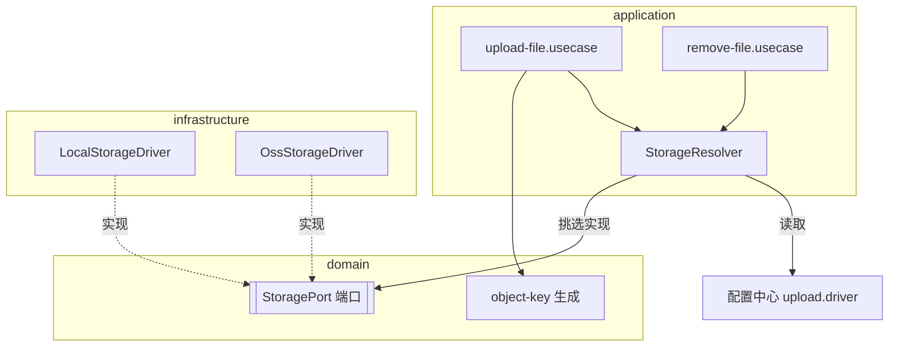
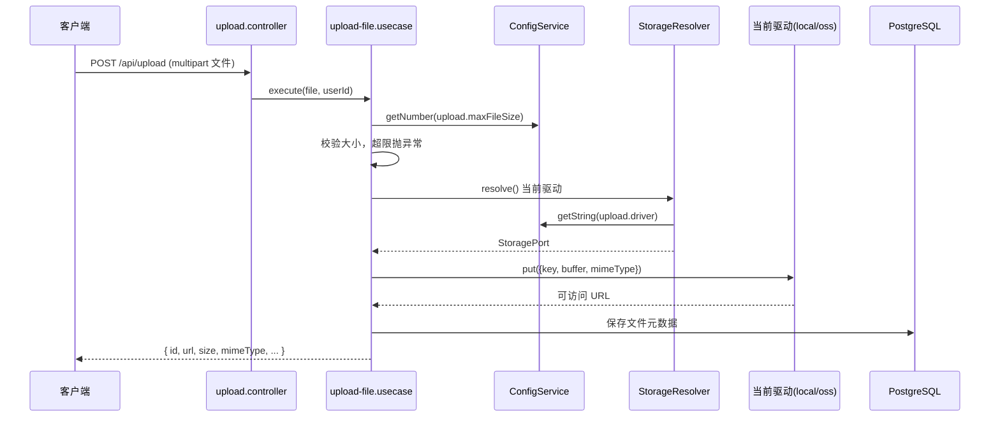

# 文件上传（Upload）

## 模块职责

文件上传服务，支持 **本地（local，默认）** 与 **OSS** 两种存储，运行时由**配置中心**选择具体驱动。
采用**策略模式 + 端口-适配器**，新增存储方式只需实现 `StoragePort` 并注册，上层用例无需改动。

实现的功能：

- **上传**：接收文件，按配置校验大小上限，由当前驱动落地并返回可访问 URL，元数据入库。
- **列表**：分页查询已上传文件元数据。
- **删除**：删除存储对象的同时清理数据库记录（返回 204）。
- **驱动切换**：读配置中心 `upload.driver` 即可在 local / oss 间切换，无需改代码或重启。
- **凭证安全**：OSS endpoint/bucket/ak/sk 全部存配置中心，密钥项脱敏返回。

## 目录结构（DDD 四层）

```
modules/upload/
├── domain/
│   ├── uploaded-file.entity.ts          文件元数据实体
│   ├── file-repository.interface.ts     仓储端口
│   ├── storage-driver.interface.ts      StoragePort 策略端口 + STORAGE_PORTS 令牌
│   └── object-key.ts                    对象 key 生成（按日期+uuid，避免碰撞）
├── application/
│   ├── storage.resolver.ts              按配置中心挑选当前驱动
│   ├── file.mapper.ts                   实体 ↔ DTO
│   └── use-cases/
│       ├── upload-file.usecase.ts
│       ├── list-files.usecase.ts
│       └── remove-file.usecase.ts
├── infrastructure/
│   ├── drivers/
│   │   ├── local-storage.driver.ts      落盘 + 静态 URL
│   │   └── oss-storage.driver.ts        阿里云 OSS
│   └── file.repository.ts               TypeORM 仓储
└── interfaces/controllers/
    ├── upload.controller.ts             POST   /api/upload
    ├── file.list.controller.ts          GET    /api/upload/files
    └── file.remove.controller.ts        DELETE /api/upload/files/:id
```

## 策略模式结构



`STORAGE_PORTS` 令牌聚合所有已注册策略，`StorageResolver` 运行时读 `upload.driver` 从集合中挑选 `driver` 字段匹配的实现。

## 上传流程



删除流程对称：先由解析出的驱动 `remove(key)` 删对象，再删数据库记录，整体保证存储与元数据一致。

## 设计要点

- **策略模式 + 配置驱动**：切换存储无需改代码，体现"对扩展开放、对修改关闭"。
- **应用层统一生成 key**：`object-key` 负责对象命名（日期分目录 + uuid），驱动只负责落字节，职责清晰。
- **大小上限走配置中心**：`upload.maxFileSize` 可热调，不是写死常量。
- **删除一致性**：存储对象与数据库记录同删，避免孤儿文件/记录。

## 相关端点

详见 [api-reference.md](./api-reference.md#文件上传)。
