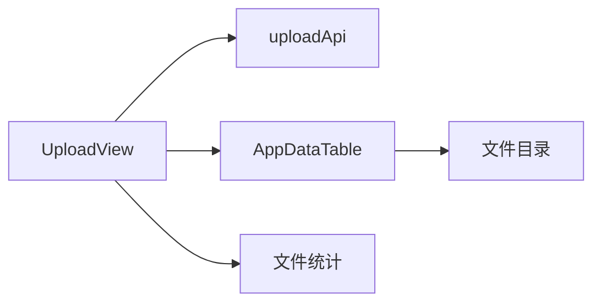
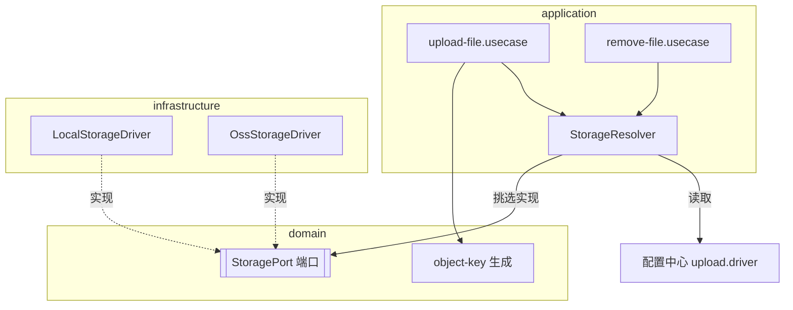
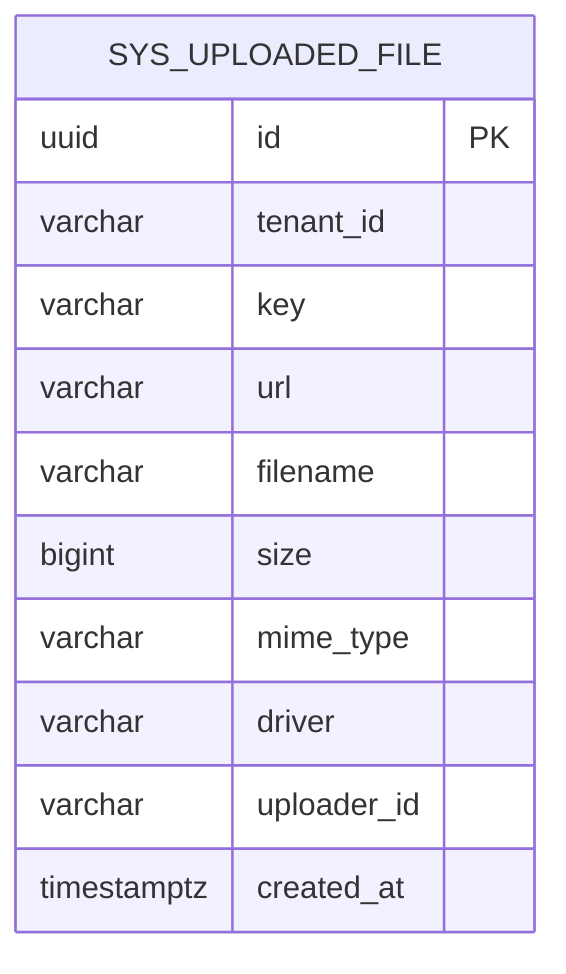
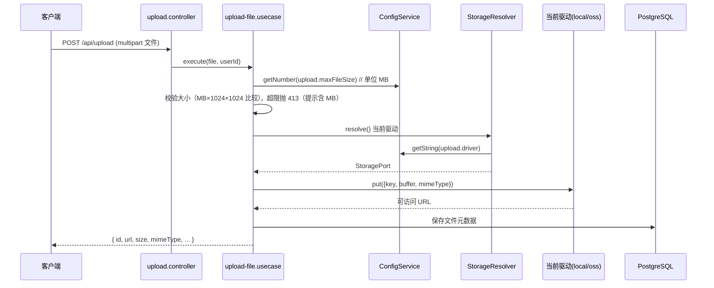
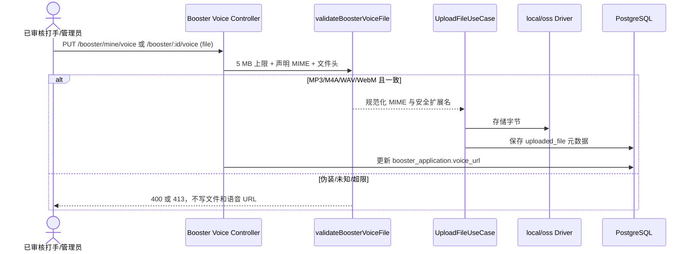

# 文件上传（Upload）

## 模块职责

文件上传服务，支持 **本地（local，默认）** 与 **OSS** 两种存储，运行时由**配置中心**选择具体驱动。
采用**策略模式 + 端口-适配器**，新增存储方式只需实现 `StoragePort` 并注册，上层用例无需改动。

实现的功能：

- **上传**：接收文件，按配置校验大小上限，由当前驱动落地并返回可访问 URL，元数据入库。
- **登录用户自助上传**：`POST /api/upload/self` 无需后台上传权限，供头像、实名证件、打手材料和订单备注附件等本人业务入口复用。
- **列表**：分页查询已上传文件元数据。
- **删除**：删除存储对象的同时清理数据库记录（返回 204）。
- **驱动切换**：读配置中心 `upload.driver` 即可在 local / oss 间切换，无需改代码或重启。
- **凭证安全**：OSS endpoint/bucket/ak/sk 全部存配置中心，密钥项脱敏返回。
- **前端文件库**：`UploadView` 提供文件统计、上传入口、分页目录、访问链接和删除操作；表格复用 `AppDataTable`，窄屏通过统一横向滚动避免字段遮挡。
- **打手语音复用**：语音由 booster 模块专用接口先做 5 MB、MIME 与文件头双重校验，再复用 `UploadFileUseCase` 和当前存储驱动，不把音频安全规则塞入通用上传模块。

明确非目标：通用上传接口不负责图片/视频内容嗅探、病毒扫描、内容审核、转码或引用计数；清空业务字段只移除 URL，不会自动删除旧对象。

## 目录结构（DDD 四层）

```
modules/upload/
├── domain/
│   ├── uploaded-file.entity.ts          文件元数据实体
│   ├── file-repository.interface.ts     仓储端口
│   ├── storage-driver.interface.ts      StoragePort 策略端口 + STORAGE_PORTS 令牌
│   └── object-key.ts                    对象 key 生成（按日期+uuid，避免碰撞）
├── application/
│   ├── storage.resolver.ts              按配置中心挑选当前驱动
│   ├── file.mapper.ts                   实体 ↔ DTO
│   └── use-cases/
│       ├── upload-file.usecase.ts
│       ├── list-files.usecase.ts
│       └── remove-file.usecase.ts
├── infrastructure/
│   ├── drivers/
│   │   ├── local-storage.driver.ts      落盘 + 静态 URL
│   │   └── oss-storage.driver.ts        阿里云 OSS
│   └── file.repository.ts               TypeORM 仓储
└── interfaces/controllers/
    ├── upload.controller.ts             POST   /api/upload
    ├── upload.self.controller.ts        POST   /api/upload/self
    ├── file.list.controller.ts          GET    /api/upload/files
    └── file.remove.controller.ts        DELETE /api/upload/files/:id
```

## 前端页面结构

```
apps/web/src/views/upload/
├── UploadView.vue                       上传页状态、上传/删除/分页交互
├── UploadView.css                       桌面端文件库、统计卡片、表格单元样式
└── UploadView.responsive.css            窄屏布局与操作区响应式
```

`UploadView` 不承载存储策略判断，只展示接口返回的 `driver`、`size`、`mimeType`、`createdAt` 等元数据；上传失败仍交给全局 HTTP 拦截器提示，页面只处理成功反馈与文件输入重置。


```mermaid
flowchart LR
  PAGE[UploadView]
  API[uploadApi]
  TABLE[AppDataTable]
  STATS[文件统计]
  LIST[文件目录]

  PAGE --> API
  PAGE --> STATS
  PAGE --> TABLE
  TABLE --> LIST
```

## 策略模式结构


```mermaid
flowchart TB
  subgraph application
    UU[upload-file.usecase]
    RU[remove-file.usecase]
    SR[StorageResolver]
  end
  subgraph domain
    PORT[[StoragePort 端口]]
    KEY[object-key 生成]
  end
  subgraph infrastructure
    LOCAL[LocalStorageDriver]
    OSS[OssStorageDriver]
  end
  CC[配置中心 upload.driver]

  UU --> SR
  RU --> SR
  SR -->|读取| CC
  SR -->|挑选实现| PORT
  LOCAL -. 实现 .-> PORT
  OSS -. 实现 .-> PORT
  UU --> KEY
```

`STORAGE_PORTS` 令牌聚合所有已注册策略，`StorageResolver` 运行时读 `upload.driver` 从集合中挑选 `driver` 字段匹配的实现。

## 数据模型与 Migration

`sys_uploaded_file` 只保存对象元数据，不保存二进制；`tenantId + uploaderId` 记录归属，`key` 和 `driver` 用于删除时定位同一存储策略。


```mermaid
erDiagram
  SYS_UPLOADED_FILE {
    uuid id PK
    varchar tenant_id
    varchar key
    varchar url
    varchar filename
    bigint size
    varchar mime_type
    varchar driver
    varchar uploader_id
    timestamptz created_at
  }
```

本次语音/目录功能没有新增上传表或 migration；`1784332800000-add-booster-directory-order-selection.ts` 只增加 `booster_application.voice_url`，对象仍通过 `sys_uploaded_file` 元数据和当前驱动保存。仓库暂未提供从空库创建全部历史表的 baseline，生产环境不得以 `synchronize` 代替正式 migration。

## 上传流程


```mermaid
sequenceDiagram
  participant C as 客户端
  participant Ctl as upload.controller
  participant UU as upload-file.usecase
  participant Cfg as ConfigService
  participant SR as StorageResolver
  participant DRV as 当前驱动(local/oss)
  participant DB as PostgreSQL

  C->>Ctl: POST /api/upload (multipart 文件)
  Ctl->>UU: execute(file, userId)
  UU->>Cfg: getNumber(upload.maxFileSize) // 单位 MB
  UU->>UU: 校验大小（MB×1024×1024 比较），超限抛 413（提示含 MB）
  UU->>SR: resolve() 当前驱动
  SR->>Cfg: getString(upload.driver)
  SR-->>UU: StoragePort
  UU->>DRV: put({key, buffer, mimeType})
  DRV-->>UU: 可访问 URL
  UU->>DB: 保存文件元数据
  UU-->>C: { id, url, size, mimeType, ... }
```

删除流程对称：先由解析出的驱动 `remove(key)` 删对象，再删数据库记录；正常路径保持存储与元数据一致，后续数据库删除失败仍需人工补偿。

### 打手语音专用上传流程


```mermaid
sequenceDiagram
  actor U as 已审核打手/管理员
  participant B as Booster Voice Controller
  participant V as validateBoosterVoiceFile
  participant UU as UploadFileUseCase
  participant D as local/oss Driver
  participant DB as PostgreSQL

  U->>B: PUT /booster/mine/voice 或 /booster/:id/voice (file)
  B->>V: 5 MB 上限 + 声明 MIME + 文件头
  alt MP3/M4A/WAV/WebM 且一致
    V-->>UU: 规范化 MIME 与安全扩展名
    UU->>D: 存储字节
    UU->>DB: 保存 uploaded_file 元数据
    B->>DB: 更新 booster_application.voice_url
  else 伪装/未知/超限
    V-->>U: 400 或 413，不写文件和语音 URL
  end
```

语音入口的业务权限由 booster 模块控制：本人接口要求申请已审核通过，管理端接口要求 `booster:update`。通用 `/upload/self` 本身只要求登录，不能代替语音业务字段更新。

## 设计要点

- **策略模式 + 配置驱动**：切换存储无需改代码，体现"对扩展开放、对修改关闭"。
- **应用层统一生成 key**：`object-key` 负责对象命名（日期分目录 + uuid），驱动只负责落字节，职责清晰。
- **大小上限走配置中心**：`upload.maxFileSize` 以 **MB** 为单位、可热调，不是写死常量；应用层换算为字节后比较，超限抛 `413`，错误信息以 MB 展示。
- **失败有反馈**：上传等任意请求失败时，由全局 http 拦截器统一 `ElMessage.error` 弹出后端 message（`resolveHttpErrorMessage` 提取），杜绝静默失败；`UploadView` 仅负责成功提示与重置输入。
- **删除一致性**：存储对象与数据库记录同删，避免孤儿文件/记录。

## API、权限与安全边界

| 方法 | 路径 | 权限 | 说明 |
| --- | --- | --- | --- |
| POST | `/api/upload` | `upload:file:upload` | multipart `file`；后台通用上传 |
| POST | `/api/upload/self` | 登录 | 本人业务自助上传；返回同一 `UploadedFileView` |
| GET | `/api/upload/files` | `upload:file:list` | 文件元数据分页 |
| DELETE | `/api/upload/files/:id` | `upload:file:remove` | 删除对象后删除元数据，成功 204 |

- 通用大小上限来自配置中心 `upload.maxFileSize`（MB）；打手语音另有共享常量 `BOOSTER_VOICE_LIMITS.maxSizeBytes=5 MB`，两层都可能拒绝超限文件。
- 本地驱动按日期 + UUID 生成对象 key，并把业务传入文件名规范化后写盘；静态 URL 由 `upload.local.baseUrl` 决定。OSS 凭证为 secret 配置，不在列表明文返回。
- `uploaded_file` 只保存元数据，文件字节由驱动管理；业务表只保存 URL，没有外键和引用计数。文件管理删除仍被引用对象会导致头像、材料、语音或附件失效。

## 异常、测试与残余风险

- 存储驱动找不到、配置错误、大小超限或驱动写入失败会返回明确错误；业务前端保留可重试状态，不静默吞掉失败。
- `apps/server/test/booster/booster-voice-file.spec.ts` 覆盖语音 MIME/文件头匹配、未知内容、5 MB 上限和安全扩展名；上传主流程、local/OSS 真实驱动、删除补偿与 RBAC 仍缺端到端测试。
- 根目录 `pnpm test` 当前串行执行服务端、管理端和客户端测试，实际结果与数量以交付汇报为准；该套件包含语音校验回归，但不等同于真实对象存储和浏览器播放验证。
- `RemoveFileUseCase` 先删对象再删元数据；若后续数据库删除失败，当前没有自动补偿重建对象。旧文件清理也需人工通过文件库确认引用后执行。

## 相关端点

详见 [api-reference.md](./api-reference.md#文件上传)。
