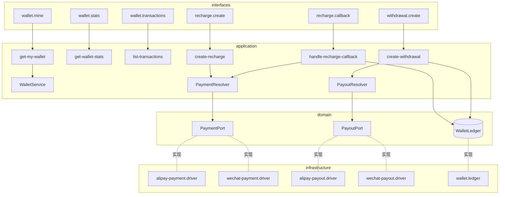
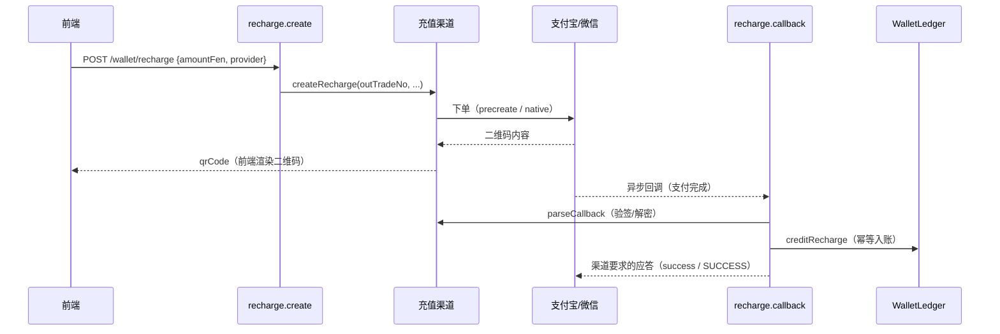
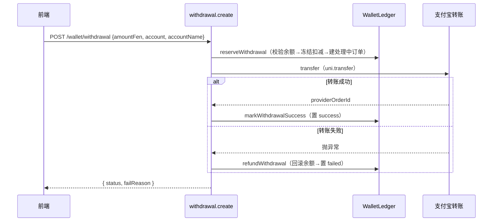

# 钱包（Wallet）

## 模块职责

纳入 RBAC 权限体系的钱包：菜单与功能均受权限控制，授权后打开页面无钱包则自动初始化（懒创建），支持充值、提现、收支明细与统计。

实现的功能：

- **钱包自动初始化**：每个用户在租户内唯一；持 `wallet:view` 权限首次访问 `GET /wallet/mine` 时若不存在则懒创建。
- **充值（扫码支付，官方协议）**：
  - 支付宝 `alipay.trade.precreate`（当面付/扫码），返回二维码内容供前端渲染。
  - 微信支付 v3 `Native 下单`，返回 `code_url` 供前端渲染二维码。
  - 用户支付后由渠道**异步回调**，经**验签**（支付宝公钥 / 微信平台证书）后**幂等入账**。
- **提现（转账到账）**：默认方案 A——申请即校验余额并**冻结扣减**，调支付宝 `alipay.fund.trans.uni.transfer` 转账；成功置 `success`，失败**回滚余额**并置 `failed`。微信提现为**预留位**（调用即提示未开通）。
- **收支明细**：分页查询本人流水，按时间倒序，含金额、方向、变更后余额快照、备注。
- **统计**：余额、累计充值/提现金额与成功笔数。
- **金额一律以「分」整数存储与传输**，杜绝浮点误差；展示「元」由 `fenToYuan` 统一换算（前后端共享）。
- **零硬编码**：所有商户凭证、网关、最小金额、回调地址均入配置中心（`ConfigGroup.Wallet`，敏感项脱敏）。

## 权限（RBAC）

钱包菜单与功能权限纳入权限树（`MENU_DEFINITIONS` / `PERMS.wallet`），默认仅超级管理员拥有，其他角色在「角色管理」按需分配。

| 权限码 | 名称 | 类型 | 守卫接口 |
| --- | --- | --- | --- |
| `wallet:menu` | 我的钱包 | 菜单 | 前端动态路由 `/wallet`（菜单守卫） |
| `wallet:view` | 钱包-查看 | 接口 | `GET /wallet/mine`、`GET /wallet/stats` |
| `wallet:transaction:list` | 钱包-明细 | 接口 | `GET /wallet/transactions` |
| `wallet:recharge` | 钱包-充值 | 接口/按钮 | `POST /wallet/recharge`（前端「充值」按钮 `v-permission`） |
| `wallet:withdraw` | 钱包-提现 | 接口/按钮 | `POST /wallet/withdrawal`（前端「提现」按钮 `v-permission`） |

> 充值异步回调 `POST /wallet/recharge/callback/:provider` 为 `@Public()` 渠道回调端点，不受权限控制（靠验签保障）。

## 不变量与一致性

- **唯一余额写入口**：所有余额变更都经 `WalletLedger`（账务单元），在**同一数据库事务**内对钱包行加**悲观写锁**，并同步写流水与流转订单状态，杜绝并发脏写与「改了余额没记流水」。
- **充值入账幂等**：以 `outTradeNo` 为幂等键；订单已支付则重复回调直接返回成功；金额不符则拒绝。
- **提现资金安全**：先冻结扣减再转账，转账失败在事务内回滚余额并写补偿入账流水。

## 渠道策略（策略模式 + 配置驱动）

- 充值端口 `PaymentPort`、提现端口 `PayoutPort` 为抽象；具体渠道为可插拔策略，由解析器按请求渠道挑选。
- 新增渠道 = 实现端口 + 注册进 `PAYMENT_PORTS` / `PAYOUT_PORTS`，上层用例零改动。
- 提现端口含 `available` 标记，预留渠道（微信）在**扣款前**即被拦截，避免无谓的冻结/回滚。

## 目录结构（DDD 四层）

```
modules/wallet/
├── domain/
│   ├── wallet.entity.ts                  钱包实体（余额/累计/状态，租户内 user 唯一）
│   ├── wallet-transaction.entity.ts      流水实体（类型/方向/金额/余额快照）
│   ├── recharge-order.entity.ts          充值订单（outTradeNo 幂等键/状态机）
│   ├── withdrawal-order.entity.ts        提现订单（outBizNo 幂等键/状态机）
│   ├── wallet-repository.interface.ts    仓储端口 + 注入令牌
│   ├── transaction-repository.interface.ts
│   ├── recharge-repository.interface.ts
│   ├── withdrawal-repository.interface.ts
│   ├── payment-port.interface.ts         充值渠道端口（下单/回调验签/应答）
│   ├── payout-port.interface.ts          提现渠道端口（转账）
│   └── ledger.interface.ts               账务单元端口（唯一余额写入口）
├── application/
│   ├── wallet.service.ts                 取钱包/懒创建（并发安全）
│   ├── payment.resolver.ts               充值渠道选择器
│   ├── payout.resolver.ts                提现渠道选择器
│   ├── wallet.mapper.ts                  实体 → 钱包/统计视图
│   ├── transaction.mapper.ts             实体 → 流水视图
│   ├── order-no.util.ts                  商户订单号生成（幂等键）
│   └── use-cases/
│       ├── get-my-wallet.usecase.ts
│       ├── get-wallet-stats.usecase.ts
│       ├── list-transactions.usecase.ts
│       ├── create-recharge.usecase.ts
│       ├── handle-recharge-callback.usecase.ts
│       └── create-withdrawal.usecase.ts
├── infrastructure/
│   ├── wallet.repository.ts              TypeORM 仓储（按租户过滤）
│   ├── transaction.repository.ts
│   ├── recharge.repository.ts
│   ├── withdrawal.repository.ts
│   ├── wallet.ledger.ts                  账务单元实现（事务 + 悲观锁）
│   └── drivers/
│       ├── alipay-client.factory.ts      支付宝 SDK 工厂（凭证取自配置中心）
│       ├── alipay-payment.driver.ts      支付宝扫码下单 + 回调验签
│       ├── alipay-payout.driver.ts       支付宝转账提现
│       ├── wechat-pay.config.ts          微信支付 v3 凭证工厂
│       ├── wechat-payment.driver.ts      微信 Native 下单 + 回调验签/解密
│       └── wechat-payout.driver.ts       微信提现（预留位）
└── interfaces/
    ├── dto/
    │   ├── create-recharge.dto.ts
    │   └── create-withdrawal.dto.ts
    └── controllers/
        ├── wallet.mine.controller.ts         GET  /api/wallet/mine
        ├── wallet.stats.controller.ts        GET  /api/wallet/stats
        ├── wallet.transactions.controller.ts GET  /api/wallet/transactions
        ├── recharge.create.controller.ts     POST /api/wallet/recharge
        ├── recharge.callback.controller.ts   POST /api/wallet/recharge/callback/:provider（公开）
        └── withdrawal.create.controller.ts   POST /api/wallet/withdrawal
```

## 结构与依赖



## 充值时序



## 提现时序（方案 A）



## 配置项（ConfigGroup.Wallet）

| Key | 说明 | 敏感 |
| --- | --- | --- |
| `wallet.payment.provider` | 默认充值渠道（alipay/wechat） | |
| `wallet.payout.provider` | 默认提现渠道（alipay） | |
| `wallet.minRechargeFen` | 最小充值金额（分） | |
| `wallet.minWithdrawFen` | 最小提现金额（分） | |
| `wallet.notifyBaseUrl` | 回调公网基础地址（拼接异步通知 URL） | |
| `wallet.alipay.appId` | 支付宝应用 AppId | |
| `wallet.alipay.privateKey` | 支付宝应用私钥（PEM） | ✓ |
| `wallet.alipay.publicKey` | 支付宝公钥（PEM，回调验签） | ✓ |
| `wallet.alipay.gateway` | 支付宝网关（留空用官方默认） | |
| `wallet.wechat.appId` | 微信支付 AppId | |
| `wallet.wechat.mchId` | 微信商户号 | |
| `wallet.wechat.serialNo` | 商户证书序列号 | |
| `wallet.wechat.privateKey` | 商户私钥（PEM） | ✓ |
| `wallet.wechat.apiV3Key` | APIv3 密钥（回调解密） | ✓ |
| `wallet.wechat.platformPublicKey` | 平台证书公钥（PEM，回调验签） | ✓ |
| `wallet.wechat.platformSerialNo` | 平台证书序列号 | |

> 真实到账需在配置中心填入对应商户凭证；未配置时下单/转账会如实返回「渠道未配置」。
> 回调地址需公网可达：`{notifyBaseUrl}/wallet/recharge/callback/{provider}`。

## 前端

- 路由 `/wallet` 由后端按 `wallet:menu` 菜单权限动态下发（组件在 `component-registry` 以 code 登记），侧边菜单「我的钱包」仅对获授权角色可见。
- 充值/提现按钮以 `v-permission` 绑定 `wallet:recharge` / `wallet:withdraw`，无权时隐藏。
- `stores/wallet.store.ts`：打开页面并发拉取钱包/统计/首页流水；收支成功后 `refresh`。
- `views/wallet/WalletView.vue`：余额卡片、统计卡片、明细表格分页；充值弹窗（金额+渠道，下单后用 `qrcode` 渲染二维码，支付完成点「我已支付」刷新）；提现弹窗（金额+支付宝账号+姓名）。
