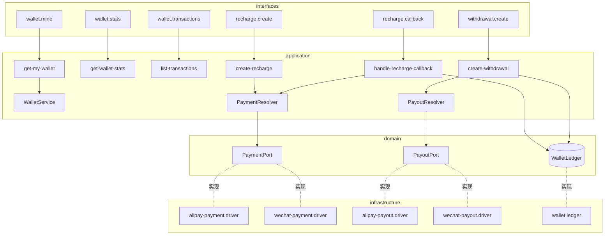
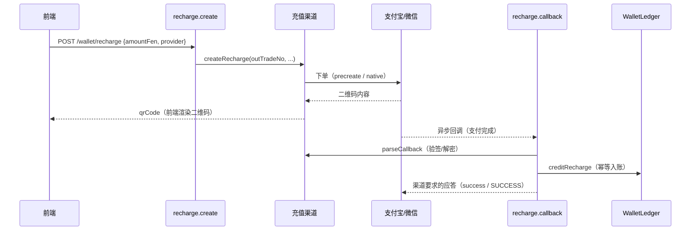
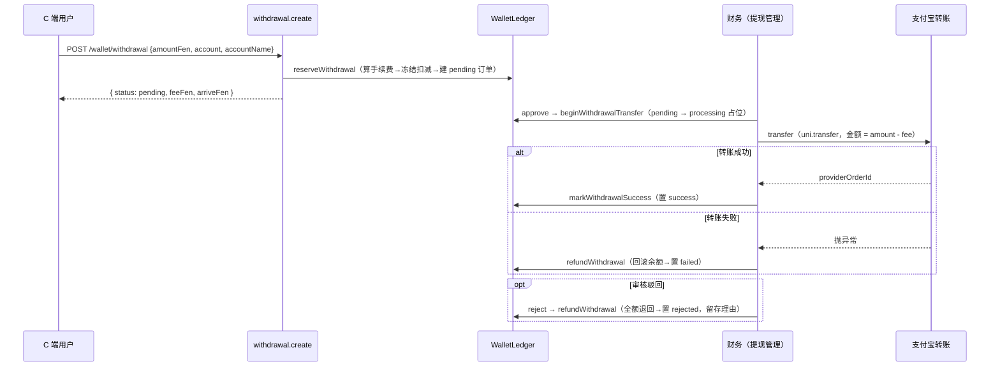
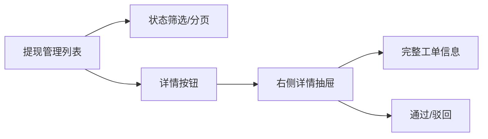

# 钱包（Wallet）

## 模块职责

钱包分为**个人侧**与**管理侧**两层：

- **个人侧（我的钱包）**：所有登录用户均可使用，无需特定权限（从右上角头像下拉「我的钱包」进入，静态路由 `/wallet`）。打开页面无钱包则自动初始化（懒创建），支持充值、提现、本人收支明细与统计。
- **管理侧（钱包管理）**：纳入 RBAC 权限树的后台菜单（侧边栏「钱包管理」），默认仅超管拥有。分页查看所有用户钱包与余额、查看任意用户收支明细、人工调整任意用户余额（充/扣并自动记一条 `adjust` 流水）。

实现的功能：

- **钱包自动初始化**：每个用户在租户内唯一；登录用户首次访问 `GET /wallet/mine` 时若不存在则懒创建。
- **充值（扫码支付，官方协议）**：
  - 支付宝 `alipay.trade.precreate`（当面付/扫码），返回二维码内容供前端渲染。
  - 微信支付 v3 `Native 下单`，返回 `code_url` 供前端渲染二维码。
  - 用户支付后由渠道**异步回调**，经**验签**（支付宝公钥 / 微信平台证书）后**幂等入账**。
  - **主动查单兜底**：充值二维码弹窗轮询 `GET /wallet/recharge/:outTradeNo/status`，后端调渠道官方查单接口（支付宝 `alipay.trade.query` / 微信 `GET /v3/pay/transactions/out-trade-no`），查到已支付则与回调共用同一幂等入账口径——回调丢失/延迟也能正常到账关闭弹窗。
- **提现（审核制 + 转账到账）**：用户填写支付宝账号/实名提交申请，申请即校验余额并**冻结扣减**、按配置费率计手续费后置 `pending`（待审核）；财务在「财务 → 提现管理」**审核**：通过即调支付宝 `alipay.fund.trans.uni.transfer` 向收款账号转账**到账金额 = 提现金额 - 手续费**（成功置 `success`，失败回滚余额置 `failed`）；驳回则全额退回余额置 `rejected` 并留存理由。微信提现为**预留位**（调用即提示未开通）。
- **转账场景报备**：支付宝「商家转账」要求报备的商户需在配置中心填写 `wallet.alipay.transferSceneName`（转账场景名称，如「业务结算」）、`wallet.alipay.transferReportInfoType`（报备信息类型，如「结算款项名称」）、`wallet.alipay.transferReportInfoContent`（报备信息内容，如「游戏账号租赁结算款」）；转账时随 `transfer_scene_name` / `transfer_scene_report_info` 上送，场景名称留空则不传（兼容未要求报备的商户）。
- **提现手续费**：费率万分比配置（`wallet.withdrawFeeRateBp`，如 100 = 1%，0 免费），前端提现弹层实时展示手续费与预计到账金额（费率随 `GET /wallet/mine` 下发），计算函数 `calcWithdrawFeeFen` 前后端共享。
- **支付宝证书模式**：应用公钥证书/支付宝公钥证书/根证书三证齐全时自动启用证书签名（转账等资金接口必须证书模式），否则回退公钥模式；支付/转账共用同一 SDK 工厂。
- **收支明细**：分页查询本人流水，按时间倒序，含金额、方向、变更后余额快照、备注。
- **统计**：余额、累计充值/提现金额与成功笔数。
- **金额一律以「分」整数存储与传输**，杜绝浮点误差；展示「元」由 `fenToYuan` 统一换算（前后端共享）。
- **零硬编码**：所有商户凭证、网关、最小金额、回调地址均入配置中心（`ConfigGroup.Wallet`，敏感项脱敏）。

## 权限（RBAC）

**个人侧端点仅需登录态，不挂任何功能权限**（与「我的实名」一致，全员可用）：`GET /wallet/mine`、`GET /wallet/stats`、`GET /wallet/transactions`、`POST /wallet/recharge`、`POST /wallet/withdrawal`。

**管理侧**菜单与功能权限纳入权限树（`MENU_DEFINITIONS` / `PERMS.wallet`），默认仅超级管理员拥有，其他角色在「角色管理」按需分配：

| 权限码 | 名称 | 类型 | 守卫 |
| --- | --- | --- | --- |
| `wallet:admin:menu` | 钱包管理 | 菜单 | 侧边栏「钱包管理」动态路由 `/wallet/admin`（系统管理组） |
| `wallet:admin:list` | 钱包-用户列表 | 接口 | `GET /wallet/admin/wallets` |
| `wallet:admin:transaction` | 钱包-明细查看 | 接口/按钮 | `GET /wallet/admin/wallets/:userId/transactions`（前端「明细」按钮 `v-permission`） |
| `wallet:admin:adjust` | 钱包-余额调整 | 接口/按钮 | `POST /wallet/admin/wallets/:userId/adjust`（前端「调整余额」按钮 `v-permission`） |
| `finance:withdrawal:menu` | 提现管理 | 菜单 | 侧边栏「财务 → 提现管理」动态路由 `/finance/withdrawals` |
| `finance:withdrawal:list` | 财务-提现工单列表 | 接口 | `GET /wallet/admin/withdrawals` |
| `finance:withdrawal:review` | 财务-提现审核 | 接口/按钮 | `POST /wallet/admin/withdrawals/:id/approve`、`POST /wallet/admin/withdrawals/:id/reject`（前端「通过/驳回」按钮 `v-permission`） |

> 充值异步回调 `POST /wallet/recharge/callback/:provider` 为 `@Public()` 渠道回调端点，不受权限控制（靠验签保障）。
>
> 历史命名（`wallet:menu`/`wallet:view` 等）已废弃：菜单权限会在启动时由 `pruneObsoleteMenus()` 自动清理；旧的接口权限行不再被任何控制器引用（无副作用）。

## 不变量与一致性

- **唯一余额写入口**：所有余额变更都经 `WalletLedger`（账务单元），在**同一数据库事务**内对钱包行加**悲观写锁**，并同步写流水与流转订单状态，杜绝并发脏写与「改了余额没记流水」。
- **充值入账幂等**：以 `outTradeNo` 为幂等键；订单已支付则重复回调直接返回成功；金额不符则拒绝。
- **提现资金安全**：申请即冻结扣减；审核通过时先在事务内「待审核 → 处理中」占位（防并发重复转账）再发起转账；转账失败/审核驳回在事务内全额回滚余额并写补偿入账流水。
- **提现状态机**：`pending`（待审核）→ `processing`（转账中）→ `success` / `failed`；`pending` → `rejected`（驳回）。

## 渠道策略（策略模式 + 配置驱动）

- 充值端口 `PaymentPort`、提现端口 `PayoutPort` 为抽象；具体渠道为可插拔策略，由解析器按请求渠道挑选。
- 新增渠道 = 实现端口 + 注册进 `PAYMENT_PORTS` / `PAYOUT_PORTS`，上层用例零改动。
- 提现端口含 `available` 标记，预留渠道（微信）在**扣款前**即被拦截，避免无谓的冻结/回滚。

## 目录结构（DDD 四层）

```
modules/wallet/
├── domain/
│   ├── wallet.entity.ts                  钱包实体（余额/累计/状态，租户内 user 唯一）
│   ├── wallet-transaction.entity.ts      流水实体（类型/方向/金额/余额快照）
│   ├── recharge-order.entity.ts          充值订单（outTradeNo 幂等键/状态机）
│   ├── withdrawal-order.entity.ts        提现订单（outBizNo 幂等键/状态机）
│   ├── wallet-repository.interface.ts    仓储端口 + 注入令牌
│   ├── transaction-repository.interface.ts
│   ├── recharge-repository.interface.ts
│   ├── withdrawal-repository.interface.ts
│   ├── payment-port.interface.ts         充值渠道端口（下单/回调验签/应答）
│   ├── payout-port.interface.ts          提现渠道端口（转账）
│   └── ledger.interface.ts               账务单元端口（唯一余额写入口）
├── application/
│   ├── wallet.service.ts                 取钱包/懒创建（并发安全）
│   ├── payment.resolver.ts               充值渠道选择器
│   ├── payout.resolver.ts                提现渠道选择器
│   ├── wallet.mapper.ts                  实体 → 钱包/统计视图
│   ├── transaction.mapper.ts             实体 → 流水视图
│   ├── wallet-admin.mapper.ts            用户 + 钱包 → 管理端列表视图（未开通按零值）
│   ├── withdrawal-admin.mapper.ts        提现单 + 归属用户 → 财务列表视图
│   ├── order-no.util.ts                  商户订单号生成（幂等键）
│   └── use-cases/
│       ├── get-my-wallet.usecase.ts
│       ├── get-wallet-stats.usecase.ts
│       ├── list-transactions.usecase.ts
│       ├── create-recharge.usecase.ts
│       ├── handle-recharge-callback.usecase.ts
│       ├── create-withdrawal.usecase.ts      提现申请（算手续费→冻结扣减→待审核）
│       ├── list-wallets.usecase.ts          管理端：分页所有用户钱包
│       ├── list-user-transactions.usecase.ts 管理端：任意用户明细
│       ├── adjust-wallet.usecase.ts          管理端：人工调整余额（记流水）
│       ├── list-withdrawals.usecase.ts       财务：分页提现工单（反查归属用户）
│       ├── approve-withdrawal.usecase.ts     财务：审核通过→支付宝转账到账
│       └── reject-withdrawal.usecase.ts      财务：驳回→全额退回余额
├── infrastructure/
│   ├── wallet.repository.ts              TypeORM 仓储（按租户过滤）
│   ├── transaction.repository.ts
│   ├── recharge.repository.ts
│   ├── withdrawal.repository.ts
│   ├── wallet.ledger.ts                  账务单元实现（事务 + 悲观锁）
│   └── drivers/
│       ├── alipay-client.factory.ts      支付宝 SDK 工厂（证书/公钥双模式，凭证取自配置中心）
│       ├── alipay-payment.driver.ts      支付宝扫码下单 + 回调验签
│       ├── alipay-payout.driver.ts       支付宝转账提现
│       ├── wechat-pay.config.ts          微信支付 v3 凭证工厂
│       ├── wechat-payment.driver.ts      微信 Native 下单 + 回调验签/解密
│       └── wechat-payout.driver.ts       微信提现（预留位）
└── interfaces/
    ├── dto/
    │   ├── create-recharge.dto.ts
    │   ├── create-withdrawal.dto.ts
    │   ├── adjust-wallet.dto.ts                管理端调整入参校验
    │   └── reject-withdrawal.dto.ts            驳回理由入参校验
    └── controllers/
        ├── wallet.mine.controller.ts         GET  /api/wallet/mine（登录态）
        ├── wallet.stats.controller.ts        GET  /api/wallet/stats（登录态）
        ├── wallet.transactions.controller.ts GET  /api/wallet/transactions（登录态）
        ├── recharge.create.controller.ts     POST /api/wallet/recharge（登录态）
        ├── recharge.callback.controller.ts   POST /api/wallet/recharge/callback/:provider（公开）
        ├── withdrawal.create.controller.ts   POST /api/wallet/withdrawal（登录态）
        ├── wallet.admin.list.controller.ts         GET  /api/wallet/admin/wallets
        ├── wallet.admin.transactions.controller.ts GET  /api/wallet/admin/wallets/:userId/transactions
        ├── wallet.admin.adjust.controller.ts       POST /api/wallet/admin/wallets/:userId/adjust
        ├── withdrawal.admin.list.controller.ts     GET  /api/wallet/admin/withdrawals
        ├── withdrawal.admin.approve.controller.ts  POST /api/wallet/admin/withdrawals/:id/approve
        └── withdrawal.admin.reject.controller.ts   POST /api/wallet/admin/withdrawals/:id/reject
```

## 结构与依赖


```mermaid
flowchart TB
  subgraph interfaces
    M[wallet.mine]
    S[wallet.stats]
    T[wallet.transactions]
    RC[recharge.create]
    RB[recharge.callback]
    WC[withdrawal.create]
  end
  subgraph application
    GW[get-my-wallet]
    GS[get-wallet-stats]
    LT[list-transactions]
    CR[create-recharge]
    HC[handle-recharge-callback]
    CW[create-withdrawal]
    WS[WalletService]
    PR[PaymentResolver]
    POR[PayoutResolver]
  end
  subgraph domain
    LED[(WalletLedger)]
    PP[PaymentPort]
    POP[PayoutPort]
  end
  subgraph infrastructure
    AP[alipay-payment.driver]
    WP[wechat-payment.driver]
    APO[alipay-payout.driver]
    WPO[wechat-payout.driver]
    LImpl[wallet.ledger]
  end

  M --> GW --> WS
  S --> GS
  T --> LT
  RC --> CR --> PR --> PP
  RB --> HC --> PR
  HC --> LED
  WC --> CW --> POR --> POP
  CW --> LED
  PP -. 实现 .- AP & WP
  POP -. 实现 .- APO & WPO
  LED -. 实现 .- LImpl
```

## 充值时序


```mermaid
sequenceDiagram
  participant FE as 前端
  participant API as recharge.create
  participant DRV as 充值渠道
  participant PAY as 支付宝/微信
  participant CB as recharge.callback
  participant LED as WalletLedger

  FE->>API: POST /wallet/recharge {amountFen, provider}
  API->>DRV: createRecharge(outTradeNo, ...)
  DRV->>PAY: 下单（precreate / native）
  PAY-->>DRV: 二维码内容
  DRV-->>FE: qrCode（前端渲染二维码）
  PAY-->>CB: 异步回调（支付完成）
  CB->>DRV: parseCallback（验签/解密）
  CB->>LED: creditRecharge（幂等入账）
  CB-->>PAY: 渠道要求的应答（success / SUCCESS）
```

## 提现时序（审核制）


```mermaid
sequenceDiagram
  participant FE as C 端用户
  participant API as withdrawal.create
  participant LED as WalletLedger
  participant ADM as 财务（提现管理）
  participant DRV as 支付宝转账

  FE->>API: POST /wallet/withdrawal {amountFen, account, accountName}
  API->>LED: reserveWithdrawal（算手续费→冻结扣减→建 pending 订单）
  API-->>FE: { status: pending, feeFen, arriveFen }
  ADM->>LED: approve → beginWithdrawalTransfer（pending → processing 占位）
  ADM->>DRV: transfer（uni.transfer，金额 = amount - fee）
  alt 转账成功
    DRV-->>ADM: providerOrderId
    ADM->>LED: markWithdrawalSuccess（置 success）
  else 转账失败
    DRV-->>ADM: 抛异常
    ADM->>LED: refundWithdrawal（回滚余额→置 failed）
  end
  opt 审核驳回
    ADM->>LED: reject → refundWithdrawal（全额退回→置 rejected，留存理由）
  end
```

## 配置项（ConfigGroup.Wallet）

| Key | 说明 | 敏感 |
| --- | --- | --- |
| `wallet.payment.provider` | 默认充值渠道（alipay/wechat） | |
| `wallet.payout.provider` | 默认提现渠道（alipay） | |
| `wallet.minRechargeFen` | 最小充值金额（分） | |
| `wallet.minWithdrawFen` | 最小提现金额（分） | |
| `wallet.withdrawFeeRateBp` | 提现手续费率（万分比，100 = 1%，0 免费） | |
| `wallet.notifyBaseUrl` | 回调公网基础地址（拼接异步通知 URL） | |
| `wallet.alipay.appId` | 支付宝应用 AppId | |
| `wallet.alipay.privateKey` | 支付宝应用私钥（PEM） | ✓ |
| `wallet.alipay.publicKey` | 支付宝公钥（PEM，回调验签） | ✓ |
| `wallet.alipay.gateway` | 支付宝网关（留空用官方默认） | |
| `wallet.alipay.appCert` | 证书模式：应用公钥证书 appCertPublicKey_xxx.crt 内容 | ✓ |
| `wallet.alipay.publicCert` | 证书模式：支付宝公钥证书 alipayCertPublicKey_RSA2.crt 内容 | ✓ |
| `wallet.alipay.rootCert` | 证书模式：支付宝根证书 alipayRootCert.crt 内容 | ✓ |
| `wallet.wechat.appId` | 微信支付 AppId | |
| `wallet.wechat.mchId` | 微信商户号 | |
| `wallet.wechat.serialNo` | 商户证书序列号 | |
| `wallet.wechat.privateKey` | 商户私钥（PEM） | ✓ |
| `wallet.wechat.apiV3Key` | APIv3 密钥（回调解密） | ✓ |
| `wallet.wechat.platformPublicKey` | 平台证书公钥（PEM，回调验签） | ✓ |
| `wallet.wechat.platformSerialNo` | 平台证书序列号 | |

> 真实到账需在配置中心填入对应商户凭证；未配置时下单/转账会如实返回「渠道未配置」。
> 回调地址需公网可达：`{notifyBaseUrl}/wallet/recharge/callback/{provider}`。

## 前端

- 路由 `/wallet` 由后端按 `wallet:menu` 菜单权限动态下发（组件在 `component-registry` 以 code 登记），侧边菜单「我的钱包」仅对获授权角色可见。
- 充值/提现按钮以 `v-permission` 绑定 `wallet:recharge` / `wallet:withdraw`，无权时隐藏。
- `stores/wallet.store.ts`：打开页面并发拉取钱包/统计/首页流水；收支成功后 `refresh`。
- 管理端 `/finance/withdrawals` 采用「轻量列表 + 右侧详情抽屉」：列表只展示申请用户、金额信息、收款信息、状态、申请时间与操作；详情抽屉完整展示提现金额、手续费、到账金额、收款渠道、收款账号、渠道单号、失败/驳回原因，并在底部固定审核按钮，便于财务扫描列表后再处理单笔工单。


```mermaid
flowchart LR
  A["提现管理列表"] --> B["状态筛选/分页"]
  A --> C["详情按钮"]
  C --> D["右侧详情抽屉"]
  D --> E["完整工单信息"]
  D --> F["通过/驳回"]
```
- `views/wallet/WalletView.vue`：余额卡片、统计卡片、明细表格分页；充值弹窗（金额+渠道，下单后用 `qrcode` 渲染二维码，支付完成点「我已支付」刷新）；提现弹窗（金额+支付宝账号+姓名，提交后进入待审核）。
- `views/finance/WithdrawalAdminView.vue`（菜单 `finance:withdrawal:menu`，财务分组）：提现工单分页（状态筛选），表格保留扫描所需的关键列，右侧详情抽屉展示完整金额、收款、渠道与失败信息；待审核工单可「通过」（二次确认后立即转账）/「驳回」（填写理由，退回余额）；`api/finance.api.ts` 封装列表/审核接口。

## C 端（apps/client）

- `api/wallet.api.ts`：直连既有接口 `/wallet/mine`、`/wallet/transactions`、`/wallet/recharge`、`/wallet/withdrawal`。
- `views/wallet/WalletView.vue`（路由 `/wallet`，需登录）：余额卡 + 充值/提现入口 + 分页流水明细（类型/方向/变更后余额）。
- `views/wallet/WalletView.responsive.css`：钱包页 PC 响应式布局，标题栏、余额卡与流水明细统一收敛到内容宽度，移动端保持全屏钱包。
- `components/wallet/RechargeDialog.vue`：金额（元）+ 支付宝/微信 → 生成扫码二维码，轮询余额高于基线即视为入账并自动刷新。
- `components/wallet/WithdrawDialog.vue`：金额 + 支付宝账号/实名 → 提交提现申请；输入金额时按费率实时展示手续费与预计到账金额，提交后提示等待审核。
- 个人中心 `BalanceCards` 余额卡展示真实余额，点击进钱包页。
