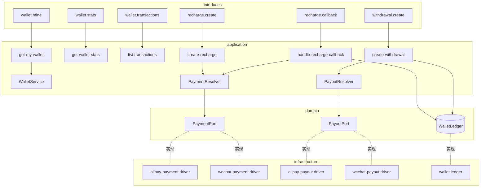
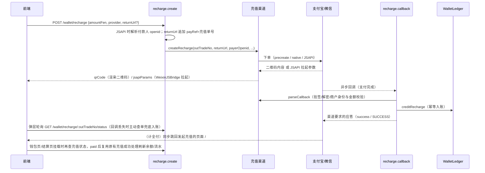
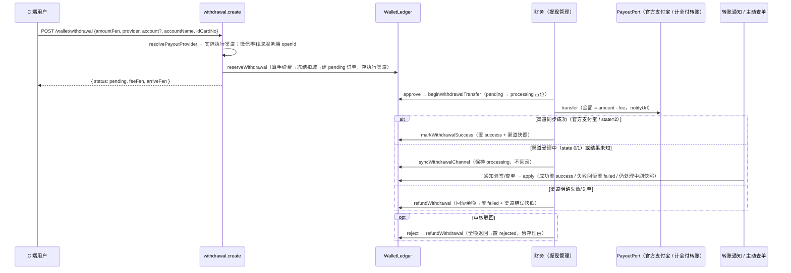
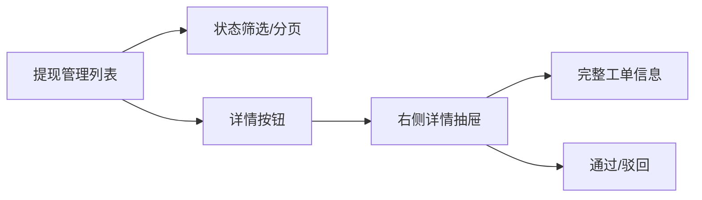

# 钱包（Wallet）

## 模块职责

钱包分为**个人侧**与**管理侧**两层：

- **个人侧（我的钱包）**：所有登录用户均可使用，无需特定权限（从右上角头像下拉「我的钱包」进入，静态路由 `/wallet`）。打开页面无钱包则自动初始化（懒创建），支持充值、提现、本人收支明细与统计。
- **管理侧（钱包管理）**：纳入 RBAC 权限树的后台菜单（侧边栏「钱包管理」），默认仅超管拥有。分页查看所有用户钱包与余额、查看任意用户收支明细、人工调整任意用户余额（充/扣并自动记一条 `adjust` 流水）。

实现的功能：

- **钱包自动初始化**：每个用户在租户内唯一；登录用户首次访问 `GET /wallet/mine` 时若不存在则懒创建。
- **充值（扫码支付，官方协议）**：
  - 支付宝 `alipay.trade.precreate`（当面付/扫码），返回二维码内容供前端渲染。
  - 微信支付 v3 `Native 下单`，返回 `code_url` 供前端渲染二维码。
  - 用户支付后由渠道**异步回调**，经**验签**（支付宝公钥 / 微信平台证书）后**幂等入账**。
  - **主动查单兜底**：充值二维码弹窗轮询 `GET /wallet/recharge/:outTradeNo/status`，后端调渠道官方查单接口（支付宝 `alipay.trade.query` / 微信 `GET /v3/pay/transactions/out-trade-no`），查到已支付则与回调共用同一幂等入账口径——回调丢失/延迟也能正常到账关闭弹窗。
- **提现（审核制 + 转账到账）**：用户填写支付宝账号/实名/**身份证号（报税用，18 位格式校验，落库到提现单）**提交申请，申请即校验余额并**冻结扣减**、按配置费率计手续费后置 `pending`（待审核）；财务在「财务 → 提现管理」**审核**：通过即调支付宝 `alipay.fund.trans.uni.transfer` 向收款账号转账**到账金额 = 提现金额 - 手续费**（成功置 `success`，失败回滚余额置 `failed`）；驳回则全额退回余额置 `rejected` 并留存理由。微信提现为**预留位**（调用即提示未开通）。
- **转账场景报备**：支付宝「商家转账」要求报备的商户需在配置中心填写 `wallet.alipay.transferSceneName`（转账场景名称，如「业务结算」）、`wallet.alipay.transferReportInfoType`（报备信息类型，如「结算款项名称」）、`wallet.alipay.transferReportInfoContent`（报备信息内容，如「游戏账号租赁结算款」）；转账时随 `transfer_scene_name` / `transfer_scene_report_info` 上送，场景名称留空则不传（兼容未要求报备的商户）。
- **提现手续费（阶梯税费）**：支持阶梯式可调税费配置 `wallet.withdrawTaxTiers`（JSON 数组 `[{"minFen":0,"rateBp":100},{"minFen":100000,"rateBp":300}]`，按提现金额取「minFen ≤ 金额」的最高档费率），未配置/配置非法时回退单一费率 `wallet.withdrawFeeRateBp`（万分比，如 100 = 1%，0 免费）；前端提现弹层实时展示税费与预计到账金额（费率与阶梯配置随 `GET /wallet/mine` 下发），选档/计算函数 `pickWithdrawFeeRateBp`、`sanitizeWithdrawTaxTiers`、`calcWithdrawFeeFen` 前后端共享。
- **报税表单导出**：财务在「财务 → 提现管理」一键导出报税表单（`GET /wallet/admin/withdrawals/tax-export`，需 `finance:withdrawal:list` 权限）：导出当前租户全部「已到账」提现单的 CSV（姓名/身份证号/收款账号/提现金额/税费/到账金额/单号/时间），前端加 UTF-8 BOM 生成文件下载，Excel 打开中文不乱码；历史无身份证号的单据该列为空。
- **C 端提现记录**：钱包页「流水明细 / 提现记录」页签，提现记录展示每笔提现的金额/手续费/到账金额、审核状态（待审核/处理中/已到账/转账失败/已驳回）与失败原因（`GET /wallet/withdrawals/mine`，仅见本人）；提现提交后自动切到该页签。
- **支付宝证书模式**：应用公钥证书/支付宝公钥证书/根证书三证齐全时自动启用证书签名（转账等资金接口必须证书模式），否则回退公钥模式；支付/转账共用同一 SDK 工厂。
- **收支明细**：分页查询本人流水，按时间倒序，含金额、方向、变更后余额快照、备注。
- **统计**：余额、累计充值/提现金额与成功笔数。
- **服务订单余额支付**：结算页读取本人钱包；选择余额后由订单模块在数据库事务内扣款并写 `order_payment` 出账流水，支付成功直接进入订单详情。
- **服务订单原路退款**：订单退款审核通过后，余额订单通过事务参与端口写 `order_refund` 入账流水；支付宝/微信分别调用退款创建与查询接口，稳定退款号保证重试幂等。完整业务规则见 [order-refund.md](./order-refund.md)。
- **金额一律以「分」整数存储与传输**，杜绝浮点误差；展示「元」由 `fenToYuan` 统一换算（前后端共享）。
- **零硬编码**：所有商户凭证、网关、最小金额、回调地址均入配置中心（`ConfigGroup.Wallet`，敏感项脱敏）。

## 权限（RBAC）

**个人侧端点仅需登录态，不挂任何功能权限**（与「我的实名」一致，全员可用）：`GET /wallet/mine`、`GET /wallet/stats`、`GET /wallet/transactions`、`POST /wallet/recharge`、`POST /wallet/withdrawal`、`GET /wallet/withdrawals/mine`。

**管理侧**菜单与功能权限纳入权限树（`MENU_DEFINITIONS` / `PERMS.wallet`），默认仅超级管理员拥有，其他角色在「角色管理」按需分配：

| 权限码                      | 名称              | 类型      | 守卫                                                                                                                              |
| --------------------------- | ----------------- | --------- | --------------------------------------------------------------------------------------------------------------------------------- |
| `wallet:admin:menu`         | 钱包管理          | 菜单      | 侧边栏「钱包管理」动态路由 `/wallet/admin`（系统管理组）                                                                          |
| `wallet:admin:list`         | 钱包-用户列表     | 接口      | `GET /wallet/admin/wallets`                                                                                                       |
| `wallet:admin:transaction`  | 钱包-明细查看     | 接口/按钮 | `GET /wallet/admin/wallets/:userId/transactions`（前端「明细」按钮 `v-permission`）                                               |
| `wallet:admin:adjust`       | 钱包-余额调整     | 接口/按钮 | `POST /wallet/admin/wallets/:userId/adjust`（前端「调整余额」按钮 `v-permission`）                                                |
| `finance:withdrawal:menu`   | 提现管理          | 菜单      | 侧边栏「财务 → 提现管理」动态路由 `/finance/withdrawals`                                                                          |
| `finance:withdrawal:list`   | 财务-提现工单列表 | 接口      | `GET /wallet/admin/withdrawals`、`GET /wallet/admin/withdrawals/tax-export`（报税导出）                                           |
| `finance:withdrawal:review` | 财务-提现审核     | 接口/按钮 | `POST /wallet/admin/withdrawals/:id/approve`、`POST /wallet/admin/withdrawals/:id/reject`（前端「通过/驳回」按钮 `v-permission`） |
| `finance:penalty:menu`      | 罚款管理          | 菜单      | 侧边栏「财务 → 罚款管理」动态路由 `/finance/penalties`                                                                            |
| `finance:penalty:list`      | 财务-罚款记录列表 | 接口      | `GET /finance/penalties`                                                                                                          |
| `finance:penalty:create`    | 财务-创建罚款     | 接口/按钮 | `POST /finance/penalties`；与 `feedback:handle` 共同保护投诉直接扣款                                                              |
| `finance:tax:menu`          | 税务管理          | 菜单      | 侧边栏「财务 → 税务管理」动态路由 `/finance/tax`                                                                                    |
| `finance:tax:list`          | 财务-税务配置查看 | 接口      | `GET /wallet/admin/tax-config`                                                                                                    |
| `finance:tax:save`          | 财务-税务配置保存 | 接口/按钮 | `PUT /wallet/admin/tax-config`（仅平台超管；前端「保存配置」按钮 `v-permission`）                                                    |

> 充值异步回调 `POST /wallet/recharge/callback/:provider` 为 `@Public()` 渠道回调端点，不受权限控制（靠验签保障）。
>
> 历史命名（`wallet:menu`/`wallet:view` 等）已废弃：菜单权限会在启动时由 `pruneObsoleteMenus()` 自动清理；旧的接口权限行不再被任何控制器引用（无副作用）。

## 不变量与一致性

- **余额写入边界**：充值、提现、调整和提成经 `WalletLedger`；服务订单余额支付经 `OrderPaymentSettlement`；订单余额退款、缴押、押金退款、通用罚款和投诉处罚经调用方事务复用 `WalletTransactionParticipant`。三种基础设施入口都对钱包行加悲观写锁并同步写流水，业务用例不直接修改余额。
- **充值入账幂等**：以 `outTradeNo` 为幂等键；订单已支付则重复回调直接返回成功；金额不符则拒绝。
- **订单支付并发安全**：按订单行再钱包行的固定顺序加锁；锁内校验租户、用户、待付款状态、支付方式、金额、钱包启用状态和余额。同一订单只扣一次，同一钱包并发支付不能透支。
- **投诉直接扣款**：反馈模块通过 `FeedbackPenaltySettlement` 和各模块公开的事务参与端口执行。余额分支按“反馈 → 订单 → wallet”加锁，扣余额并写 `penalty` 出账流水；押金分支按“反馈 → 订单 → booster_application”加锁且不写钱包流水。两条路径都在同一事务内保存罚款并完成反馈，`bizOrderId` 保存反馈 ID，同反馈重试不会重复扣款。该路径不调用管理端人工调账接口。
- **打手资金事务**：缴押、退款和通用罚款由打手模块先锁 `booster_application`，再通过钱包参与端口锁 `wallet`；押金、钱包余额、流水和罚款任一步失败都会整体回滚。
- **提现资金安全**：申请即冻结扣减；审核通过时先在事务内「待审核 → 处理中」占位（防并发重复转账）再发起转账；渠道**明确**失败/关单或审核驳回才在事务内全额回滚余额并写补偿入账流水；请求已发出但结果未知（网关不可达/响应异常）一律保持 `processing`，绝不回滚，防止「钱已出、余额又退」。
- **提现状态机**：`pending`（待审核）→ `processing`（转账中）→ `success` / `failed`；`pending` → `rejected`（驳回）。`processing` 由三条路径共用 `WithdrawalSettlementService` 幂等收敛：审核发起的同步结果、渠道异步通知（`POST /wallet/withdrawal/callback/:provider`）、财务主动查单（`POST /wallet/admin/withdrawals/:id/sync`）。终态后的重复/乱序通知不再改变余额与状态。
- **提现执行渠道固定**：用户选的是收款方式（支付宝 / 微信零钱），创建时由 `PaymentGatewayService.resolvePayoutProvider` 按 `wallet.payout.gateway` 解析为实际执行渠道（`alipay` / `jqf_alipay` / `jqf_wechat`）并持久化到提现单；审核、回调、查单均按提现单保存的渠道解析端口，切换网关不影响在途单。
- **微信零钱收款标识**：客户端不得提交 openid；服务端通过 `WechatIdentityService.findOpenid` 读取当前用户绑定的公众号 openid，未绑定则拒绝申请；C 端提现记录中的 openid 脱敏展示。
- **渠道手续费**：充值单/服务订单的 `channelFeeFen` 与提现单的 `channelFeeFen`（计全付 `mchOrderFeeAmount + mchApicostFeeAmount`）仅作财务对账字段，不参与用户余额计算；提现手续费 `feeFen` 仍由平台费率/阶梯税费决定。

## 渠道策略（策略模式 + 配置驱动）

- 充值端口 `PaymentPort`、原路退款端口 `RefundPort`、提现端口 `PayoutPort` 为抽象；具体渠道为可插拔策略，由解析器按请求渠道挑选。
- 新增渠道 = 实现端口 + 注册进 `PAYMENT_PORTS` / `REFUND_PORTS` / `PAYOUT_PORTS`，上层用例零改动。
- 提现端口含 `available` 标记，官方微信商家转账仍为占位（`available=false`），在**扣款前**即被拦截；提现网关切到计全付后微信零钱由 `JqfWechatTransferDriver` 承接。
- 计全付提现驱动 `JqfAlipayTransferDriver`（`ifCode=alipay, entryType=ALIPAY_CASH`）/ `JqfWechatTransferDriver`（`ifCode=wxpay, entryType=WX_CASH`）共用 `JqfTransferDriverBase`：`api/transferOrder` 发起、`api/transfer/query` 查单、转账通知验签；渠道状态 0/1 → 处理中、2 → 成功、3/4 → 失败/关单；发起被业务拒绝时先按商户单号查一次，渠道确实无单才判定失败（避免重复提交被误判）；网关不可达抛 `PayoutOutcomeUnknownError`。
- 主动查单对「渠道无此单」的判定：仅当提现单**没有渠道单号**且距上次更新超过 5 分钟宽限期（`PAYOUT_NOT_FOUND_GRACE_MS`）才视为未出款并回滚，否则保持 `processing` 等待下次同步。
- 微信支付含 Native 扫码与公众号 JSAPI 两个驱动（回调验签/查单复用 `wechat-pay.trade` 公共函数），JSAPI 驱动与开关、证书上传见 [wechat-official.md](./wechat-official.md)。

## 目录结构（DDD 四层）

```
modules/wallet/
├── domain/
│   ├── wallet.entity.ts                  钱包实体（余额/累计/状态，租户内 user 唯一）
│   ├── wallet-transaction.entity.ts      流水实体（类型/方向/金额/余额快照）
│   ├── recharge-order.entity.ts          充值订单（outTradeNo 幂等键/状态机）
│   ├── withdrawal-order.entity.ts        提现订单（outBizNo 幂等键/状态机）
│   ├── wallet-repository.interface.ts    仓储端口 + 注入令牌
│   ├── transaction-repository.interface.ts
│   ├── recharge-repository.interface.ts
│   ├── withdrawal-repository.interface.ts
│   ├── payment-port.interface.ts         充值渠道端口（下单/回调验签/应答）
│   ├── refund-port.interface.ts          原路退款渠道端口（创建/查询）
│   ├── payout-port.interface.ts          提现渠道端口（转账）
│   └── ledger.interface.ts               账务单元端口（唯一余额写入口）
├── application/
│   ├── wallet.service.ts                 取钱包/懒创建（并发安全）
│   ├── payment.resolver.ts               充值渠道选择器
│   ├── refund.resolver.ts                原路退款渠道选择器
│   ├── payout.resolver.ts                提现渠道选择器
│   ├── wallet.mapper.ts                  实体 → 钱包/统计视图
│   ├── transaction.mapper.ts             实体 → 流水视图
│   ├── wallet-admin.mapper.ts            用户 + 钱包 → 管理端列表视图（未开通按零值）
│   ├── withdrawal-admin.mapper.ts        提现单 + 归属用户 → 财务列表视图
│   ├── order-no.util.ts                  商户订单号生成（幂等键）
│   └── use-cases/
│       ├── get-my-wallet.usecase.ts
│       ├── get-wallet-stats.usecase.ts
│       ├── list-transactions.usecase.ts
│       ├── create-recharge.usecase.ts
│       ├── handle-recharge-callback.usecase.ts
│       ├── create-withdrawal.usecase.ts      提现申请（算手续费→冻结扣减→待审核）
│       ├── list-wallets.usecase.ts          管理端：分页所有用户钱包
│       ├── list-user-transactions.usecase.ts 管理端：任意用户明细
│       ├── adjust-wallet.usecase.ts          管理端：人工调整余额（记流水）
│       ├── list-my-withdrawals.usecase.ts    C 端：分页我的提现记录（按钱包过滤）
│       ├── list-withdrawals.usecase.ts       财务：分页提现工单（反查归属用户）
│       ├── approve-withdrawal.usecase.ts     财务：审核通过→支付宝转账到账
│       └── reject-withdrawal.usecase.ts      财务：驳回→全额退回余额
├── infrastructure/
│   ├── wallet.repository.ts              TypeORM 仓储（按租户过滤）
│   ├── transaction.repository.ts
│   ├── recharge.repository.ts
│   ├── withdrawal.repository.ts
│   ├── wallet.ledger.ts                  账务单元实现（事务 + 悲观锁）
│   ├── wallet-transaction.participant.ts 调用方事务中的钱包锁、余额调整与流水
│   └── drivers/
│       ├── alipay-client.factory.ts      支付宝 SDK 工厂（证书/公钥双模式，凭证取自配置中心）
│       ├── alipay-payment.driver.ts      支付宝扫码下单 + 回调验签
│       ├── alipay-refund.driver.ts       支付宝原路退款 + 查询
│       ├── alipay-payout.driver.ts       支付宝转账提现
│       ├── wechat-pay.config.ts          微信支付 v3 凭证工厂
│       ├── wechat-payment.driver.ts      微信 Native 下单 + 回调验签/解密
│       ├── wechat-refund.driver.ts       微信支付 v3 国内退款 + 查询
│       └── wechat-payout.driver.ts       微信提现（预留位）
└── interfaces/
    ├── dto/
    │   ├── create-recharge.dto.ts
    │   ├── create-withdrawal.dto.ts
    │   ├── adjust-wallet.dto.ts                管理端调整入参校验
    │   └── reject-withdrawal.dto.ts            驳回理由入参校验
    └── controllers/
        ├── wallet.mine.controller.ts         GET  /api/wallet/mine（登录态）
        ├── wallet.stats.controller.ts        GET  /api/wallet/stats（登录态）
        ├── wallet.transactions.controller.ts GET  /api/wallet/transactions（登录态）
        ├── recharge.create.controller.ts     POST /api/wallet/recharge（登录态）
        ├── recharge.callback.controller.ts   POST /api/wallet/recharge/callback/:provider（公开）
        ├── withdrawal.create.controller.ts   POST /api/wallet/withdrawal（登录态）
        ├── withdrawal.mine.controller.ts     GET  /api/wallet/withdrawals/mine（登录态，我的提现记录）
        ├── wallet.admin.list.controller.ts         GET  /api/wallet/admin/wallets
        ├── wallet.admin.transactions.controller.ts GET  /api/wallet/admin/wallets/:userId/transactions
        ├── wallet.admin.adjust.controller.ts       POST /api/wallet/admin/wallets/:userId/adjust
        ├── withdrawal.admin.list.controller.ts     GET  /api/wallet/admin/withdrawals
        ├── withdrawal.admin.approve.controller.ts  POST /api/wallet/admin/withdrawals/:id/approve
        └── withdrawal.admin.reject.controller.ts   POST /api/wallet/admin/withdrawals/:id/reject
```

## 结构与依赖


```mermaid
flowchart TB
  subgraph interfaces
    M[wallet.mine]
    S[wallet.stats]
    T[wallet.transactions]
    RC[recharge.create]
    RB[recharge.callback]
    WC[withdrawal.create]
  end
  subgraph application
    GW[get-my-wallet]
    GS[get-wallet-stats]
    LT[list-transactions]
    CR[create-recharge]
    HC[handle-recharge-callback]
    CW[create-withdrawal]
    WS[WalletService]
    PR[PaymentResolver]
    POR[PayoutResolver]
  end
  subgraph domain
    LED[(WalletLedger)]
    PP[PaymentPort]
    POP[PayoutPort]
  end
  subgraph infrastructure
    AP[alipay-payment.driver]
    WP[wechat-payment.driver]
    APO[alipay-payout.driver]
    WPO[wechat-payout.driver]
    LImpl[wallet.ledger]
  end

  M --> GW --> WS
  S --> GS
  T --> LT
  RC --> CR --> PR --> PP
  RB --> HC --> PR
  HC --> LED
  WC --> CW --> POR --> POP
  CW --> LED
  PP -. 实现 .- AP & WP
  POP -. 实现 .- APO & WPO
  LED -. 实现 .- LImpl
```

## 充值时序


```mermaid
sequenceDiagram
  participant FE as 前端
  participant API as recharge.create
  participant DRV as 充值渠道
  participant PAY as 支付宝/微信
  participant CB as recharge.callback
  participant LED as WalletLedger

  FE->>API: POST /wallet/recharge {amountFen, provider, returnUrl?}
  API->>API: JSAPI 时解析付款人 openid；returnUrl 追加 payRef=充值单号
  API->>DRV: createRecharge(outTradeNo, returnUrl, payerOpenid, ...)
  DRV->>PAY: 下单（precreate / native / JSAPI）
  PAY-->>DRV: 二维码内容 或 JSAPI 拉起参数
  DRV-->>FE: qrCode（渲染二维码）/ jsapiParams（WeixinJSBridge 拉起）
  PAY-->>CB: 异步回调（支付完成）
  CB->>DRV: parseCallback（验签/解密/商户身份与金额校验）
  CB->>LED: creditRecharge（幂等入账）
  CB-->>PAY: 渠道要求的应答（success / SUCCESS）
  FE->>API: 弹层轮询 GET /wallet/recharge/:outTradeNo/status（回调丢失时主动查单兜底入账）
  PAY-->>FE: （计全付）同步跳回发起充值的页面 /#/wallet?payRef&returnPageAction
  FE->>API: 钱包页/结算页挂载时再查充值状态，paid 后复用原有充值成功处理刷新余额/流水
```

充值不到账的排查顺序：先看充值单状态（仍 pending 说明回调与查单均未确认支付），再看回调接口是否返回 400（验签/商户号/金额/参数格式）。计全付回调为表单编码，数值字段以字符串到达，解析细节见 [payment-gateway.md](./payment-gateway.md)。打手保证金从钱包余额扣缴（`POST /booster/deposit/pay`），充值未入账则无法缴纳；保证金展示值始终读服务端 `GET /booster/funds/mine`，前端不自行推算。

服务订单余额扣款不经过 `PaymentProvider` 或充值渠道驱动，也没有新的钱包 REST 端点；入口仍是 `POST /order`。完整原子事务与失败补偿见 [order.md](./order.md#钱包余额支付时序)。

## 提现时序（审核制）


```mermaid
sequenceDiagram
  participant FE as C 端用户
  participant API as withdrawal.create
  participant LED as WalletLedger
  participant ADM as 财务（提现管理）
  participant DRV as PayoutPort（官方支付宝 / 计全付转账）
  participant CB as 转账通知 / 主动查单

  FE->>API: POST /wallet/withdrawal {amountFen, provider, account?, accountName, idCardNo}
  API->>API: resolvePayoutProvider → 实际执行渠道；微信零钱取服务端 openid
  API->>LED: reserveWithdrawal（算手续费→冻结扣减→建 pending 订单，存执行渠道）
  API-->>FE: { status: pending, feeFen, arriveFen }
  ADM->>LED: approve → beginWithdrawalTransfer（pending → processing 占位）
  ADM->>DRV: transfer（金额 = amount - fee，notifyUrl）
  alt 渠道同步成功（官方支付宝 / state=2）
    ADM->>LED: markWithdrawalSuccess（置 success + 渠道快照）
  else 渠道受理中（state 0/1）或结果未知
    ADM->>LED: syncWithdrawalChannel（保持 processing，不回滚）
    CB->>LED: 通知验签/查单 → apply（成功置 success / 失败回滚置 failed / 仍处理中刷快照）
  else 渠道明确失败/关单
    ADM->>LED: refundWithdrawal（回滚余额→置 failed + 渠道错误快照）
  end
  opt 审核驳回
    ADM->>LED: reject → refundWithdrawal（全额退回→置 rejected，留存理由）
  end
```

转账通知入口 `POST /wallet/withdrawal/callback/:provider`（公开，验签 + `mchNo`/`appId` 校验）：按 `mchOrderNo`（即 `outBizNo`，全局唯一）定位提现单 → 校验 URL 渠道与提现单执行渠道一致 → 校验通知金额等于 `amountFen - feeFen` → 幂等推进 → 回 `SUCCESS`。日志只记单号/渠道/金额，不记完整报文。

## 配置项（ConfigGroup.Wallet）

| Key                               | 说明                                                       | 敏感 |
| --------------------------------- | ---------------------------------------------------------- | ---- |
| `wallet.payment.provider`         | 默认充值渠道（alipay/wechat）                              |      |
| `wallet.wechat.jsapiEnabled`      | 公众号 JSAPI 支付开关；开启且微信内时充值/结算直接拉起收银台（详见 wechat-official.md） |      |
| `wallet.payout.provider`          | 默认提现渠道（alipay）                                     |      |
| `wallet.payout.gateway`           | 提现网关，默认 `jqf` 计全付转账（支付宝 + 微信零钱；普通用户 / 打手 / 客服钱包提现共用）/ `official` 官方支付宝转账（管理端「财务 → 支付配置」） |      |
| `wallet.minRechargeFen`           | 最小充值金额（分）                                         |      |
| `wallet.minWithdrawFen`           | 最小提现金额（分）                                         |      |
| `wallet.withdrawFeeRateBp`        | 提现手续费率（万分比，100 = 1%，0 免费；阶梯未命中时回退） |      |
| `wallet.withdrawTaxTiers`         | 阶梯税费配置（JSON 数组，按提现金额选档；空数组用单一费率；推荐用管理端「财务 → 税务管理」可视化配置） |      |
| `wallet.notifyBaseUrl`            | 回调公网基础地址（拼接异步通知 URL）                       |      |
| `wallet.alipay.appId`             | 支付宝应用 AppId                                           |      |
| `wallet.alipay.privateKey`        | 支付宝应用私钥（PEM）                                      | ✓    |
| `wallet.alipay.publicKey`         | 支付宝公钥（PEM，回调验签）                                | ✓    |
| `wallet.alipay.gateway`           | 支付宝网关（留空用官方默认）                               |      |
| `wallet.alipay.appCert`           | 证书模式：应用公钥证书 appCertPublicKey_xxx.crt 内容       | ✓    |
| `wallet.alipay.publicCert`        | 证书模式：支付宝公钥证书 alipayCertPublicKey_RSA2.crt 内容 | ✓    |
| `wallet.alipay.rootCert`          | 证书模式：支付宝根证书 alipayRootCert.crt 内容             | ✓    |
| `wallet.wechat.appId`             | 微信支付 AppId                                             |      |
| `wallet.wechat.mchId`             | 微信商户号                                                 |      |
| `wallet.wechat.serialNo`          | 商户证书序列号                                             |      |
| `wallet.wechat.privateKey`        | 商户私钥（PEM）                                            | ✓    |
| `wallet.wechat.apiV3Key`          | APIv3 密钥（回调解密）                                     | ✓    |
| `wallet.wechat.platformPublicKey` | 平台证书公钥（PEM，回调验签）                              | ✓    |
| `wallet.wechat.platformSerialNo`  | 平台证书序列号                                             |      |

> 真实到账需在配置中心填入对应商户凭证；未配置时下单/转账会如实返回「渠道未配置」。
> 回调地址需公网可达：充值 `{notifyBaseUrl}/wallet/recharge/callback/{provider}`，提现转账通知 `{notifyBaseUrl}/wallet/withdrawal/callback/{provider}`（`jqf_alipay` / `jqf_wechat`）。
> `POST /wallet/withdrawal` 的 `provider` 仅接受 `alipay` / `wechat`（用户收款方式）；`account` 仅支付宝必填，微信零钱由服务端取绑定 openid。
> `POST /wallet/recharge` 的 `provider` 仅接受 `alipay` / `wechat` / `wechat_jsapi`；`returnUrl` 选填，需为 http(s) 绝对地址且追加业务参数后不超过 128 字符（计全付字段上限）。

## 前端

- 路由 `/wallet` 由后端按 `wallet:menu` 菜单权限动态下发（组件在 `component-registry` 以 code 登记），侧边菜单「我的钱包」仅对获授权角色可见。
- 充值/提现按钮以 `v-permission` 绑定 `wallet:recharge` / `wallet:withdraw`，无权时隐藏。
- `stores/wallet.store.ts`：打开页面并发拉取钱包/统计/首页流水；收支成功后 `refresh`。
- 管理端 `/finance/withdrawals` 采用「轻量列表 + 右侧详情抽屉」：列表展示申请用户、金额信息、收款信息、执行渠道、渠道手续费、状态、申请时间与操作；详情抽屉完整展示提现金额、手续费、到账金额、执行渠道、收款账号、渠道单号、上游转账单号、渠道状态/错误、渠道手续费、最近同步时间、失败/驳回原因，并在底部固定审核按钮；`processing` 工单提供「同步状态」主动查单。动作逻辑抄出到 `use-withdrawal-review.ts`。


```mermaid
flowchart LR
  A["提现管理列表"] --> B["状态筛选/分页"]
  A --> C["详情按钮"]
  C --> D["右侧详情抽屉"]
  D --> E["完整工单信息"]
  D --> F["通过/驳回"]
```

- `views/wallet/WalletView.vue`：余额卡片、统计卡片、明细表格分页；充值弹窗（金额+渠道，下单后用 `qrcode` 渲染二维码，支付完成点「我已支付」刷新）；提现弹窗（金额+支付宝账号+姓名，提交后进入待审核）。
- `views/finance/WithdrawalAdminView.vue`（菜单 `finance:withdrawal:menu`，财务分组）：提现工单分页（状态筛选），表格保留扫描所需的关键列，右侧详情抽屉展示完整金额、收款、渠道快照与失败信息；待审核工单可「通过」（二次确认后按执行渠道转账，渠道受理中提示「转账中」）/「驳回」（填写理由，退回余额），转账中工单可「同步状态」；`api/finance.api.ts` 封装列表/审核/同步/导出接口。报税 CSV 尾部新增「提现渠道 / 上游转账单号 / 渠道手续费(元)」三列。
- `views/finance/PaymentConfigView.vue`（仅平台超管可改）：微信支付 / 支付宝支付 / 用户提现三个网关各自在「官方 / 计全付」间切换，任一开启计全付时商户参数必填；`apiKey` 为 secret不回显，留空保存保持原值。
- `views/finance/TaxConfigAdminView.vue`（菜单 `finance:tax:menu`，财务分组）：提现阶梯税费可视化配置，表格按「起始金额（元）→ 税费率（%）」增删改档位，展示适用区间与税费示例，头部提示回退单一费率；保存需二次确认（`GET/PUT /wallet/admin/tax-config`，写入配置中心 `wallet.withdrawTaxTiers`，保存后立即对新提现申请生效）。

## C 端（apps/client）

- `api/wallet.api.ts`：直连既有接口 `/wallet/mine`、`/wallet/transactions`、`/wallet/recharge`、`/wallet/withdrawal`。
- `views/wallet/WalletView.vue`（路由 `/wallet`，需登录）：余额卡 + 充值/提现入口 + 分页流水明细（类型/方向/变更后余额）。
- `views/wallet/WalletView.responsive.css`：钱包页 PC 响应式布局，标题栏、余额卡与流水明细统一收敛到内容宽度，移动端保持全屏钱包。
- `components/wallet/RechargeDialog.vue`：金额（元）+ 支付宝/微信；微信内且后台开启 JSAPI 时以 `wechat_jsapi` 下单并用 `invokeWechatJsapiPay` 拉起收银台（取消/失败可重新拉起），否则生成扫码二维码；下单携带 `returnUrl` 为当前页面地址（钱包页 / 结算页）；用 `createPayStatusPoller` 轮询 `GET /wallet/recharge/:outTradeNo/status`，充值单 paid 后抛出 `paid` 由钱包页刷新余额与流水，closed 提示重新发起。
- `composables/use-pay-return-recharge.ts`：钱包页与结算页挂载时消费计全付同步跳回带的 `payRef`（先清理 query 防重复），查 `GET /wallet/recharge/:outTradeNo/status`，paid 时复用页面原有的充值成功处理（`onRecharged` / `handleRechargePaid`），pending/closed/查询失败仅提示；不新增独立支付结果页。订单支付回跳直接落订单详情，详见 [payment-gateway.md](./payment-gateway.md)。
- 个人中心打手「我的资金」（`BoosterFundsCard`）与余额卡在押金缴纳成功后由 `ProfileView` 通过 key 重建并重新拉取，保证金/余额不再停留在旧值。
- `components/order/CheckoutPaymentMethods.vue`：结算页独立加载钱包，展示余额并处理加载失败、刷新、冻结、余额不足和原地充值；订单金额变化后重新判断可用性。
- 余额方式成功时后端返回 `paid=true`，结算页直接进入订单详情，不打开渠道二维码弹层。
- `components/wallet/WithdrawDialog.vue`：金额 + 提现方式（支付宝 / 微信零钱）+ 实名/身份证号 → 提交提现申请；支付宝需填收款账号，微信零钱不展示也不提交账号（服务端取绑定 openid，未绑定时后端提示先在微信内登录）；输入金额时按费率实时展示手续费与预计到账金额，提交后提示等待审核。`WithdrawalRecords.vue` 展示提现方式与脱敏账号。
- 个人中心 `BalanceCards` 余额卡展示真实余额，点击进钱包页。

## 数据、异常与测试边界

- `WalletTxnType.OrderPayment` 的存储值为 `order_payment`，沿用 `wallet_transaction.type` 的现有 `varchar(16)`；没有表结构变化和 migration。
- migration `1786500000000-add-payment-channel-fee-and-payout-snapshot`：`service_order.channel_fee_fen`、`wallet_recharge_order.channelFeeFen`（渠道手续费，默认 0），`wallet_withdrawal_order` 新增 `channelOrderNo` / `channelState` / `channelErrCode` / `channelErrMsg` / `channelFeeFen` / `channelSyncedAt` 渠道快照字段；存量数据无需回填。
- 提现链路单测：`test/wallet/jqf-transfer.spec.ts`（转账状态映射、通知验签、手续费汇总、发起失败分类、查单 NotFound/未知）、`test/wallet/withdrawal-settlement.spec.ts`（审核占位与渠道选择、结果未知不回滚、通知渠道/金额校验、成功/处理中/失败/重复通知幂等、查单宽限期）。真实计全付转账需在有商户凭证的环境小额实测。
- `WalletTxnType.OrderRefund` 的存储值为 `order_refund`，余额退款作为入账流水并关联原服务订单 id。
- 钱包不存在、冻结或余额不足会使余额事务完整回滚，订单创建用例随后取消仍为待付款的新订单并回退已核销优惠券；前端展示服务端返回的最终校验结果。
- 会员累计消费和订单建群属于事务提交后的副作用，失败不会退回余额或把已支付订单改回未付款；错误会记录供后续补偿排查。
- 测试范围包括订单支付方式与充值渠道隔离、钱包状态/余额/金额校验、重复支付幂等、并发锁顺序、流水余额快照，以及 C 端冻结/不足/刷新/充值交互。`pnpm test:e2e:postgres` 另在随机隔离 schema 验证投诉与通用罚款的钱包原子性和故障回滚；最终结果以本次交付汇报为准。
