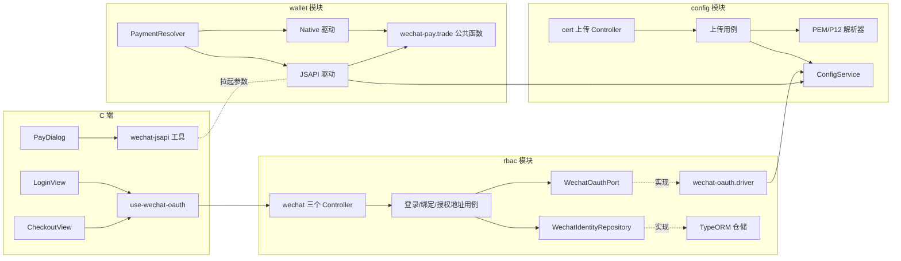
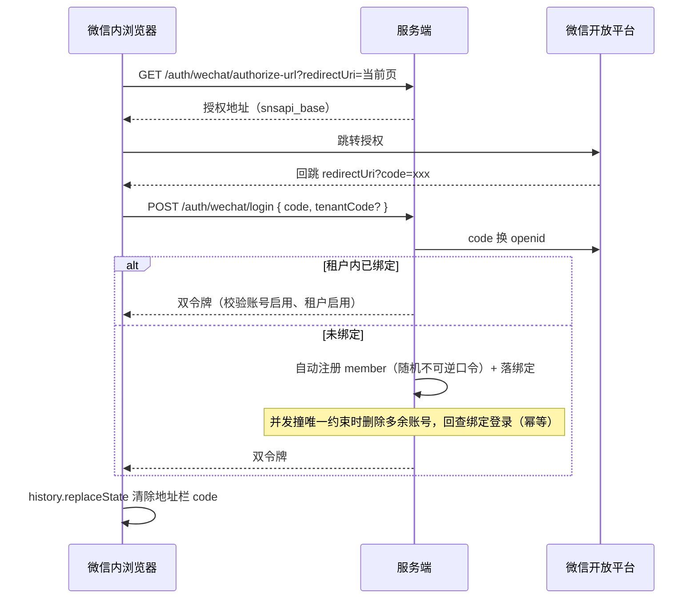
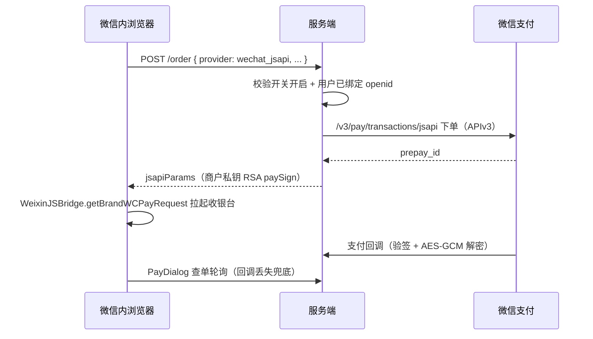
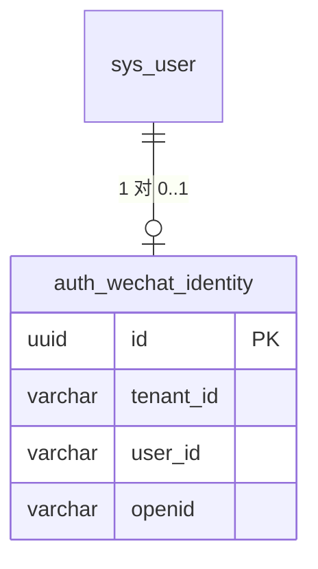

# 微信公众号登录与 JSAPI 支付

## 一、功能目标、已实现能力和非目标

### 目标

1. C 端在微信内置浏览器支持「微信公众号网页授权一键登录」，由配置中心开关控制。
2. 服务订单微信支付在微信内直接拉起公众号 JSAPI 收银台（不出二维码），非微信浏览器保持 Native 扫码；同样由配置中心开关控制。
3. 配置中心的微信支付证书/密钥项支持直接上传 PEM 或 P12 证书文件，服务端解析后写入配置，避免手工粘贴密钥文本出错。

### 已实现能力

- 公开接口生成公众号网页授权地址、以授权码换 openid 登录；租户内首登自动注册 `member` 账号并落身份绑定。
- 短信/密码老用户在微信内通过登录态绑定接口补绑 openid，绑定后即可使用 JSAPI 支付。
- 订单创建支持 `wechat_jsapi` 支付方式：服务端 JSAPI 下单取 `prepay_id`，用商户私钥 RSA 签名返回拉起参数；C 端经 `WeixinJSBridge` 调起收银台；回调验签/解密、主动查单与 Native 复用同一套微信 v3 公共函数。
- JSAPI 订单退款与 Native 共用微信商户退款驱动（同一商户号原路退回）。
- 管理端配置页在编辑证书类配置项（商户私钥/序列号、平台公钥/序列号）时内联提供证书上传，支持 PEM 与 P12（可带密码），解析出的私钥/公钥与证书序列号写入对应敏感配置项，私钥不回传前端、不写日志。上传成功后抽屉保持打开并展示解析结果（序列号与写入的配置项），按用途提示应上传的文件（商户：apiclient_key.pem / apiclient_cert.p12；平台：平台证书或公钥 pub_key.pem，公钥模式序列号需手工填 PUB_KEY_ID_…）。
- 敏感配置项编辑时不回显原值，提交留空表示**保持原值不变**（不会清空），避免误清空商户私钥等密钥导致支付 503。商户私钥与平台公钥两项即使敏感标记被误关，留空保存同样不清空，且证书上传/保存会强制恢复其敏感标记。
- `GET /api/config/portal` 公开返回 `smsLoginEnabled`、`wechatOfficialLoginEnabled`、`wechatJsapiPayEnabled` 三个开关，C 端据此渲染入口。
- 短信登录与微信登录各自独立开关，可同时开启共存也可二选一：`auth.smsLoginEnabled`（默认开）控制手机号验证码登录（登录注册合一，首登自动注册，关闭后发码与登录接口均 403，C 端隐藏短信表单）；`auth.wechatOfficialLoginEnabled` 控制微信一键登录及首登自动注册。两者均开且在微信内时，登录页以「一键登录 / 手机号登录」页签并列展示；仅开微信时非微信浏览器提示去微信内打开；两者都关时登录页提示登录暂未开放（请勿同时关闭）。

### 非目标

- 钱包充值、打手押金仍为扫码支付，不走 JSAPI。
- 不做微信 App/PC 扫码登录、unionid 打通、`snsapi_userinfo` 头像昵称拉取（登录使用 `snsapi_base` 静默授权，仅取 openid）。
- 不做公众号 JS-SDK config 注入（拉起支付使用微信内置 `WeixinJSBridge`，无需 jsapi_ticket 签名）。

## 二、目录结构与分层职责

```text
apps/server/src/modules/rbac/
├── domain/
│   ├── wechat-identity.entity.ts               微信身份实体（userId ↔ openid，租户内唯一）
│   ├── wechat-identity-repository.interface.ts 身份仓储端口
│   └── wechat-oauth-port.interface.ts          微信 OAuth 端口（授权地址 / code 换 openid）
├── application/
│   ├── use-cases/get-wechat-login-url.usecase.ts 生成授权地址（开关校验 + 回跳地址安全校验）
│   ├── use-cases/wechat-login.usecase.ts         授权码登录（首登自动注册，幂等处理并发）
│   ├── use-cases/bind-wechat-identity.usecase.ts 登录态补绑 openid
│   └── wechat-identity.service.ts                身份查询（绑定状态 / 按用户取 openid）
├── infrastructure/
│   ├── wechat-oauth.driver.ts                  微信 OAuth HTTP 适配器（复用公众号凭证配置）
│   └── wechat-identity.repository.ts           TypeORM 身份仓储
└── interfaces/controllers/
    ├── auth.wechat-authorize-url.controller.ts GET  /auth/wechat/authorize-url（公开）
    ├── auth.wechat-login.controller.ts         POST /auth/wechat/login（公开）
    └── auth.wechat-bind.controller.ts          POST /auth/wechat/bind、GET /auth/wechat/identity（登录）

apps/server/src/modules/wallet/infrastructure/drivers/
├── wechat-pay.trade.ts               微信 v3 公共函数：回调验签解密、主动查单、回调应答
├── wechat-payment.driver.ts          Native 扫码驱动（重构为复用公共函数）
└── wechat-jsapi-payment.driver.ts    JSAPI 驱动：按 openid 下单 + RSA 签名拉起参数

apps/server/src/modules/config/
├── application/use-cases/upload-wechat-pay-cert.usecase.ts 证书解析入库（仅超管）
├── infrastructure/wechat-pay-cert.parser.ts                PEM/P12 解析（node-forge）
└── interfaces/upload-wechat-pay-cert.controller.ts         POST /config/wechat-pay-cert

apps/client/src/
├── composables/use-wechat-oauth.ts   授权跳转 / 回跳取 code / 清除 code
├── utils/wechat-jsapi.ts             WeixinJSBridge 拉起收银台（成功/取消/失败）
├── views/auth/LoginView.vue          微信内一键登录入口
├── views/order/CheckoutView.vue      JSAPI 支付前绑定引导 + 回跳续付
├── views/profile/ProfileEditView.vue 个人信息页微信绑定入口（老账号绑定后可微信一键登录）
└── components/order/PayDialog.vue    JSAPI 拉起 + 查单轮询兜底

apps/web/src/components/config/WechatPayCertUpload.vue 管理端证书上传控件（内联在证书类配置项的编辑抽屉中）
```

## 三、模块结构图



## 四、业务流程

### 微信一键登录（含首登自动注册）



### 订单 JSAPI 支付



## 五、数据模型

新增表 `auth_wechat_identity`（migration `1786100000000-add-auth-wechat-identity.ts`，含可回滚 `down`）：

| 字段 | 类型 | 说明 |
| --- | --- | --- |
| id | uuid PK | |
| tenant_id | varchar(36) | 租户，默认平台租户 |
| user_id | varchar(36) | 绑定用户 |
| openid | varchar(64) | 公众号 openid |

约束：`UNIQUE(tenant_id, openid)`（登录路由依据）、`UNIQUE(tenant_id, user_id)`（一个账号只留一条公众号身份），并有 tenant/user 两个索引。



## 六、API、配置项与权限

### API

| 方法 | 路径 | 权限 | 说明 |
| --- | --- | --- | --- |
| GET | `/api/auth/wechat/authorize-url?redirectUri=` | 公开 | 生成公众号网页授权地址；开关关闭 403；回跳地址仅允许 HTTP(S) |
| POST | `/api/auth/wechat/login` | 公开 | `{ code, tenantCode? }` 授权码登录，首登自动注册，返回双令牌 |
| POST | `/api/auth/wechat/bind` | 登录 | `{ code }` 补绑 openid；重复绑同一微信幂等成功；openid 被他人占用或本人已绑其他微信 409 |
| GET | `/api/auth/wechat/identity` | 登录 | `{ bound }` 当前账号是否已绑定 |
| POST | `/api/config/wechat-pay-cert` | `config:save`（仅超管） | multipart 上传证书：`usage=merchant|platform`、`file`（PEM/P12，≤64KB）、`password?`（P12 密码），返回 `{ usage, updatedKeys, serialNo }` |

订单创建 `POST /api/order` 的 `provider` 新增 `wechat_jsapi`，返回 `CreateOrderResult.jsapiParams`（非 JSAPI 为 `null`）。

### 配置项（配置中心）

| 键 | 默认 | 说明 |
| --- | --- | --- |
| `auth.wechatOfficialLoginEnabled` | false | 公众号网页授权登录开关（复用 `notify.wechat.official.*` 公众号凭证），同时控制微信首登自动注册 |
| `auth.smsLoginEnabled` | true | 手机号验证码登录/注册开关；关闭后发码与短信登录注册接口均 403，C 端隐藏短信表单；可与微信登录共存或二选一 |
| `wallet.wechat.jsapiEnabled` | false | 公众号 JSAPI 支付开关；关闭时微信内也回退 Native 扫码 |

证书上传写入既有敏感配置项：商户用途 → `wallet.wechat.privateKey` + `wallet.wechat.serialNo`；平台用途 → `wallet.wechat.platformPublicKey` + `wallet.wechat.platformSerialNo`。注意 `wallet.wechat.appId` 必须是与商户号绑定的公众号 AppId。

### 安全边界

- 回跳地址校验协议，避免开放重定向到任意协议。
- openid 一律由服务端向微信换取，前端不可伪造；绑定冲突显式 409，避免身份串号。
- 私钥/公钥只写入配置中心敏感项（管理端列表脱敏 `******`），不回传、不写日志；证书上传仅超管可操作，租户管理员 403。
- 首登自动注册账号使用随机不可逆口令，只能微信登录。

## 七、异常处理与失败恢复

- 开关关闭：授权地址、登录、JSAPI 下单均显式 403/400 拒绝，C 端不渲染对应入口。
- 并发首登：绑定表唯一约束兜底，撞约束时清理多余账号并回查绑定登录，保证幂等。
- JSAPI 支付缺 openid：下单前置校验报错，C 端结算页引导先绑定微信（跳授权→回跳续付，购物草稿保留）。
- 拉起失败/用户取消：`WeixinJSBridge` 结果区分 ok/cancel/fail；bridge 5 秒未注入按失败处理；PayDialog 保留查单轮询兜底（回调丢失也能终态）。
- 内置浏览器后台冻结定时器：PayDialog/充值弹层轮询接入 `pay-status-poller`，页面恢复可见（`visibilitychange`/`pageshow`）时立即补查并重启定时器，用户跳去支付宝/收银台支付后返回也能查到支付成功并跳转。
- 证书解析失败（格式错误、P12 密码错误、缺私钥/公钥）：返回明确 400 文案，不写入任何配置。
- JSAPI 退款复用微信商户退款驱动，`toRefundProvider` 将 `wechat_jsapi` 归一为微信商户渠道。

## 八、测试与验证

- `pnpm lint`、`pnpm typecheck`、`pnpm build`（含 `build:server`）、`git diff --check` 全部通过。
- `portal.store.spec.ts` 覆盖新开关字段的解析与默认关闭。
- 真实微信授权与支付需公众号/商户号线上凭证与微信内环境，本地无法端到端验证，属于上线前人工验证项。

## 九、尚未实现与后续路线

- 未做 unionid 打通与头像昵称拉取；后续如需展示微信头像可升级 `snsapi_userinfo`。
- 钱包充值、押金缴纳仍为扫码，如需 JSAPI 可在 `PaymentResolver` 上按同一模式扩展。
- 未提供解绑微信入口（当前一账号一身份，解绑涉及仅微信登录账号的可达性，需产品决策）。
